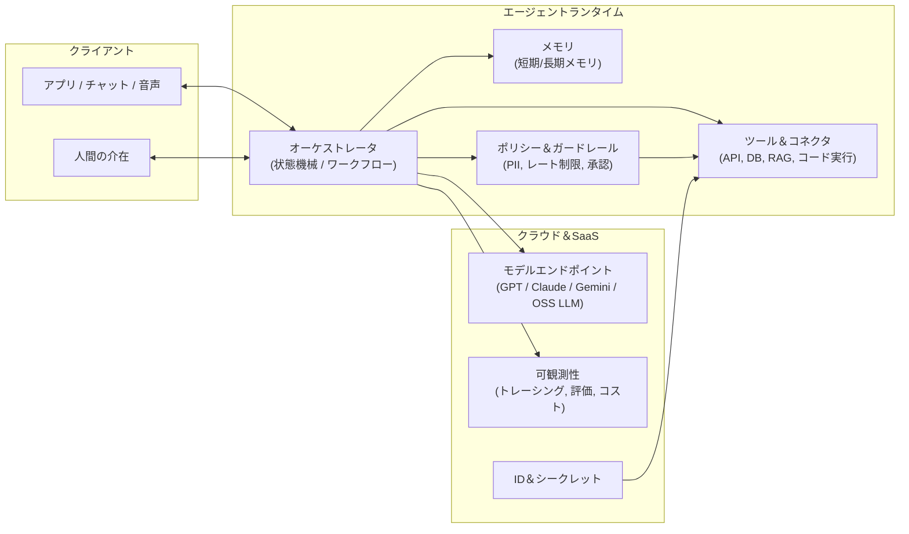
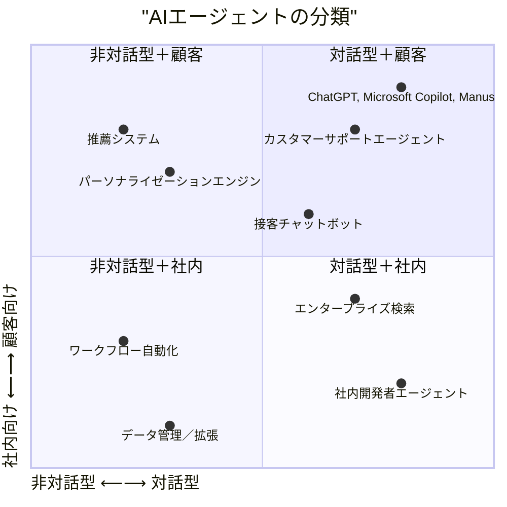
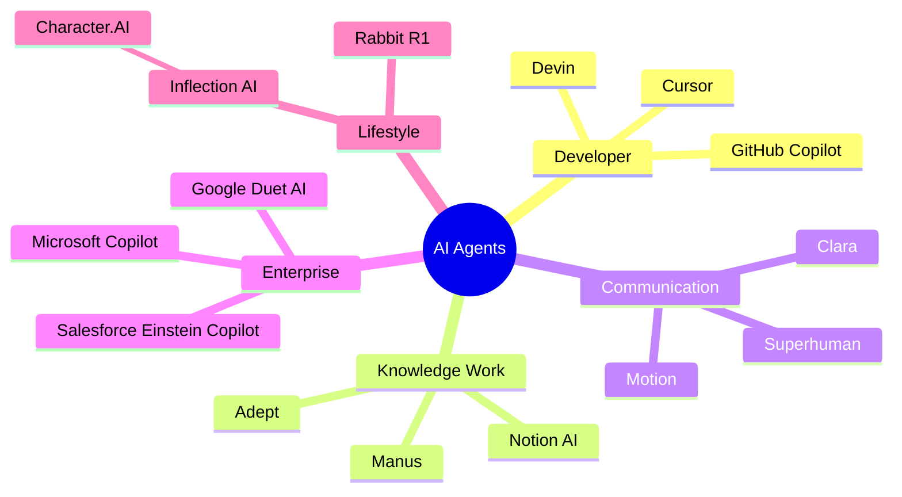
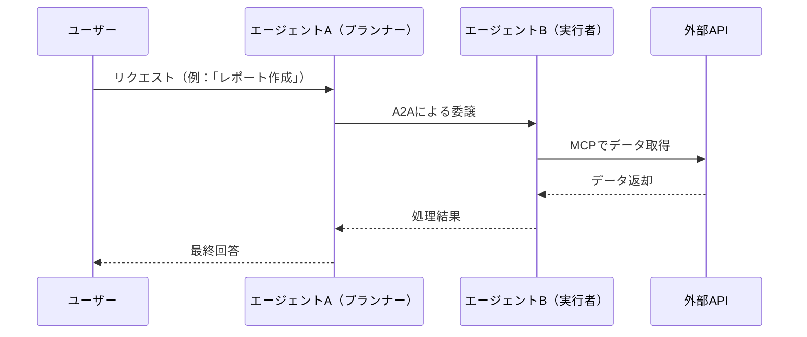
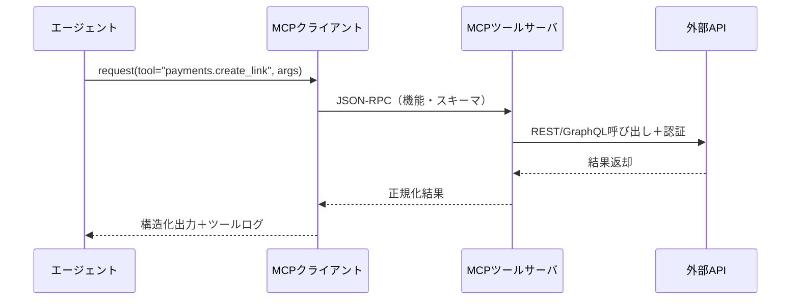
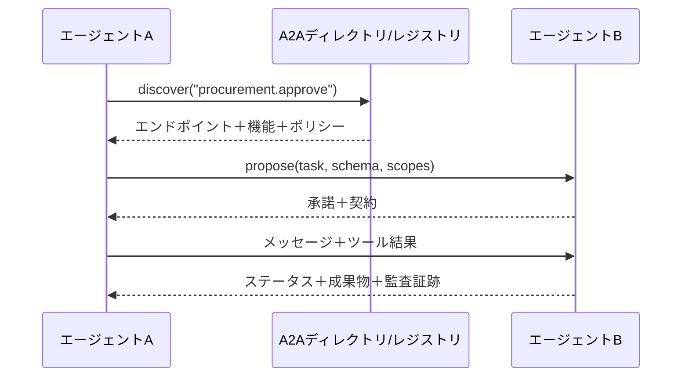
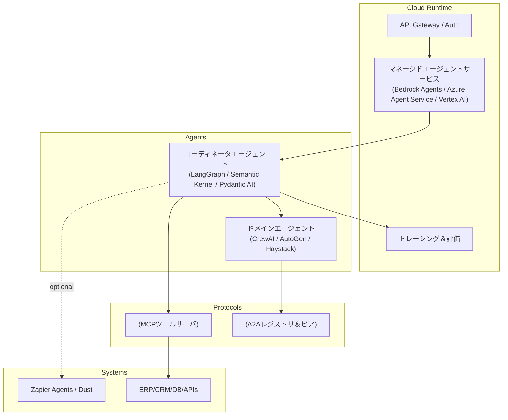

AIエージェントは、学術的な研究からクラウドプラットフォーム、SaaSスタートアップ、エンタープライズシステムにおける**本番運用可能な構成要素**へと進化しました。

本記事では、2025年におけるAIエージェントの導入を形作る**ツール、フレームワーク、プロトコル、プロフェッショナルサービス**を開発者や技術リーダー向けに解説します。今、どのようなエージェントAIを導入できるのか、どう接続するのか、どの標準が重要なのか整理します。

## AIエージェントの概要 {#ai-agents-overview}

**AIエージェント**は、状態（メモリ＋ツール＋外部データ）を認識し、意思決定し、ツールやAPIを通じて**行動**します。多くの場合、複数ステップの計画・再実行・ガードレールを伴います。単なるチャットではなく、意思決定と副作用を伴うオーケストレーションです。ベンダーの紹介文も「チャットボット」から**実行可能な自動化**へのシフトを強調しています。
（[What are AI agents? How they work and how to use them - Zapier][26]）

**すぐに使えるリファレンスアーキテクチャ**

**なぜこの形なのか？**

- **オーケストレータ**はグラフ/状態機械（例：LangGraph, Semantic Kernel,
  AutoGen）で、ツールやサブエージェントを確実に連携します。（[LangChain][13], [Microsoft Learn][15],
  [Microsoft GitHub][14]）
- **ポリシー＆ガードレール**はランタイムに組み込まれています（プロバイダーサービスが標準搭載しつつある）。（[Microsoft
  Learn][3]）
- **ツール**はプロトコルやコネクタ（MCP, Logic Apps, Bedrockアクショングループ, Vertexツール）経由で統合されます。
  ([Anthropic][5], [Microsoft Azure][4], [AWS][1], [Google Cloud][2])

### AIエージェントの2×2マトリクス {#2x2-matrix-of-ai-agents}

AIエージェントを**2つの軸**で分類します：

- **対話型 vs. 非対話型**（会話/リアルタイム vs. バックエンド/自動化）
- **顧客向け vs. 社内向け**（外部 vs. 内部）

これにより、エンジニアや意思決定者が理解しやすい**2×2フレームワーク**が得られます。

**各象限の解説**

1. **対話型＋顧客向け**
   - **例**：
     - ChatGPT、Manus、Gemini（ユーザーとの直接会話）
     - カスタマーサービスボット（Intercom Fin、Zendesk AI）
   - **主な技術**：
     - 会話型LLM、マルチモーダル入出力
     - リアルタイム応答最適化（RLHF、検索拡張）

2. **非対話型＋顧客向け**
   - **例**：
     - 推薦システム（Amazon、Netflix、Spotify）
     - 検索・ランキング最適化（Google Discover、EC検索AI）
     - 不正検知・スコアリングシステム
   - **主な技術**：
     - バッチ推論、ベクトル類似度、パーソナライズモデル
     - バックグラウンドで静かに動作、直接対話なし

3. **非対話型＋社内向け**
   - **例**：
     - ワークフロー自動化（Zapier AI、UiPath AI Agents、n8n）
     - データクレンジング・拡張（Clearbit、社内ETLエージェント）
     - 監視・セキュリティ（AI搭載SIEM、異常検知）
   - **主な技術**：
     - イベント駆動トリガー、APIオーケストレーション
     - バックエンドパイプライン統合（Kafka、Airflow）

4. **対話型＋社内向け**
   - **例**：
     - Microsoft 365 Copilot（Word、Excel、Teams）
     - Salesforce Einstein Copilot
     - 内部開発ツール（Devin、Cursor、GitHub Copilot）
   - **主な技術**：
     - きめ細かなロールベースアクセス制御
     - エンタープライズワークフロー向けマルチエージェントオーケストレーション
     - 社内SaaSアプリに組み込み

<!-- deno-fmt-ignore-start -->


この2×2マップは、**どのタイプのエージェントを優先すべきか**を判断するのに役立ちます：

- B2Cなら→**顧客向け**エージェントに注力
- 社内エンジニアリングなら→**社内向け**ツールが重要
- インタラクティブか否かで**UI/UXやインフラ要件**が変わる

<!-- deno-fmt-ignore-end -->

### エンドユーザー向けツール {#end-user-ai-agents}

AIエージェントはもはや開発者向けインフラだけでなく、**仕事・生産性・生活**のあらゆる場面で**エンドユーザー向けツール**となっています。主なカテゴリは以下の通りです：

1. **ナレッジワーク＆個人の生産性**
   - **Manus** — 個人のワークフロー自動化：メール、ドキュメント、カレンダー、タスクを横断的に連携。 ([Manus][61])
   - **Adept**（Amazon が創業者を人材獲得目的で買収）—
     デスクトップアプリを操作する**アクションエージェント**を先駆けて実装。 ([Adept][56], [Leadership change][57])
   - **Notion AI Agent** — 要約だけでなく、ワークスペース全体でコンテンツ作成やDB操作も自動化。
   - 👉 ここではエージェントが**知識アシスタント**として、メモリ＋自動化を融合。

2. **エンタープライズ生産性スイート**
   - **Microsoft Copilot (Office 365)** —
     Word、Excel、Teamsに組み込まれたエージェント。単なるアシスタントでなく、**ワークフローエージェント**として機能。
   - **Google Duet AI (Workspace)** — ドキュメント作成、会議要約、Gmail操作など。
   - **Salesforce Einstein Copilot** — CRM特化型エージェント。レコード更新、見込み生成、顧客対応文の草稿作成。
   - 👉 これらは**ドメイン特化型**で、エンタープライズデータを活用。

3. **開発者生産性エージェント**
   - **GitHub Copilot** —
     補完だけでなく、**開発者の相棒エージェント**へ進化。関数生成、テスト作成、修正提案、リポジトリ横断のワークフロー自動化も。
   - **Cursor** — 組み込みエージェント搭載IDE。リファクタ、説明、コード実行を反復的に支援（[Cursor][45]）。
   - **Devin** —
     自律型コーディングエージェント。計画・実装・テスト・デプロイまでソフトウェアエンジニアの役割を自動化（[Devin][54]）。
   - 👉 開発現場にエージェントを組み込み、迅速なフィードバックループを実現。

4. **コミュニケーション＆スケジューリングエージェント**
   - **Clara / Motion** — カレンダー・スケジューリングエージェント。メールやSlackで自動的に会議調整。 ([Clara][58],
     [Motion][59])
   - **Superhuman** — AI駆動のメールアシスタント。自動で下書き・要約・フォローアップ。 ([Superhuman][65])
   - 👉 **自律性**（自動でやってくれる）と**透明性**（ユーザーが把握できる）の両立が成功の鍵。

5. **コンシューマー向けライフスタイルエージェント**
   - **Rabbit R1** — **Large Action Model (LAM)** エージェント搭載のポケットデバイス。自然言語でアプリ横断タスクを実行。
     ([Rabbit][66], [Wikipedia][67])
   - **Humane AI Pin** (事業終了) — 音声・映像投影によるウェアラブルエージェント。**アンビエントAIアシスタント**を志向。
     ([Wikipedia][68])
   - **HeyPi / Inflection AI** — **パーソナル会話エージェント**。共感やコーチングに特化。 ([HeyPi][69],
     [Inflection AI][70])
   - **Character.AI** — エンタメ・ロールプレイ・対話型のマルチキャラクターエージェント。 ([Character.AI][71])
   - 👉 デバイスや日常のやりとりにエージェントが浸透。

6. **専門領域エージェント**
   - **法務・コンプライアンスエージェント**（Harvey, EvenUp）— 契約書・訴状・法的文書の作成。 ([Harvey][72],
     [EvenUp][73])
   - **ヘルスケアエージェント**（Glass Health, Hippocratic AI）— 診断推論、トリアージ、患者対応支援。
     ([Glass Health][74], [Hippocratic AI][75])
   - **金融エージェント**（Kasisto）— 銀行・予算管理・金融Q&Aの自律アシスタント。 ([Kasisto][76])
   - **顧客サービス** (unitQ) —
     さまざまなチャネルからのプロダクトフィードバックをリアルタイムに解析し、企業のプロダクト品質や顧客体験の向上を支援。
     ([unitQ][77])
   - 👉 **強いドメイン知識＋規制ガードレール**が鍵。

**なぜ重要か**

エンドユーザーは、IDEやメール、カレンダーなど**自分のツールにエージェントが組み込まれる**ことを期待し始めています。開発者や企業にとって：

- **MCPやA2Aのようなプロトコル**により、ユーザーエージェントが安全にエンタープライズデータやAPIと連携可能に。
- **OpenAI Agents SDK**のようなフレームワークが多くのエージェントの基盤に。

つまり、最前線は：

- **エンタープライズコパイロット**→MCP/A2A経由で企業システムと連携
- **パーソナル/ライフスタイルエージェント**→信頼・透明性・マルチモーダル（音声・ウェアラブル・アンビエント）

<!-- deno-fmt-ignore-start -->


エンドユーザーエージェントは**インタラクション設計**や**MCPのようなプロトコル**が将来ツール横断で統一される可能性を理解するのに最適な出発点です。


<!-- deno-fmt-ignore-end -->

## 注目すべきソリューション {#notable-solutions}

### クラウドプロバイダー {#cloud-provider-solutions}

- **AWS — Bedrock Agents / AgentCore**
  は、**アクショングループ**や関数/ツール呼び出し、スケール展開、IaC（CloudFormation）対応のエージェントを構築できます。**Strands
  Agents** というAWSサービス連携に特化したカスタムエージェント用ライブラリも提供し、AWSエコシステム利用者に最適です。
  ([Amazon Bedrock Agents][1], [AWS CloudFormation][28], [Strands Agents][46])

- **Azure — AI Foundry Agent Service**
  は、ツールのオーケストレーション、コンテンツセーフティ、AzureのID/ネットワーク/可観測性との統合、1,400以上の**Logic
  Apps**コネクタを備えたマネージドエージェントランタイムです。（[Azure AI Foundry Agent Service][4],
  [Microsoft Learn][3]）

- **Google Cloud — Vertex AI Agent Builder/Engine** は、**マルチエージェント**体験に注力し、Google検索連携やVertex
  Search、コード実行などの組み込みツール、長期エージェント用の**Sessions**や**Memory
  Bank**を提供。**Genkit**はGoogleのオープンソースフレームワークで、マルチステップAIエージェントのプロトタイピング・デプロイを簡単にします。（[Vertex
  AI Agent Builder][29], [Google Cloud Documentation][2], [Google Codelabs][39], [Genkit][47]）

**クラウドランタイムを使うべき場面**：規制環境、エンタープライズID、ネットワーク制御、一貫した監視が必要な場合は自作よりも有効です。

### SaaSスタートアップ＆プラットフォーム {#saas-startups-and-platforms}

- **Manus** — 思考と行動を橋渡しする汎用AIエージェント（[Manus][61]）
- **Devin** — Cognition AIによるAIソフトウェアエンジニア（[Devin][54]）
- **Dust** —
  **MCP**や**Claude**と連携するエンタープライズエージェント。Slack/GitHub/Notion横断の大規模ワークフロー（Temporal）を実現。ARR成長も著しい（[Dust][42],
  [Anthropic][21], [Temporal][22], [VentureBeat][23]）
- **Zapier Agents & AI Actions** —
  7,000以上のアプリと連携し、数分でエージェントを構築。業務オペレーションや非開発チームに最適（[Zapier Agents][24],
  [Zapier AI Actions][30]）
- **Fixie** —
  低コードからフルコードまで対応する会話型/マルチモーダルエージェント。アクション重視の「サイドキック」に注力（[Fixie.ai][25],
  [Deepchecks][31]）

**市場動向**：Web/ブラウジングエージェントなど新たな専門プレイヤーも資金調達・リリースを続けており、チャットを超えた**エージェント自動化**への期待が高まっています。

### オープンソース {#open-source}

- **LangGraph (LangChain)** — 状態機械型の堅牢なエージェントオーケストレーション。**LangGraph
  Platform**での運用も可能（[LangChain][13], [LangSmith][33]）
- **AutoGen (Microsoft Research)** — マルチエージェント協調フレームワーク。研究・プロトタイプに最適（[Microsoft][34],
  [GitHub][14]）
- **Semantic Kernel (Agent Framework)** —
  モデル非依存のSDK。**Agent/Pluginパターン**で.NETやPython、エンタープライズに強い（[Microsoft Learn][15],
  [GitHub][16]）
- **CrewAI** — マルチエージェント自動化に特化した軽量Pythonフレームワーク（[CrewAI][36], [Tutorial][40], [GitHub][35]）
- **Haystack** —
  RAGや評価ツールと相性が良い成熟フレームワーク。エージェント、ReAct、マルチエージェント「Swarm」も実装（[Haystack][43],
  [AI agent in Haystack][18], [Agent component][41], [Swarm][37]）
- **LlamaIndex** —
  RAGから**エージェントワークフロー**へ拡張。「スプレッドシートエージェント」やメモリパターンも（[LlamaIndex][44],
  [Announcing Workflows 1.0][19]）
- **Pydantic AI** —
  型安全なエージェント（ツールスキーマ・結果）をクリーンなPythonで実装。AG-UIと好相性（[Pydantic AI][20], [GitHub][38]）
- **OpenAI Agents SDK** —
  OpenAIエコシステムでAPI・メモリ・ツール呼び出し可能なエージェント開発キット（[OpenAI Agents SDK][48]）
- **Genkit (Google)** — Vertex
  AIやFirebaseと連携しやすいエンドツーエンドAIワークフロー/エージェント用OSSフレームワーク（[Genkit][47]）
- **Strands Agents (AWS)** — AWSサービス連携に特化したモデル駆動型エージェント（[Strands Agents][46]）
- **n8n** — OSSワークフロー自動化・ツール統合基盤。エージェントの実行基盤としても有用（[n8n][49], [GitHub][50]）

### 事例紹介 - Manus {#case-study-manus}

**Manus**（[manus.im][61]）は、思考と行動を橋渡しする汎用AIエージェントで、複雑なマルチステップタスク（Web自動化やコンテンツ作成など）を独立して計画および実行します。単なるAIアシスタントではなく、汎用知能への一歩といえる存在です。

**主な特徴：**

- **真の自律性＆非同期実行**：Manusはクラウド上で継続的に稼働し、ユーザーがオフラインでもWebブラウジングやフォーム入力、ワークフローの自動化を管理。
- **マルチエージェントアーキテクチャ**：タスクを計画・調査・コーディング・実行などのサブエージェントに分割し、並列処理と堅牢性を実現。
- **ブラウザ＆ツール統合**：Webページ閲覧、アプリ操作、データ抽出、API連携を高速かつ高精度で実行（[Bard AI][63]）。
- **GAIAベンチマーク最高水準**：GAIA Level 1タスクで86.5%（OpenAI Deep Research agentの74.3%を上回る）を達成。
- **非同期クラウド処理＆プライバシー重視**：安全な環境で独立実行し、プライバシーとセキュリティにも配慮。

**開発者向けユースケース：**

- Webベースワークフローのエンドツーエンド自動化
- マルチステップのリサーチ・分析・レポート生成
- データ・コーディング・計画タスクの並列オーケストレーション
- 市場調査、ドキュメントやWeb自動化、コンテンツワークフローなど

<!-- deno-fmt-ignore-start -->


Manusには非公式サイトが多く存在します。アクセス時はドメインを必ず確認してください。
以下はChatGPTが最初に示したサイト例です。

- `https://manus.org/`
- `https://www.manus.is/`
- `https://www.manusagent.io/`
- `https://manusagent.im/`

<!-- deno-fmt-ignore-end -->

### 事例紹介 - Devin {#case-study-devin}

**Devin**（[devin.ai][54]）は、Cognition AI（旧Cognition
Labs）による**自律型コーディングエージェント**で、計画・実装・テスト・デプロイまで担当できるソフトウェアエンジニアのように振る舞います。多くの場合に人の指示は最低限で完結し、リファクタリングやバグ修正からアプリ構築まで幅広いタスクを支援します。

**主な特徴：**

- **エンドツーエンドの自律性**：プロジェクト計画からコーディング・テスト・デプロイまで数千の意思決定を自動化（[Cognition
  AI][51], [Wikipedia][53]）。
- **組み込み開発ツール**：シェル・コードエディタ・ブラウザを備え、サンドボックス内で安全に実行。
- **協調的ワークフロー**：進捗をリアルタイムで報告し、フィードバックを受けて設計を対話的に調整。
- **高いベンチマーク性能**：SWE-bench課題の13.86%をエンドツーエンドで解決（従来の2%前後を大きく上回る）。
- **マルチエージェント機能**：最新のバージョンではサブタスクを他エージェント委譲したり、自信度に応じて人間への確認も可能。

**開発者向けユースケース：**

- コード移行・リファクタ（言語アップグレードやバージョン変更）
- データエンジニアリング・ETLワークフロー
- バグ修正、CI/CD、バックログ整理
- 機能開発、テスト、ドキュメント、オンボーディング

**企業・成長動向：**

- Cognition AIは2023年末にIOI金メダリストらが創業し、Founders
  Fund等の支援で急成長。評価額は3.5億ドルから数十億ドル規模へ（[Wikipedia][55]）。
- 2025年中頃には**Windsurf**（エージェント型開発者IDE）を買収し、ツール群を拡充。

## プロトコル層：MCPとA2A {#the-protocol-layer-mcp-and-a2a}

エージェントが**ツールや他エージェントと連携**するための新たなプロトコルが登場しています。

- **MCP（Model Context Protocol）**
  - LLMが外部ツール・DB・APIにアクセスするための構造的な手段を定義。
  - AnthropicやOSSコミュニティでツール拡張推論に利用。

- **A2A（Agent-to-Agent）**
  - エージェント同士のメッセージング・協調のための仕様。
  - **マルチエージェントシステム**での協調タスクに不可欠。

### MCP — Model Context Protocol

- **概要**：Anthropic発の**オープンプロトコル**で、アシスタントが**ツール・データソース・開発環境**と標準的に接続できるようにします。AIツール群に対する
  USB-C だと考えてください。実装とドキュメントは公開されており、急速に進化中です。 ([Model Context Protocol][6],
  [Introduction by Anthropic][5], [Wikipedia][9])
- **意義**：N×Mの個別アダプタを不要にし、エージェントがツールのスキーマを発見して安全に呼び出せるようにします。業界の関心も高まっています。
  ([The Verge][8])

**MCP（Model Context Protocol）Registry** は、MCP
サーバー、クライアント、ツールの公式なコミュニティ主導ディレクトリです。AIエージェントやアプリケーションがMCPを介して相互通信できるようにする実装・ライブラリ・統合を整理し、開発者が再利用可能なコンポーネントを見つけやすくし、エコシステム全体での相互運用性を促進します。
([MCP Registry][94], [GitHub][95], [InfoQ][93])

### A2A — Agent-to-Agent Protocol

- **概要**：異なるプラットフォームのエージェント同士が**発見・機能交換・協調**できる相互運用の仕様です。Googleが公開し、開発者ブログで解説しています。
  ([A2A Protocol][11], [GitHub][12], [Google Developers Blog][10])
- **意義**：マルチエージェント・クロスベンダーワークフロー（例：CRMエージェントと調達エージェントの連携を脆弱なWebhookなしで実現可能）

> **関連**：**AG-UI** (Agent User Interaction Protocol)
> 仕様は**フロントエンド↔エージェント**のストリーミング＆ツールUXに注力。Pydantic AI 連携で普及中。 ([AG-UI][7],
> [Pydantic AI][27])

### AgentGateway

**AgentGateway** は、AIエージェントが外部システムと **Model Context Protocol (MCP)**
を通じてやり取りする方法を標準化・簡素化するために設計されたオープンソースプラットフォームです。
MCPサーバーやツールのレジストリを提供し、開発者が複数のプロバイダーやエコシステムにまたがってAIエージェントを発見・接続・構成できるようにします。
([agentgateway.dev][91], [GitHub][92], [Linux Foundation][96])

MCPと **Agent-to-Agent (A2A)**
通信の両方をサポートすることで、AgentGatewayは分断されたエージェントアーキテクチャを統合し、相互運用可能で安全かつスケーラブルなマルチエージェントワークフローの構築を可能にします。

- このプラットフォームはMCP準拠エコシステム向けに特化した「APIゲートウェイ」に相当する **AIエージェントのハブ**
  として機能します。
- ガバナンス、オブザーバビリティ、企業システムとの統合をサポートしています。
- コンサルティング企業やエンタープライズは、マルチクラウド・マルチエージェントAIシステムの **PoC（概念実証）**
  を加速するためにAgentGatewayを活用することができます。

## アーキテクチャパターン {#architecture-patterns}

1. **MCPによるツールファーストエージェント**
   - 社内システム（決済、CRM、在庫など）はMCPサーバ化し、エージェントが**一貫してツール発見・呼び出し**できるように。
   - MCP境界で承認ポリシーやログをレイヤー化。

2. **信頼性のためのグラフオーケストレーション**
   - エージェントを「計画→実行→反映→完了」の明示的な状態グラフで表現し、バックオフやリトライも管理。
   - LangGraph や Semantic Kernel はこの**決定論的**な形を推進。

3. **Human-in-the-Loopチェックポイント**
   - リスクの高いアクション（購入・削除など）は承認ノードを設ける。クラウドランタイムはコンテンツセーフティやID管理も支援。

4. **A2Aによるマルチエージェント**
   - A2Aでドメインエージェント（例：財務・調達）を**発見**して適用範囲とSLAを管理することで、アドホックなWebhookは不要になります。

**例：最小構成の本番トポロジー**

**セキュリティとガバナンスのチェックリスト**

- **ツール境界でのID＆スコープ管理** -- ツールごとのOAuth設定、短命トークン
- **データガード** --
  マスキング、コンテンツフィルタ、テナント分離はエージェントランタイムで。クラウドエージェントサービスはこれを標準搭載
  ([Microsoft Learn][3])
- **高リスクアクションの承認ワークフロー** -- 購入・書き込み・削除
- **監査性** -- ツール呼び出し・入出力・コストのトレース
- **コード実行ツールのサンドボックス化** -- Vertex組み込みやコンテナ型サンドボックス （[Google Cloud][2]）

**エージェント評価指標（デモを超えて）**

- **タスク成功率** -- エンドツーエンドで評価する。単なる回答品質に終始しない。
- **ツール正確性＆スキーマ準拠** -- Pydantic AI はここが強い。
- **レイテンシ予算** -- 計画/実行ループ＋ツールRTT
- **オペレータ負荷** -- 人間の承認・修正頻度
- **変化耐性** - ツールバージョン・スキーマドリフト—MCPが有効

**自作か購入か**

- **クラウド＋SaaS**：コンプライアンス/ID、多数コネクタ、ROI重視ならZapier
  Agents＋Bedrock/Vertex/Azureランタイム（[Zapier][24], [Amazon Web Services, Inc.][1], [Google Cloud][2],
  [Microsoft Learn][3]）
- **OSS**：制御フローや実験的機能、カスタムワークフロー重視ならLangGraph/SK/AutoGen＋MCP/A2A（[LangChain][13],
  [Microsoft Learn][15], [Microsoft GitHub][14], [Anthropic][5]）
- **ユーザー向けツール**：即効性重視ならCopilotやManusを活用しつつ、独自のバックエンドオーケストレーションを構築

## エンタープライズ導入 {#enterprise-adoption}

AIエージェントの本番導入では、OSSやクラウドサービスだけでなく、**コンサルティングファームやシステムインテグレーター
(SIer)**
の知見も活用されます。これらのサービスは、OSS・クラウド・新興プロトコル（MCP/A2A）の効果的な組み合わせ方をエンジニアに示してくれます。

<!-- deno-fmt-ignore-start -->


コンサルティングファームは戦略だけでなく、リファレンスアーキテクチャやSDKの設計図も公開しており、社内エージェント開発の参考になります。


<!-- deno-fmt-ignore-end -->

グローバルコンサルティングファーム

- **Accenture**：マルチクラウドAIエージェントアーキテクチャ、MCP/A2AのPoC ([AI Refinery][81], [A2AClientAgent][82])
- **Deloitte**：Zora AI をリリースしました。Trustworthy AI
  上に構築された既存システムと連携して動作するデジタルワーカーです。 ([Zora AI][88], [Global Agentic Network][89])
- **EY**：NVIDIA AI を活用した EY.ai Agentic Platform を発表しました。 ([EY.ai][90])
- **PwC**：GitHub CopilotやMicrosoft Copilotのエンタープライズワークフロー統合 ([PwC][80])

日本のコンサル／SIer

- **NTTデータ**：業界特化型のインテリジェントエージェントや既存ボットの高度化、OpenAIとの連携を含む Smart AI Agent™
  エコシステムを発表し、企業向けのエージェント型AIソリューションを提供開始しました。 ([Smart AI Agent][85],
  [日本語の記事][86])
- **富士通**：セキュアで信頼性の高いクラウドベースのAIサービス群である Fujitsu Kozuchi
  を提供し、業務の生産性と創造性を向上させます。 ([Fujitsu Kozuchi][83], [Fujitsu Kozuchi AI Agent][84])
- **日立**：生成AI活用プロフェッショナルサービスpowered by
  Lumadaのメニューとして、数百の事例で培ったOTナレッジを活用し、建設・エネルギー・輸送などの現場で働くフロントラインワーカーを支援するお客さま専用のAIエージェントを迅速に提供する「AIエージェント開発・運用・環境提供サービス」を開始しました。
  ([ニュースリリース][87])

コンサルティングファームは、OSS・クラウド・新興プロトコルを統合し、本番運用可能なスタックを構築する「インテグレータ」として機能しています。

## 開発者の出発点 {#developer-starting-points}

エージェントシステムは**オーケストレーション層**、**標準化ツールアクセス（MCP）**、 **エージェント間相互運用（A2A）**
の3本柱で固まりつつあります。自分に合ったクラウドやOSSオーケストレータを選び、ツールアクセスを早期に標準化し、**ガードレール付きのタスク完了率**（単なるチャット品質ではなく）で評価しましょう。

注目すべき開発者向けフレームワーク／ライブラリ：

- **ユーザー向けツール**：Devin（開発者生産性）、Manus（ワークフロー自動化）
- **クラウドプロバイダー**：Amazon Bedrock Agents/AgentCore、Azure AI Foundry Agent Service、Google Vertex AI Agent
  Builder。ホスティング・ツール安全性・ID・可観測性・コネクタを標準搭載。
- **OSS＆開発者フレームワーク**：LangGraph、AutoGen、Semantic Kernel（Agent
  Framework）、CrewAI、Haystack、LlamaIndex（Workflows/agent framework）、Pydantic
  AI（型安全エージェント）、Genkit（Google）、OpenAI Agents SDK、Strands Agents（AWS）
- **SaaSプラットフォーム**：Dust、Zapier Agents、Fixieなど。エージェント運用・コネクタ・Human-in-the-loop
  UXを製品化。資金調達・リリースも活発。
- **オープンプロトコル**：MCP（Model Context
  Protocol）、A2A（Agent-to-Agent）。MCPはモデルのツール/データアクセスを標準化、A2Aはエージェント間のメッセージ・機能交換を標準化。

## おわりに {#closing-thoughts}

AIエージェントはツールからエコシステムへと急速に進化しています。2025年のエンジニアに求められるのは：

- **クラウド＆フレームワーク**（LangGraph、Genkit、AWS/OpenAI SDKなど）
- **プロトコル**（MCPでツール利用、A2Aでエージェント協調）
- **エンタープライズ導入モデル**（コンサル／SIer／ガバナンス層）

CopilotやManusのようなユーザー向けツールがエージェントを身近にする一方、OpenAI Agents SDKやGenkit、Strands
Agentsが堅牢な本番エージェント構築を容易にしています。

<!-- deno-fmt-ignore-start -->


AIエージェントの未来は、単なるLLMの進化だけではありません。
標準化プロトコル、オーケストレーションフレームワーク、エンタープライズ統合こそがエンジニアの活躍領域です。


<!-- deno-fmt-ignore-end -->

[1]: https://aws.amazon.com/bedrock/agents/ "Amazon Bedrock Agents | AWS"
[2]: https://cloud.google.com/vertex-ai/generative-ai/docs/agent-builder/overview "Vertex AI Agent Builder overview | Google Cloud"
[3]: https://learn.microsoft.com/en-us/azure/ai-foundry/agents/overview "What is Azure AI Foundry Agent Service? | Microsoft Learn"
[4]: https://azure.microsoft.com/en-us/products/ai-agent-service "Azure AI Foundry Agent Service"
[5]: https://www.anthropic.com/news/model-context-protocol "Introducing the Model Context Protocol - Anthropic"
[6]: https://modelcontextprotocol.io/ "Model Context Protocol: Introduction"
[7]: https://docs.ag-ui.com/introduction "Introduction - Agent User Interaction Protocol"
[8]: https://www.theverge.com/decoder-podcast-with-nilay-patel/669409/microsoft-cto-kevin-scott-interview-ai-natural-language-search-openai "Microsoft CTO Kevin Scott on how AI can save the web, not destroy it"
[9]: https://en.wikipedia.org/wiki/Model_Context_Protocol "Model Context Protocol - Wikipedia"
[10]: https://developers.googleblog.com/en/a2a-a-new-era-of-agent-interoperability/ "Announcing the Agent2Agent Protocol (A2A)"
[11]: https://a2aprotocol.ai/ "A2A Protocol - Agent2Agent Communication"
[12]: https://github.com/a2aproject/A2A "a2aproject/A2A: An open protocol enabling communication ... - GitHub"
[13]: https://www.langchain.com/langgraph "LangGraph - LangChain"
[14]: https://microsoft.github.io/autogen/stable//index.html "AutoGen"
[15]: https://learn.microsoft.com/en-us/semantic-kernel/frameworks/agent/ "Semantic Kernel Agent Framework | Microsoft Learn"
[16]: https://github.com/microsoft/semantic-kernel "microsoft/semantic-kernel: Integrate cutting-edge LLM ... - GitHub"
[17]: https://www.crewai.com/open-source "Open source - CrewAI"
[18]: https://docs.haystack.deepset.ai/docs/agents "Agents - Haystack Documentation"
[19]: https://www.llamaindex.ai/blog/announcing-workflows-1-0-a-lightweight-framework-for-agentic-systems "Announcing Workflows 1.0: A Lightweight Framework for Agentic ..."
[20]: https://ai.pydantic.dev/ "Pydantic AI"
[21]: https://www.anthropic.com/customers/dust "Dust helps enterprises create actionable AI agents with MCP and ..."
[22]: https://temporal.io/blog/how-dust-builds-agentic-ai-temporal "How Dust Builds Agentic AI with Temporal Workflows"
[23]: https://venturebeat.com/ai/dust-hits-6m-arr-helping-enterprises-build-ai-agents-that-actually-do-stuff-instead-of-just-talking/ "Dust hits $6M ARR helping enterprises build AI agents that actually do stuff instead of just talking"
[24]: https://zapier.com/agents "Build AI teammates with Zapier Agents"
[25]: https://fixie.ai/ "Fixie.ai"
[26]: https://zapier.com/blog/ai-agent/ "What are AI agents? How they work and how to use them - Zapier"
[27]: https://ai.pydantic.dev/ag-ui/ "AG-UI - Pydantic AI"
[28]: https://docs.aws.amazon.com/AWSCloudFormation/latest/TemplateReference/aws-resource-bedrock-agent.html "AWS::Bedrock::Agent - AWS CloudFormation - AWS Documentation"
[29]: https://cloud.google.com/products/agent-builder "Vertex AI Agent Builder | Google Cloud"
[30]: https://actions.zapier.com/ "Zapier AI Actions: Get Started"
[31]: https://www.deepchecks.com/llm-tools/fixie-ai/ "What is Fixie AI? Features & Getting Started - Deepchecks"
[32]: https://www.reuters.com/technology/ai-agent-startup-tinyfish-raises-47-million-iconiq-led-round-2025-08-20/ "AI agent startup TinyFish raises $47 million in ICONIQ-led round"
[33]: https://docs.smith.langchain.com/langgraph_cloud "LangGraph Platform | 🦜️🛠️ LangSmith"
[34]: https://www.microsoft.com/en-us/research/project/autogen/ "AutoGen - Microsoft Research"
[35]: https://github.com/crewAIInc/crewAI "crewAIInc/crewAI - GitHub"
[36]: https://docs.crewai.com/ "Introduction - CrewAI"
[37]: https://haystack.deepset.ai/cookbook/swarm "Create a Swarm of Agents - Haystack - Deepset"
[38]: https://github.com/pydantic/pydantic-ai "Agent Framework / shim to use Pydantic with LLMs - GitHub"
[39]: https://codelabs.developers.google.com/devsite/codelabs/building-ai-agents-vertexai "Building AI Agents with Vertex AI Agent Builder - Codelabs - Google"
[40]: https://blog.crewai.com/getting-started-with-crewai-build-your-first-crew/ "Build your First CrewAI Agents"
[41]: https://docs.haystack.deepset.ai/docs/agent "Agent - Haystack Documentation"
[42]: https://dust.tt/ "Accelerate your entire organization with custom AI agents"
[43]: https://haystack.deepset.ai/ "Haystack - Deepset"
[44]: https://www.llamaindex.ai/ "LlamaIndex"
[45]: https://cursor.com/ja "The AI Code Editor"
[46]: https://strandsagents.com/latest/ "Strands Agents"
[47]: https://genkit.dev/ "Genkit"
[48]: https://openai.github.io/openai-agents-python/ "OpenAI Agents SDK"
[49]: https://n8n.io/ "AI Workflow Automation Platform & Tools - n8n"
[50]: https://github.com/n8n-io/n8n "n8n-io/n8n"
[51]: https://cognition.ai/blog/introducing-devin "Introducing Devin, the first AI software engineer - Cognition"
[53]: https://en.wikipedia.org/wiki/Devin_AI "Devin AI"
[54]: https://devin.ai/ "Devin | The AI Software Engineer"
[55]: https://en.wikipedia.org/wiki/Cognition_AI "Cognition AI"
[56]: https://www.adept.ai/ "Adept: AI that powers the workforce"
[57]: https://www.adept.ai/blog/adept-update "An update from Adept"
[58]: https://claralabs.com/ "Clara"
[59]: https://www.usemotion.com/ "AI Employees That 10x Your Team’s Output | Motion"
[61]: https://manus.im/ "Manus is a general AI agent that bridges mind and action."
[63]: https://bardai.ai/2025/05/25/how-manus-ai-is-redefining-autonomous-workflow-automation-across-industries/ "How Manus AI is Redefining Autonomous Workflow Automation Across Industries | BARD AI"
[65]: https://superhuman.com/ "The most productive email app ever made | Superhuman"
[66]: https://www.rabbit.tech/ "rabbit r1 | rabbit intern | rabbitOS"
[67]: https://en.wikipedia.org/wiki/Rabbit_r1 "Rabbit r1 - Wikipedia"
[68]: https://en.wikipedia.org/wiki/Humane_Inc. "Humane Inc. - Wikipedia"
[69]: https://pi.ai/ "Pi, your personal AI"
[70]: https://inflection.ai/ "Inflection AI"
[71]: https://character.ai/ "AI Chat, Reimagined–Your Words. | character.ai"
[72]: https://www.harvey.ai/ "Harvey"
[73]: https://www.evenuplaw.com/ "EvenUp | Personal Injury AI — From Intake to Resolution"
[74]: https://glass.health/ "Glass | AI Diagnosis & Clinical Decision Support (CDS)"
[75]: https://www.hippocraticai.com/ "Hippocratic AI"
[76]: https://kasisto.com/ "Kasisto | The Trusted Agentic AI Platform for Financial Services"
[77]: https://www.unitq.com/ "unitQ"
[80]: https://www.pwc.com/gx/en/news-room/press-releases/2025/pwc-and-microsoft-strategic-collaboration.html "PwC and Microsoft announce strategic collaboration to transform industries with AI agents | PwC"
[81]: https://newsroom.accenture.com/news/2025/accenture-expands-ai-refinery-and-launches-new-industry-agent-solutions-to-accelerate-agentic-ai-adoption "Accenture Expands AI Refinery and Launches New Industry Agent Solutions to Accelerate Agentic AI Adoption | Accenture"
[82]: https://sdk.airefinery.accenture.com/tutorial/a2a_agents/a2a_currency_converter/ "Utilize A2A-exposed Agents - Accenture AI Refinery SDK"
[83]: https://pr.fujitsu.com/jp/news/2024/10/23.html "AIが人と協調して自律的に高度な業務を推進する「Fujitsu Kozuchi AI Agent」を提供開始 : 富士通"
[84]: https://pr.fujitsu.com/jp/news/2024/10/23.html "AIが人と協調して自律的に高度な業務を推進する「Fujitsu Kozuchi AI Agent」を提供開始 : 富士通"
[85]: https://www.nttdata.com/global/en/news/press-release/2025/may/051600 "NTT DATA Unveils Smart AI Agent™ Ecosystem, Revolutionizing Industry Solutions with Intelligent Automation and Strategic Alliances | NTT DATA Group"
[86]: https://www.nttdata.com/jp/ja/trends/data-insight/2025/082702/ "AIエージェントが切り開く、業務変革の最新事例 | DATA INSIGHT | NTTデータ - NTT DATA"
[87]: https://www.hitachi.co.jp/New/cnews/month/2025/03/0326.html "日立、数百の事例で獲得したOTナレッジの活用手法によりお客さま専用のAIエージェントを迅速に提供：2025年3月26日"
[88]: https://www.deloitte.com/us/en/services/consulting/services/zora-generative-ai-agent.html "Introducing Zora AI™ | Deloitte US"
[89]: https://www.deloitte.com/global/en/about/press-room/deloitte-launches-global-agentic-network-to-power-digital-workforce-solutions.html "Deloitte launches Global Agentic Network to power digital workforce solutions | Deloitte Global"
[90]: https://www.ey.com/en_gl/newsroom/2025/03/ey-launching-ey-ai-agentic-platform-created-with-nvidia-ai-to-drive-multi-sector-transformation-starting-with-tax-risk-and-finance-domains "EY launching EY.ai Agentic Platform, created with NVIDIA AI, to drive multi-sector transformation starting with tax, risk and finance domains | EY - Global"
[91]: https://agentgateway.dev/ "agentgateway | Agent Connectivity Solved"
[92]: https://github.com/agentgateway/agentgateway "agentgateway/agentgateway: Next Generation Agentic Proxy for AI Agents and MCP servers"
[93]: https://www.infoq.com/news/2025/09/introducing-mcp-registry/ "Introducing the MCP Registry"
[94]: https://github.com/mcp "MCP Registry"
[95]: https://github.com/modelcontextprotocol/registry/ "modelcontextprotocol/registry: A community driven registry service for Model Context Protocol (MCP) servers."
[96]: https://www.linuxfoundation.org/press/linux-foundation-welcomes-agentgateway-project-to-accelerate-ai-agent-adoption-while-maintaining-security-observability-and-governance "Linux Foundation Welcomes Agentgateway Project to Accelerate AI Agent Adoption While Maintaining Security, Observability and Governance"
