AI Agents have evolved from academic concepts to **production-ready building blocks** across cloud platforms, SaaS
startups, and enterprise systems.

This article explores the **tools, frameworks, protocols, and professional services** shaping AI agent adoption in 2025
for developers and tech leaders who want a crisp, practical view of where agentic AI is today—what to deploy, how to
wire it, and which standards matter.

## AI Agents overview

An **AI agent** perceives state (memory + tools + external data), decides, and **acts** via tools/APIs—often over
multiple steps with plans, retries, and guardrails. This isn’t just chat; it’s orchestration with decisions and
side-effects. Good vendor intros capture this shift from “chatbot” to **actionable automations**.
([What are AI agents? How they work and how to use them - Zapier][26])

**A Reference Architecture You Can Start From**

**Why this shape?**

- The **orchestrator** is a graph/state machine (e.g., LangGraph, Semantic Kernel, AutoGen) that coordinates tools &
  sub-agents reliably. ([LangChain][13], [Microsoft Learn][15], [Microsoft GitHub][14])
- **Policy & guardrails** sit in the runtime (provider services increasingly bundle this). ([Microsoft Learn][3])
- **Tools** integrate via protocols & connectors (MCP, Logic Apps, Bedrock action groups, Vertex tools).
  ([Anthropic][5], [Microsoft Azure][4], [AWS][1], [Google Cloud][2])

### 2x2 Matrix of AI Agents

Categorizing AI agents by **two axes** —

- **Interactive vs. Non-interactive** (i.e., conversational/real-time vs. backend/automation)
- **Customer-facing vs. Corporate team–facing** (external vs. internal)

gives a **2×2 framework** that’s easy for engineers and decision-makers to understand.

```mermaid
quadrantChart
    title "AI Agent Landscape"
    x-axis "Non-Interactive ⟵⟶ Interactive"
    y-axis "Corporate team–facing ⟵⟶ Customer-facing"
    quadrant-1 "Interactive + Customer"
    quadrant-2 "Non-interactive + Customer"
    quadrant-3 "Non-interactive + Team"
    quadrant-4 "Interactive + Team"

    "ChatGPT, Microsoft Copilot, Manus" : [0.8, 0.9]
    "Customer Support agents" : [0.7, 0.8]
    "Retail chatbots" : [0.6, 0.6]
    "Recommender systems" : [0.2, 0.8]
    "Personalization engines" : [0.3, 0.7]
    "Workflow automation" : [0.2, 0.3]
    "Data enrichment agents" : [0.3, 0.1]
    "Enterprise copilots" : [0.7, 0.4]
    "Internal developer agents" : [0.8, 0.2]
```

**Quadrant Breakdown**

1. **Interactive + Customer-facing**
   - **Examples**:
     - ChatGPT, Manus, Gemini (direct user conversation)
     - Customer service bots (Intercom Fin, Zendesk AI)
   - **Key tech**:
     - Conversational LLMs, multimodal input/output
     - Real-time response optimization (RLHF, retrieval-augmented)

2. **Non-interactive + Customer-facing**
   - **Examples**:
     - Recommendation engines (Amazon, Netflix, Spotify)
     - Search/ranking optimizers (Google Discover, e-commerce search AI)
     - Fraud detection & scoring systems
   - **Key tech**:
     - Batch inference, vector similarity, personalization models
     - Operates silently in the background, no direct dialogue

3. **Non-interactive + Corporate team-facing**
   - **Examples**:
     - Workflow automation (Zapier AI, UiPath AI Agents, n8n)
     - Data cleaning and enrichment (Clearbit, internal ETL agents)
     - Monitoring/security (AI-powered SIEM, anomaly detection)
   - **Key tech**:
     - Event-driven triggers, API orchestration
     - Often integrated into backend pipelines (Kafka, Airflow)

4. **Interactive + Corporate team-facing**
   - **Examples**:
     - Microsoft 365 Copilot (Word, Excel, Teams)
     - Salesforce Einstein Copilot
     - Internal DevTools like **Devin**, **Cursor**, **GitHub Copilot**
   - **Key tech**:
     - Fine-grained role-based access control
     - Multi-agent orchestration for enterprise workflows
     - Often deployed inside corporate SaaS apps

<!-- deno-fmt-ignore-start -->

This 2×2 map helps teams decide **which type of agent to prioritize**:

- If you’re B2C → focus on **customer-facing** agents.
- If you’re internal engineering → **corporate team-facing** tools (copilots, automation agents) are more relevant.
- Interactive vs. non-interactive dictates **UI/UX and infra requirements**.

<!-- deno-fmt-ignore-end -->

### End-User AI Agents in 2025

AI agents are no longer just infrastructure for developers. They’re **end-user tools** across work, productivity, and
personal life. Here are the key clusters:

1. **Knowledge Work & Personal Productivity**

   - **Manus** — Personal workflow automation: emails, docs, calendars, and tasks coordinated across tools.
     ([Manus][61])
   - **Adept** (Amazon acqui-hired co-founders) — pioneered **“action agents”** that operate your desktop apps.
     ([Adept][56], [Leadership change][57])
   - **Notion AI Agent** — Beyond summaries, it now orchestrates content creation and database actions across
     workspaces.
   - 👉 Agents here act as **knowledge assistants**, blending memory + automation.

2. **Enterprise Productivity Suites**

   - **Microsoft Copilot (Office 365)** — Embedded agents in Word, Excel, Teams; not just assistants, but **workflow
     agents** across the suite.
   - **Google Duet AI (Workspace)** — Document drafting, meeting summaries, and Gmail actions.
   - **Salesforce Einstein Copilot** — CRM-specific agent that updates records, generates forecasts, and drafts customer
     interactions.
   - 👉 These agents are **domain specialists**, leveraging enterprise data.

3. **Developer Productivity Agents**

   - **GitHub Copilot** — now beyond autocomplete to a **developer companion agent**: generating functions, writing
     tests, and suggesting fixes, and even orchestrating workflows across repos and services.
   - **Cursor** — An IDE with a built-in agent that can refactor, explain, and run code iteratively. ([Cursor][45])
   - **Devin** — Autonomous coding agent which acts as a software engineer capable of planning, writing, testing, and
     deploying code—largely with minimal human guidance. ([Devin][54])
   - 👉 These tools embed agents _where developers work_, creating tight feedback loops.

4. **Communication & Scheduling Agents**

   - **Clara / Motion** — Calendar & scheduling agents that negotiate meetings automatically via email/Slack.
     ([Clara][58], [Motion][59])
   - **Superhuman** — An AI-driven email assistant that drafts, summarizes, and follows up automatically.
     ([Superhuman][65])
   - 👉 These succeed when they blend **autonomy** (do it for you) with **transparency** (you stay in the loop).

5. **Consumer Lifestyle Agents**

   - **Rabbit R1** — A pocket-sized device with a **Large Action Model (LAM)** agent that executes tasks across apps via
     natural language. ([Rabbit][66], [Wikipedia][67])
   - **Humane AI Pin** (Discontinued) — A wearable agent projecting voice/visual interaction, designed for **ambient AI
     assistance**. ([Wikipedia][68])
   - **HeyPi by Inflection AI** — A **personal conversation agent**, oriented around empathy and coaching. ([HeyPi][69],
     [Inflection AI][70])
   - **Character.AI** — Multi-character conversational agents for entertainment, roleplay, and companionship.
     ([Character.AI][71])
   - 👉 These are pushing agents **into devices and everyday interactions**.

6. **Specialized Domain Agents**

   - **Legal / Compliance Agents** (Harvey, EvenUp) — Draft contracts, briefs, and filings with law-specific knowledge.
     ([Harvey][72], [EvenUp][73])
   - **Healthcare Agents** (Glass Health, Hippocratic AI) — Provide diagnostic reasoning, triage, or patient
     communication support. ([Glass Health][74], [Hippocratic AI][75])
   - **Finance Agents** (Kasisto) — Autonomous assistants in banking, budgeting, and financial Q\&A. ([Kasisto][76])
   - **Customer Service** (unitQ) — Analyzes product feedback across channels in real time to help companies improve
     product quality and customer experience. ([unitQ][77])
   - 👉 These thrive in **verticals** with strong domain expertise + regulatory guardrails.

**Why This Matters**

End-users increasingly expect agents inside their tools: whether that’s IDEs, email, or calendars. For developers and
enterprises:

- **Protocols like MCP and A2A** ensure these user agents can safely interact with enterprise data & APIs.
- **Frameworks like OpenAI Agents SDK** are the rails under the hood powering many of these.

So the frontier is:

- **Enterprise copilots** → connecting with enterprise systems via MCP/A2A.
- **Personal/lifestyle agents** → building trust, transparency, and multimodality (voice, wearable, ambient).

<!-- deno-fmt-ignore-start -->

 End-user agents are a great starting point to understand **interaction design**
 and how **protocols like MCP** may one day unify agents across tools.

<!-- deno-fmt-ignore-end -->

## Notable Solutions

### Cloud Provider Solutions

- **AWS — Bedrock Agents / AgentCore** creates agents with **action groups**, function/tool calling, and deploy at
  scale; IaC support (CloudFormation). Also includes **Strands Agents**, a library for building custom agents that
  integrate deeply with AWS services. Good fit if you’re already in the AWS ecosystem. ([Amazon Bedrock Agents][1],
  [AWS CloudFormation][28], [Strands Agents][46])

- **Azure — AI Foundry Agent Service** is a managed **agent runtime** that orchestrates tools, enforces content safety,
  integrates with **Azure identity/networking/observability**, and exposes 1,400+ **Logic Apps** connectors.
  ([Azure AI Foundry Agent Service][4], [Microsoft Learn][3])

- **Google Cloud — Vertex AI Agent Builder/Engine** focuses on **multi-agent** experiences, with built-in tools (Google
  Search grounding, Vertex Search, code exec), plus **Sessions** and **Memory Bank** for long-running agents.
  Complemented by **Genkit**, Google’s open-source framework for agent workflows, designed to simplify prototyping and
  deploying multi-step AI agents. ([Vertex AI Agent Builder][29], [Google Cloud Documentation][2],
  [Google Codelabs][39], [Genkit][47])

**When to use cloud runtimes:** regulated environments, enterprise identity, network egress controls, and consistent
monitoring—before you roll your own.

### SaaS Startups & Platforms

- **Manus** — A general AI agent that bridges mind and action. ([Manus][61])
- **Devin** — The AI Software Engineer by Cognition AI. ([Devin][54])
- **Dust** — Enterprise agents integrated with **MCP** and **Claude**; runs high-scale workflows (Temporal) across
  Slack/GitHub/Notion; strong traction/ARR growth. ([Dust][42], [Anthropic][21], [Temporal][22], [VentureBeat][23])
- **Zapier Agents & AI Actions** — Build agents in minutes over **7k+ apps**, weave into automations. Great for business
  ops and non-dev teams. ([Zapier Agents][24], [Zapier AI Actions][30])
- **Fixie** — Conversational/multimodal agents from low-code to full-code; long-standing focus on action-capable
  “sidekicks.” ([Fixie.ai][25], [Deepchecks][31])

**Market signal:** New specialist players (e.g., web/browsing agents) continue to raise and ship, indicating confidence
in **agentic automation** beyond chat.

### Open-Source Tools & Frameworks

- **LangGraph (LangChain)** — State-machine-style orchestration for **deterministic, resilient agents**; now with a
  managed **LangGraph Platform** for deployment. ([LangChain][13], [LangSmith][33])
- **AutoGen (Microsoft Research)** — Multi-agent collaboration framework; solid for research and production prototypes.
  ([Microsoft][34], [GitHub][14])
- **Semantic Kernel (Agent Framework)** — Model-agnostic SDK with **Agent** & **Plugin** patterns; plays well in .NET,
  Python, and enterprise. ([Microsoft Learn][15], [GitHub][16])
- **CrewAI** — Lean Python framework focused on **multi-agent automation**. ([CrewAI][36], [Tutorial][40], [GitHub][35])
- **Haystack** — Mature framework adding **agents**, ReAct, and multi-agent “Swarm” examples; good with RAG & eval
  tooling. ([Haystack][43], [AI agent in Haystack][18], [Agent component][41], [Swarm][37])
- **LlamaIndex** — Expanding from RAG to **agentic workflows**; specialized “Spreadsheet Agent” and memory patterns.
  ([LlamaIndex][44], [Announcing Workflows 1.0][19])
- **Pydantic AI** — Type-safe agents (tool schemas, results) with clean Python ergonomics; pairs nicely with AG-UI.
  ([Pydantic AI][20], [GitHub][38])
- **OpenAI Agents SDK** — A developer kit for creating agents with access to APIs, memory, and tool calling using the
  OpenAI ecosystem. ([OpenAI Agents SDK][48])
- **Genkit (Google)** — Open-source framework for building end-to-end AI workflows and agents, integrating easily with
  Vertex AI and Firebase. ([Genkit][47])
- **Strands Agents (AWS)** – A model-driven approach to building AI agents that integrate deeply with AWS services.
  ([Strands Agents][46])
- **n8n** – open-source workflow automation and tool integration platform; useful as an execution backbone for agents.
  ([n8n][49], [GitHub][50])

### Case Study - Manus

**Manus** ([manus.im][61]) is a general AI agent that bridges mind and action that independently plans, executes, and
completes complex multi-step tasks—ranging from web automation to content creation—without continuous human oversight.
It represents a significant step toward general intelligence rather than mere AI assistance.

**Key Features:**

- **True autonomy & asynchronous execution**: Manus operates continuously in the cloud—even when users are
  offline—managing tasks like web browsing, form filling, and workflow orchestration.
- **Multi-agent architecture**: Breaks down tasks into sub-agents specialized for planning, research, coding, and
  execution, enabling parallel processing and more robust operation.
- **Browser & tool integration**: Can navigate web pages, interact with applications, extract data, and interface with
  APIs—all at high speed and precision. ([Bard AI][63])
- **Top GAIA benchmark performance**: Achieves—per its claim—86.5% on GAIA Level 1 tasks (outperforming OpenAI’s Deep
  Research agent, which scores 74.3%).
- **Asynchronous cloud processing & privacy focus**: Runs tasks independently in secure environments, aiming to respect
  user privacy and system security.

**Developer Use Cases:**

- End-to-end automation of web-based workflows
- Multi-step research, analysis, and report generation
- Parallel orchestration of data, coding, and planning tasks
- Use cases such as market research, document and web automation, and content workflows

<!-- deno-fmt-ignore-start -->

Manus has a lot of unofficial sites. Please check the domain before you visit.
Followings are websites which ChatGPT showed at first.

- `https://manus.org/`
- `https://www.manus.is/`
- `https://www.manusagent.io/`
- `https://manusagent.im/`

<!-- deno-fmt-ignore-end -->

### Case Study - Devin

**Devin** ([devin.ai][54]) is an advanced **autonomous coding agent** developed by Cognition AI (formerly Cognition
Labs), which acts as a software engineer capable of planning, writing, testing, and deploying code—largely with minimal
human guidance. It supports a wide range of engineering tasks from refactoring and bug fixes to building full
applications.

**Key Features:**

- **End-to-end autonomy**: Devin can generate a project plan, code it, test it, and deploy it, handling thousands of
  decisions over time. ([Cognition AI][51], [Wikipedia][53])
- **Built-in developer tools**: Devin operates with a shell, code editor, and browser, all within a sandboxed
  environment for safe execution.
- **Collaborative workflow**: Devin reports its progress in real time, accepts feedback, and adjusts designs
  interactively.
- **High performance on benchmarks**: Devin resolved 13.86% of SWE-bench issues end-to-end—significantly higher than
  previous bests of \~2% unassisted.
- **Multi-agent capabilities**: Later versions support dispatching sub-tasks to other agents and use self-assessed
  confidence to ask for human guidance when unsure.

**Developer Use Cases:**

- Code migrations and refactoring (e.g., language upgrades, version changes)
- Data engineering and ETL workflows
- Bug fixes, CI/CD tasks, and backlog cleanup
- Feature development, testing, documentation, and onboarding

**Company and Growth:**

- Cognition AI was founded in late 2023 by IOI gold medalists and is backed by Founders Fund and others, rapidly scaling
  from a \$350M to a multi-billion-dollar valuation. ([Wikipedia][55])
- In mid-2025, Cognition acquired **Windsurf**, an agentic developer IDE, expanding its tooling ecosystem.

## The Protocol Layer: MCP and A2A

Two emerging protocols are shaping the way agents **interact with tools and with each other**.

- **MCP (Model Context Protocol)**
  - Defines a structured way for LLMs to access external tools, databases, and APIs.
  - Used by Anthropic and OSS community for tool-augmented reasoning.

- **A2A (Agent-to-Agent)**
  - Defines messaging and collaboration between agents.
  - Key for **multi-agent systems** where specialized agents collaborate on tasks.

### MCP — Model Context Protocol

- **What it is:** An **open protocol** (origin: Anthropic) that standardizes how assistants connect to **tools, data
  sources, and dev environments**—think “USB-C for AI tools.” Implementations and docs are public and rapidly evolving.
  ([Model Context Protocol][6], [Introduction by Anthropic][5], [Wikipedia][9])
- **Why it matters:** Avoid N×M bespoke adapters; agents can discover tool schemas & call them safely. Growing industry
  interest. ([The Verge][8])

The **MCP (Model Context Protocol) Registry** is the official community-driven directory of MCP servers, clients, and
tools. It lists implementations, libraries, and integrations that enable AI agents and applications to communicate via
the Model Context Protocol, helping developers discover reusable components and ensure interoperability across the
ecosystem. ([MCP Registry][94], [GitHub][95], [InfoQ][93])

### A2A — Agent-to-Agent Protocol

- **What it is:** An **interoperability spec** so agents on different platforms can **discover each other, exchange
  capabilities, and coordinate** with auth & sandboxing. Google has described A2A on its developer blog.
  ([A2A Protocol][11], [GitHub][12], [Google Developers Blog][10])
- **Why it matters:** Multi-agent, cross-vendor workflows (e.g., your CRM agent talks to a procurement agent without
  brittle webhooks).

> **Related:** The **AG-UI** (Agent User Interaction Protocol) spec focuses on **frontend↔agent** streaming & tool UX;
> it’s gaining traction via Pydantic AI integration. ([AG-UI][7], [Pydantic AI][27])

### AgentGateway

**AgentGateway** is an open-source platform designed to standardize and simplify how AI agents interact with external
systems through the **Model Context Protocol (MCP)**. It provides a registry of MCP servers and tools, enabling
developers to discover, connect, and compose AI agents across multiple providers and ecosystems.
([agentgateway.dev][91], [GitHub][92], [Linux Foundation][96])

By supporting both **MCP** and **Agent-to-Agent (A2A)** communication, AgentGateway helps unify fragmented agent
architectures, allowing enterprises to build multi-agent workflows that are interoperable, secure, and scalable.

- It acts as a **“hub” for AI agents**, similar to an API gateway, but tailored for MCP-compliant ecosystems.
- The platform supports governance, observability, and integration with enterprise systems.
- Consulting firms and enterprises can leverage AgentGateway to accelerate **proof-of-concepts (PoCs)** for multi-cloud,
  multi-agent AI systems.

## Architecture Patterns

1. **Tool-First Agents with MCP**

   - Use MCP servers for internal systems (payments, CRM, inventory) so agents can **discover** and **call** tools
     consistently.
   - Layer approval policies + logging at the MCP boundary.

2. **Graph Orchestration for Reliability**

   - Represent the agent as a **graph** with explicit states (plan, act, reflect, finish) and backoffs/retries.
   - LangGraph and Semantic Kernel both push this **deterministic** shape.

3. **Human-in-the-Loop Checkpoints**

   - Approval nodes for risky actions (purchases, deletions). Cloud runtimes help enforce content safety + identity.

4. **Multi-Agent via A2A**

   - Use A2A to **discover** domain agents (e.g., Finance/Procurement) and contract scopes/SLAs, rather than ad-hoc
     webhooks.

**Example**: _Minimal Production Topology_

**Security & Governance Checklist**

- **Identity & scopes** at the tool boundary (per-tool OAuth/keys, short-lived tokens).
- **Data guards** (masking, content filtering, tenant separation) in the agent runtime. Cloud agent services provide
  first-class controls. ([Microsoft Learn][3])
- **Approval workflows** for high-impact actions (purchase, write, delete).
- **Auditability** (trace tool calls, inputs/outputs, cost).
- **Sandboxing** for code execution tools (Vertex built-ins, containerized sandboxes). ([Google Cloud][2])

**Evaluating Agents (beyond demos)**

- **Task success rate** (end-to-end, not just answer quality)
- **Tool correctness & schema fidelity** (Pydantic AI is strong here)
- **Latency budget** (plan/act loops + tool RTTs)
- **Operator workload** (how often humans must approve/fix)
- **Stability under change** (tool versioning, schema drift—MCP helps)

**Build vs. Buy**

- **Start with Cloud + SaaS** when you need compliance/identity, many connectors, and fast ROI (e.g., Zapier Agents +
  Bedrock/Vertex/Azure runtime). ([Zapier][24], [Amazon Web Services, Inc.][1], [Google Cloud][2], [Microsoft Learn][3])
- **Go OSS** when you need deep control flows, experimental features, or custom workflows (LangGraph/SK/AutoGen +
  MCP/A2A). ([LangChain][13], [Microsoft Learn][15], [Microsoft GitHub][14], [Anthropic][5])
- **Adopt user-facing tools** like Copilot or Manus for immediate productivity boosts, while building your own backend
  orchestration.

## Enterprise Adoption

When adopting AI agents in production, organizations often rely not only on open-source frameworks or cloud services,
but also on **consulting firms** and **system integrators (SIers)** that provide expertise in architecture, governance,
and integration. For engineers, these services offer practical insights into how OSS, cloud platforms, and emerging
protocols (like MCP and A2A) can be combined effectively.

<!-- deno-fmt-ignore-start -->

Consulting firms are not just for strategy — they publish reference architectures and SDK blueprints
that engineers can reuse in internal agent projects.

<!-- deno-fmt-ignore-end -->

Global Consulting Firms

- **Accenture**: Multi-cloud AI agent architectures, PoCs with MCP/A2A. ([AI Refinery][81], [A2AClientAgent][82])
- **Deloitte**: Launched Zora AI, which are digital workers that interact with existing systems built on Trustworthy AI.
  ([Zora AI][88], [Global Agentic Network][89])
- **EY**: Launched the EY.ai Agentic Platform, built with NVIDIA, using private/domain-specific reasoning models,
  edge/cloud/on-prem deployments. ([EY.ai][90])
- **PwC**: PwC and Microsoft announce strategic collaboration to transform industries with AI agents. ([PwC][80])

Japanese Consultancies & SIers

- **NTT Data**: Launched the Smart AI Agent™ Ecosystem, combining industry-specific intelligent agents, legacy bot
  transformation, and alliances (including OpenAI CoE) to deliver enterprise-ready agentic AI solutions.
  ([Smart AI Agent][85], [Japanese article][86])
- **Fujitsu**: Provides Fujitsu Kozuchi, which a set of secure, reliable, cloud-based AI services that enhance the
  productivity and creativity of your business operations. ([Fujitsu Kozuchi][83],
  [Fujitsu Kozuchi AI Agent in Japanese][84])
- **Hitachi**: launched its AI Agent Development, Operation, and Environment Provision Service under the GenAI
  Professional service powered by Lumada, leveraging OT knowledge from hundreds of projects to rapidly deliver
  customized AI agents that support frontline workers in industries such as construction, energy, and transport.
  ([News Release in Japanese][87])

This shows how consultancies act as integrators, combining OSS, cloud-native solutions, and emerging protocols into
production-ready stacks.

## Developer Starting Points

Agentic systems are solidifying around **three pillars**: a **orchestration layers**, **standardized tool access
(MCP)**, and **inter-agent interoperability (A2A)**. Pick a cloud or OSS orchestrator you can live with, standardize
tool access early, and measure actual **task completion** with guardrails—_not_ just chat quality.

Here is a short list of developer frameworks and libraries which you should be familiar with.

- **User-facing tools**: Devin (developer productivity) and Manus (workflow automation) bring agents directly to end
  users.
- **Cloud providers** now ship first-class agent runtimes: **Amazon Bedrock Agents/AgentCore**, **Azure AI Foundry Agent
  Service**, and **Google Vertex AI Agent Builder**. These give you hosting, tool safety, identity, observability, and
  connectors out of the box.
- **OSS & developer frameworks** have matured: **LangGraph**, **AutoGen**, **Semantic Kernel** (Agent Framework),
  **CrewAI**, **Haystack**, **LlamaIndex** (Workflows/agent framework), and **PydanticAI** (type-safe agents), plus new
  entrants **Genkit (Google)**, **OpenAI Agents SDK**, **Strands Agents (AWS)**.
- **SaaS platforms** (e.g., **Dust**, **Zapier Agents**, **Fixie**) productize agent operations, connectors, and
  human-in-the-loop UX. Recent funding and releases show momentum.
- **Open protocols**—notably **MCP (Model Context Protocol)** and **A2A (Agent-to-Agent)**—aim to make agents
  interoperable across tools and vendors. MCP standardizes how models access tools/data; A2A standardizes agent-to-agent
  messaging and capabilities exchange.

## Closing Thoughts

AI agents are moving quickly from tools to ecosystems. In 2025, engineers will need to master:

- **Cloud & Frameworks** (LangGraph, Genkit, AWS/OpenAI SDKs)
- **Protocols** (MCP for tool use, A2A for agent collaboration)
- **Enterprise adoption models** (Consulting firms, SIers, governance layers)

Meanwhile, user-oriented tools (Copilot, Manus) are making agents feel real to end-users. On the developer side, OpenAI
Agents SDK, Genkit, and Strands Agents are making it easier than ever to build robust, production-ready agents.

<!-- deno-fmt-ignore-start -->

The future of AI agents is not just about better LLMs.
It’s about standardized protocols, orchestration frameworks, and integration into enterprise systems.
This is where engineers can lead.

<!-- deno-fmt-ignore-end -->

[1]: https://aws.amazon.com/bedrock/agents/ "Amazon Bedrock Agents | AWS"
[2]: https://cloud.google.com/vertex-ai/generative-ai/docs/agent-builder/overview "Vertex AI Agent Builder overview | Google Cloud"
[3]: https://learn.microsoft.com/en-us/azure/ai-foundry/agents/overview "What is Azure AI Foundry Agent Service? | Microsoft Learn"
[4]: https://azure.microsoft.com/en-us/products/ai-agent-service "Azure AI Foundry Agent Service"
[5]: https://www.anthropic.com/news/model-context-protocol "Introducing the Model Context Protocol - Anthropic"
[6]: https://modelcontextprotocol.io/ "Model Context Protocol: Introduction"
[7]: https://docs.ag-ui.com/introduction "Introduction - Agent User Interaction Protocol"
[8]: https://www.theverge.com/decoder-podcast-with-nilay-patel/669409/microsoft-cto-kevin-scott-interview-ai-natural-language-search-openai "Microsoft CTO Kevin Scott on how AI can save the web, not destroy it"
[9]: https://en.wikipedia.org/wiki/Model_Context_Protocol "Model Context Protocol - Wikipedia"
[10]: https://developers.googleblog.com/en/a2a-a-new-era-of-agent-interoperability/ "Announcing the Agent2Agent Protocol (A2A)"
[11]: https://a2aprotocol.ai/ "A2A Protocol - Agent2Agent Communication"
[12]: https://github.com/a2aproject/A2A "a2aproject/A2A: An open protocol enabling communication ... - GitHub"
[13]: https://www.langchain.com/langgraph "LangGraph - LangChain"
[14]: https://microsoft.github.io/autogen/stable//index.html "AutoGen"
[15]: https://learn.microsoft.com/en-us/semantic-kernel/frameworks/agent/ "Semantic Kernel Agent Framework | Microsoft Learn"
[16]: https://github.com/microsoft/semantic-kernel "microsoft/semantic-kernel: Integrate cutting-edge LLM ... - GitHub"
[17]: https://www.crewai.com/open-source "Open source - CrewAI"
[18]: https://docs.haystack.deepset.ai/docs/agents "Agents - Haystack Documentation"
[19]: https://www.llamaindex.ai/blog/announcing-workflows-1-0-a-lightweight-framework-for-agentic-systems "Announcing Workflows 1.0: A Lightweight Framework for Agentic ..."
[20]: https://ai.pydantic.dev/ "Pydantic AI"
[21]: https://www.anthropic.com/customers/dust "Dust helps enterprises create actionable AI agents with MCP and ..."
[22]: https://temporal.io/blog/how-dust-builds-agentic-ai-temporal "How Dust Builds Agentic AI with Temporal Workflows"
[23]: https://venturebeat.com/ai/dust-hits-6m-arr-helping-enterprises-build-ai-agents-that-actually-do-stuff-instead-of-just-talking/ "Dust hits $6M ARR helping enterprises build AI agents that actually do stuff instead of just talking"
[24]: https://zapier.com/agents "Build AI teammates with Zapier Agents"
[25]: https://fixie.ai/ "Fixie.ai"
[26]: https://zapier.com/blog/ai-agent/ "What are AI agents? How they work and how to use them - Zapier"
[27]: https://ai.pydantic.dev/ag-ui/ "AG-UI - Pydantic AI"
[28]: https://docs.aws.amazon.com/AWSCloudFormation/latest/TemplateReference/aws-resource-bedrock-agent.html "AWS::Bedrock::Agent - AWS CloudFormation - AWS Documentation"
[29]: https://cloud.google.com/products/agent-builder "Vertex AI Agent Builder | Google Cloud"
[30]: https://actions.zapier.com/ "Zapier AI Actions: Get Started"
[31]: https://www.deepchecks.com/llm-tools/fixie-ai/ "What is Fixie AI? Features & Getting Started - Deepchecks"
[32]: https://www.reuters.com/technology/ai-agent-startup-tinyfish-raises-47-million-iconiq-led-round-2025-08-20/ "AI agent startup TinyFish raises $47 million in ICONIQ-led round"
[33]: https://docs.smith.langchain.com/langgraph_cloud "LangGraph Platform | 🦜️🛠️ LangSmith"
[34]: https://www.microsoft.com/en-us/research/project/autogen/ "AutoGen - Microsoft Research"
[35]: https://github.com/crewAIInc/crewAI "crewAIInc/crewAI - GitHub"
[36]: https://docs.crewai.com/ "Introduction - CrewAI"
[37]: https://haystack.deepset.ai/cookbook/swarm "Create a Swarm of Agents - Haystack - Deepset"
[38]: https://github.com/pydantic/pydantic-ai "Agent Framework / shim to use Pydantic with LLMs - GitHub"
[39]: https://codelabs.developers.google.com/devsite/codelabs/building-ai-agents-vertexai "Building AI Agents with Vertex AI Agent Builder - Codelabs - Google"
[40]: https://blog.crewai.com/getting-started-with-crewai-build-your-first-crew/ "Build your First CrewAI Agents"
[41]: https://docs.haystack.deepset.ai/docs/agent "Agent - Haystack Documentation"
[42]: https://dust.tt/ "Accelerate your entire organization with custom AI agents"
[43]: https://haystack.deepset.ai/ "Haystack - Deepset"
[44]: https://www.llamaindex.ai/ "LlamaIndex"
[45]: https://cursor.com/ja "The AI Code Editor"
[46]: https://strandsagents.com/latest/ "Strands Agents"
[47]: https://genkit.dev/ "Genkit"
[48]: https://openai.github.io/openai-agents-python/ "OpenAI Agents SDK"
[49]: https://n8n.io/ "AI Workflow Automation Platform & Tools - n8n"
[50]: https://github.com/n8n-io/n8n "n8n-io/n8n"
[51]: https://cognition.ai/blog/introducing-devin "Introducing Devin, the first AI software engineer - Cognition"
[53]: https://en.wikipedia.org/wiki/Devin_AI "Devin AI"
[54]: https://devin.ai/ "Devin | The AI Software Engineer"
[55]: https://en.wikipedia.org/wiki/Cognition_AI "Cognition AI"
[56]: https://www.adept.ai/ "Adept: AI that powers the workforce"
[57]: https://www.adept.ai/blog/adept-update "An update from Adept"
[58]: https://claralabs.com/ "Clara"
[59]: https://www.usemotion.com/ "AI Employees That 10x Your Team’s Output | Motion"
[61]: https://manus.im/ "Manus is a general AI agent that bridges mind and action."
[63]: https://bardai.ai/2025/05/25/how-manus-ai-is-redefining-autonomous-workflow-automation-across-industries/ "How Manus AI is Redefining Autonomous Workflow Automation Across Industries | BARD AI"
[65]: https://superhuman.com/ "The most productive email app ever made | Superhuman"
[66]: https://www.rabbit.tech/ "rabbit r1 | rabbit intern | rabbitOS"
[67]: https://en.wikipedia.org/wiki/Rabbit_r1 "Rabbit r1 - Wikipedia"
[68]: https://en.wikipedia.org/wiki/Humane_Inc. "Humane Inc. - Wikipedia"
[69]: https://pi.ai/ "Pi, your personal AI"
[70]: https://inflection.ai/ "Inflection AI"
[71]: https://character.ai/ "AI Chat, Reimagined–Your Words. | character.ai"
[72]: https://www.harvey.ai/ "Harvey"
[73]: https://www.evenuplaw.com/ "EvenUp | Personal Injury AI — From Intake to Resolution"
[74]: https://glass.health/ "Glass | AI Diagnosis & Clinical Decision Support (CDS)"
[75]: https://www.hippocraticai.com/ "Hippocratic AI"
[76]: https://kasisto.com/ "Kasisto | The Trusted Agentic AI Platform for Financial Services"
[77]: https://www.unitq.com/ "unitQ"
[80]: https://www.pwc.com/gx/en/news-room/press-releases/2025/pwc-and-microsoft-strategic-collaboration.html "PwC and Microsoft announce strategic collaboration to transform industries with AI agents | PwC"
[81]: https://newsroom.accenture.com/news/2025/accenture-expands-ai-refinery-and-launches-new-industry-agent-solutions-to-accelerate-agentic-ai-adoption "Accenture Expands AI Refinery and Launches New Industry Agent Solutions to Accelerate Agentic AI Adoption | Accenture"
[82]: https://sdk.airefinery.accenture.com/tutorial/a2a_agents/a2a_currency_converter/ "Utilize A2A-exposed Agents - Accenture AI Refinery SDK"
[83]: https://www.fujitsu.com/global/services/kozuchi/ "Fujitsu Kozuchi : Fujitsu Global"
[84]: https://pr.fujitsu.com/jp/news/2024/10/23.html "AIが人と協調して自律的に高度な業務を推進する「Fujitsu Kozuchi AI Agent」を提供開始 : 富士通"
[85]: https://www.nttdata.com/global/en/news/press-release/2025/may/051600 "NTT DATA Unveils Smart AI Agent™ Ecosystem, Revolutionizing Industry Solutions with Intelligent Automation and Strategic Alliances | NTT DATA Group"
[86]: https://www.nttdata.com/jp/ja/trends/data-insight/2025/082702/ "AIエージェントが切り開く、業務変革の最新事例 | DATA INSIGHT | NTTデータ - NTT DATA"
[87]: https://www.hitachi.co.jp/New/cnews/month/2025/03/0326.html "日立、数百の事例で獲得したOTナレッジの活用手法によりお客さま専用のAIエージェントを迅速に提供：2025年3月26日"
[88]: https://www.deloitte.com/us/en/services/consulting/services/zora-generative-ai-agent.html "Introducing Zora AI™ | Deloitte US"
[89]: https://www.deloitte.com/global/en/about/press-room/deloitte-launches-global-agentic-network-to-power-digital-workforce-solutions.html "Deloitte launches Global Agentic Network to power digital workforce solutions | Deloitte Global"
[90]: https://www.ey.com/en_gl/newsroom/2025/03/ey-launching-ey-ai-agentic-platform-created-with-nvidia-ai-to-drive-multi-sector-transformation-starting-with-tax-risk-and-finance-domains "EY launching EY.ai Agentic Platform, created with NVIDIA AI, to drive multi-sector transformation starting with tax, risk and finance domains | EY - Global"
[91]: https://agentgateway.dev/ "agentgateway | Agent Connectivity Solved"
[92]: https://github.com/agentgateway/agentgateway "agentgateway/agentgateway: Next Generation Agentic Proxy for AI Agents and MCP servers"
[93]: https://www.infoq.com/news/2025/09/introducing-mcp-registry/ "Introducing the MCP Registry"
[94]: https://github.com/mcp "MCP Registry"
[95]: https://github.com/modelcontextprotocol/registry/ "modelcontextprotocol/registry: A community driven registry service for Model Context Protocol (MCP) servers."
[96]: https://www.linuxfoundation.org/press/linux-foundation-welcomes-agentgateway-project-to-accelerate-ai-agent-adoption-while-maintaining-security-observability-and-governance "Linux Foundation Welcomes Agentgateway Project to Accelerate AI Agent Adoption While Maintaining Security, Observability and Governance"
