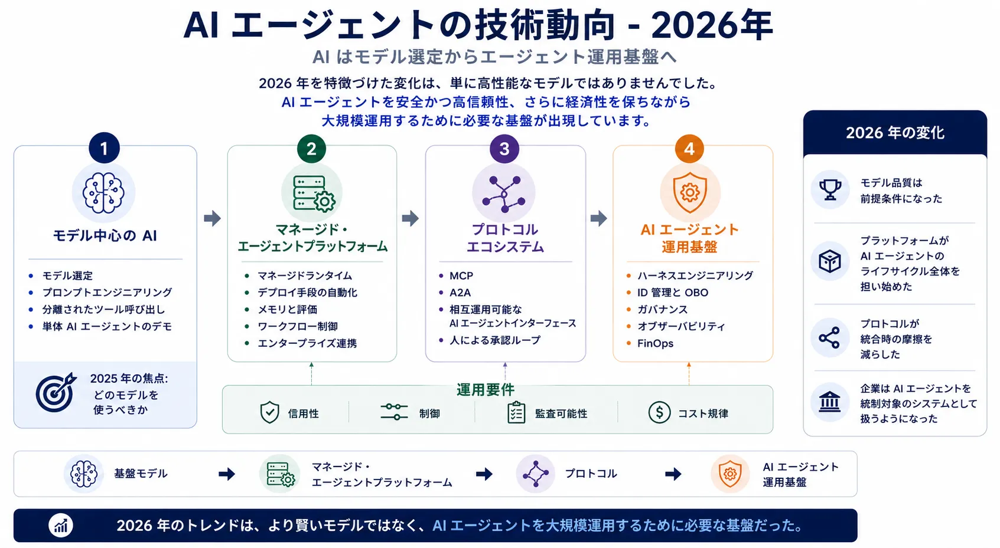
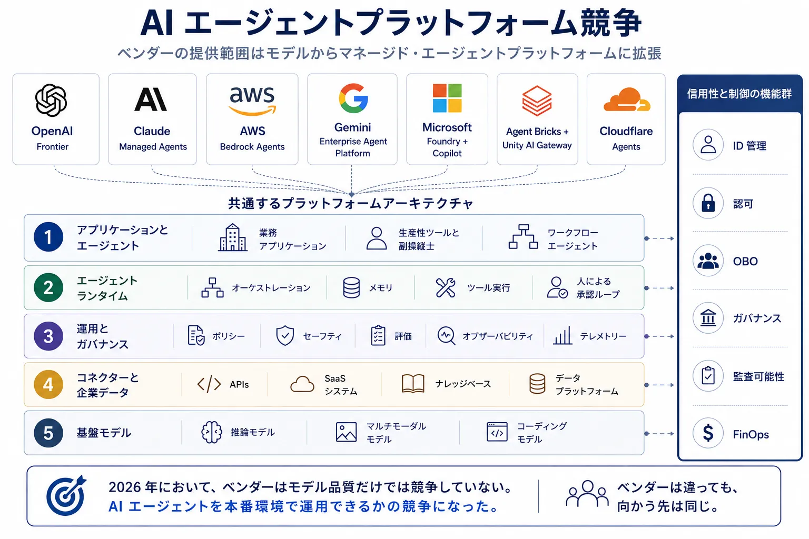
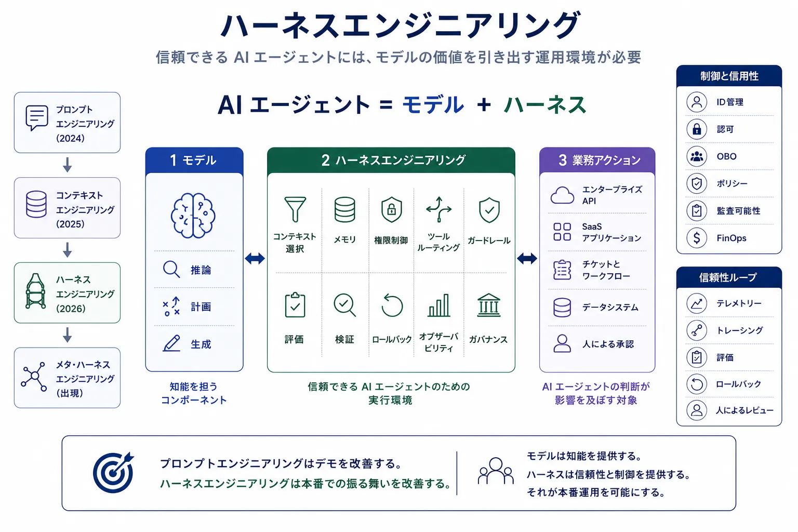
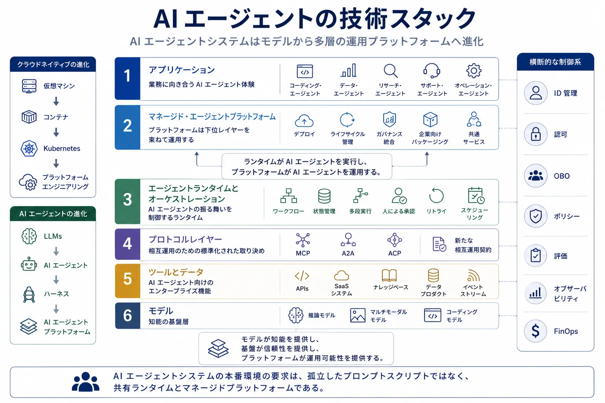

2025年のエージェント設計で中心だった問いは、どのモデルを選ぶべきかでした。
2026年の中心的な問いは、AI エージェントをどのように本番システムとして運用するかです。

この変化は、さらなるベンチマーク向上よりも重要です。
フロンティアモデルは推論、マルチモーダル対話、コーディング、コンピュータ操作の面で引き続き進化しました。しかし、より大きな変化はアーキテクチャ側にありました。ベンダー、クラウドプラットフォーム、オープンソースコミュニティが、AI エージェントを統制可能、可観測、相互運用可能、コスト管理しやすい形で動かすためのランタイム層を組み立て始めたのです。

だからこそ、2026年の AI エージェントの物語は本質的にインフラが主人公です。
AI エージェントは、気の利いた回答を返せるかどうかだけでは評価されなくなりました。アイデンティティ、権限、監査可能性、ロールバック経路、経済的な制御を伴ったまま、業務プロセスの中で動かせるかどうかで評価されます。

## エグゼクティブサマリー

- モデル品質は依然として重要ですが、それ自体は差別化要因というより前提条件になりつつあります。
- 競争の主戦場はモデル API から、オーケストレーション、ツールアクセス、メモリ、評価、ガバナンスを束ねたフルスタックの AI エージェントプラットフォームへ移りました。
- MCP や A2A のようなオープンプロトコルは、分散システムにおけるネットワーク標準に近い役割を果たし始め、独立に作られたコンポーネント間の摩擦を減らしました。
- ハーネスエンジニアリングは、モデルの周囲に信頼できる実行環境を構築するための実践的な分野として浮上しました。
- エンタープライズ導入により、アイデンティティ、委任認可、監査証跡、コスト制御が第一級の要件であることが明確になりました。
- AI エージェントで勝つチームは、最も派手なプロンプトデモを持つチームではありません。AI エージェント型ワークロードを、反復可能かつ安全に、スケールさせて運用できるチームです。



## 1. 振り返り: 2025年の見立てで当たっていたこと

2025年の技術動向は、大きく5つのテーマについて方向性として正しかったと言えます。推論モデル、ツール利用、自律的ワークフロー、コーディングエージェント、マルチエージェント協調です。

特に的中したのは、ツール利用こそがチャット体験と本物の AI エージェントを分ける境界になる、という見立てでした。
AI エージェントがシステムを呼び出し、状態を変更し、時間をまたいで意思決定を連鎖させられるようになると、設計課題はプロンプトだけの問題ではなくなり、ランタイムの問題になります。

コーディングエージェントも、2025年の仮説をすばやく裏づけました。
ユーザーは、周辺のハーネスが高速な検証ループ、透過的な差分、環境分離、わかりやすいロールバックを提供するなら、部分的な自律性を受け入れることが明らかになりました。2025年にはニッチな開発者体験に見えたものが、2026年には他の業務ドメインでエンタープライズ AI エージェントがどう動くかを先取りする存在になりました。

変わったのは、推論能力の向上だけで十分だという業界の前提です。
企業は、より賢いモデルがそのまま信頼できるシステムを生むわけではないと理解しました。AI エージェントがタスクチケット、クラウドリソース、購買ワークフロー、社内ナレッジベースに触れ始めた途端、文脈品質（コンテキスト）、権限境界、追跡可能性、運用コストを管理しなければならなくなったのです。

2025年から2026年への移行から得られる教訓は明快です。モデルは必要条件のままですが、それだけでは十分条件ではなくなりました。

## 2. フロンティアモデルは引き続き進化する

フロンティアモデルの主要ベンダーは、おおむね同じ方向で前進しました。
OpenAI、Anthropic、Google DeepMind、Meta、xAI、Mistral、Alibaba Qwen、そして Microsoft の MAI の取り組みが、それぞれ推論の深さ、長いコンテキスト、マルチモーダル I/O、高いコーディング性能、より明示的なツール利用能力を持つ市場を形作りました。

ここでの戦略的な含意は、これらのモデルがあらゆる用途で完全に交換可能になったということではありません。
実際にはそうではなく、レイテンシ、価格、安全性の姿勢、エンタープライズ向けパッケージング、公開性、特定タスクでの強みには、依然として有意な差があります。ただし2026年には、生のモデル能力だけでは、重要なアーキテクチャ判断を説明しきれなくなりました。

際立つ変化は3つあります。

第一に、モデルは単発のプロンプトに答えるだけでなく、ワークフローの中で動作することに適応するようになりました。
より長いスレッドを維持し、ツール障害から自然に回復し、最終的なユーザー入力だけでなく中間状態を踏まえて推論する場面でも性能が向上しました。

第二に、マルチモーダル性が運用上の意味を持つようになりました。
コンピュータ操作、文書理解、スクリーンショット、音声、構造化 UI 操作によって、AI エージェントはテキスト中心の設計を超えました。そのぶん自動化できる範囲は広がりましたが、同時に権限、可観測性、ポリシー適用の重要性も増しました。

第三に、コーディング性能が市場全体を押し動かす力になりました。
開発者向け AI エージェントが、計画、編集、テスト、複数ステップで修正できるモデルへの明確な需要を作り出し、その需要が AI エージェント向け最適化を主要な市場へ引き上げました。

市場から見た結論は単純です。モデル選定は今でも重要ですが、それだけでは本番成功を説明できません。

## 3. AI エージェントプラットフォーム競争

2026年を特徴づけた商業面での変化は、主要ベンダーが単なるモデルアクセスの販売から、AI エージェントの運用環境そのものを売り始めたことでした。

OpenAI は、単純な推論エンドポイントを超えて、モデル、ツール、構造化レスポンス、評価パターン、マネージドワークフローのプリミティブを束ねた AI エージェントスタックへ進みました。
Anthropic も、Claude を中心としたマネージド AI エージェントとツールが豊富なエンタープライズ利用に向けて同様の方向に進みました。
AWS は、既存のクラウドガバナンスの中に AI エージェント機能を組み込みたいチーム向けに Bedrock のエコシステムを深めています。
Google は、Gemini Enterprise と Google Agent Development Kit を企業向けランタイムの文脈に接続しました。
Microsoft は、Microsoft Foundry、Copilot の各種サーフェス、エンタープライズ制御プレーンをより広いアプリケーションモデルとして結びつけました。
Databricks は、Agent Bricks と Unity AI Gateway を、データ、ガバナンス、評価を重視する企業環境の軸として位置づけました。
Cloudflare は、API、イベント、ユーザートラフィックの近くで動作するエッジネイティブな AI エージェント実行を打ち出しました。

提供形態は異なっていても、これらは同じ技術スタックへ収束しつつあります。



もはや競争は「最良のモデルが勝つか」だけではありません。
誰がライフサイクル全体を握るかが競争の焦点です。

- 開発
- テストと評価
- デプロイ
- ランタイム制御
- 監査可能性
- 最適化

だからこそ、プラットフォーム競争が重要です。
ランタイムを握るベンダーは、統合モデル、ガバナンスモデル、そして最終的には調達モデルまで左右することになりがちです。

## 4. プロトコルは AI エージェントの TCP/IP になる

2025年に AI エージェントがツールを必要とすることが証明されたとすれば、2026年には AI エージェントがプロトコルも必要とすることが明らかになりました。

AI エージェントとツールの接続を担う MCP や、AI エージェント同士の接続を担う A2A のようなプロトコルは、多くの製品発表より深い市場変化を表しています。
これらは個別実装のつぎはぎコードを減らし、独立に進化するシステム同士の共有契約を確立します。

この契約が重要なのは、少なくとも次の3つのインターフェースにまたがるからです。

| インターフェース            | 実現すること                                            | 重要な理由                               |
| --------------------------- | ------------------------------------------------------- | ---------------------------------------- |
| エージェント ↔ ツール       | API、ファイル、データシステム、アプリへの構造化アクセス | 独自コネクターを減らし、移植性を高める   |
| エージェント ↔ エージェント | タスク委譲、交渉、協調、ハンドオフ                      | マルチエージェントシステムの脆さを減らす |
| エージェント ↔ 人間         | 承認、確認、レビュー、例外処理                          | 信頼と運用制御を維持する                 |

MCP が重要になったのは、ツールをベンダー固有の小技ではなく、標準化された能力面として扱ったからです。
A2A や関連する通信の取り組みが重要なのも同じ理由です。企業は、各 AI エージェントフレームワークが互換性のないメッセージパッシングモデルをそれぞれ発明することを望んでいません。

他のプロトコルの取り組みも、この流れを広げています。
Agentic Commerce Protocol や Universal Commerce Protocol のようなコマース指向の仕様、さらに新たな UI 操作の契約は、いずれも同じ方向を示しています。AI エージェントのエコシステムは、インターフェースが退屈なほど予測可能になったときに初めてスケールするのだと、市場は学びつつあります。

この意味で、ネットワークの比喩は有効です。
TCP/IP は派手だったから勝ったのではありません。異種システムが高い信頼性で相互接続できるようにしたから勝ちました。AI エージェントのプロトコルも、同じ役割へ向かっています。

## 5. ハーネスエンジニアリングの登場

2026年に現れた最も有用な考え方のひとつは、AI エージェントを次のように理解すべきだというものです。

```
AI エージェント = モデル + ハーネス
```

モデルは推論を担います。
ハーネスは、その推論を実システムの中で使えるものにします。

ハーネスの責務には、次のようなものがあります。

- コンテキスト選択
- メモリ管理
- 権限制御
- ツールルーティング
- ガードレール
- 評価
- 検証
- ロールバック
- オブザーバビリティ
- ガバナンス

この見方は単なる用語ではありません。
なぜプロンプトエンジニアリングだけでは頭打ちになったのかを説明してくれます。多くのチームはプロンプト改善でデモの品質を上げられましたが、モデルの周囲にある実行環境を制御しない限り、本番結果を安定して改善することはできませんでした。

実務でハーネスエンジニアリングが意味するのは、AI エージェントが考え、行動することを許されるランタイム条件を設計することです。
コーディングエージェントであれば、リポジトリの範囲、テストコマンド、サンドボックス実行、差分レビューが含まれるかもしれません。
財務 AI エージェントなら、承認しきい値、ポリシーチェック、台帳アクセス、不正防止制御が含まれるでしょう。
サポート AI エージェントなら、エスカレーションポリシー、ナレッジ鮮度保証、顧客アイデンティティ確認が必要です。

### メタ・ハーネス: ハーネスを管理するハーネス

単一のハーネスの次に来るのが、メタ・ハーネスです。

メタ・ハーネスは、複数の AI エージェントハーネスを固定配線された部品として扱うのではなく、動的に管理する監督ランタイムです。
実行モードの選択、適切なモデルやサブエージェントへのルーティング、一貫したポリシー適用、予算管理、システム全体にわたるリスク封じ込めを担います。

この変化が重要なのは、第一世代のハーネスが主に個々の AI エージェント境界に焦点を当てていたからです。

- プロンプト
- メモリ
- ツール
- 評価

メタ・ハーネスは、よりシステムレベルの責務を持ち込みます。

- マルチエージェント協調
- ハーネス選択
- モデルディベート
- ポリシー適用
- 予算最適化
- モデルルーティング
- リスク管理
- セキュアサンドボクシング

Omnigent 風のアーキテクチャは、このパターンを説明する例としてわかりやすいものです。
重要なのはブランド名ではなく、設計上の転換点です。AI エージェントは1つずつ手作業で縫い合わせる存在ではなくなり、ハーネスを差し替え、障害を隔離し、全体ルールを強制できる高次の実行層に監督されるようになります。



この進化は、今後の AI エージェントシステムにおける持続的な競争優位を定義するかもしれません。
モデル品質が収束するほど、戦略的優位はモデルの周辺にある実行層の知性へ移っていきます。

## 6. AI エージェントの技術スタック

2026年の AI エージェントスタックは、単一アプリケーションのパターンというより、レイヤー化されたプラットフォームアーキテクチャに近づいています。



各レイヤーは2026年の間に成熟しました。

モデルの能力は向上しました。
ツールとデータは、より構造化され、よりプロトコル経由でアクセスしやすくなりました。
プロトコルは統合時の摩擦を減らしました。
オーケストレーションは、場当たり的なチェーンから明示的なランタイム制御へ移りました。
プラットフォームは、ガバナンス、評価、デプロイを束ね始めました。
アプリケーションは薄くなり、より多くの知性が共有インフラへ移りました。

これは、かつてのクラウドネイティブの歩みに似ています。
業界は、分散システムを運用するために高次の制御プレーンが必要だったため、仮想マシンからコンテナへ、そして Kubernetes へ進みました。AI エージェントシステムも、同じような経路をたどりつつあります。

```
LLMs -> AI エージェント -> ハーネス -> AI エージェントプラットフォーム
```

すべての組織がただちに最も複雑なスタックを必要とする、ということではありません。
重要なのは、進む方向がもはや明白だということです。本番環境の AI エージェントシステムが求めるのは、孤立したプロンプトスクリプトではなく共有ランタイムです。

## 7. アイデンティティ、認可、信頼

AI エージェントに関するセキュリティ議論は、初期の市場ストーリーでは十分に成熟していないことが多くありました。
しかし、AI エージェントが単に文章を生成するだけでなく、実際に行動を起こし始めると、その甘さは許されなくなりました。

最も難しい問題はアイデンティティです。
エンタープライズ向け AI エージェントシステムは、何らかのアクションが試みられるたびに、少なくとも次の4つの問いに答えなければなりません。

1. 誰がこのアクションを要求したのか。
2. どの AI エージェントがそれを実行しているのか。
3. どの権限が委任されていたのか。
4. 必要に応じて、そのアクションをどのように監査し、取り消すのか。

ここから、マシンアイデンティティ、ポリシーエンジン、最小権限、監査可能な実行へと話が直結します。
機密データを読み、チケットを起票し、レコードを更新し、インフラをデプロイできる AI エージェントが、曖昧な信頼の上で動くことはできません。明確に定義されたセキュリティプリンシパル、制約された権限、追跡可能なアクションログが必要です。

### OBO 認可は必須になる

On-behalf-of 認可は、AI エージェントシステムにおける最重要のエンタープライズパターンのひとつになりました。

従来のエンタープライズソフトウェアは、主に次の経路を前提としていました。

```
人間 -> アプリケーション
```

AI エージェントシステムでは、その間に実行主体が挟まります。

```
人間 -> AI エージェント -> ツール
```

この中間段階が、新しい制御問題を生みます。
ツール側は、AI エージェントがユーザーから委任された権限で動いているのか、システムアイデンティティで動いているのか、あるいはさらに限定されたワークフロー専用資格情報で動いているのかを理解しなければなりません。

これは、ごく普通の業務シナリオでも重要です。

- AI エージェントが購買申請を出す
- AI エージェントが Jira チケットを更新する
- AI エージェントがインフラをデプロイする
- AI エージェントが企業データにアクセスする

いずれの場合も、企業にはスコープ付き権限、承認ワークフロー、監査証跡、取り消し経路が必要です。
それがなければ、自律性はサンドボックスの外へ広がりません。

長期的には、AI エージェントのアイデンティティはユーザーアイデンティティに近い重要度を持つようになるでしょう。
アイデンティティプロバイダー、クラウドベンダー、エンタープライズアプリケーションプラットフォームは、委任されたマシンアクションを例外ではなく第一級の関心事として扱う方向へ進んでいます。

## 8. AI エージェントの経済性

2026年には、AI エージェントの経済性もより明確になりました。
推論コストは数ある明細行の1行にすぎません。

本番コストには、少なくとも次の5つが含まれます。

- モデル推論
- ツール実行
- オーケストレーションのオーバーヘッド
- 評価と回帰テスト
- オブザーバビリティとトレーシング

だからこそ、AI エージェントは FinOps の問題になりつつあります。
最も高価な AI エージェントは、最も高価なモデルを使うものとは限りません。無駄にループし、ツールを呼びすぎ、コンテキストを無駄に再処理し、経済的な規律なしに下流システムを起動してしまう AI エージェントこそが高くつきます。

ここから新しいアーキテクチャ要件が生まれます。コストを意識した実行です。
チームは、定型作業には小さなモデルを選び、高価な推論は高価値の分岐にだけ使い、技術的には動いていても経済的には失敗しているワークフローを止めるランタイムポリシーを必要とし始めています。

したがって、予算最適化はハーネスの一部になり、やがてメタ・ハーネスの一部になります。
本番環境では、効率性は調達上の細目ではありません。ランタイムの振る舞いそのものです。

## 9. 2027年に向けて

2026年が、AI エージェントをインフラ問題として扱う年だったとすれば、2027年は、そのインフラがより強い前提を持つ運用モデルへ集約されていく年になる可能性があります。

考えられる方向性はいくつかあります。

- アイデンティティ、オーケストレーション、ポリシー、評価を一体の制御プレーンとしてまとめる AI エージェント OS
- 単なるプロンプトテンプレートではなく、信頼できる能力を配布する AI エージェントマーケットプレイス
- 委任されたマシンアクションに対する、より強固なアイデンティティ標準と認可標準
- 明示的な検証ゲートを備えた自律型ソフトウェアデリバリーパイプライン
- 実績データからルーティングやポリシーを適応的に変える自己改善型ハーネス
- デジタル AI エージェントとロボティクス、エッジ環境を接続するフィジカル AI
- AI エージェント実行をデフォルトのワークロード種別として扱うエージェントネイティブなクラウドプラットフォーム

重要なのは AGI を推測することではありません。
より有用な問いは、組織が、分散システム、クラウドプラットフォーム、データ基盤に向けるのと同じ真剣さで、AI エージェント型システムをどう運用するかです。

これこそが、2026年の本当の物語です。
業界が手に入れたのは、より賢いモデルだけではありません。AI エージェントを運用するための環境を作り始めたのです。

だからこそ、いまの AI エージェントの技術動向は、プロンプト設計者よりも、ランタイムアーキテクト、プラットフォームエンジニア、セキュリティチーム、ガバナンスシステムの側に重心を移しています。
