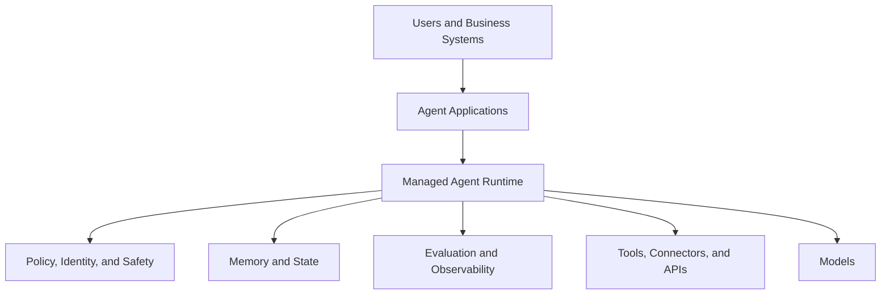
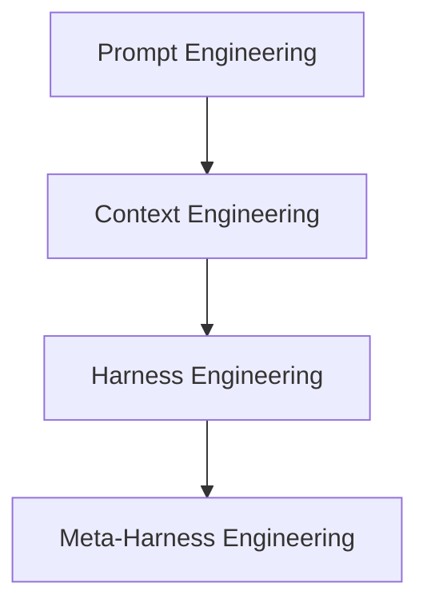
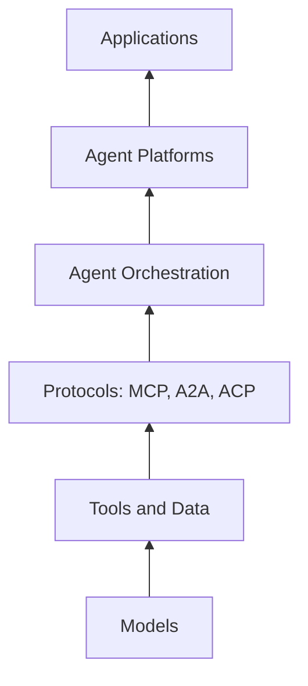

In 2025, the central question in agent design was which model to pick.
In 2026, the central question is how to operate agents as a production system.

That shift matters more than another round of benchmark gains.
Frontier models continued to improve across reasoning, multimodal interaction, coding, and computer use, but the more important change was architectural: vendors, cloud platforms, and open source communities started assembling the runtime layers required to make agents governable, observable, interoperable, and cost-aware.

This is why the AI agent story of 2026 is fundamentally an infrastructure story.
Agents are no longer judged only by whether they can produce a clever answer. They are judged by whether they can run inside a business process with identity, permissions, auditability, rollback paths, and economic controls.

## Executive Summary

- Model quality still matters, but it is increasingly a baseline capability rather than the sole source of differentiation.
- The competitive surface shifted from model APIs to full agent platforms that bundle orchestration, tool access, memory, evaluation, and governance.
- Open protocols such as MCP and A2A started playing the role that networking standards once played for distributed systems: they reduced friction between independently built components.
- Harness Engineering emerged as a practical discipline for building reliable execution environments around models.
- Enterprise adoption exposed identity, delegated authorization, audit trails, and cost control as first-class requirements.
- The teams that will win with agents are not the ones with the flashiest prompt demos. They are the ones that can run agentic workloads repeatedly, safely, and at scale.

## 1. Looking Back: What the 2025 Landscape Predicted Correctly

The 2025 landscape was directionally right about five major themes: reasoning models, tool use, autonomous workflows, coding agents, and multi-agent coordination.

The most important prediction that held up was that tool use would become the boundary between chat experiences and real agents.
Once an agent can call systems, mutate state, and chain decisions over time, the design problem stops being only about prompting and starts becoming a runtime problem.

Coding agents also validated the 2025 thesis quickly.
They became the clearest proof that users would tolerate partial autonomy if the surrounding harness provided fast verification loops, transparent diffs, environment isolation, and straightforward rollback.
What looked like a niche developer experience in 2025 became a preview of how enterprise agents would work in every other domain.

What changed was the industry assumption that more reasoning alone would be enough.
Enterprises discovered that smarter models do not automatically produce dependable systems.
As soon as agents touched tickets, cloud resources, purchase workflows, or internal knowledge bases, organizations had to solve for context quality, permission boundaries, traceability, and operational cost.

That is the key lesson from the 2025 to 2026 transition: the model remained necessary, but it stopped being sufficient.

## 2. Frontier Models Continue to Improve

The frontier model vendors all moved forward in roughly the same directions.
OpenAI, Anthropic, Google DeepMind, Meta, xAI, Mistral, Alibaba Qwen, and Microsoft's MAI efforts each contributed to a market where reasoning depth, larger context windows, multimodal I/O, stronger coding ability, and more explicit tool-use behavior became more common.

The strategic implication is not that these models became interchangeable in every scenario.
They did not.
Different vendors still show meaningful variation in latency, price, safety posture, enterprise packaging, openness, and task-specific strengths.
But by 2026, raw model capability ceased to be the only meaningful architecture decision.

Three changes stand out.

First, models became better at operating inside workflows rather than only answering isolated prompts.
They maintain longer threads, recover from tool failures more gracefully, and perform better when asked to reason over intermediate state rather than just final user input.

Second, multimodality became operationally relevant.
Computer-use patterns, document understanding, screenshots, voice, and structured UI interactions pushed agents beyond text-centric designs.
This expanded the scope of what could be automated, but it also increased the importance of permissions, observability, and policy enforcement.

Third, coding performance became a forcing function for the whole market.
Developer agents created visible demand for models that can plan, edit, test, and revise across multiple steps.
That demand pulled agent-specific optimizations into the mainstream.

The market takeaway is simple: model selection still matters, but model selection alone no longer explains production success.

## 3. The Agent Platform Wars

The defining commercial shift of 2026 was that major vendors stopped selling only model access and started selling agent operating environments.

OpenAI pushed beyond plain inference endpoints toward an agent stack that combined models, tools, structured responses, evaluation patterns, and managed workflow primitives.
Anthropic advanced a similar direction around Claude-centered managed agents and tool-rich enterprise usage.
AWS kept deepening the Bedrock agent ecosystem for teams that want agent capabilities packaged inside existing cloud governance.
Google connected Gemini with enterprise runtime patterns and the Google Agent Development Kit.
Microsoft linked Microsoft Foundry, Copilot surfaces, and enterprise control planes into a broader application model.
Databricks positioned Agent Bricks and Unity AI Gateway around data, governance, and evaluation-heavy enterprise environments.
Cloudflare emphasized edge-native agent execution close to APIs, events, and user traffic.

These offerings differ in packaging, but they are converging on the same basic stack.



The competition is no longer only about best model wins.
It is about who can own the full lifecycle:

- development
- test and evaluation
- deployment
- runtime control
- auditability
- optimization

This is why the platform wars matter.
The vendor that owns the runtime often shapes the integration model, the governance model, and eventually the procurement model.

## 4. Protocols Become the TCP/IP of Agents

If 2025 proved that agents needed tools, 2026 made it clear that agents also need protocols.

Protocols such as MCP for agent-to-tool interaction and A2A for agent-to-agent interaction represent a deeper market shift than most product launches.
They reduce bespoke glue code and establish a shared contract between independently evolving systems.

That contract matters across three separate interfaces:

| Interface     | What it enables                                          | Why it matters                                     |
| ------------- | -------------------------------------------------------- | -------------------------------------------------- |
| Agent ↔ Tool  | Structured access to APIs, files, data systems, and apps | Reduces custom connectors and improves portability |
| Agent ↔ Agent | Task delegation, negotiation, coordination, and handoff  | Makes multi-agent systems less brittle             |
| Agent ↔ Human | Approvals, clarification, review, and exception handling | Preserves trust and operational control            |

MCP became important because it treated tools as a standardized capability surface instead of a provider-specific trick.
A2A and related communication efforts matter for the same reason: organizations do not want every agent framework to invent its own incompatible message-passing model.

Other protocol efforts broaden this pattern.
ACP variants, commerce-oriented protocols such as Agentic Commerce Protocol and Universal Commerce Protocol, and emerging UI interaction contracts all point in the same direction.
The market is slowly learning that agent ecosystems scale when interfaces become boring and predictable.

That is why the networking analogy is useful.
TCP/IP did not win because it was glamorous.
It won because it allowed heterogeneous systems to interoperate reliably.
Agent protocols are heading toward the same role.

## 5. Harness Engineering Emerges

One of the most useful ideas to emerge in 2026 is that an agent should be understood as:

```
Agent = Model + Harness
```

The model performs reasoning.
The harness makes that reasoning usable inside a real system.

Harness responsibilities now include:

- context selection
- memory management
- permission control
- tool routing
- guardrails
- evaluation
- verification
- rollback
- observability
- governance

This framing is more than vocabulary.
It explains why prompt engineering alone plateaued.
Teams could often improve a demo by refining prompts, but they could not reliably improve production outcomes without controlling the execution environment around the model.

In practice, Harness Engineering means designing the runtime conditions under which an agent is allowed to think and act.
For a coding agent, that harness may include repository scope, test commands, sandboxed execution, and diff review.
For a finance agent, it may include approval thresholds, policy checks, ledger access, and fraud controls.
For a support agent, it may include escalation policies, knowledge freshness guarantees, and customer identity verification.

### Meta-Harnesses: Harnesses Managing Harnesses

The next step beyond a single harness is the meta-harness.

A meta-harness is a supervisory runtime that manages multiple agent harnesses dynamically rather than treating each agent as a fixed hand-wired component.
It is responsible for selecting execution modes, routing work to the right model or sub-agent, enforcing policy consistently, managing budgets, and containing risk across the whole system.

This is an important shift because first-generation harnesses mostly focused on the local agent boundary:

- prompts
- memory
- tools
- evaluations

Meta-harnesses introduce system-level responsibilities:

- multi-agent coordination
- harness selection
- model debate
- policy enforcement
- budget optimization
- model routing
- risk management
- secure sandboxing

An Omnigent-style architecture is a useful illustration of the pattern.
The point is not the brand name; the point is the design move.
Agents are no longer manually stitched together one by one. They are supervised by a higher-order execution layer that can swap harnesses, isolate failures, and enforce global rules.



This progression may define the next durable moat in agent systems.
As model quality converges, the strategic advantage shifts toward the intelligence of the execution layer around the models.

## 6. The New Agent Stack

The agent stack in 2026 looks increasingly like a layered platform architecture rather than a single application pattern.



Each layer matured during 2026.

Models improved in capability.
Tools and data became more structured and more protocol-accessible.
Protocols reduced integration friction.
Orchestration shifted from ad hoc chains to explicit runtime control.
Platforms started bundling governance, evaluation, and deployment.
Applications became thinner, because more intelligence moved into shared infrastructure.

This resembles the earlier cloud-native journey.
The industry moved from virtual machines to containers to Kubernetes because operating distributed systems required a higher-order control plane.
Agent systems are following a similar path:

```
LLMs -> Agents -> Agent Platforms
```

The important point is not that every organization needs the most elaborate stack immediately.
It is that the direction of travel is now obvious.
Production agent systems want shared runtimes, not isolated prompt scripts.

## 7. Identity, Authorization, and Trust

Security discussions about agents were often underdeveloped in early market narratives.
That stopped being acceptable once agents started taking actions rather than only generating text.

The hard problem is identity.
An enterprise agent system must answer at least four questions every time an action is attempted:

1. Who requested this action?
2. Which agent is executing it?
3. Which permissions were delegated?
4. How will the action be audited and revoked if necessary?

That leads directly to machine identity, policy engines, least privilege, and auditable execution.
An agent that can read sensitive data, open tickets, modify records, or deploy infrastructure cannot operate on vague trust.
It needs a well-defined security principal, constrained authority, and a traceable action log.

### OBO Authorization Becomes Essential

On-behalf-of authorization became one of the most important enterprise patterns for agent systems.

Traditional enterprise software mostly assumed this path:

```
Human -> Application
```

Agent systems add an intermediate executor:

```
Human -> Agent -> Tool
```

That intermediate step creates a new control problem.
The tool must know whether the agent is acting under delegated user authority, under a system identity, or under a more limited workflow-specific credential.

This matters in ordinary business scenarios:

- an agent submits a purchase request
- an agent modifies a Jira ticket
- an agent deploys infrastructure
- an agent accesses enterprise data

In each case, enterprises need scoped permissions, approval workflows, audit trails, and revocation paths.
Without those controls, autonomy does not scale beyond sandboxes.

The likely long-term result is that agent identity will become nearly as important as user identity.
Identity providers, cloud vendors, and enterprise application platforms are all moving toward patterns that treat delegated machine action as a first-class concern rather than an edge case.

## 8. The Economics of Agents

The economics of agents also became clearer in 2026.
Inference is only one line item.

Production cost includes at least five components:

- model inference
- tool execution
- orchestration overhead
- evaluation and regression testing
- observability and tracing

This is why agents are turning into a FinOps problem.
The most expensive agent is often not the one using the most expensive model. It is the one that loops unnecessarily, calls too many tools, reprocesses context wastefully, or triggers downstream systems without economic discipline.

This creates a new architecture requirement: cost-aware execution.
Teams increasingly need runtime policies that can choose smaller models for routine tasks, reserve premium reasoning for high-value branches, and stop workflows that are failing economically even if they are still technically running.

Budget optimization therefore becomes part of the harness, and eventually part of the meta-harness.
In production, efficiency is not a procurement detail. It is a runtime behavior.

## 9. Looking Toward 2027

If 2026 was the year agents became an infrastructure problem, 2027 is likely to be the year that infrastructure starts consolidating into more opinionated operating models.

Several directions look plausible.

- agent operating systems that combine identity, orchestration, policy, and evaluation into a coherent control plane
- agent marketplaces that package trusted capabilities rather than just prompt templates
- stronger identity and authorization standards for delegated machine action
- autonomous software delivery pipelines with explicit verification gates
- self-improving harnesses that adapt routing and policy from observed outcomes
- physical AI systems that connect digital agents with robotics and edge environments
- agent-native cloud platforms that treat agent execution as a default workload category

The point is not to speculate about AGI.
The more useful question is how organizations will run agentic systems with the same seriousness they apply to distributed systems, cloud platforms, and data infrastructure.

That is the real story of 2026.
The industry did not simply get better models.
It began building the operating environment for agents.

And that is why the AI agent landscape now belongs less to prompt designers and more to runtime architects, platform engineers, security teams, and governance systems.
