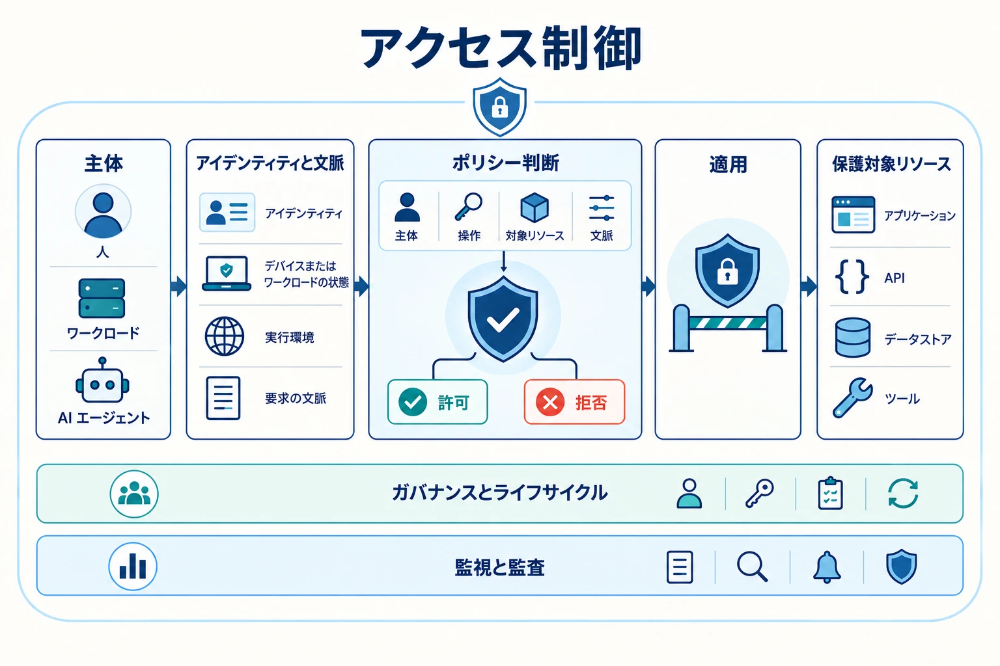

アクセス制御は、誰または何が、どの条件で、どの程度の保証を伴って、どの操作を実行できるかを定義するアーキテクチャ上の中核領域です。
現代のシステムでは、この問いは従業員や顧客だけでなく、ワークロード、API、外部サービス、AI エージェント、そしてクラウドとオンプレミスをまたぐ信頼境界全体に広がります。

本セクションは、単一の長文レポートではなく、3 階層のセキュリティアーキテクチャライブラリとして構成しています。
領域全体の概要からドメインハブへ進み、各ハブから個別のトピックページへ移動できます。基本原則、技術ドメイン、運用統制、再利用可能な参照資料を分離し、戦略から実装までを一貫した概念モデルのまま辿れるようにしています。

推奨する読書順は次のとおりです。

1. ビジョンと原則
2. 全体像と分類体系
3. 人のアイデンティティ、認可モデル、ワークロード ID、AI エージェント制御
4. 多層防御とガバナンス
5. パターン、脅威モデル、設計トレードオフ、参照アーキテクチャ

各ドキュメントは共通して次の 3 層で構成します。

- **概要**: 全体像の把握
- **主要概念**: 概念モデルの理解
- **実装と運用**: 実装・運用上の論点

## アクセス制御の領域を探る

以下のハブから、アクセス制御の全体像を起点として、特定のドメイン、運用上の論点、参照資料へ進んでください。










