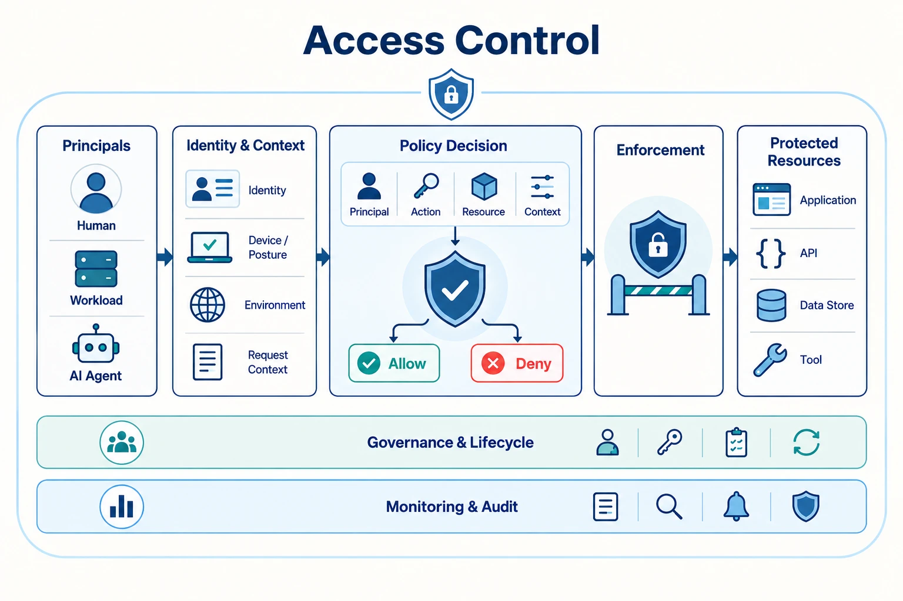

Access control is the architectural discipline that decides who or what may do what, under which conditions, and with what degree of assurance.
In modern systems, that question spans employees, customers, workloads, APIs, third-party services, and AI agents operating across cloud and on-premises boundaries.

This section is organized as a three-level security architecture library rather than a single long report.
The field overview leads to domain hubs, and each hub leads to focused topic pages. This structure separates guiding principles, technical domains, operational controls, and reusable reference material so readers can move from strategy to implementation without losing the conceptual model.

The recommended reading flow is:

1. Vision and principles
2. Landscape and taxonomy
3. Human identity, authorization, workload identity, and AI-agent control models
4. Defense in depth and governance
5. Patterns, threat models, tradeoffs, and reference architectures

Every document follows a similar shape:

- **Executive Summary** for orientation
- **Core Concepts** for the conceptual model
- **Implementation and Operations** for architecture tradeoffs and operating guidance

## Explore Access Control Domains

Use these hubs to move from the overall access-control landscape into a specific domain, operating concern, or reference collection.










