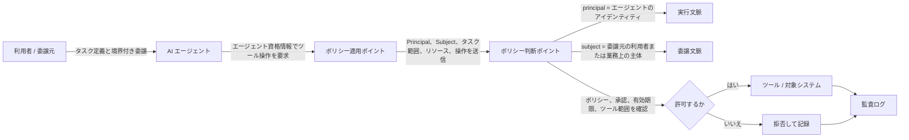

+++
date = '2026-05-10T13:00:00+09:00'
title = 'AI エージェントと自律的認可'
weight = 6
prev = '/docs/acc/workload-identity'
next = '/docs/acc/defense-in-depth'
+++

AI エージェントは、既存権限の上に載る単なる UI 機能ではなく、制約付きで動作する運用上のアイデンティティとして扱うべきです。

## 概要

AI エージェントは、文脈を読み、ツールを選び、アクションを生成し、人間より高い速度と規模で複数システムをまたいで動けます。これにより認可問題の性質が変わります。重要なのは、エージェントが認証されているかだけではありません。委譲された権限が、どのように境界づけられ、説明され、監視され、剥奪されるかです。

そのためエージェントセキュリティでは、ツールの権限範囲、メモリアクセス、承認境界、実行環境を明示的に制御する必要があります。これがない場合、広い権限と確率的挙動の組み合わせにより、新しい代理人の混乱問題やプロンプトインジェクションのリスクが生まれます。

## 主要概念

### 主体としてのエージェント

エージェントは次の形で振る舞います。

- 人間の主体の代理として動く
- 自身のサービスアイデンティティで動く
- 特定タスク用に発行された委譲済み権能を用いて動く

これらを混同すべきではありません。「ユーザーの代理」という説明だけでは信頼モデルになりません。誰が何を、どの期間、どのツールに、どのポリシー制約付きで委譲したのかを記録する必要があります。

### 委譲における Principal と Subject の違い

委譲が入ると、現在実行している主体である Principal と、権限や業務上の意図の参照元となる Subject を区別する必要が生じます。

人間が直接操作する通常のリクエストでは、両者は一致しやすくなります。たとえば Alice がサインインして文書へのアクセスを要求する場合、ポリシーエンジンは Alice を実行主体としても、アクセス判断の対象主体としても扱えます。しかしエージェントワークフローでは、実行主体はエージェントになり、Alice は委譲元としての Subject のまま残ることがあります。このときポリシーは、Alice の委譲範囲、タスク境界、承認状態、データ所有関係を引き続き参照する必要があります。

この違いが重要なのは、別々の制御上の問いが紐づくからです。

- **主体（Principal）** が答えること: 今まさに誰が呼び出しを実行し、資格情報を保持し、ツールを起動し、副作用を発生させているのか
- **被評価主体（Subject）** が答えること: 誰の代理としてその操作が検討されているのか、誰の権限が参照されるのか、誰の承認や制約がポリシー上の基準になるのか

もしシステムが Principal と Subject を 1 つの項目に潰してしまうと、その操作が利用者本人によるものか、委譲を受けたエージェントによるものか、あるいは常設権限を持つサービスによるものかを区別しにくくなります。この曖昧さは監査可能性を下げ、代理人の混乱問題を見えにくくします。

委譲付きのエージェントフローでは、通常、ポリシー評価に両方の識別子を明示的に残すべきです。たとえば Principal は `agent://research-assistant/session-123`、Subject は `user://alice` とし、さらにタスク範囲、委譲の有効期限、許可されたツール、リソースの機微性などを文脈として添えます。

このフローでは、利用者が境界付きでタスクを委譲し、エージェントの要求を PEP が受け取り、PDP が Principal と Subject と委譲制約を評価し、許可・拒否の結果を監査ログに残します。

実務上は、少なくとも次の 5 項目をログとポリシー入力に残すべきです。すなわち、実行 Principal、委譲元 Subject、対象リソース、要求された操作、委譲制約です。この構造がないと、インシデント後の再構成が不必要に難しくなります。

### 主なリスク領域

- **プロンプトインジェクション** によりツール利用やデータ解釈が変えられる
- **過剰権限ツール** により小さな文脈露出が大きな侵害に発展する
- **メモリリーク** によりタスク間の機微情報が露出する
- **マルチエージェント連鎖** により計画と実行の責任境界が曖昧になる
- **エージェントなりすまし** は共有または常在のツール資格情報で起こりやすい

### より良い制御モデル

有望なパターンとして、権能ベースの委譲、短命な実行アイデンティティ、機微または特権的な操作に対する人手承認、サンドボックス化されたツール実行環境、暗号的に束縛された委譲記録があります。

## 実装と運用

### 設計ガイダンス

- 広いユーザートークンの再利用ではなく、タスク単位の資格情報を発行する
- 読み取り、書き込み、承認を分離する
- エージェントメモリはテナント、ワークフロー、保持区分ごとに隔離する
- ツール呼び出し自体をポリシー適用ポイントとして扱う
- 意図、プロンプト文脈の区分、選択されたツール、承認、結果を記録する

### PEP と PDP の役割分担

Policy Enforcement Point（PEP）は、ツール呼び出し、API 要求、ワークフローステップを受け止めて、認可要求へ変換する部品です。Policy Decision Point（PDP）は、その要求をポリシー、委譲文脈、承認状態、リソース状態に照らして評価し、許可・拒否、場合によっては追加義務付きの結果を返す部品です。

エージェントシステムでは、PEP はチャット UI だけでなく、実際の副作用に最も近い場所へ置くべきです。PDP を中央集約できるとしても、PEP 側は、実行 Principal、委譲元 Subject、ツール名、リソース、操作、タスク範囲を十分な精度で渡し、後から判断経路を再構成できるようにする必要があります。

### 実務的な承認モデル

低リスク操作は、境界づけられたポリシー内で事前承認できる場合があります。中リスク操作には、データ分類検証や異常検知などの二次チェックを入れます。権限変更、本番書き込み、規制データの持ち出しなど高リスク操作には、明示的な承認または暗号的委譲が必要です。

目標は自律性を完全に止めることではありません。自律的挙動を、境界づけられ、可観測で、統制可能なものにすることです。
