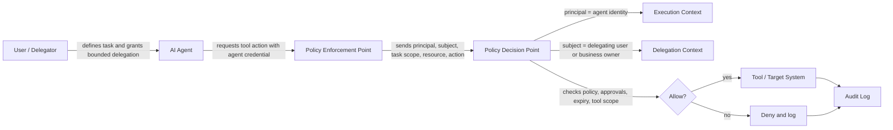

AI agents should be treated as constrained operating identities rather than as a user-interface feature layered on top of existing permissions.

## Executive Summary

An AI agent can read context, select tools, generate actions, and operate across multiple systems with speed and scale that humans cannot match. That capability changes the authorization problem. The key issue is not merely whether an agent is authenticated. It is how delegated authority is bounded, explained, monitored, and revoked.

Agent security therefore requires explicit control of tool scopes, memory access, approval boundaries, and execution environments. Without those controls, the combination of broad permissions and probabilistic behavior creates a new class of confused-deputy and prompt-injection risk.

## Core Concepts

### Agents as principals

An agent may act:

- on behalf of a human principal
- under its own service identity
- through delegated capabilities issued for a specific task

These modes should not be conflated. "Acting for a user" is not enough as a trust model. Systems must record who delegated what, for how long, to which tools, and under which policy constraints.

### Principal versus subject under delegation

Delegation creates an important distinction between the principal that is currently executing and the subject whose authority or business intent is being referenced.

In a direct human request, these are often the same. Alice signs in, requests access to a document, and the policy engine evaluates Alice as both the executing principal and the subject of the access rule. In an agent workflow, however, the agent may become the executing principal while Alice remains the subject whose delegation, task scope, approval state, or data ownership relationship must still be considered.

That distinction matters because different control questions attach to each identity:

- **Principal** answers: who is making the live call, holding the credential, invoking the tool, and producing side effects right now?
- **Subject** answers: on whose behalf is the action being considered, whose entitlements are relevant, and whose approvals or constraints should the policy reference?

If a system collapses principal and subject into one field, it becomes hard to answer whether the action was performed by the user directly, by an agent using delegated authority, or by a service acting under its own standing privileges. That ambiguity weakens auditability and can hide confused-deputy failures.

For delegated agent flows, policy evaluation should usually preserve both identities explicitly. The principal may be `agent://research-assistant/session-123`, while the subject may be `user://alice`, with additional context such as task scope, delegation expiry, approved tools, and resource sensitivity.

In this flow, a user delegates a bounded task to an AI agent, the agent request is enforced by a Policy Enforcement Point (PEP), the Policy Decision Point (PDP) evaluates principal/subject plus delegation constraints, and every allow-or-deny outcome is recorded to the audit log.

In practice, this means logs and policy inputs should retain at least five fields: executing principal, delegated subject, target resource, requested action, and delegation constraints. Without that structure, post-incident reconstruction becomes unnecessarily difficult.

### Key risk areas

- **Prompt injection** can alter tool use or data interpretation.
- **Over-permissioned tools** can turn small context exposure into broad compromise.
- **Memory leakage** can reveal sensitive cross-task data.
- **Multi-agent chains** can blur accountability across planning and execution.
- **Agent impersonation** can occur when tool credentials are shared or ambient.

### Better control models

Promising patterns include capability-based delegation, ephemeral execution identities, human-in-the-loop approval for sensitive actions, sandboxed tool runtimes, and cryptographically bound delegation records.

## Implementation and Operations

### Design guidance

- Issue task-scoped credentials instead of reusing broad user tokens.
- Separate read, write, and approval permissions.
- Isolate agent memory by tenant, workflow, and retention class.
- Treat tool invocation as a policy enforcement point.
- Log intent, prompt context class, selected tools, approvals, and outcomes.

### PEP and PDP responsibilities

The PEP is the component that intercepts the tool call, API request, or workflow step and turns it into an authorization request. The PDP is the component that evaluates the request against policy, delegation context, approvals, and resource state, then returns allow, deny, or sometimes conditional obligations.

For agent systems, the PEP should sit as close as possible to the real side effect, not only at the chat interface. The PDP may be centralized, but the PEP must still pass the executing principal, delegated subject, tool name, resource, action, and task scope with enough fidelity that the decision remains reconstructable during review.

### A practical approval model

Low-risk actions may be pre-authorized within a bounded policy. Medium-risk actions may require secondary checks such as data-classification validation or anomaly detection. High-risk actions such as privilege changes, production writes, or regulated data export should require explicit approval or cryptographic delegation.

The objective is not to block autonomy entirely. It is to make autonomous behavior bounded, observable, and governable.
