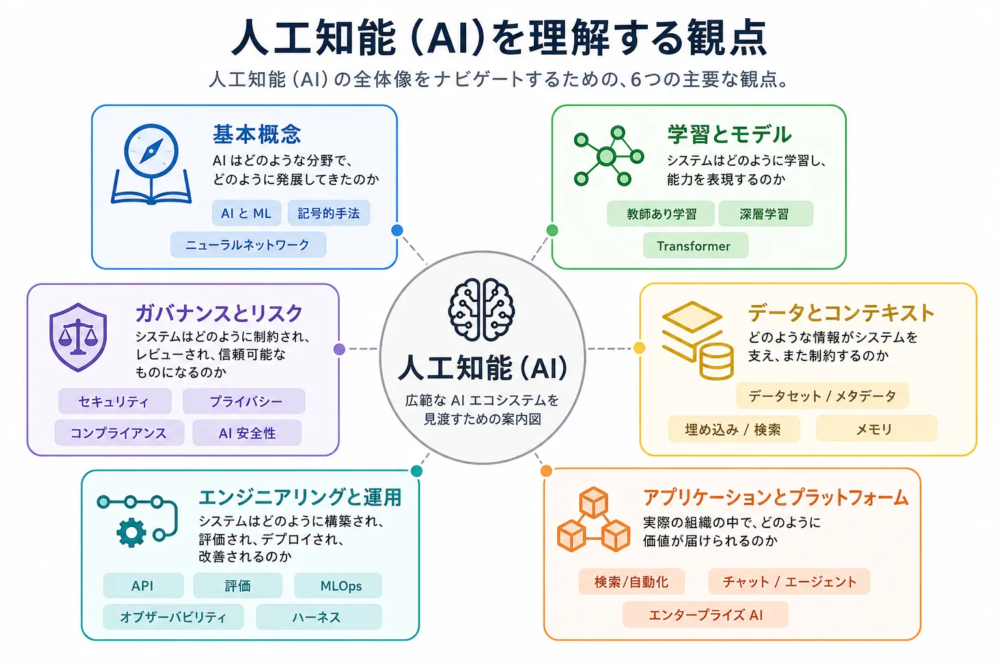

人工知能（AI）とは、知覚、予測、生成、意思決定、適応といった能力を必要とするタスクを実行するシステムを構築するための広い分野です。
実際には、AI は単一の技術ではありません。統計的学習、ニューラルアーキテクチャ、ソフトウェアシステム、データパイプライン、インフラストラクチャ、ガバナンス、業務領域ごとの応用にまたがる、複数の関連分野の集合です。

その広がりがあるため、このセクションはひとつの長い記事としてではなく、ドキュメントハブとして捉える必要があります。
ここで重要なのは、個別のモデルファミリーやツールカテゴリを暗記することではありません。
全体を構成する主要な要素がどのようにつながっているかを理解し、より詳細なトピックを適切な文脈に位置付けられるようにすることです。

AI は横断的な領域です。
実運用のシステムには、学習データ、検索パイプライン、モデルサービング、アプリケーションオーケストレーション、評価ループ、アクセス制御、プライバシー保護、人による承認ワークフローが同時に含まれることがあります。
そのため、AI のトピックは [ソフトウェアアーキテクチャ](../arch/)、[ソフトウェア開発](../swe/)、[データ](../data/)、[アクセス制御](../acc/) と接点を持ちますが、それらのいずれかひとつに還元できるものではありません。

## 主要な観点

このセクションでは、読者がどのような問いに答えたいのかという観点から、AI のトピックを整理しています。

| 観点                               | 主な問い                                                             | 代表的なトピック                                                                         |
| ---------------------------------- | -------------------------------------------------------------------- | ---------------------------------------------------------------------------------------- |
| 基本概念                           | AI はどのような分野で、どのように発展してきたのか                    | AI と ML、記号的手法、統計的学習、ニューラルネットワーク                                 |
| 学習とモデル                       | システムはどのように学習し、能力を表現するのか                       | 教師あり学習、深層学習、Transformer、基盤モデル                                          |
| データとコンテキスト               | どのような情報がシステムを支え、また制約するのか                     | 学習データ、ラベリング、埋め込み、メタデータ、検索、メモリ、コンテキストエンジニアリング |
| エンジニアリングと運用             | システムはどのように構築され、評価され、デプロイされ、改善されるのか | API、評価、テスト、MLOps、オブザーバビリティ、モデルサービング                           |
| ガバナンスとリスク                 | システムはどのように制約され、レビューされ、信頼可能なものになるのか | セキュリティ、プライバシー、公平性、コンプライアンス、AI 安全性                          |
| アプリケーションとプラットフォーム | 実際の組織の中で、どのように価値が届けられるのか                     | チャット、検索、エージェント、エンタープライズ AI、自動化、ロボティクス                  |

これらの観点は、実際のシステムの中では重なり合います。
たとえば、検索拡張型 AI アシスタントは、基盤モデル、データパイプライン、アプリケーションオーケストレーション、評価の管理策、ガバナンス上の判断に同時に依存します。

## このセクションの主要なドメイン

このセクションでは、AI の全体像を、今後それぞれ独立したトピックページへ展開していく安定した概念ドメインとして整理しています。
これらのドメインは、個別のモデル、ベンダー、フレームワーク、製品カテゴリが変化しても意味を失いにくいという点で重要です。

**基本概念** では、AI、機械学習、深層学習の違いを含め、現代のシステムに影響を与え続けている歴史的・理論的な背景を扱います。

**機械学習** では、教師あり学習、教師なし学習、強化学習を通じてシステムがどのようにパターンを学習するか、また学習と評価に関する実務上の論点を扱います。

**深層学習** では、CNN、RNN、Transformer、拡散モデルなどを含む、豊かな表現を学習するニューラルアーキテクチャを扱います。

**基盤モデル** では、言語、視覚、音声、マルチモーダルといった大規模で再利用可能なモデル群と、それを支えるトークナイゼーションや埋め込みを扱います。

**生成 AI** では、プロンプト、検索、ファインチューニング、ツール呼び出し、メモリ、計画、エージェント的実行を通じて構築される対話型・生成型のシステムを扱います。

**コンテキストエンジニアリング** では、指示、検索された根拠、状態、メモリ、ツール結果、ポリシー制約を含む、モデルの振る舞いを導く実行時情報をどのように選択、構造化、供給、評価、制御するかを扱います。

**エージェント間の通信** では、能力の発見、タスクの委任、状態と結果の交換、信頼境界など、独立して動作するエージェント間の相互運用性を扱います。

**AI エンジニアリング** では、API、SDK、フレームワーク、評価、テスト、デプロイ、バージョニングを通じて、AI の機能をどのように信頼できるソフトウェアへ変えるかを扱います。

**AI インフラストラクチャ** では、アクセラレータ、分散学習、推論スタック、ベクトルシステム、ゲートウェイ、オーケストレーションなど、モデルを大規模に学習・提供するための実行基盤を扱います。

**AI のためのデータ** では、学習、適応、検索、評価を支える情報供給の仕組みとして、データ品質、ガバナンス、メタデータ、ラベリング、知識構造を扱います。

**MLOps と LLMOps** では、CI/CD、レジストリ、監視、ドリフト検知、継続的改善を含む、モデル中心のシステムにおける運用モデルを扱います。

**責任ある AI** では、AI システムを適法で、安全で、公平で、説明可能で、レビュー可能なものに保つための制約と管理策を扱います。

**エンタープライズ AI** では、組織導入、統合、プラットフォーム、セキュリティ、コスト管理、運用モデルなど、企業スケールで AI を扱うための論点を扱います。

**AI アプリケーション** では、検索システム、コパイロット、自動化ツール、ロボティクス、科学技術ワークフロー、業務領域別ソリューションとして AI の機能がどのように現れるかを扱います。

## 全体像の中での関係

上記のカテゴリは、それぞれの関係が見えていてこそ意味を持ちます。

- 基盤モデルは、深層学習アーキテクチャと大規模学習の仕組みの上に成り立っています。
- 生成 AI のシステムは、基盤モデルに加えて、プロンプト、コンテキストウィンドウ、検索、ツール、アプリケーションロジックを組み合わせて構成されます。
- AI エージェントは、生成システムに計画、実行、承認境界、実行時の制御を加えたものです。
- AI のためのデータは、モデル品質だけでなく、評価の信頼性、ガバナンス、安全性にも影響します。
- MLOps は本番の機械学習システムを支え、LLMOps はその運用規律を基盤モデルベースのアプリケーションへ拡張します。
- 責任ある AI は、最後に追加される独立した段階ではありません。データ選定、モデル設計、デプロイ管理、監視、組織的な説明責任にまで影響します。

重要なのは、AI システムは単一のモデルだけで成立するのではなく、複数の層が組み合わされて構成されるという点です。

## トピックページ

このセクションは、ひとつの長い記事ではなく、ドキュメントハブとして構成されています。以下のトピックページから、自分の問いに合った領域へ直接進んでください。


















## 推奨される出発点

- 概念的な全体像を把握したい場合は、**基本概念**、**機械学習**、**深層学習** から始めてください。
- 現代的なアシスタントやコパイロットのシステムに取り組む場合は、**基盤モデル**、**生成 AI**、**AI エンジニアリング** から始めてください。
- 本番の AI システムを運用する場合は、**AI インフラストラクチャ**、**AI のためのデータ**、**MLOps と LLMOps** から始めてください。
- 企業の方針やリスク管理を考える場合は、**責任ある AI** と **エンタープライズ AI** から始めてください。

## まとめ

人工知能（AI）は、単一の製品カテゴリでも、一直線の成熟モデルでもありません。
それは、モデル、データシステム、エンジニアリング実践、インフラストラクチャ層、ガバナンス管理策、アプリケーションが連結したエコシステムです。

このセクションは、その全体像を示す高水準の案内図です。
今後追加されるトピックページでは、各主要ドメインをさらに詳しく扱い、読者が全体構造を見失うことなく、概要から詳細なリファレンスへ進めるようにします。
