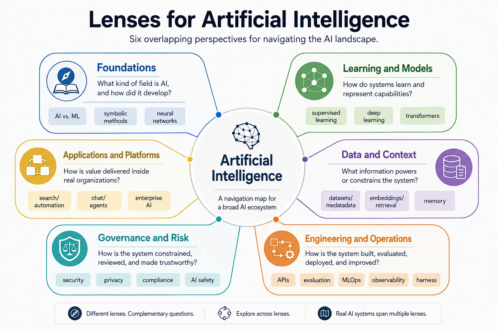

Artificial Intelligence is the broad discipline of building systems that perform tasks requiring perception, prediction, generation, decision-making, or adaptation.
In practice, AI is not one thing. It is a collection of related fields that span statistical learning, neural architectures, software systems, data pipelines, infrastructure, governance, and domain applications.

That breadth is why this section should be treated as a documentation hub rather than a single long article.
The main task is not memorizing every model family or tool category.
It is understanding how the major parts of the ecosystem fit together so that deeper topics can be placed in the right context.

AI is a cross-cutting domain.
The same production system may involve training data, retrieval pipelines, model serving, application orchestration, evaluation loops, access control, privacy safeguards, and human approval workflows.
As a result, AI topics overlap with [Software Architecture](../arch/), [Software Engineering](../swe/), [Data](../data/), and [Access Control](../acc/), but they are not reducible to any one of those areas.

## Core Navigation Perspectives

This section organizes AI topics by the main question a reader is trying to answer.

| Perspective                | Primary question                                               | Typical topics                                                      |
| -------------------------- | -------------------------------------------------------------- | ------------------------------------------------------------------- |
| Foundations                | What kind of field is AI, and how did it develop?              | AI vs. ML, symbolic methods, statistical learning, neural networks  |
| Learning and models        | How do systems learn and represent capabilities?               | Supervised learning, deep learning, transformers, foundation models |
| Data and context           | What information powers or constrains the system?              | Training data, labeling, embeddings, metadata, retrieval, memory    |
| Engineering and operations | How is the system built, evaluated, deployed, and improved?    | APIs, evaluation, testing, MLOps, observability, model serving      |
| Governance and risk        | How is the system constrained, reviewed, and made trustworthy? | Security, privacy, fairness, compliance, AI safety                  |
| Applications and platforms | How is value delivered inside real organizations?              | Chat, search, agents, enterprise AI, automation, robotics           |

These perspectives overlap in practice.
For example, a retrieval-augmented AI assistant depends on foundation models, data pipelines, application orchestration, evaluation controls, and governance decisions at the same time.

## The Main Domains in This Section

This section organizes the AI landscape into stable conceptual domains that will each expand into their own topic pages.
Those domains are useful because they remain meaningful even as specific models, vendors, frameworks, and product categories change.

**Foundations** explains the conceptual roots of AI, including the distinction between AI, machine learning, and deep learning, along with the historical and theoretical ideas that still shape modern systems.

**Machine Learning** covers how systems learn patterns from data through supervised, unsupervised, and reinforcement learning, as well as the practical concerns around training and evaluation.

**Deep Learning** focuses on neural architectures that learn rich representations, including CNNs, RNNs, transformers, diffusion models, and related techniques.

**Foundation Models** examines large reusable model families such as language, vision, speech, and multimodal models, along with tokenization and embeddings.

**Generative AI** covers interactive and content-producing systems built on prompts, context, retrieval, fine-tuning, tool calling, memory, planning, and agentic execution.

**AI Engineering** focuses on how AI capabilities become dependable software through APIs, SDKs, frameworks, evaluation, testing, deployment, and versioning.

**AI Infrastructure** covers the runtime systems required to train and serve models at scale, including accelerators, distributed training, inference stacks, vector systems, gateways, and orchestration.

**Data for AI** covers the information supply chain behind training, adaptation, retrieval, and evaluation, including data quality, governance, metadata, labeling, and knowledge structures.

**MLOps and LLMOps** covers the operating model for model-centric systems after initial development, including CI/CD, registries, monitoring, drift detection, and continuous improvement.

**Responsible AI** covers the constraints that keep AI systems lawful, safe, fair, explainable, and reviewable across their lifecycle.

**Enterprise AI** focuses on organizational adoption, integration, platforms, security, cost management, and operating models for AI at scale.

**AI Applications** looks at the use-case layer where these capabilities become search systems, copilots, automation tools, robotics systems, scientific workflows, and domain solutions.

## Relationships Across the Landscape

The categories above are useful only if their relationships stay visible.

- Foundation models build on deep-learning architectures and large-scale training regimes.
- Generative AI systems combine foundation models with prompts, context windows, retrieval, tools, and application logic.
- AI agents extend generative systems with planning, execution, approval boundaries, and runtime control.
- Data for AI influences not only model quality, but also evaluation reliability, governance, and safety.
- MLOps supports production machine-learning systems, while LLMOps extends similar operational discipline to foundation-model-based applications.
- Responsible AI is not a separate stage at the end. It shapes data selection, model design, deployment controls, monitoring, and organizational accountability.

The important pattern is that AI systems are assembled from several interacting layers rather than delivered by one isolated model.

## Topic Pages

This section is organized as a documentation hub rather than one long article. Use the topic pages below to move directly to the areas that match your question.
















## Suggested Starting Points

- If you need a conceptual map, start with **Foundations**, **Machine Learning**, and **Deep Learning**.
- If you are working on modern assistant or copilot systems, start with **Foundation Models**, **Generative AI**, and **AI Engineering**.
- If you are operating production AI systems, start with **AI Infrastructure**, **Data for AI**, and **MLOps and LLMOps**.
- If you are setting enterprise policy or risk controls, start with **Responsible AI** and **Enterprise AI**.

## Summary

Artificial Intelligence is not one product category and not one linear maturity path.
It is a connected ecosystem of models, data systems, engineering practices, infrastructure layers, governance controls, and applications.

This section provides the high-level map.
The child pages will examine each major domain in more detail so that readers can move from orientation to deeper reference material without losing the overall structure.
