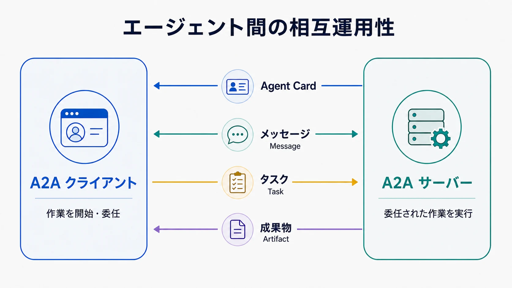

エージェント間の通信とは、独立して動作する AI エージェントが要求、タスクの状態、結果を交換することです。一つのアプリケーション内部のコンポーネントとは異なり、連携するエージェントは異なるモデル、フレームワーク、ツール、内部ワークフローで構築されている場合があります。そのため、相互運用性は各エージェントの実装を知ることではなく、共通の外部契約に依存します。

Agent2Agent（A2A）Protocol は、この境界のためのオープンスタンダードです。エージェントが自身の能力を説明し、クライアントが内部の推論、メモリ、ツール実装を公開させずに作業を委任できるようにします。プロトコルは通信を構造化しますが、信頼を確立したり、エージェントに何を許可すべきかを決定したりするものではありません。



## 定義

エージェント間の相互運用性とは、あるアプリケーションまたはエージェントが、明示的な能力とタスクの契約を通じて別のエージェントを発見し、連携できることです。要求を開始する側はクライアントとして動作します。リモートエージェントは要求を受け付け、独自の内部プロセスで作業を実行し、進捗または結果を返します。

これは単にモデルを二回呼び出すこととは異なります。参加するエージェントが、所有者、デプロイ、ライフサイクル、権限、実装方式などの点で実質的に独立している場合に有用です。[A2A 公式ドキュメント](https://a2a-protocol.org/latest/)では、このようなシステムのための標準的な対話モデルを定義しています。

## エージェントの相互運用性が重要な理由

多くのエージェントシステムは、一つのアプリケーションが複数のプロンプト、ツール、特化した処理を調整するところから始まります。この場合は、内部オーケストレーションで十分なことが少なくありません。これとは異なる問題が生じるのは、あるチームが所有する調査エージェントが、別の場所で管理される調達、出張、セキュリティ、文書処理などのエージェントへ、範囲を限定したタスクを委任するときです。

共通の契約がなければ、接続するたびに能力の発見、メッセージ形式、長時間実行される作業、中間状態、結果、エラー、認証について個別の前提が必要になります。相互運用プロトコルは、このような個別統合を減らします。また、リモートエージェントをブラックボックスとして保てます。呼び出し側が知る必要があるのは、提供されるサービスと対話方法であり、内部で使われるモデル、プロンプト、メモリ、ツールではありません。

この不透明性には利点と制約があります。実装の自由度を保てる一方で、クライアントはリモートの処理内容を把握していることに頼らず、境界で出力と運用上の主張を評価しなければなりません。

## 基本的なやり取りの仕組み

A2A では、エージェント間のやり取りを、外部から確認できるいくつかの基本要素で表現します。

| 概念 | 責務 |
| --- | --- |
| A2A クライアント（A2A Client） | 利用者、アプリケーション、または別のエージェントに代わって対話を開始する |
| A2A サーバー（A2A Server）またはリモートエージェント（Remote Agent） | 能力を公開し、委任された作業を実行する |
| Agent Card | ID、エンドポイント、スキル、対応機能、認証要件を説明する |
| メッセージ（Message） | 対話の入力、確認、状態に関する情報を運ぶ |
| タスク（Task） | 状態を持つ一単位の委任作業をライフサイクル全体で追跡する |
| Part | メッセージまたは成果物に含まれるテキスト、ファイル参照、構造化データを表す |
| 成果物（Artifact） | 文書や構造化レコードなど、タスクが生成した結果を運ぶ |

クライアントは、まず適切なリモートエージェントを特定し、公開されたインターフェースを読み取ります。次にメッセージを送信し、直接メッセージとして応答を受け取るか、状態を持つタスクを作成します。タスクは時間とともに進行し、追加の入力を要求し、状態更新を公開し、一つ以上の成果物を生成できます。

メッセージと成果物の区別は重要です。メッセージは作業に関するコミュニケーションを支え、成果物はタスクの出力を表します。役割を分けることで、クライアントは何を会話として表示し、結果として処理し、証跡として保持し、後続の操作前に検証すべきかを判断しやすくなります。

## 発見と能力の記述

Agent Card は、リモートエージェントを説明する機械可読な文書です。サービスエンドポイント、対応するプロトコルインターフェース、ストリーミングなどの機能、利用可能なスキル、認証方式を示せます。クライアントは、well-known ロケーション、統制されたレジストリ、直接設定などからカードを取得できます。

能力の記述は、クライアントがエージェントの適合性を判断する助けになりますが、発見は選定や信頼と同じではありません。自由記述のスキル説明は不完全な場合があり、能力は変化し、到達可能なエンドポイントであっても利用者のタスクに適さないことがあります。特にエージェントが組織やデータの境界を越える場合、本番システムでは発見を承認やガバナンスの層で囲む必要があります。

したがって、Agent Card はサービスのメタデータとして扱うべきであり、認証情報やリモートエージェントの安全性を証明するものではありません。クライアントはエンドポイントを認証し、必要に応じて許可リストやレジストリによる統制を適用し、ポリシーで許可されるまで機密コンテキストを送信しないようにします。

### Agent Card の例

次の簡略化した例は、A2A 1.0 の JSON 表現を使った文書分析エージェントです。優先インターフェース、任意のストリーミング、OpenID Connect の認証方式、一つのスキルを公開しています。

```json
{
  "name": "Document Analysis Agent",
  "description": "Extracts structured findings from technical documents.",
  "version": "1.0.0",
  "supportedInterfaces": [
    {
      "url": "https://agents.example.com/document-analysis/a2a",
      "protocolBinding": "HTTP+JSON",
      "protocolVersion": "1.0"
    }
  ],
  "capabilities": {
    "streaming": true,
    "pushNotifications": false
  },
  "securitySchemes": {
    "organization-login": {
      "openIdConnectSecurityScheme": {
        "openIdConnectUrl": "https://identity.example.com/.well-known/openid-configuration"
      }
    }
  },
  "securityRequirements": [
    {
      "schemes": {
        "organization-login": {
          "list": ["openid"]
        }
      }
    }
  ],
  "defaultInputModes": ["text/plain", "application/pdf"],
  "defaultOutputModes": ["application/json", "text/markdown"],
  "skills": [
    {
      "id": "summarize-technical-document",
      "name": "Summarize Technical Document",
      "description": "Produces a structured summary with key findings and open questions.",
      "tags": ["documents", "summarization", "technical-review"],
      "examples": ["Summarize this architecture decision record."],
      "inputModes": ["text/plain", "application/pdf"],
      "outputModes": ["application/json", "text/markdown"]
    }
  ]
}
```

このカードにより、クライアントは接続先と接続方法、利用可能な対話機能、受け付けるメディア形式と返す形式、提供すると宣言されたスキルを把握できます。それでもクライアントは、カードとは別の経路で認証情報を取得し、エンドポイントを検証し、スキルが適切かを判断し、実際の要求を認可しなければなりません。トークン、API キーなどの秘密情報を Agent Card に含めてはいけません。

## タスクのライフサイクルと結果交換

エージェントの作業は、通常の要求と応答より長く続く場合があります。委任されたタスクは、受付後に実行を開始し、追加の入力や認可を待つために一時停止し、最終的に完了、失敗、拒否、キャンセルのいずれかに至ります。クライアントは遅延した応答をすべてネットワーク障害として扱うのではなく、これらの状態を理解する必要があります。

リモートエージェントが対応を宣言している場合、更新はポーリングで取得するほか、ストリーミングやプッシュ通知で受け取れます。これらは転送とライフサイクルの問題に対応しますが、業務上の完了を保証するものではありません。完了したタスクでも利用できない成果物を生成する場合があり、技術的に有効な成果物でも別のシステムへ影響を与える前にレビューが必要な場合があります。

信頼できるクライアントは、安定したタスク識別子を使用し、再試行時の振る舞いを明確にし、関連する状態遷移を保持し、重複または遅延したイベントを処理します。タイムアウト、キャンセル、不完全な成果物、バージョン不一致、利用できないエージェントは、例外的な端の事象ではなく、通常の分散システム上の課題です。

## MCP、API、オーケストレーションとの関係

エージェントの相互運用性は複数の統合パターンと重なりますが、それぞれが扱う境界は異なります。

| アプローチ | 主な境界 | 適する用途 |
| --- | --- | --- |
| A2A | クライアントエージェントから独立したリモートエージェント | リモートエージェントの自律性を保ちながら、状態を持つ作業を委任する |
| MCP | AI アプリケーションまたはクライアントから、ツール、リソース、プロンプト | コンテキストデータと範囲を限定した能力を一貫したインターフェースで公開する |
| 直接 API | アプリケーションから明示的にモデル化されたサービス操作 | エージェントレベルのタスク抽象化を必要としない、安定して明確に定義された処理 |
| 内部オーケストレーション | 一つのアプリケーションまたはランタイム内で統制されるコンポーネント | 一つの所有境界内で既知のワーカー、モデル、ツールを調整する |

これらのアプローチは組み合わせられます。A2A を介して接続するリモートエージェントは、内部で MCP サーバーや通常の API を利用できます。オーケストレーターは、A2A エージェントをより大きなワークフローの参加者として扱えます。それぞれが異なる関係を標準化するため、互いを置き換える必要はありません。

この違いを「A2A はエージェント向け、MCP はツール向け」といった標語だけに単純化すべきではありません。実際のシステムでは役割の境界が曖昧なことがあり、どちらのプロトコルも進化を続けています。長期的に重要な設計上の問いは、どちら側が計画とタスク状態を所有し、どの契約が境界を越え、どこで権限を強制するかです。

## 信頼、認可、運用上の制御

エージェント間の要求は、両方が同じ組織に属していても信頼境界を越えます。受信側のエージェントは、どのプリンシパルが呼び出しているか、どの利用者またはプロセスが作業を委任したか、どの範囲が認可されたか、どのデータや操作が許可されているかを把握する必要があります。認証は呼び出し元を識別しますが、それだけで要求されたタスクを認可するわけではありません。

ポリシーまたは監査で必要な場合、委任の連鎖では実行エージェントと起点となる主体の両方を保持します。認証情報はエージェント間で広く複製せず、リモートサービスとタスクへ限定します。影響の大きい操作では、副作用を所有するシステムで明示的な承認が必要になる場合があります。

リモートエージェントからの入力は、信頼できないデータです。不正な形式、誤解を招く内容、機密情報、後続のモデルを操作しようとする指示を含む可能性があります。同様に、別のエージェントが成果物を使う前に、スキーマ、来歴、ポリシー、業務上の妥当性を確認します。オブザーバビリティでは、機密内容を無差別に記録せず、タスク識別子、参加者、関連する認可コンテキスト、状態遷移、成果物の来歴を記録します。

## エージェント間の相互運用性を使う場面

専用のエージェントプロトコルは、リモートの能力が独立して所有され、意味のある内部複雑性を隠し、状態を持つ作業や長時間実行される作業を行い、共通の発見とタスクライフサイクルの意味付けが役立つ場合に適しています。異なる技術スタックで実装されたエージェントを複数のクライアントから利用する場合にも有用です。

操作がすでに決定的で API として明確に表現できる場合、すべてのコンポーネントが一つの統制されたランタイム内にある場合、またはワークフローエンジンがすでに状態機械を所有している場合は、より単純な境界を使います。すべての関数やマイクロサービスをエージェントとして包んでも、相互運用性が向上するとは限らず、曖昧さと運用負荷が増えます。

プロトコルの採用を先に決めるのではなく、連携の境界を先に定めます。所有者、タスクの意味、信頼、障害からの復旧、必要な出力を特定します。A2A は、その抽象化がこれらのニーズに合う場合に価値を発揮します。

## まとめ

エージェント間の相互運用性は、独立した AI システムが能力を公開し、メッセージを交換し、委任されたタスクを管理し、成果物を返すための共通手段を提供します。A2A は、リモートエージェントが内部のモデル、ツール、ワークフローを非公開のまま保てる境界の一つを標準化します。

プロトコルは信頼できる設計の一部にすぎません。ID、委任された権限、入力と成果物の検証、ライフサイクル処理、オブザーバビリティ、明確な所有責任は、引き続きアプリケーションと組織の責務です。適切な境界で利用すれば、A2A は MCP、API、内部オーケストレーションを置き換えるのではなく補完します。
