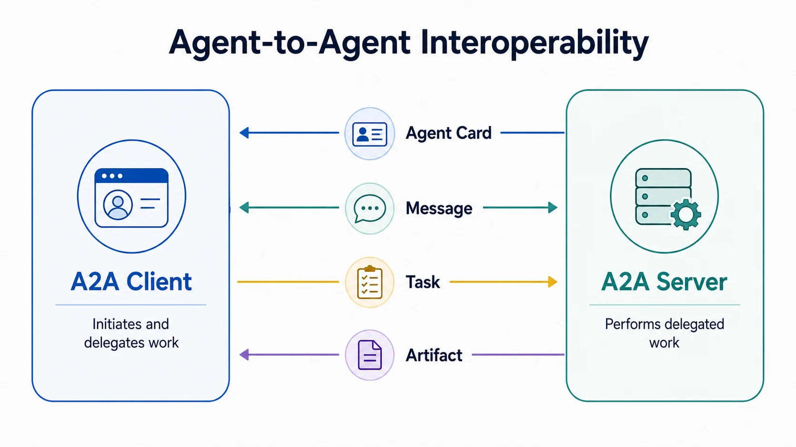

Agent-to-agent communication is the exchange of requests, task state, and results between independently operating AI agents. Unlike components inside one application, collaborating agents may be built with different models, frameworks, tools, and internal workflows. Interoperability therefore depends on a shared external contract rather than knowledge of each agent's implementation.

The Agent2Agent (A2A) Protocol is an open standard for this boundary. It gives an agent a way to describe its capabilities and lets a client delegate work without requiring either side to expose its internal reasoning, memory, or tool implementation. The protocol structures communication, but it does not establish trust or decide what an agent should be allowed to do.



## Definition

Agent-to-agent interoperability is the ability of one application or agent to discover and engage another agent through explicit capability and task contracts. The initiating side acts as a client; the remote agent accepts a request, performs work through its own internal process, and returns progress or results.

This is distinct from merely calling a model twice. It becomes useful when the participating agents have meaningful operational independence: separate ownership, deployment, lifecycle, permissions, or implementation choices. The [official A2A documentation](https://a2a-protocol.org/latest/) defines a standardized interaction model for such systems.

## Why Agent Interoperability Matters

Many agentic systems begin as one application that coordinates several prompts, tools, or specialized routines. Internal orchestration is often sufficient in that setting. A different problem appears when a research agent owned by one team must delegate a bounded task to a procurement, travel, security, or document agent owned elsewhere.

Without a shared contract, every connection needs custom assumptions about capability discovery, message formats, long-running work, intermediate states, results, errors, and authentication. An interoperability protocol reduces this bespoke integration work. It also lets the remote agent remain opaque: callers need to know what service it offers and how to interact with it, not which model, prompt, memory system, or tools it uses internally.

That opacity is both useful and limiting. It preserves implementation freedom, but it means the client must evaluate outputs and operational claims at the boundary rather than relying on knowledge of the remote workflow.

## Core Interaction Model

A2A organizes collaboration around a small set of externally visible concepts.

| Concept | Responsibility |
| --- | --- |
| A2A client | Initiates an interaction on behalf of a user, application, or another agent |
| A2A server or remote agent | Advertises capabilities and performs delegated work |
| Agent Card | Describes identity, endpoints, skills, supported features, and authentication requirements |
| Message | Carries conversational input, clarification, or status information |
| Task | Tracks a stateful unit of delegated work through its lifecycle |
| Part | Represents text, a file reference, or structured data within a message or artifact |
| Artifact | Carries a result produced by a task, such as a document or structured record |

A client first identifies an appropriate remote agent and reads its declared interface. It then sends a message that may receive a direct message response or create a stateful task. A task can progress over time, request more input, publish status updates, and produce one or more artifacts.

The distinction between messages and artifacts is important. Messages support communication about the work; artifacts represent task outputs. Keeping those roles separate makes it easier for clients to determine what should be displayed as conversation, processed as a result, retained as evidence, or validated before another action.

## Discovery and Capability Description

An Agent Card is a machine-readable description of a remote agent. It can identify the service endpoint, supported protocol interfaces, capabilities such as streaming, available skills, and authentication schemes. Clients may obtain cards from a well-known location, a curated registry, or direct configuration.

Capability description helps a client decide whether an agent appears suitable, but discovery is not the same as selection or trust. Free-text skill descriptions can be incomplete, capabilities can change, and a reachable endpoint may still be inappropriate for the user's task. Production systems need an approval or governance layer around discovery, especially when agents cross organizational or data boundaries.

An Agent Card should therefore be treated as service metadata, not as a credential or proof that the remote agent is safe. Clients should authenticate endpoints, apply allowlists or registry controls where appropriate, and avoid sending sensitive context until policy permits it.

### Example Agent Card

The following simplified example describes a document-analysis agent using the A2A 1.0 JSON representation. It advertises one preferred interface, optional streaming, an OpenID Connect authentication scheme, and one skill.

```json
{
  "name": "Document Analysis Agent",
  "description": "Extracts structured findings from technical documents.",
  "version": "1.0.0",
  "supportedInterfaces": [
    {
      "url": "https://agents.example.com/document-analysis/a2a",
      "protocolBinding": "HTTP+JSON",
      "protocolVersion": "1.0"
    }
  ],
  "capabilities": {
    "streaming": true,
    "pushNotifications": false
  },
  "securitySchemes": {
    "organization-login": {
      "openIdConnectSecurityScheme": {
        "openIdConnectUrl": "https://identity.example.com/.well-known/openid-configuration"
      }
    }
  },
  "securityRequirements": [
    {
      "schemes": {
        "organization-login": {
          "list": ["openid"]
        }
      }
    }
  ],
  "defaultInputModes": ["text/plain", "application/pdf"],
  "defaultOutputModes": ["application/json", "text/markdown"],
  "skills": [
    {
      "id": "summarize-technical-document",
      "name": "Summarize Technical Document",
      "description": "Produces a structured summary with key findings and open questions.",
      "tags": ["documents", "summarization", "technical-review"],
      "examples": ["Summarize this architecture decision record."],
      "inputModes": ["text/plain", "application/pdf"],
      "outputModes": ["application/json", "text/markdown"]
    }
  ]
}
```

The card tells a client where and how to connect, which interaction features are available, what media types the agent accepts and returns, and which skill it claims to provide. The client still has to obtain credentials outside the card, verify the endpoint, decide whether the skill is appropriate, and authorize the actual request. Tokens, API keys, and other secrets do not belong in the Agent Card.

## Task Lifecycle and Result Exchange

Agent work is often longer-lived than a conventional request-response call. A delegated task may be submitted, start working, pause for more input or authorization, and eventually complete, fail, be rejected, or be canceled. Clients need to understand these states rather than treating every delayed response as a network failure.

Updates can be retrieved by polling or delivered through streaming and push mechanisms when the remote agent declares support. These options address transport and lifecycle concerns; they do not guarantee business-level completion. A completed task may still produce an unusable artifact, and a technically valid artifact may still require review before it can influence another system.

Reliable clients should use stable task identifiers, make retry behavior explicit, preserve relevant status transitions, and handle duplicated or delayed events. Timeouts, cancellation, partial artifacts, version mismatches, and unavailable agents are normal distributed-systems concerns, not exceptional edge cases.

## Relationship to MCP, APIs, and Orchestration

Agent interoperability overlaps with several integration patterns, but the boundaries are different.

| Approach | Primary boundary | Best fit |
| --- | --- | --- |
| A2A | Client agent to independent remote agent | Delegating stateful work while preserving the remote agent's autonomy |
| MCP | AI application or client to tools, resources, and prompts | Exposing contextual data and bounded capabilities through a consistent interface |
| Direct API | Application to explicitly modeled service operation | Stable, well-defined transactions without an agent-level task abstraction |
| Internal orchestration | Components controlled inside one application or runtime | Coordinating known workers, models, or tools under one ownership boundary |

These approaches can be composed. A remote agent reached through A2A may use MCP servers or ordinary APIs to perform its work. An orchestrator may treat an A2A agent as one participant in a larger workflow. The protocols do not need to replace one another because they standardize different relationships.

The distinction should not be reduced to a slogan such as “A2A is for agents and MCP is for tools.” Real systems have blurred roles, and both protocols continue to evolve. The durable architectural question is which side owns planning and task state, what contract crosses the boundary, and where authority is enforced.

## Trust, Authorization, and Operational Controls

A request between agents crosses a trust boundary even when both agents belong to the same organization. The receiving agent needs to know which principal is calling, which user or process delegated the work, what scope was authorized, and which data or actions are permitted. Authentication identifies a caller; it does not by itself authorize the requested task.

Delegation chains should preserve both the executing agent and the originating subject where policy or audit requires them. Credentials should be scoped to the remote service and task rather than copied broadly across agents. High-impact actions may require explicit approval at the system that owns the side effect.

Inputs from remote agents are untrusted data. They can be malformed, misleading, sensitive, or contain instructions intended to manipulate downstream models. Likewise, artifacts should be checked for schema, provenance, policy, and business validity before another agent uses them. Observability should record task identifiers, participants, relevant authorization context, state transitions, and artifact lineage without indiscriminately logging sensitive content.

## When to Use Agent-to-Agent Interoperability

A dedicated agent protocol is a good fit when the remote capability is independently owned, hides meaningful internal complexity, performs stateful or long-running work, and benefits from common discovery and task lifecycle semantics. It can also help when multiple clients must interact with agents implemented on different technology stacks.

Use a simpler boundary when the operation is already deterministic and well expressed by an API, when all components live inside one controlled runtime, or when a workflow engine already owns the state machine. Wrapping every function or microservice as an agent adds ambiguity and operational overhead without necessarily improving interoperability.

Protocol adoption should follow the collaboration boundary, not precede it. Start by identifying ownership, task semantics, trust, failure recovery, and required outputs. A2A is valuable when its abstractions match those needs.

## Summary

Agent-to-agent interoperability gives independent AI systems a common way to advertise capabilities, exchange messages, manage delegated tasks, and return artifacts. A2A standardizes one such boundary while allowing remote agents to keep their internal models, tools, and workflows private.

The protocol is only part of a dependable design. Identity, delegated authority, input and artifact validation, lifecycle handling, observability, and clear ownership remain application and organizational responsibilities. Used at the right boundary, A2A complements MCP, APIs, and internal orchestration rather than replacing them.
