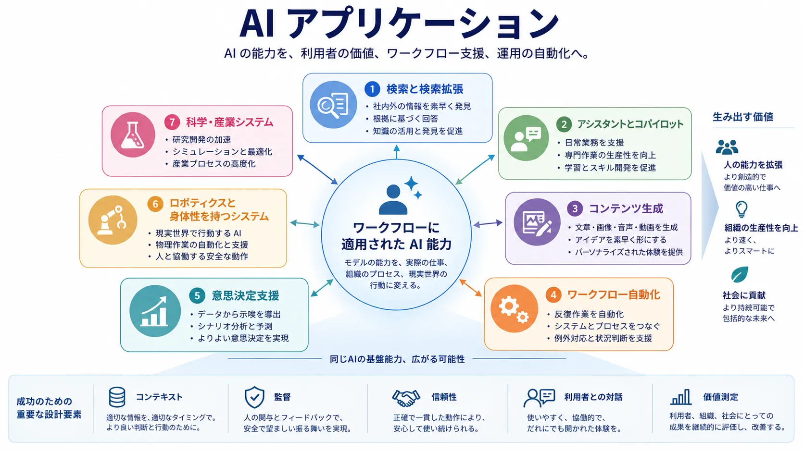

AI アプリケーションは、抽象的な能力が具体的な価値へ変わる場所です。モデル、データ、インフラストラクチャ、運用が重要なのは、このレイヤーを可能にするからです。利用者、ワークフロー、業務成果が最終的にシステムと出会うのはアプリケーションレイヤーであり、多くの AI プロジェクトはモデル選択ではなくここで成功または失敗します。

中心となる設計上の問いは単純です。誰の、どの有用なタスクを、どの制約の下で支えるのか。この問いが明確になれば、AI スタックの残りを、その用途に必要なだけ適切に振る舞えるかという観点から評価できます。

## 定義

AI アプリケーションは、特定の利用者課題、運用上のニーズ、領域のワークフローに AI の能力を適用するシステムです。モデルの振る舞いを、インターフェース、データ、制御ロジック、ガバナンスと組み合わせて、有用な成果を生みます。

この定義は、生のモデル出力ではなく、解決される仕事へ焦点を保つために重要です。

## アプリケーションレイヤーが重要な理由

利用者価値は実際のワークフローへの適合に依存します。高い能力のモデルでも、誤ったインターフェースに現れる、利用者の判断を妨げる、グラウンディングがない、訂正・エスカレーションの信頼できる経路がない場合は、弱いプロダクトになります。逆に、控えめな能力でも、適切なプロセスに統合すれば高い価値を持ちます。

アプリケーションレイヤーは、AI が有用で、統制可能で、経済的に意味があるかを決めます。

## 主なアプリケーション分類

以下の分類は、支える仕事と、それぞれに生じる設計上の制約によってアプリケーションパターンを区別します。

| 分類                                     | 典型的な役割                                               | 主な設計上の関心事                 |
| ---------------------------------------- | ---------------------------------------------------------- | ---------------------------------- |
| 検索と検索拡張                           | 関連情報を素早く見つける                                   | グラウンディング品質と順位の関連性 |
| アシスタントとコパイロット               | タスクのワークフロー内で利用者を支える                     | 対話設計と信頼の調整               |
| コンテンツ生成                           | テキスト、コード、メディア、構造化成果物を下書き・変換する | レビュー可能性と出力制御           |
| ワークフロー自動化                       | 境界のある複数段階のタスクを実行する                       | 権限、失敗処理、監督               |
| 意思決定支援                             | 人の判断に情報を与える                                     | 証拠品質と説明責任                 |
| ロボティクスと物理世界で動作するシステム | 物理世界で行動する                                         | 安全性、センシング、制御の信頼性   |
| 科学・産業システム                       | 発見、最適化、監視を支える                                 | 領域での検証と誤りのコスト         |

アシスタント、コパイロット、検索は、プロセス全体を作り直さず既存のワークフローへ追加できることが多いため、一般的です。その成否は新規性よりも、コンテキストの品質、利用者の信頼、システムがすべきこと・すべきでないことの明確な境界に依存します。

支援から実行へ進むと、承認境界、監査可能性、失敗処理がより重要になります。もっともらしい出力を作るだけでは足りず、説明責任のある運用プロセスに適合しなければなりません。科学、産業、医療、金融、製造のような領域では、誤りのコストと制御要件が高く、能力を証拠、ポリシー、領域専門知識でより強く形作る必要があります。

## 共通する設計の次元

利用者との対話は、アプリケーションが助言、協働、自動化のどれとして感じられるかを決めます。コンテキストとグラウンディングは、出力の関連性と信頼性を決めます。承認と監督は、システムが自律的に行動できるか、助言にとどまるべきかを決めます。信頼性と安全性は、不確実性と失敗をどう扱うかを決めます。価値の測定は、対象ワークフローを本当に改善しているかを明らかにします。

同じ AI パターンでも、領域により異なる振る舞いになります。コード作成コパイロット、臨床要約アシスタント、金融レビューのツール、製造の異常検知器は似たモデル群を使うことがありますが、許容できる誤り率、証拠要件、制御境界、エスカレーション経路は大きく異なります。そのため、AI アプリケーションはモデル種別だけでなく、ワークフロー上の役割と設計制約で分類すべきです。

## AI スタックとの関係

アプリケーションは AI 全体の上に位置します。基盤モデルは再利用可能な能力を提供し、データは学習・検索・評価のコンテキストを提供し、インフラストラクチャは実行時性能を可能にします。AI エンジニアリングはアプリケーションを信頼できるソフトウェアにし、MLOps と LLMOps は本番で管理可能に保ちます。責任ある AI とエンタープライズ AI は、信頼と組織上の制御を提供します。

## まとめ

AI アプリケーションは、利用者が AI を実際の仕事の支援、改善、自動化として体験するレイヤーです。成功は、モデル能力をコンテキスト、インターフェース、ガバナンス、ワークフロー設計とどれだけ適切に統合できるかに依存します。このためアプリケーションレイヤーは、AI スタック全体のもっとも見えやすい表現です。
