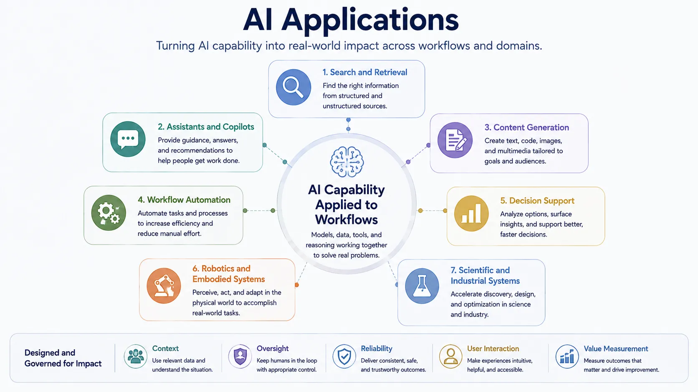

AI applications are the point where abstract capability becomes concrete value. Models, data, infrastructure, and operations matter because they make this layer possible, but the application layer is where users, workflows, and business outcomes finally meet the system. That is why many AI projects succeed or fail here rather than in model selection alone.

The core design question is simple: what useful task is being supported, for whom, under what constraints? Once that question is clear, the rest of the AI stack can be evaluated in terms of whether it helps the application behave well enough for that purpose.

## Definition

AI applications are systems that apply AI capability to a specific user problem, operational need, or domain workflow. They combine model behavior with interfaces, data, control logic, and governance to produce useful outcomes.

This definition matters because it keeps the focus on solved work rather than on raw model output.

## Why the Application Layer Matters

User value depends on fit to a real workflow. A highly capable model can still produce a weak product if it appears in the wrong interface, interrupts user decision-making, lacks grounding, or has no reliable path for correction and escalation. Conversely, modest capability can become highly valuable when integrated into the right process.

The application layer therefore determines whether AI is helpful, governable, and economically worthwhile.

## Topic Pages





## Relationship to the Rest of the AI Stack

Applications sit on top of the rest of the AI landscape. Foundation models provide reusable capability. Data provides training, retrieval, and evaluation context. Infrastructure makes runtime performance feasible. AI engineering shapes the application into dependable software. MLOps and LLMOps keep it manageable in production. Responsible and enterprise AI provide trust and organizational control.

## Summary

AI applications are the layer where users experience AI as actual work being supported, improved, or automated. Their success depends on how well model capability is integrated with context, interfaces, governance, and workflow design. That is why the application layer is the most visible expression of the entire AI stack.
