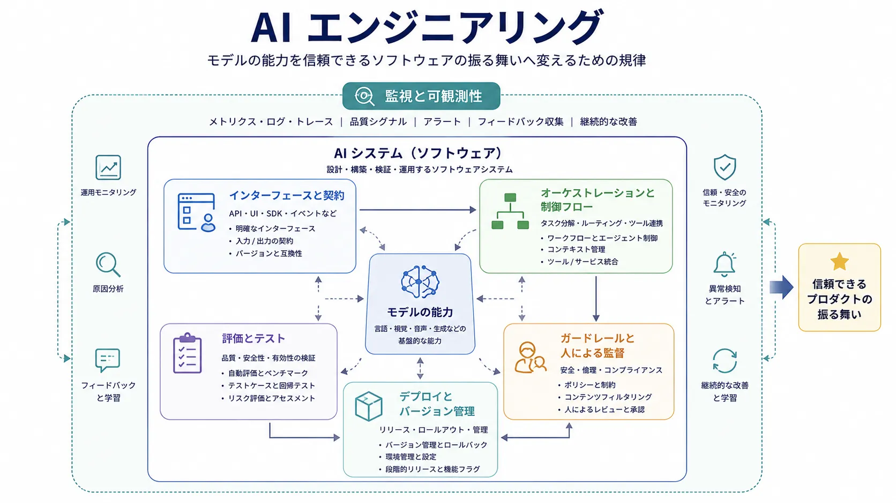

AI エンジニアリングは、モデルの能力をプロダクトの振る舞いへ変える領域です。優れたモデルだけでは、信頼できるシステムにはなりません。実際のアプリケーションには、インターフェース、フォールバック、オブザーバビリティ、ガードレール、評価基準、運用規律が必要です。これらがなければ、印象的な出力も日常のワークフローでは信頼しにくいままです。

そのため AI エンジニアリングは、モデル API の薄いラッパーではなく、ソフトウェアの規律として扱う必要があります。モデルは、利用者、運用者、関係者にとって十分に予測可能な振る舞いを実現すべき、より広いシステムの一構成要素です。

## 定義

AI エンジニアリングは、モデルに基づく能力を組み込んだソフトウェアシステムを設計、構築、運用する分野です。構成、制御、テスト、ライフサイクル管理を通じて、確率的な振る舞いを境界のあるアプリケーション成果へ変えることに焦点を当てます。

この定義は古典的な機械学習システムにも基盤モデルのシステムにも当てはまります。ただし後者では、オーケストレーションと実行時制御への注意がより必要になることが一般的です。

## なぜ重要か

モデルの品質はアプリケーション品質を保証しません。単独では強い応答を出せるモデルでも、周辺のワークフローが曖昧、権限が広すぎる、コンテキストが弱い、UI が誤用を促すといった理由で本番では失敗します。

プロダクトの信頼性はエンドツーエンドの性質です。コンテキストをどう選ぶか、ツールをいつ実行するか、出力をどう検証するか、不確実性をどう扱うか、利用者と運用者にどのような制御を見せるかに依存します。

## トピックページ






## モデル研究・運用との関係

モデル研究は基礎となる能力の改善を問います。AI エンジニアリングは、その能力を実際のワークフローで信頼できる振る舞いに変える方法を問います。プラットフォームの仕事は、複数チームで能力を再利用・統制可能にする方法を扱います。

MLOps と LLMOps は、デプロイ規律、監視、バージョン管理、評価パイプライン、継続的改善によってシステムを時間とともに運用する領域です。AI エンジニアリングがプロダクトを構築することに重心を置くのに対し、MLOps と LLMOps は本番で信頼できる状態を保つことに重心を置きます。

## まとめ

AI エンジニアリングは、モデル能力をインターフェース、オーケストレーション、テスト、制御で包み込むソフトウェアの規律です。有用な AI プロダクトは生のモデルエンドポイントではなく、組み立てられたシステムです。この規律が、柔軟な能力を境界のあるプロダクトの振る舞いへ変えます。
