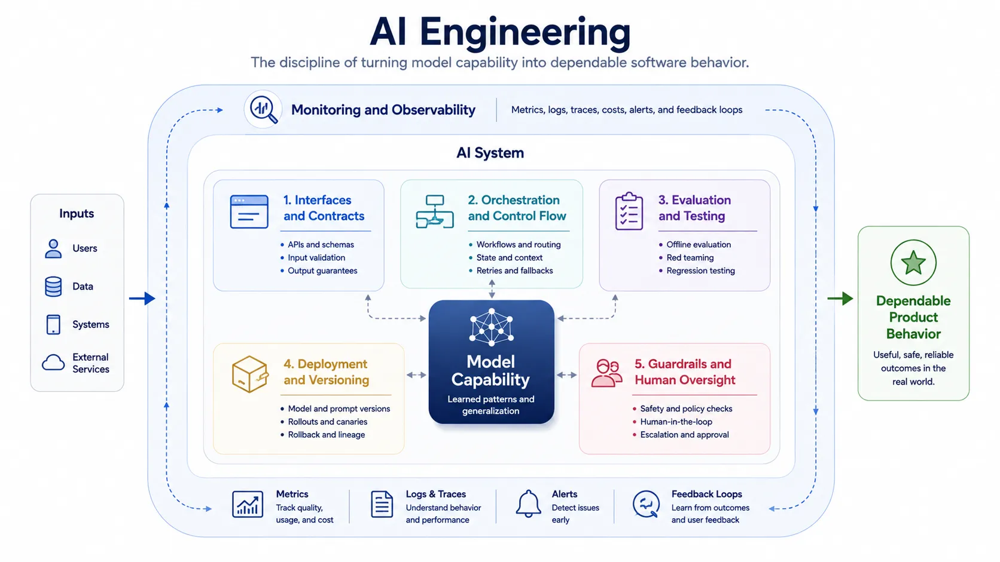

AI engineering is where model capability becomes product behavior. A strong model alone does not create a dependable system. Real applications need interfaces, fallbacks, observability, guardrails, evaluation criteria, and operational discipline. Without those layers, even impressive model outputs remain difficult to trust in day-to-day workflows.

This is why AI engineering should be treated as a software discipline rather than as a thin wrapper around model APIs. The model is only one component in a broader system that must behave predictably enough for users, operators, and stakeholders.

## Definition

AI engineering is the discipline of designing, building, and operating software systems that incorporate model-based capability. It focuses on turning probabilistic behavior into bounded application outcomes through composition, control, testing, and lifecycle management.

That definition applies to both classical machine-learning systems and systems built on foundation models, though the latter usually require more attention to orchestration and runtime control.

## Why AI Engineering Matters

Model quality does not guarantee application quality. A model may produce strong responses in isolation and still fail in production because the surrounding workflow is ambiguous, permissions are too broad, the context is weak, or the user interface encourages misuse.

AI engineering matters because product reliability is an end-to-end property. It depends on how the system selects context, triggers tools, validates outputs, handles uncertainty, and exposes control to both users and operators.

## Topic Pages






## AI Engineering vs. Model Research

Model research asks how to improve underlying capability. AI engineering asks how to turn capability into dependable behavior for a real workflow. Platform work asks how to make these capabilities reusable and governable across many teams.

Those activities overlap, but they are not the same discipline. Confusing them usually leads to either overbuilt prototypes or under-governed production systems.

## Relationship to MLOps and LLMOps

AI engineering focuses on application design and behavior. MLOps and LLMOps focus on operating the system over time through deployment discipline, monitoring, version control, evaluation pipelines, and continuous improvement. The two are closely connected, but one is about building the product and the other is about keeping it trustworthy in production.

## Summary

AI engineering is the software discipline that surrounds model capability with interfaces, orchestration, testing, and controls. It exists because useful AI products are assembled systems, not raw model endpoints. That discipline is what turns flexible capability into bounded product behavior.
