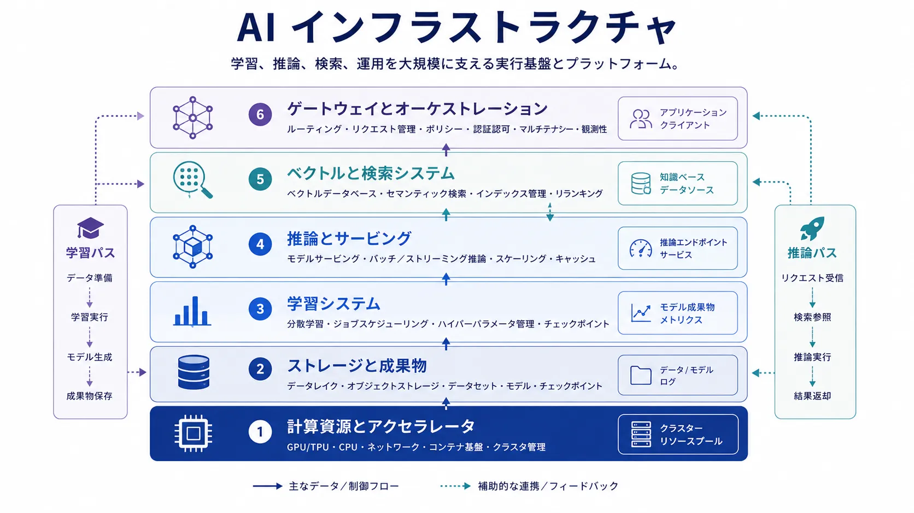

AI インフラストラクチャは、モデルの学習、推論、大規模な AI 運用を実現する技術的な基盤です。アクセラレータだけでなく、ストレージ、サービングレイヤー、ルーティング、オーケストレーション、検索システム、可観測性も含まれます。どのような AI システムを構築し、持続できるかを形作る層です。

## 定義

AI インフラストラクチャは、AI ワークロードの開発、デプロイ、運用を支える実行時・プラットフォームのレイヤーです。実用的な規模で学習と推論を行うために必要な、計算、ストレージ、ネットワーク、サービング、協調のシステムを提供します。

これはモデルホスティングより広い対象です。成果物を移動し、ルーティングを強制し、検索を支え、運用上の制御を公開するシステムも含みます。

## なぜ重要か

AI システムはインフラストラクチャに特有の負荷をかけます。学習には大規模な並列計算と高スループットのストレージが必要になることがあります。推論には低レイテンシ、高い同時実行数、厳格なコスト制御が求められます。検索ベースのシステムにはデータの局所性とベクトル検索の関心事が加わり、複数段階のワークフローにはオーケストレーションとキャッシュが必要になります。

これらは実装の詳細ではなく、実現可能なアーキテクチャと現実的なサービス水準を決める要因です。

## 中核となるインフラストラクチャ層

以下の層は、実用的な規模でモデルを開発・運用するために連携します。

| 層                                 | 主な責任                                                 | 重要な理由                                       |
| ---------------------------------- | -------------------------------------------------------- | ------------------------------------------------ |
| 計算資源とアクセラレータ           | 学習・推論ワークロードを実行する                         | スループット、規模、コストを決める               |
| 学習システム                       | 分散ジョブ、チェックポイント、成果物を協調する           | 大規模なモデル開発を管理可能にする               |
| 推論とサービング                   | アプリケーションへモデルを信頼可能に公開する             | レイテンシ、同時実行数、分離、リリースを制御する |
| ストレージと成果物管理             | データセット、チェックポイント、埋め込み、設定を保持する | 再現性とライフサイクル制御を保つ                 |
| ベクトルと検索システム             | 意味検索とグラウンディングを支える                       | 検索拡張のパターンを可能にする                   |
| ゲートウェイとオーケストレーション | 要求をルーティングし、ポリシーを強制し、フローを管理する | 再利用可能なサービスレイヤーに変える             |

## 設計上のトレードオフ

性能とコストは常に結び付いています。高いスループットや低いレイテンシには、より高価な選択が必要になりがちです。集中型サービングはガバナンスと再利用を簡単にしますが、分散型は領域固有の性能やデータ局所性に合うことがあります。マネージドサービスはプラットフォーム負荷を減らす一方、制御や最適化を制限し得ます。内製プラットフォームは柔軟性を提供しますが、運用の複雑さを高めます。

## アプリケーションと運用との関係

インフラストラクチャは AI システムを可能にしますが、プロダクトの振る舞いを定義するものではありません。検索品質、ツール境界、利用者との対話、評価ロジックはアプリケーションレイヤーの責任です。優れたインフラストラクチャは、これらの上位の関心事を一貫して実装しやすくします。

また可観測性、回復性、スケーリング、インシデント対応、ライフサイクルガバナンスにも直結します。学習成果物、デプロイしたモデル版、埋め込み、キャッシュ、ルーティングルールを可視化できなければ、プラットフォーム全体を信頼できる状態に保てません。

## まとめ

AI インフラストラクチャは、モデル中心のシステムを経済面・運用面で成立させるプラットフォーム層です。規模、レイテンシ、再利用、検索、制御を形作るため、AI システムが統合され運用上重要になるほど、単なるホスティングの詳細ではなく設計上の対話の一部になります。
