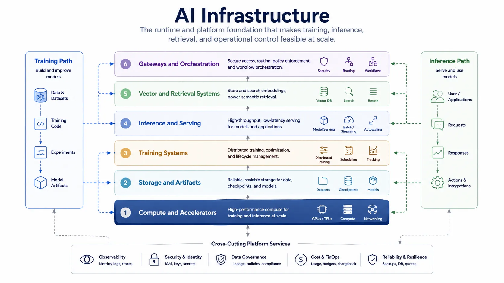

AI infrastructure is the technical substrate that makes model training, inference, and large-scale AI operations feasible. It includes more than accelerators. Storage, serving layers, routing, orchestration, retrieval systems, and observability all shape what kinds of AI systems can actually be built and sustained.

This layer matters because AI capability is expensive, stateful, and operationally sensitive. A strong model is not useful if it cannot be served within cost, latency, reliability, or governance constraints.

## Definition

AI infrastructure is the runtime and platform layer that supports the development, deployment, and operation of AI workloads. It provides the compute, storage, networking, serving, and coordination systems needed for training and inference at practical scale.

The topic is broader than model hosting. It includes the systems that move artifacts, enforce routing, support retrieval, and expose operational control.

## Why It Matters

AI systems put unusual pressure on infrastructure. Training can require large parallel compute and high-throughput storage. Inference can require low latency, high concurrency, and strict cost controls. Retrieval-based systems add data locality and vector search concerns. Multistep workflows add orchestration and caching requirements.

These are not implementation details. They shape what architectures are viable and what service levels are realistic.

## Core Infrastructure Layers

The following layers work together to support model development and operation at practical scale.

| Layer                           | Main responsibility                                     | Why it matters                                                 |
| ------------------------------- | ------------------------------------------------------- | -------------------------------------------------------------- |
| Compute and accelerators        | Execute training and inference workloads                | Determines throughput, scale, and cost profile                 |
| Training systems                | Coordinate distributed jobs, checkpoints, and artifacts | Makes large-scale model development manageable                 |
| Inference and serving           | Expose models reliably to applications                  | Controls latency, concurrency, isolation, and release behavior |
| Storage and artifact management | Hold datasets, checkpoints, embeddings, and configs     | Preserves reproducibility and lifecycle control                |
| Vector and retrieval systems    | Support semantic lookup and grounding                   | Enables modern retrieval-augmented patterns                    |
| Gateways and orchestration      | Route requests, enforce policy, and manage workflows    | Turns infrastructure into a reusable service layer             |

### Compute and Training

Accelerators and distributed training systems matter because modern models often exceed the limits of single-machine training. Parallelization, checkpointing, scheduling, and artifact movement become infrastructure concerns rather than application concerns.

### Inference and Serving

Inference is where infrastructure and product requirements meet directly. Teams must manage model loading, scaling, isolation, request routing, concurrency, and cost. These choices shape user experience and operating margins.

### Retrieval, Gateways, and Orchestration

Modern AI applications frequently depend on more than direct model execution. Retrieval systems, caches, model gateways, and orchestration layers determine how context is attached, how requests are routed, and how policy or safety controls are enforced.

The [AI Gateway](ai-gateway/) topic examines this boundary in depth, from model and provider routing to MCP tool connectivity, agent-to-agent traffic, governance, and AI-specific observability.

## Key Design Tradeoffs

Performance and cost are always linked. Higher throughput or lower latency usually requires more expensive infrastructure choices. Centralized serving can simplify governance and reuse, while distributed serving may better fit domain-specific performance or data locality needs. Managed services reduce platform burden but can limit control or optimization. Internal platforms provide flexibility but raise operational complexity.

These are architectural tradeoffs, not just procurement choices.

## Relationship to Application Architecture

Infrastructure enables AI systems, but it does not define product behavior. Retrieval quality, tool boundaries, user interaction, and evaluation logic still belong to the application layer. Good AI infrastructure makes those higher-level concerns easier to implement consistently.

## Relationship to Operations

AI infrastructure connects directly to observability, resilience, scaling, incident response, and lifecycle governance. Training artifacts, deployed model versions, embeddings, caches, and routing rules all need operational visibility if the overall platform is to remain trustworthy.

## Summary

AI infrastructure is the platform layer that makes model-centric systems economically and operationally viable. Its importance comes from how it shapes scale, latency, reuse, retrieval, and control. As AI systems become more integrated and more operationally significant, infrastructure becomes part of the design conversation rather than just a hosting detail.
