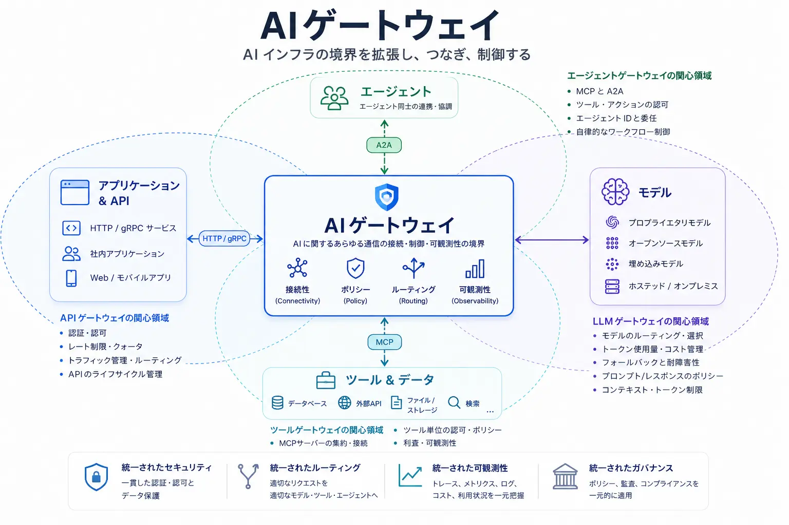

1つのアプリケーションが1つのプロバイダーの1つのモデルだけを呼び出す段階では、ルーティング、認証情報、再試行、利用記録をアプリケーションコードに置けます。しかし、複数のモデル、エージェント、ツール、 [Model Context Protocol（MCP）](../../context-engineering/tools-and-mcp/) サーバー、社内 API、外部サービスを利用するようになると、この方法は脆弱になります。直接統合ごとにセキュリティ、ポリシー、オブザーバビリティ、コスト制御が重複するためです。

AI ゲートウェイは、こうしたトラフィックに共通のインフラストラクチャ境界を設けます。アプリケーションやエージェントをモデルや能力へ接続しながら、ルーティング、ガバナンス、テレメトリを一貫して適用します。AI システムがエージェント化するにつれ、この境界はモデル推論だけでなく、エージェントからモデル、ツール、別の [エージェント](../../agent-to-agent/) への通信も仲介するようになります。

## AI ゲートウェイが重要な理由

最初の課題は接続そのものではありません。HTTPS クライアントだけでもモデル API には到達できます。難しいのは、多数の接続を信頼でき、統制可能な状態にすることです。

モデルエンドポイントは、認証、要求スキーマ、ストリーミング、トークン上限、エラー処理、利用量報告が異なります。プロンプトや応答には機密情報が含まれることがあり、障害やクォータ超過時には統制されたフォールバックが必要です。プラットフォームチームは、モデル呼び出しが複数のツールへ分岐しても、コストを配賦し、テナント上限を適用し、要求を追跡できなければなりません。

エージェントはトラフィックグラフをさらに広げます。ツールを発見して呼び出し、別のエージェントへ作業を委任し、通常の要求より長時間動作します。ポイントツーポイント接続では、認証情報とポリシー判断が各エージェントへ分散し、どの ID が、誰の権限で、どのデータを使い、どのツールを、いくらのコストで呼び出したかを説明しにくくなります。

この広い役割は、AI ゲートウェイが LLM ゲートウェイや API ゲートウェイを置き換える直線的な進化ではありません。アプリケーション、API、モデル、ツール、データ、エージェントが集まり、接続、ポリシー、ルーティング、オブザーバビリティを共通化するインフラストラクチャ境界の拡張です。

ゲートウェイは制御点ですが、すべての制御の所有者ではありません。ID プロバイダーが ID を確立し、ポリシーエンジンが認可判断を行い、モデルサービング基盤が推論を実行し、ワークフローエンジンが永続的な処理状態を所有します。ゲートウェイは、接続境界で必要な判断を統合し、強制します。

## トピックページ








## 中核となる責任

| 責任                       | ゲートウェイの役割                                                                                 |
| -------------------------- | -------------------------------------------------------------------------------------------------- |
| 接続と抽象化               | 振る舞いに影響する違いを消さずに、安定したエンドポイントとプロトコル適応を提供する                 |
| トラフィック管理           | ルーティング、制限、回復性、ライフサイクルを考慮したトランスポート制御を適用する                   |
| セキュリティとガバナンス   | ID と委任を保持し、認証情報を分離し、信頼境界でポリシーを強制する                                  |
| オブザーバビリティと経済性 | 機密ペイロードの保持を制限しながら、モデル、ツール、エージェントの活動を利用量とコストに関連付ける |
| AI 固有の制御              | 実装に応じて、モデルポリシー、ガードレール、コンテキスト上限、セマンティックキャッシュを適用する   |

## API ゲートウェイ、サービスメッシュとの関係

3つのパターンは重なります。以下の表は一般的なアーキテクチャ上の重点を示すものであり、個々の製品が必ず備える機能を示すものではありません。

| 関心事                       | API ゲートウェイ | サービスメッシュ           | AI ゲートウェイ        |
| ---------------------------- | ---------------- | -------------------------- | ---------------------- |
| HTTP / API ルーティング      | 主な対象         | 一般的に対応               | 一般的に対応           |
| サービス間通信               | 場合による       | 主な対象                   | 場合による             |
| LLM プロバイダールーティング | 対応が進行中     | 実装依存                   | 一般的な対象           |
| トークン・コスト計測         | 実装依存         | 一般的ではない             | 一般的な対象           |
| プロンプト・応答ポリシー     | 実装依存         | 一般的ではない             | 一般的に対応           |
| MCP の理解                   | 発展中           | 実装依存                   | 発展中の中核能力       |
| エージェント間トラフィック   | 発展中           | トランスポート層で対応可能 | 発展中の中核能力       |
| ツール単位のガバナンス       | 実装依存         | 一般的ではない             | エージェント対応の重点 |

既存の API ゲートウェイを拡張する、ゲートウェイとサービスメッシュを組み合わせる、専用の AI ゲートウェイを配置するという選択肢があります。カテゴリ名ではなく、所有権、信頼境界、運用成熟度、必要な意味理解に基づいて判断します。

## エコシステム

エコシステムには、マネージドモデルプラットフォームと密接に結び付いたクラウドプロバイダーのゲートウェイ、独立した商用ゲートウェイ、オープンソースの LLM プロキシ、Kubernetes ネイティブの AI ゲートウェイ、エージェントプロトコルに対応する AI ゲートウェイ、AI 対応ポリシーを追加する API 管理プラットフォームがあります。

プロトコルの進化により、従来型インフラストラクチャと AI トラフィックの関係も強まっています。 [MCP `2026-07-28` 仕様](https://modelcontextprotocol.io/specification/2026-07-28) は、ステートレスな要求と、メソッド名や能力名を公開する HTTP ヘッダーを導入し、MCP の処理を負荷分散、ルーティング、計測、統制しやすくしました。これらの機能はゲートウェイの役割を強めますが、版のネゴシエーション、認可設計、ペイロードを考慮した制御は引き続き必要です。

[agentgateway](https://agentgateway.dev/) は、この収束を示す実装例の1つです。このオープンソースプロジェクトは、HTTP、gRPC、LLM 推論、MCP、A2A のトラフィックを共通基盤で扱い、2026年に [Agentic AI Foundation](https://agentgateway.dev/blog/2026-06-04-agentgateway-joins-aaif/) のホストプロジェクトになりました。従来型通信とエージェント型通信が基盤プリミティブを共有できることを示していますが、すべての組織があらゆる AI の関心事を1つのゲートウェイやデータプレーンへ集約すべきことを意味しません。

製品一覧よりも、評価のための問いの方が長期的に有用です。ゲートウェイはどのトラフィックとプロトコルを理解できるか。コントロールプレーンはどこにあるか。どの ID とポリシーを保持できるか。ストリーミングと長時間処理に対応できるか。抽象化にはどの程度の移植性があるか。どのデータを検査または保持するか。どのように障害へ対応するかを確認します。

## AI ゲートウェイの今後

ゲートウェイの役割は、モデルアクセスから AI トラフィック管理を経て、エージェント接続とエージェント型インフラストラクチャの制御点へ広がっています。MCP はツールとリソースを管理対象のトラフィックグラフへ取り込みます。A2A は、独立して運用されるエージェント間に、発見、委任、タスク状態、成果物をもたらします。どちらも、ID を伝播し、ポリシーを強制し、エンドツーエンドの証跡を生成できる、プログラム可能な境界の必要性を高めます。

一般的なプラットフォームがプロトコルへの理解を追加し、専門プロジェクトが従来型トラフィックへの対応を取り込むにつれて、API ゲートウェイ、推論ゲートウェイ、AI ゲートウェイ、MCP ゲートウェイ、エージェントゲートウェイという名称の境界はさらに曖昧になる可能性があります。長期的に重要なアーキテクチャ上の考え方は、特定のカテゴリや製品ではありません。AI とエージェントの通信を囲む、明示的でプログラム可能なインフラストラクチャ境界と、その境界に何を含めるかについての規律ある判断です。

## まとめ

AI ゲートウェイは、実運用の AI トラフィックがエンドポイントのルーティング以上のものを必要とするために存在します。モデルとプロバイダーを横断して、接続、セキュリティ、ポリシー、トラフィック制御、オブザーバビリティ、コストのための共通境界を提供します。エージェント型システムでは、MCP や A2A などのプロトコルを通じて、その役割がツールや独立したエージェントへ広がります。

MCP `2026-07-28` への移行により、MCP は通常のステートレス HTTP 基盤との親和性を高め、ゲートウェイが利用できるルーティング情報を公開しました。agentgateway のようなプロジェクトは、API、モデル、MCP、A2A のトラフィックが収束し得ることを示しています。アーキテクトはこの収束を選択的に採用し、共通境界の利点を得られる制御を集中化しながら、ゲートウェイを AI システムのあらゆる関心事の所有者にしないことが重要です。
