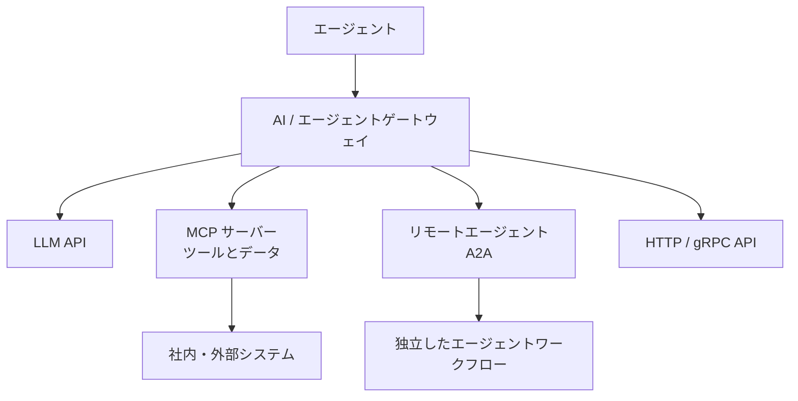

1つのアプリケーションが1つのプロバイダーの1つのモデルだけを呼び出す段階では、ルーティング、認証情報、再試行、利用記録をアプリケーションコードに置けます。しかし、複数のモデル、エージェント、ツール、 [Model Context Protocol（MCP）](../../context-engineering/tools-and-mcp/) サーバー、社内 API、外部サービスを利用するようになると、この方法は脆弱になります。直接統合ごとにセキュリティ、ポリシー、オブザーバビリティ、コスト制御が重複するためです。

AI ゲートウェイは、こうしたトラフィックに共通のインフラストラクチャ境界を設けます。アプリケーションやエージェントをモデルや能力へ接続しながら、ルーティング、ガバナンス、テレメトリを一貫して適用します。AI システムがエージェント化するにつれ、この境界はモデル推論だけでなく、エージェントからモデル、ツール、別の [エージェント](../../agent-to-agent/) への通信も仲介するようになります。

## AI ゲートウェイが重要な理由

最初の課題は接続そのものではありません。HTTPS クライアントだけでもモデル API には到達できます。難しいのは、多数の接続を信頼でき、統制可能な状態にすることです。

モデルエンドポイントは、認証、要求スキーマ、ストリーミング、トークン上限、エラー処理、利用量報告が異なります。プロンプトや応答には機密情報が含まれることがあり、障害やクォータ超過時には統制されたフォールバックが必要です。プラットフォームチームは、モデル呼び出しが複数のツールへ分岐しても、コストを配賦し、テナント上限を適用し、要求を追跡できなければなりません。

エージェントはトラフィックグラフをさらに広げます。ツールを発見して呼び出し、別のエージェントへ作業を委任し、通常の要求より長時間動作します。ポイントツーポイント接続では、認証情報とポリシー判断が各エージェントへ分散し、どの ID が、誰の権限で、どのデータを使い、どのツールを、いくらのコストで呼び出したかを説明しにくくなります。

この広い役割は、AI ゲートウェイが LLM ゲートウェイや API ゲートウェイを置き換える直線的な進化ではありません。アプリケーション、API、モデル、ツール、データ、エージェントが集まり、接続、ポリシー、ルーティング、オブザーバビリティを共通化するインフラストラクチャ境界の拡張です。

ゲートウェイは制御点ですが、すべての制御の所有者ではありません。ID プロバイダーが ID を確立し、ポリシーエンジンが認可判断を行い、モデルサービング基盤が推論を実行し、ワークフローエンジンが永続的な処理状態を所有します。ゲートウェイは、接続境界で必要な判断を統合し、強制します。

## トピックページ








## 中核となる責任

### 接続と抽象化

ゲートウェイは安定したエンドポイントを提供し、プロバイダー固有のアドレスと認証情報を隠せます。プロトコルアダプターはモデル API を正規化し、MCP、A2A、HTTP、gRPC のルートを接続できます。ルーティングでは、宣言されたポリシーと正常性に基づいて、プロバイダー、モデルデプロイメント、ツールサーバー、リモートエージェントを選択できます。

抽象化は慎重に設計する必要があります。最小公分母の API は移植性を高める一方で、プロバイダー固有の能力や意味を隠すことがあります。すべてのプロバイダーが同じように振る舞うと見なすのではなく、固有の能力を必要とするアプリケーションには明示的なパススルールートを提供できます。

エンドポイント設計、プロトコル適応、プロバイダー間の移植性、抽象化の境界については、 [接続と抽象化](connectivity-and-abstraction/) を参照してください。

### トラフィック管理

トラフィック制御には、負荷分散、タイムアウト、再試行、サーキットブレーカー、レート制限、クォータ、フォールバックがあります。AI 対応の実装では、能力、レイテンシ、データ境界、可用性、予算に応じてモデルを選択できます。ストリーミング応答や、通常の HTTP タイムアウトを超えて継続する処理にも対応する必要があります。

再試行には特に注意が必要です。読み取り専用の推論要求を再試行することと、副作用を持つツール呼び出しを再実行することは同じではありません。冪等性、キャンセル、タスク状態は、ゲートウェイが暗黙に仮定するのではなく、アプリケーションまたはプロトコルの境界で定義する必要があります。

ルーティング、クォータ、再試行、フォールバック、ストリーミング、長時間処理については、 [トラフィック管理](traffic-management/) を参照してください。

### セキュリティとガバナンス

ゲートウェイは呼び出し元を認証し、プロバイダーやツールの認証情報を分離し、トラフィックが信頼境界を越える前に認可を強制できます。ポリシーでは、テナント、モデル、データ分類、ツール名、委任元の利用者、リージョン、要求された操作などを評価できます。プロンプトと応答の検査は、機密データの制御、コンテンツポリシー、監査要件に役立ちます。

MCP サーバーへの接続権限があっても、そのサーバーが公開するすべてのツールを呼び出せるとは限らないため、ツール単位のポリシーが重要です。同様に、あるエージェントを認証しても、そのエージェントが特定のタスクを別のエージェントへ委任できるとは限りません。ゲートウェイは関連する ID と委任のコンテキストを保持する必要があり、生成されたテキストから正当な権限を推測してはなりません。

ID の伝播、委任権限、ツールポリシー、機密データの制御、監査可能性については、 [セキュリティとガバナンス](security-and-governance/) を参照してください。

### オブザーバビリティと経済性

一般的な要求メトリクスだけでは不十分です。AI の処理では、モデルとプロバイダーの ID、最初のトークンまでの時間、ストリーム時間、入力・出力トークン数、キャッシュの動作、フォールバックの判断、コスト配賦も必要です。エージェント型システムのトレースでは、起点となる要求を、モデル呼び出し、ツール呼び出し、リモートエージェントのタスク、承認、結果まで関連付ける必要があります。

高カーディナリティのラベルや機密性の高いペイロードを無差別に記録すると、安全性とコストの問題が生じます。運用上の事実とポリシー判断を構造化して記録しながら、データ処理規則に従ってプロンプト、応答、認証情報、ツール結果を編集または除外する設計が有効です。

トレース、利用量計測、コスト配賦、カーディナリティ、テレメトリ境界については、 [オブザーバビリティと経済性](observability-and-economics/) を参照してください。

### AI 固有の制御

AI 対応の制御では、コンテキストとトークンの上限を検証し、モデル固有のポリシーを適用し、プロンプトと応答を検査し、ガードレールやセマンティックキャッシュを利用できます。これらの機能は実装に依存します。特にセマンティックキャッシュは振る舞いを変えるため、類似した応答が交換可能で安全に共有できるとは限りません。類似度のしきい値、テナント分離、鮮度、認可を明示する必要があります。

## アーキテクチャパターン

### 集中型 AI ゲートウェイ

集中型ゲートウェイは、アプリケーションに単一の管理された入口を提供し、ポリシー、プロバイダーの認証情報、ルーティング、テレメトリを一貫させます。統合の重複を減らし、調達やコストの可視性を改善できます。

一方、この集中化は共有依存を生みます。容量、リージョン配置、設定の展開、障害分離は、集約されたワークロードに合わせる必要があります。「集中型」が単一のグローバルインスタンスだけを意味するわけではありません。ポリシーと設定を集中管理しながら、複数のデータプレーンインスタンスを配置する構成も一般的です。

### 環境・ドメイン別ゲートウェイ

開発環境、事業ドメイン、リージョン、チーム、信頼境界に合わせてゲートウェイを分離できます。これにより障害範囲を限定し、データレジデンシーやドメイン固有のポリシーに対応できます。一方で、設定、アップグレード、オブザーバビリティのパイプラインは増えます。共通ポリシーテンプレートと連合されたテレメトリにより、すべてのトラフィックを1つのランタイムへ集めずに一貫性を保てます。

### Kubernetes ネイティブゲートウェイ

[Kubernetes Gateway API](https://gateway-api.sigs.k8s.io/) を、ゲートウェイ、リスナー、ルートの役割指向の設定モデルとして利用できます。AI 対応の拡張や実装固有のポリシーによってモデルやエージェントの意味を追加し、既存のプラットフォームエンジニアリングの運用へ統合できます。Gateway API との統合は運用の一貫性を高めますが、標準 API 自体がトークン計測、プロンプトポリシー、MCP 認可などの AI の振る舞いを定義するわけではありません。

### エージェント型システムに対応する AI ゲートウェイ

エージェント型システムに対応する AI ゲートウェイは、複数の通信関係を同時に仲介します。

このトポロジーでは、接続点が意味のある強制点になります。ポリシーによって、エージェントを承認済みツールに制限し、委任された ID を A2A タスクに結び付け、機密コンテキストが外部モデルへ送られることを防げます。ただし、ゲートウェイが同意フロー、業務上の認可、アプリケーション検証を置き換えるわけではありません。トラフィック境界で評価できる部分を強制します。

## AI ゲートウェイと MCP

[MCP](../../context-engineering/tools-and-mcp/) は、AI ホストやクライアントを、ツール、リソース、プロンプトを公開するサーバーへ接続する方法を標準化します。多数のクライアントとサーバーを運用する組織では、ゲートウェイがサーバーを集約または連合し、統制された発見、認証情報の分離、安定したエンドポイントを提供できます。レート制限、ツール単位の認可、監査記録、信頼境界の分離も適用できます。

MCP により、ツールやコンテキストリソースは、アプリケーション統合の内部に隠れるのではなく、AI トラフィックの明示的な構成要素になります。モデル呼び出し自体には問題がなくても、その後のツール呼び出しが機密データを読み取ったり、外部システムを変更したりすることがあります。そのため、呼び出し元からモデル、ツールまでの連鎖全体について、各境界の ID、委任、承認、結果の来歴を統制する必要があります。

複数サーバーを1つのカタログへ統合すると、名前の衝突、発見範囲の拡大、侵害時の影響拡大が生じる可能性があります。ゲートウェイは呼び出し元に適した能力だけを提示し、サーバー、テナント、信頼ドメインの分離を明示的に維持する必要があります。

## AI ゲートウェイとモデルルーター

モデルルーターが主に答える問いは、次のとおりです。

**「この要求をどのモデルが処理すべきか」**

タスクの種類、品質、レイテンシ、価格、可用性、ポリシーなどに基づいてモデルを選択します。

AI ゲートウェイは、より広いインフラストラクチャ上の問いを扱います。

**「AI 関連トラフィックをどのように接続し、保護し、統制し、観測し、ルーティングするか」**

モデル選択はゲートウェイ境界内の1機能になり得ます。ゲートウェイから呼び出す独立したサービスや、ゲートウェイが所有しないアプリケーションロジックとして実装することもできます。

この区別を保つことで、ルーティングアルゴリズムが要求経路に存在するという理由だけで、認証情報、監査、ツールガバナンスなど、あらゆるプラットフォーム上の関心事を抱え込むことを防げます。

## API ゲートウェイ、サービスメッシュとの関係

3つのパターンは重なります。以下の表は一般的なアーキテクチャ上の重点を示すものであり、個々の製品が必ず備える機能を示すものではありません。

| 関心事                       | API ゲートウェイ | サービスメッシュ           | AI ゲートウェイ        |
| ---------------------------- | ---------------- | -------------------------- | ---------------------- |
| HTTP / API ルーティング      | 主な対象         | 一般的に対応               | 一般的に対応           |
| サービス間通信               | 場合による       | 主な対象                   | 場合による             |
| LLM プロバイダールーティング | 対応が進行中     | 実装依存                   | 一般的な対象           |
| トークン・コスト計測         | 実装依存         | 一般的ではない             | 一般的な対象           |
| プロンプト・応答ポリシー     | 実装依存         | 一般的ではない             | 一般的に対応           |
| MCP の理解                   | 発展中           | 実装依存                   | 発展中の中核能力       |
| エージェント間トラフィック   | 発展中           | トランスポート層で対応可能 | 発展中の中核能力       |
| ツール単位のガバナンス       | 実装依存         | 一般的ではない             | エージェント対応の重点 |

既存の API ゲートウェイを拡張する、ゲートウェイとサービスメッシュを組み合わせる、専用の AI ゲートウェイを配置するという選択肢があります。カテゴリ名ではなく、所有権、信頼境界、運用成熟度、必要な意味理解に基づいて判断します。

## 設計上の考慮事項

- **配置と可用性:** 集中化はガバナンスを簡素化する一方、レイテンシと障害範囲を増やす可能性があります。コントロールプレーンの一貫性とデータプレーンの配置を分けて考え、必要に応じて明示的な迂回経路や縮退動作を設計します。
- **ストリーミングと処理時間:** バックプレッシャー、キャンセル、最初のトークンまでの時間、長時間タスクの状態、現実的なタイムアウトを維持します。短い要求・応答だけを想定したゲートウェイは、エージェント型システムで適切に障害処理できない可能性があります。
- **認証情報と委任:** プロバイダーとツールの認証情報をアプリケーションから分離しながら、呼び出し元、委任元の利用者、ゲートウェイサービス自身の ID を1つの認証情報にまとめないようにします。
- **ポリシーの範囲:** ポリシーには明確な所有者、テスト、版管理、説明可能な拒否記録が必要です。すべての通信経路で複雑なプロンプト検査を行うと、レイテンシや振る舞いの不整合が生じる可能性があります。
- **移植性:** 中立的な API はプロバイダーへの依存を減らしますが、プロバイダー固有の機能が有用な場合もあります。完全な互換性をうたうのではなく、明示的なエスケープ経路を用意します。
- **マルチテナンシーと経済性:** 認証情報、キャッシュ、ログ、クォータ、予算をテナント間で分離します。プロバイダーごとに報告されるトークン数を直接比較できるとは限りません。
- **オブザーバビリティ:** ラベルのカーディナリティとペイロードの保持を制御します。機密性の高いプロンプトを無制限に記録することなく、モデル、ツール、エージェントのスパンを関連付けます。
- **プロトコルの進化:** プロトコルの版を固定して観測し、後方互換性をテストし、プロトコルアダプターを交換可能にします。MCP と A2A は今後も進化します。

最大の設計リスクは、ルーティング、安全性、メモリ、検索、オーケストレーション、評価、業務ルール、利用者の承認をすべて所有する、過度に大きな「AI ミドルウェア」層です。そのようなゲートウェイは理解しにくくなり、すべてのチームのボトルネックになります。ゲートウェイにはトラフィック境界の責任を置き、ワークフロー状態、ドメイン上の判断、プロダクトの振る舞いは、それらを所有するシステムに残します。

## エコシステム

エコシステムには、マネージドモデルプラットフォームと密接に結び付いたクラウドプロバイダーのゲートウェイ、独立した商用ゲートウェイ、オープンソースの LLM プロキシ、Kubernetes ネイティブの AI ゲートウェイ、エージェントプロトコルに対応する AI ゲートウェイ、AI 対応ポリシーを追加する API 管理プラットフォームがあります。

プロトコルの進化により、従来型インフラストラクチャと AI トラフィックの関係も強まっています。 [MCP `2026-07-28` 仕様](https://modelcontextprotocol.io/specification/2026-07-28) は、ステートレスな要求と、メソッド名や能力名を公開する HTTP ヘッダーを導入し、MCP の処理を負荷分散、ルーティング、計測、統制しやすくしました。これらの機能はゲートウェイの役割を強めますが、版のネゴシエーション、認可設計、ペイロードを考慮した制御は引き続き必要です。

[agentgateway](https://agentgateway.dev/) は、この収束を示す実装例の1つです。このオープンソースプロジェクトは、HTTP、gRPC、LLM 推論、MCP、A2A のトラフィックを共通基盤で扱い、2026年に [Agentic AI Foundation](https://agentgateway.dev/blog/2026-06-04-agentgateway-joins-aaif/) のホストプロジェクトになりました。従来型通信とエージェント型通信が基盤プリミティブを共有できることを示していますが、すべての組織があらゆる AI の関心事を1つのゲートウェイやデータプレーンへ集約すべきことを意味しません。

製品一覧よりも、評価のための問いの方が長期的に有用です。ゲートウェイはどのトラフィックとプロトコルを理解できるか。コントロールプレーンはどこにあるか。どの ID とポリシーを保持できるか。ストリーミングと長時間処理に対応できるか。抽象化にはどの程度の移植性があるか。どのデータを検査または保持するか。どのように障害へ対応するかを確認します。

## AI ゲートウェイの今後

ゲートウェイの役割は、モデルアクセスから AI トラフィック管理を経て、エージェント接続とエージェント型インフラストラクチャの制御点へ広がっています。MCP はツールとリソースを管理対象のトラフィックグラフへ取り込みます。A2A は、独立して運用されるエージェント間に、発見、委任、タスク状態、成果物をもたらします。どちらも、ID を伝播し、ポリシーを強制し、エンドツーエンドの証跡を生成できる、プログラム可能な境界の必要性を高めます。

一般的なプラットフォームがプロトコルへの理解を追加し、専門プロジェクトが従来型トラフィックへの対応を取り込むにつれて、API ゲートウェイ、推論ゲートウェイ、AI ゲートウェイ、MCP ゲートウェイ、エージェントゲートウェイという名称の境界はさらに曖昧になる可能性があります。長期的に重要なアーキテクチャ上の考え方は、特定のカテゴリや製品ではありません。AI とエージェントの通信を囲む、明示的でプログラム可能なインフラストラクチャ境界と、その境界に何を含めるかについての規律ある判断です。

## まとめ

AI ゲートウェイは、実運用の AI トラフィックがエンドポイントのルーティング以上のものを必要とするために存在します。モデルとプロバイダーを横断して、接続、セキュリティ、ポリシー、トラフィック制御、オブザーバビリティ、コストのための共通境界を提供します。エージェント型システムでは、MCP や A2A などのプロトコルを通じて、その役割がツールや独立したエージェントへ広がります。

MCP `2026-07-28` への移行により、MCP は通常のステートレス HTTP 基盤との親和性を高め、ゲートウェイが利用できるルーティング情報を公開しました。agentgateway のようなプロジェクトは、API、モデル、MCP、A2A のトラフィックが収束し得ることを示しています。アーキテクトはこの収束を選択的に採用し、共通境界の利点を得られる制御を集中化しながら、ゲートウェイを AI システムのあらゆる関心事の所有者にしないことが重要です。
