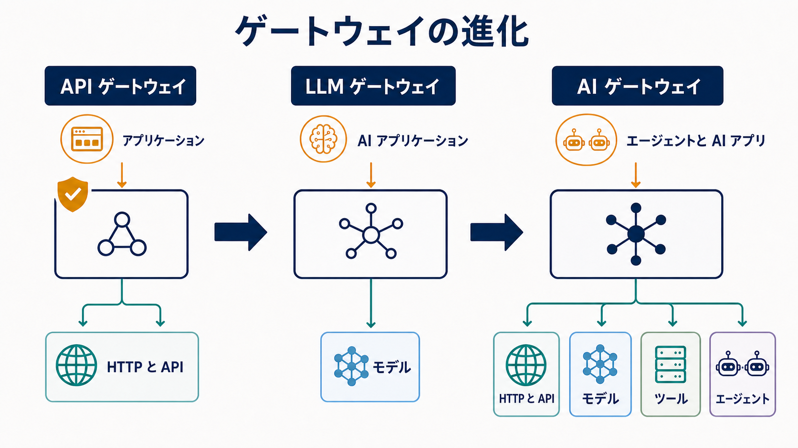
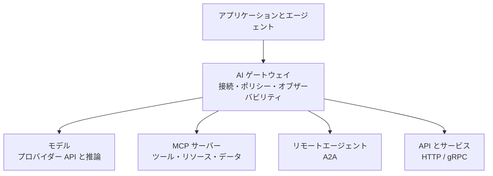
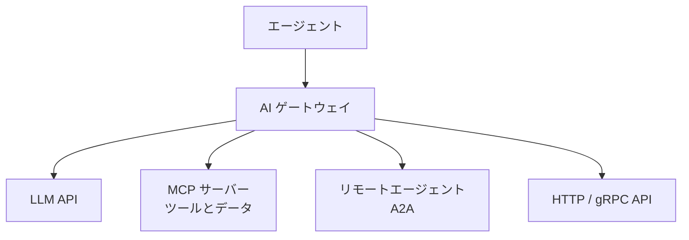

1つのアプリケーションが1つのプロバイダーの1つのモデルだけを呼び出す段階では、ルーティング、認証情報、再試行、利用記録をアプリケーションコードに置けます。しかし、複数のモデル、エージェント、ツール、 [Model Context Protocol（MCP）](../../context-engineering/tools-and-mcp/) サーバー、社内 API、外部サービスを利用するようになると、この方法は脆弱になります。直接統合ごとにセキュリティ、ポリシー、オブザーバビリティ、コスト制御が重複するためです。

AI ゲートウェイは、こうしたトラフィックに共通のインフラストラクチャ境界を設けます。アプリケーションやエージェントをモデルや能力へ接続しながら、ルーティング、ガバナンス、テレメトリを一貫して適用します。AI システムがエージェント化するにつれ、この境界はモデル推論だけでなく、エージェントからモデル、ツール、別の [エージェント](../../agent-to-agent/) への通信も仲介するようになります。

## AI ゲートウェイが重要な理由

最初の課題は接続そのものではありません。HTTPS クライアントだけでもモデル API には到達できます。難しいのは、多数の接続を信頼でき、統制可能な状態にすることです。

モデルエンドポイントは、認証、要求スキーマ、ストリーミング、トークン上限、エラー処理、利用量報告が異なります。プロンプトや応答には機密情報が含まれることがあり、障害やクォータ超過時には統制されたフォールバックが必要です。プラットフォームチームは、モデル呼び出しが複数のツールへ分岐しても、コストを配賦し、テナント上限を適用し、要求を追跡できなければなりません。

エージェントはトラフィックグラフをさらに広げます。ツールを発見して呼び出し、別のエージェントへ作業を委任し、通常の要求より長時間動作します。ポイントツーポイント接続では、認証情報とポリシー判断が各エージェントへ分散し、どの ID が、誰の権限で、どのデータを使い、どのツールを、いくらのコストで呼び出したかを説明しにくくなります。

通常の API ゲートウェイも、TLS 終端、認証、HTTP ルーティング、レート制限などに有用です。ただし、モデルプロバイダー、コンテキスト上限、ストリーミング推論、プロンプトポリシー、セマンティックキャッシュ、ツール呼び出し、エージェントプロトコルを必ずしも理解しません。違いは固定的な製品分類ではなく、責任範囲とトラフィックへの理解です。

## AI ゲートウェイとは何か

AI ゲートウェイは、AI アプリケーションやエージェントをモデル、ツール、別のエージェント、関連サービスへ接続し、共通のトラフィック管理、セキュリティ、ポリシー、オブザーバビリティを提供する仲介層です。

用語の境界はまだ変化しています。

- **API ゲートウェイ**は、一般的な HTTP、API、ID の制御によって外部 API トラフィックを統制します。
- **LLM ゲートウェイ**は、言語モデルプロバイダーへのアクセス、API の正規化、モデルルーティング、トークン・コスト計測を中心に扱います。
- **AI ゲートウェイ**は、マルチモーダルモデル、検索、ポリシーサービス、AI 固有の運用制御に加え、MCP や Agent2Agent（A2A）を通じたツール・エージェント接続まで含み得る広い概念です。

ゲートウェイは制御点ですが、すべての制御の所有者ではありません。ID プロバイダーが ID を確立し、ポリシーエンジンが認可判断を行い、モデルサービング基盤が推論を実行し、ワークフローエンジンが永続的な処理状態を所有します。ゲートウェイは、接続境界で必要な判断を統合し、強制します。

## トピックページ








## 中核となる責任

### 接続と抽象化

ゲートウェイは安定したエンドポイントを提供し、プロバイダー固有のアドレスと認証情報をアプリケーションから隠せます。プロトコルアダプターは、モデル API を正規化し、MCP、A2A、HTTP、gRPC のルートを接続します。ただし、最小公分母の API はプロバイダー固有の能力を隠すことがあります。 [接続と抽象化](connectivity-and-abstraction/) では、移植性と明示的な拡張経路を詳しく扱います。

### トラフィック管理

負荷分散、タイムアウト、再試行、サーキットブレーカー、レート制限、クォータ、フォールバックを共通化できます。モデル能力、レイテンシ、データ境界、可用性、予算に基づく選択も可能です。副作用を持つツール呼び出しの再試行は、読み取り専用の推論要求とは異なります。 [トラフィック管理](traffic-management/) では、ストリーミングと長時間処理も含めて説明します。

### セキュリティとガバナンス

呼び出し元の認証、プロバイダー・ツール認証情報の分離、信頼境界を越える前の認可を行えます。ポリシーはテナント、モデル、データ分類、ツール名、委任元利用者、リージョン、操作を評価できます。MCP サーバーへの接続権限は、すべてのツールを使う権限ではありません。 [セキュリティとガバナンス](security-and-governance/) では、ID の伝播、委任権限、機密データ、監査を扱います。

### オブザーバビリティと経済性

一般的なメトリクスに加え、モデルとプロバイダー、最初のトークンまでの時間、ストリーム時間、入力・出力トークン、キャッシュ、フォールバック、コスト配賦が必要です。エージェントのトレースは、要求からモデル、ツール、リモートエージェント、承認、結果までを結び付けます。 [オブザーバビリティと経済性](observability-and-economics/) では、計測、配賦、最適化の流れを詳しく説明します。

### AI 固有の制御

コンテキスト・トークン上限の検証、モデル別ポリシー、プロンプトと応答の検査、ガードレール、セマンティックキャッシュを適用できます。セマンティックキャッシュは振る舞いを変えるため、類似度、テナント分離、鮮度、認可を明示する必要があります。

## アーキテクチャパターン

### 集中型 AI ゲートウェイ

単一の管理された入口により、ポリシー、認証情報、ルーティング、テレメトリを一貫させます。一方で共有依存となるため、容量、リージョン配置、設定変更、障害分離が重要です。ポリシーを集中管理しつつ、データプレーンを複数配置する構成も一般的です。

### 環境・ドメイン別ゲートウェイ

開発環境、事業ドメイン、リージョン、チーム、信頼境界ごとに分離すると、障害範囲とデータ境界を限定できます。反面、設定、更新、テレメトリ基盤は増えます。共通ポリシーテンプレートと連合された観測により、一貫性と分離を両立できます。

### Kubernetes ネイティブゲートウェイ

[Kubernetes Gateway API](https://gateway-api.sigs.k8s.io/) を、ゲートウェイ、リスナー、ルートの役割指向の設定モデルとして利用できます。AI 対応の拡張や実装固有ポリシーを既存のプラットフォーム運用へ統合できますが、Gateway API 自体がトークン計測や MCP 認可を定義するわけではありません。

### エージェント型システムに対応する AI ゲートウェイ

エージェント型システムに対応する AI ゲートウェイは、複数の通信関係を同時に仲介します。

接続点では、承認済みツールへの制限、A2A タスクへの委任 ID の結び付け、外部モデルへの機密コンテキスト送信の防止などを行えます。ただし、同意フロー、業務認可、アプリケーション検証を置き換えるものではありません。

## AI ゲートウェイと MCP

[MCP](../../context-engineering/tools-and-mcp/) は、AI ホストやクライアントを、ツール、リソース、プロンプトを公開するサーバーへ接続する方法を標準化します。多数のクライアントとサーバーを運用する組織では、ゲートウェイがサーバーの集約・連合、統制された発見、認証情報の分離、安定した入口、レート制限、ツール単位の認可、監査を提供できます。

複数サーバーのカタログ統合には、名前衝突、過剰な能力公開、侵害時の影響拡大というリスクがあります。呼び出し元に適した能力だけを提示し、サーバー、テナント、信頼ドメインの分離を維持する必要があります。

## MCP `2026-07-28` と「MCP v2」への移行

「MCP v2」はエコシステムで使われる非公式な略称です。規範的な振る舞いは [MCP `2026-07-28` 仕様](https://modelcontextprotocol.io/specification/2026-07-28) で定義されます。

この版は、MCP の中核を双方向・セッション指向から、ステートレスで自己完結した要求へ変更しました。通常の要求経路では `initialize` / `initialized` ハンドシェイクと `Mcp-Session-Id` を使いません。`server/discover` による任意の事前発見は可能ですが、通常の要求は互換サーバーのどのインスタンスでも処理できます。アプリケーション状態を禁止するのではなく、トランスポートセッションへ隠さなくなったという意味です。

Multi Round-Trip Requests（MRTR）は、常時開いた双方向ストリームを必要とせず、確認などの追加入力を扱います。Streamable HTTP の `Mcp-Method` と `Mcp-Name` は、操作名と能力名を HTTP ヘッダーへ公開します。ゲートウェイ、WAF、レート制限、テレメトリ基盤は、常に JSON-RPC 本文を解析せずとも、通常の HTTP メタデータでルーティングや計測を行えます。

リスト結果のキャッシュヒントと決定的順序、認可の強化、拡張機構、Active・Deprecated・Removed のライフサイクルも導入されました。これらにより MCP は、通常の負荷分散、サーバーレス、HTTP セキュリティ基盤で扱いやすくなり、ゲートウェイの役割を強めます。詳細は MCP メンテナーの [リリース概要](https://blog.modelcontextprotocol.io/posts/2026-07-28/) と Cloudflare の [インフラストラクチャ視点の解説](https://blog.cloudflare.com/mcp-v2/) を参照してください。

## 実装例としての agentgateway

[agentgateway](https://agentgateway.dev/) は、エージェント型トラフィックと通常のトラフィックに対応する AI ゲートウェイのオープンソース実装です。Solo.io が開発を開始して Linux Foundation へ提供し、2026年6月に Linux Foundation 傘下の [Agentic AI Foundation（AAIF）](https://agentgateway.dev/blog/2026-06-04-agentgateway-joins-aaif/) のホストプロジェクトになりました。単なる Solo.io 製品ではなく、エコシステムプロジェクトとして運営されています。

通常の HTTP と gRPC に加え、LLM 推論、MCP、A2A を扱い、複数プロバイダーのモデルルーティング、セキュリティ、ポリシー、オブザーバビリティ、MCP 連合、Kubernetes Gateway API との統合を提供します。重要なのは、通常の API と AI・エージェント通信が共通の基盤プリミティブを利用できることを示している点です。ただし、すべてを1つのデータプレーンへ集約すべきことを意味しません。

## AI ゲートウェイとモデルルーター

モデルルーターが主に答える問いは、次のとおりです。

**「この要求をどのモデルが処理すべきか」**

AI ゲートウェイは、より広いインフラストラクチャ上の問いを扱います。

**「AI 関連トラフィックをどのように接続し、保護し、統制し、観測し、ルーティングするか」**

モデル選択はゲートウェイの1機能になり得ますが、独立したサービスやアプリケーションロジックでも構いません。

## API ゲートウェイ、サービスメッシュとの関係

| 関心事                       | API ゲートウェイ | サービスメッシュ | AI ゲートウェイ  |
| ---------------------------- | ---------------- | ---------------- | ---------------- |
| HTTP / API ルーティング      | 主な対象         | 一般的に対応     | 一般的に対応     |
| サービス間通信               | 場合による       | 主な対象         | 場合による       |
| LLM プロバイダールーティング | 対応が進行中     | 実装依存         | 一般的な対象     |
| トークン・コスト計測         | 実装依存         | 一般的ではない   | 一般的な対象     |
| プロンプト・応答ポリシー     | 実装依存         | 一般的ではない   | 一般的に対応     |
| MCP・A2A の理解              | 発展中           | 実装依存         | 発展中の中核能力 |
| ツール単位のガバナンス       | 実装依存         | 一般的ではない   | 主要な対象       |

既存 API ゲートウェイを拡張する、サービスメッシュと組み合わせる、専用 AI ゲートウェイを置くという選択があります。カテゴリ名ではなく、所有権、信頼境界、運用成熟度、必要な意味理解で決めます。

## 設計上の考慮事項

- **配置と可用性:** 集中化は統制を簡単にする一方、レイテンシと障害範囲を増やします。
- **ストリーミングと処理時間:** バックプレッシャー、キャンセル、最初のトークンまでの時間、長時間タスクを扱います。
- **認証情報と委任:** プロバイダー・ツール秘密をアプリケーションから分離しつつ、呼び出し元、委任元、ゲートウェイ自身の ID を混同しません。
- **ポリシー:** 所有者、テスト、版管理、説明可能な拒否記録が必要です。
- **移植性:** 中立 API とプロバイダー固有能力の間に明示的なエスケープ経路を設けます。
- **マルチテナンシー:** 認証情報、キャッシュ、ログ、クォータ、予算をテナント間で分離します。
- **プロトコル進化:** 版を記録し、後方互換性を試験し、アダプターを交換可能にします。

最大のリスクは、ルーティング、安全性、メモリ、検索、オーケストレーション、評価、業務ルール、承認をすべて1つの「AI ミドルウェア」に入れることです。ゲートウェイには通信境界の責任を置き、ワークフロー状態、業務判断、プロダクトの振る舞いは所有するシステムに残します。

## エコシステムと今後

クラウドプロバイダーのゲートウェイ、独立した商用製品、オープンソース LLM プロキシ、Kubernetes ネイティブ実装、MCP・A2A 対応ゲートウェイ、AI 機能を追加する API 管理製品があり、区分は重なりつつあります。

役割は、モデルアクセスから AI トラフィック管理、エージェント接続、AI インフラストラクチャの制御点へ広がっています。API ゲートウェイ、推論ゲートウェイ、AI ゲートウェイ、MCP ゲートウェイという名称は今後さらに曖昧になるでしょう。長期的に重要なのは製品カテゴリではなく、AI とエージェントの通信を囲む、明示的でプログラム可能なインフラストラクチャ境界です。

## ドキュメント領域をまたぐ関連トピック

- [AI インフラストラクチャ](../)
- [ツールと Model Context Protocol](../../context-engineering/tools-and-mcp/)
- [エージェント間の通信と相互運用性](../../agent-to-agent/)
- [AI エンジニアリング](../../ai-engineering/)

## まとめ

AI ゲートウェイは、実運用の AI トラフィックが単なるエンドポイントルーティング以上の制御を必要とするために存在します。モデルとプロバイダーをまたぐ接続、セキュリティ、ポリシー、トラフィック制御、オブザーバビリティ、コストの共通境界を提供し、MCP と A2A によってツールや独立したエージェントへ役割を広げます。

MCP `2026-07-28` は MCP を通常のステートレス HTTP 基盤で扱いやすくし、ゲートウェイが利用できるルーティング情報を公開しました。アーキテクトは、共通境界の利点を得られる制御を集中化しながら、ゲートウェイを AI システムのすべてを所有する層にしないことが重要です。
