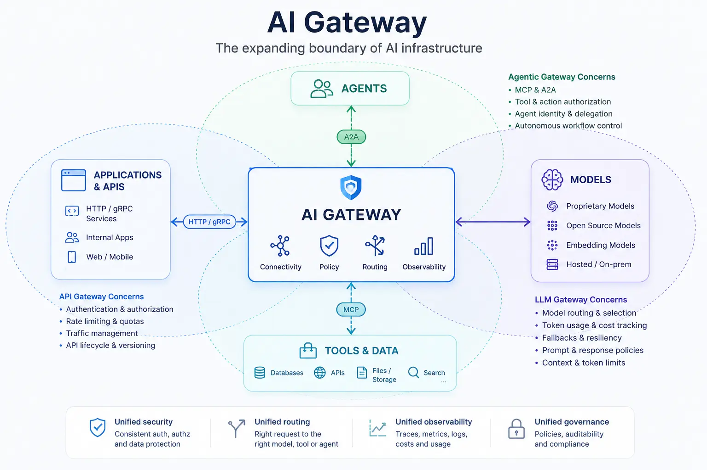

An application that calls one model through one provider can keep routing, credentials, retries, and usage records in application code. That approach becomes fragile when the same organization uses several models, agents, tools, [Model Context Protocol (MCP)](../../context-engineering/tools-and-mcp/) servers, internal APIs, and external services. Each direct integration otherwise recreates security, policy, observability, and cost controls at a different point.

An AI gateway creates a shared infrastructure boundary for this traffic. It can connect applications and agents to models and capabilities while applying routing, governance, and telemetry consistently. As AI systems become agentic, this boundary is expanding beyond model inference: it increasingly mediates agent-to-model, agent-to-tool, and [agent-to-agent](../../agent-to-agent/) communication.

## Why AI Gateways Matter

The first production problem is usually not connectivity. An HTTPS client can reach a model API without a new infrastructure layer. The difficulty is making many such connections dependable and governable.

Model endpoints differ in authentication, request schemas, streaming behavior, token limits, error handling, and usage reporting. Prompts and responses may contain sensitive data. A provider outage or quota limit may require a controlled fallback. Platform teams need to attribute cost, enforce tenant limits, and trace a request even when it fans out across a model and several tools.

Agents make the traffic graph larger. They discover and invoke tools, delegate work to other agents, and may run longer than a conventional request. A direct point-to-point design distributes credentials and policy decisions across every agent. It also makes it difficult to answer which identity invoked which tool, under whose authority, with what data, and at what cost.

This broader role is not a linear progression in which an AI gateway replaces an LLM gateway or API gateway. It is an expanding infrastructure boundary where applications, APIs, models, tools, data, and agents converge under shared connectivity, policy, routing, and observability controls.

The gateway is a control point, not necessarily the owner of every control. Identity providers establish identities; policy engines may make authorization decisions; model-serving platforms execute inference; workflow engines own durable process state. A gateway integrates and enforces relevant decisions at the connectivity boundary.

## Topic Pages








## Core Responsibilities

| Responsibility               | Gateway role                                                                                             |
| ---------------------------- | -------------------------------------------------------------------------------------------------------- |
| Connectivity and abstraction | Provide stable endpoints and protocol adaptation without erasing differences that affect behavior        |
| Traffic management           | Apply routing, limits, resilience, and lifecycle-aware transport controls                                |
| Security and governance      | Preserve identity and delegation, isolate credentials, and enforce policy at trust boundaries            |
| Observability and economics  | Correlate model, tool, and agent activity with usage and cost while limiting sensitive payload retention |
| AI-specific controls         | Apply implementation-dependent model policies, guardrails, context limits, and semantic caching          |

## Relationship to API Gateways and Service Meshes

The three patterns overlap. The table describes typical architectural focus, not guaranteed product features.

| Concern                      | API gateway              | Service mesh                     | AI gateway                   |
| ---------------------------- | ------------------------ | -------------------------------- | ---------------------------- |
| HTTP and API routing         | Primary focus            | Commonly supported               | Commonly supported           |
| Service-to-service traffic   | Sometimes                | Primary focus                    | Sometimes                    |
| LLM provider routing         | Increasingly available   | Implementation-dependent         | Common focus                 |
| Token and cost accounting    | Implementation-dependent | Uncommon                         | Common focus                 |
| Prompt and response policies | Implementation-dependent | Uncommon                         | Commonly supported           |
| MCP awareness                | Emerging                 | Implementation-dependent         | Emerging core capability     |
| Agent-to-agent traffic       | Emerging                 | Transport-level support possible | Emerging core capability     |
| Tool-level governance        | Implementation-dependent | Uncommon                         | Common agentic-gateway focus |

An organization may extend its existing API gateway, compose a gateway with a service mesh, or deploy a dedicated AI gateway. The decision should follow ownership, trust boundaries, operational maturity, and required semantics rather than the category name.

## Ecosystem

The ecosystem includes cloud-provider gateways tied closely to managed model platforms, independent commercial gateways, open-source LLM proxies, Kubernetes-native AI gateways, AI gateways with agentic-protocol support, and API management platforms adding AI-aware policies.

Protocol evolution is making conventional infrastructure more relevant to AI traffic. The [MCP `2026-07-28` specification](https://modelcontextprotocol.io/specification/2026-07-28) introduced stateless requests and HTTP headers that expose method and capability names, making MCP operations easier to load balance, route, meter, and govern. These features strengthen the potential role of gateways without removing the need for version negotiation, authorization design, or payload-aware controls.

[agentgateway](https://agentgateway.dev/) is one implementation example of this convergence. The open-source project handles HTTP, gRPC, LLM inference, MCP, and A2A traffic through shared infrastructure and became a hosted initiative of the [Agentic AI Foundation](https://agentgateway.dev/blog/2026-06-04-agentgateway-joins-aaif/) in 2026. It demonstrates that conventional and agentic connectivity can share infrastructure primitives, but it does not imply that every organization needs one gateway or one data plane for all AI concerns.

The useful evaluation questions are more stable than a vendor list: Which traffic and protocols can the gateway understand? Where is its control plane? Which identities and policies can it preserve? Can it operate streaming and long-running workloads? How portable are its abstractions? What data does it inspect or retain? How does it fail?

## Where AI Gateways Are Heading

The gateway role is moving from model access, through AI traffic management, toward agent connectivity and an agentic infrastructure control point. MCP brings tools and resources into the managed traffic graph. A2A brings discovery, delegation, task state, and artifacts across independently operated agents. Both increase the need for a programmable boundary that can carry identity, enforce policy, and produce end-to-end evidence.

The labels API gateway, inference gateway, AI gateway, MCP gateway, and agent gateway may continue to blur as general platforms add protocol awareness and specialized projects adopt conventional traffic support. The durable architectural idea is not a particular category or product. It is the need for an explicit, programmable infrastructure boundary around AI and agent communication—and for disciplined decisions about what belongs inside that boundary.

## Summary

AI gateways exist because production AI traffic needs more than endpoint routing. They provide a shared boundary for connectivity, security, policy, traffic control, observability, and cost across models and providers. Agentic systems widen that role to tools and independent agents through protocols such as MCP and A2A.

The MCP `2026-07-28` transition makes MCP more compatible with ordinary stateless HTTP infrastructure and exposes useful routing metadata to gateways. Projects such as agentgateway illustrate convergence across API, model, MCP, and A2A traffic. Architects should adopt that convergence selectively: centralize controls that benefit from a common boundary without turning the gateway into the owner of every AI system concern.
