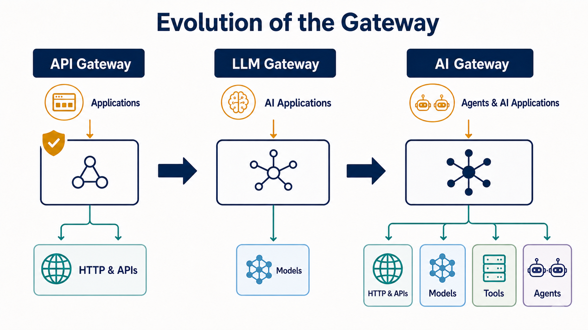
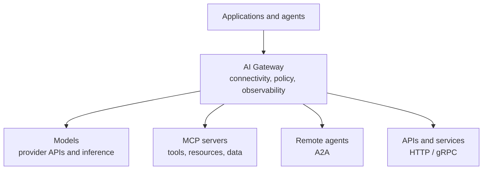
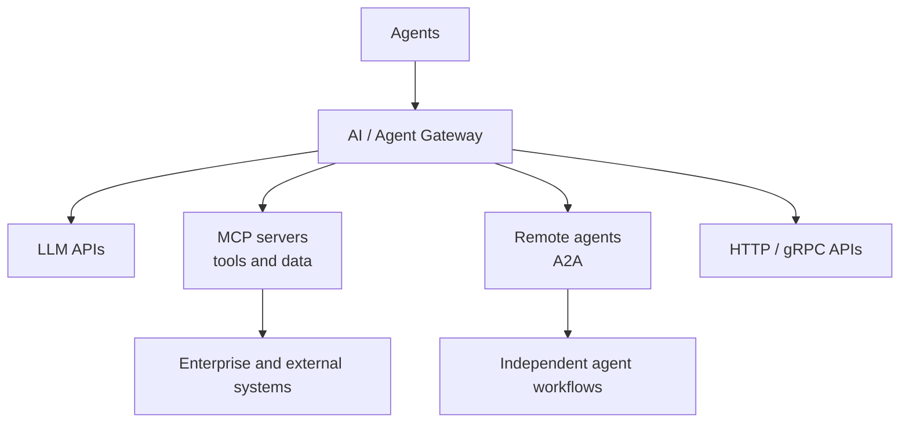

An application that calls one model through one provider can keep routing, credentials, retries, and usage records in application code. That approach becomes fragile when the same organization uses several models, agents, tools, [Model Context Protocol (MCP)](../../context-engineering/tools-and-mcp/) servers, internal APIs, and external services. Each direct integration otherwise recreates security, policy, observability, and cost controls at a different point.

An AI gateway creates a shared infrastructure boundary for this traffic. It can connect applications and agents to models and capabilities while applying routing, governance, and telemetry consistently. As AI systems become agentic, this boundary is expanding beyond model inference: it increasingly mediates agent-to-model, agent-to-tool, and [agent-to-agent](../../agent-to-agent/) communication.

## Why AI Gateways Matter

The first production problem is usually not connectivity. An HTTPS client can reach a model API without a new infrastructure layer. The difficulty is making many such connections dependable and governable.

Model endpoints differ in authentication, request schemas, streaming behavior, token limits, error handling, and usage reporting. Prompts and responses may contain sensitive data. A provider outage or quota limit may require a controlled fallback. Platform teams need to attribute cost, enforce tenant limits, and trace a request even when it fans out across a model and several tools.

Agents make the traffic graph larger. They discover and invoke tools, delegate work to other agents, and may run longer than a conventional request. A direct point-to-point design distributes credentials and policy decisions across every agent. It also makes it difficult to answer which identity invoked which tool, under whose authority, with what data, and at what cost.

The architectural progression is therefore less about replacing one proxy with another than about widening the boundary's understanding of traffic.

Ordinary API gateways remain useful for TLS termination, authentication, HTTP routing, rate limiting, and other general controls. They are not always sufficient abstractions for AI workloads because they do not necessarily understand model providers, tokens and context limits, streaming inference, prompt policies, semantic caches, tool calls, or agent protocols. Some API management products are adding these capabilities, so the distinction is about responsibility and traffic awareness rather than a fixed product boundary.

## What Is an AI Gateway?

An AI gateway is an intermediary that connects AI applications and agents to models, tools, agents, and related services while providing shared traffic management, security, policy, and observability controls.

The terminology is still evolving:

- An **API gateway** typically governs external or north-south API traffic using general HTTP, API, and identity controls.
- An **LLM gateway** focuses on access to language-model providers, often normalizing APIs, routing requests, and tracking tokens or cost.
- An **AI gateway** is the broader category. It can include multimodal models, retrieval and policy services, AI-specific operational controls, and connectivity to tools and agents through protocols such as MCP and Agent2Agent (A2A).

The gateway is a control point, not necessarily the owner of every control. Identity providers establish identities; policy engines may make authorization decisions; model-serving platforms execute inference; workflow engines own durable process state. A gateway integrates and enforces relevant decisions at the connectivity boundary.

## Topic Pages








## Core Responsibilities

### Connectivity and Abstraction

A gateway can offer stable endpoints while hiding provider-specific addresses and credentials. Protocol adapters may normalize model APIs or connect MCP, A2A, HTTP, and gRPC routes. Routing can select a provider, model deployment, tool server, or remote agent using declared policy and health.

Abstraction should be deliberate. A lowest-common-denominator API improves portability but can hide provider-specific capabilities or semantics. Applications that need those capabilities may use explicit pass-through routes rather than pretending all providers behave identically.

See [Connectivity and Abstraction](connectivity-and-abstraction/) for endpoint design, protocol adaptation, provider portability, and abstraction boundaries.

### Traffic Management

Traffic controls include load balancing, timeouts, retries, circuit breaking, rate limits, quotas, and fallback. AI-aware implementations may select models according to capability, latency, data boundary, availability, or budget. They must account for streaming responses and operations that outlive a normal HTTP timeout.

Retries require particular care. Retrying a read-only inference request is different from replaying a tool call with side effects. Idempotency, cancellation, and task state must be defined at the application or protocol boundary rather than assumed by the gateway.

See [Traffic Management](traffic-management/) for routing, quotas, retries, fallback, streaming, and long-running operations.

### Security and Governance

The gateway can authenticate callers, isolate provider or tool credentials, and enforce authorization before traffic crosses a trust boundary. Policies may consider tenant, model, data classification, tool name, delegated user, region, or requested action. Prompt and response inspection can support sensitive-data controls, content policy, and audit requirements.

Tool-level policy matters because access to an MCP server does not imply permission to invoke every tool it exposes. Similarly, authenticating one agent does not establish that it may delegate a particular task to another. The gateway must preserve relevant identity and delegation context; it cannot infer legitimate authority from generated text.

See [Security and Governance](security-and-governance/) for identity propagation, delegated authority, tool policy, sensitive-data controls, and auditability.

### Observability and Economics

General request metrics are necessary but incomplete. AI operations also need model and provider identity, time to first token, stream duration, input and output token counts, cache behavior, fallback decisions, and cost attribution. Agentic traces should connect the initiating request to model calls, tool invocations, remote-agent tasks, approvals, and results.

High-cardinality labels and sensitive payloads make indiscriminate logging unsafe and expensive. A useful design records structured operational facts and policy decisions while redacting or excluding prompts, responses, credentials, and tool results according to data-handling rules.

See [Observability and Economics](observability-and-economics/) for traces, usage measurement, cost attribution, cardinality, and telemetry boundaries.

### AI-Specific Controls

AI-aware controls can validate context and token limits, apply model-specific policies, inspect prompts and responses, invoke guardrails, and serve a semantic cache. These features are implementation-dependent. In particular, semantic caching changes behavior: similarity thresholds, tenant isolation, freshness, and authorization must be explicit because a semantically similar response is not necessarily interchangeable or safe to share.

## Architecture Patterns

### Centralized AI Gateway

A centralized gateway gives applications one managed entry point and makes policy, provider credentials, routing, and telemetry consistent. It reduces duplicated integrations and can improve purchasing and cost visibility.

The same concentration creates a shared dependency. Capacity, regional placement, configuration rollout, and failure isolation must match the aggregate workload. A single global instance is rarely the only possible meaning of “centralized”; organizations commonly centralize policy and configuration while deploying multiple data-plane instances.

### Gateway per Environment or Domain

Separate gateways can align with development environments, business domains, regions, teams, or trust boundaries. This limits blast radius and supports data residency or domain-specific policy. It also multiplies configuration, upgrades, and observability pipelines. Shared policy templates and federated telemetry can retain consistency without forcing all traffic through one runtime.

### Kubernetes-Native Gateway

A Kubernetes-native design uses the [Kubernetes Gateway API](https://gateway-api.sigs.k8s.io/) as a role-oriented configuration model for gateways, listeners, and routes. AI-aware extensions or implementation-specific policies can add model and agent semantics while fitting existing platform-engineering practices. Gateway API integration improves operational consistency, but the standard API does not by itself define token accounting, prompt policy, MCP authorization, or other AI behavior.

### AI Gateway for Agentic Systems

An AI gateway serving agentic systems mediates several communication relationships at once.

This topology makes connectivity a meaningful enforcement point. A policy can restrict an agent to approved tools, bind a delegated identity to an A2A task, or prevent sensitive context from reaching an external model. The gateway still does not replace consent workflows, business authorization, or application validation; it enforces the parts that can be evaluated at the traffic boundary.

## AI Gateway and MCP

[MCP](../../context-engineering/tools-and-mcp/) standardizes how AI hosts and clients connect to servers that expose tools, resources, and prompts. When an organization operates many clients and servers, a gateway can aggregate or federate servers, provide controlled discovery, isolate credentials, and expose a stable endpoint. It can also apply rate limits, tool-level authorization, audit records, and trust-boundary isolation.

MCP changes the infrastructure graph because tools and contextual resources become first-class AI traffic, not hidden application integrations. A model call may be harmless while a subsequent tool call reads confidential data or changes an external system. Useful governance therefore follows the entire chain from caller to model to tool, including the identity, delegation, approval, and result provenance at each boundary.

Aggregation has risks. Combining several servers into one catalog can create naming collisions, broaden discovery, and make a compromise more consequential. A gateway should present only the capabilities appropriate to the caller and keep server, tenant, and trust-domain isolation explicit.

## MCP `2026-07-28`: The “MCP v2” Transition

“MCP v2” is informal ecosystem shorthand. Normative behavior is defined by the dated [MCP `2026-07-28` specification](https://modelcontextprotocol.io/specification/2026-07-28), not by that nickname or by any vendor's interpretation.

The revision changes MCP from a bidirectional, session-oriented protocol core into stateless, self-contained requests with per-request capability information. The normal request path no longer uses the required `initialize` / `initialized` handshake or `Mcp-Session-Id`. Optional `server/discover` supports up-front capability discovery, but an ordinary request can be handled independently by any compatible server instance. Application state can still exist; the protocol no longer hides it in a transport session.

Multi Round-Trip Requests (MRTR) preserve interactions such as eliciting confirmation without requiring a continuously open bidirectional stream. A server returns an input-required result, and the client retries the original operation with the requested responses. Long-running work is addressed separately through the optional Tasks extension.

For Streamable HTTP, `Mcp-Method` and `Mcp-Name` expose operation and capability names as HTTP headers. Gateways, web application firewalls, rate limiters, and telemetry systems can therefore route, meter, and apply coarse-grained policy using normal HTTP metadata rather than always parsing JSON-RPC bodies. Payload-aware controls may still be needed for arguments and results.

The revision also adds caching hints and deterministic ordering to list and read results, making tool and resource catalogs more stable and reducing repeated discovery. Authorization hardening includes issuer validation and a move away from Dynamic Client Registration toward Client ID Metadata Documents. A formal extension mechanism allows optional capabilities to evolve outside the core. Features now move through Active, Deprecated, and Removed states, with a minimum deprecation window intended to make migration more predictable.

Together, stateless requests, visible routing metadata, cache hints, extensions, and lifecycle rules make MCP easier to operate on ordinary load-balanced, serverless, and HTTP security infrastructure. This strengthens the potential gateway role: standard infrastructure can understand more of an MCP operation without becoming a full MCP endpoint. It does not eliminate version negotiation, authorization design, payload security, or backward compatibility with session-based revisions. See the MCP maintainers' [release overview](https://blog.modelcontextprotocol.io/posts/2026-07-28/) and Cloudflare's [infrastructure-oriented interpretation](https://blog.cloudflare.com/mcp-v2/) for complementary explanations.

## The agentgateway project as an Architectural Example

[agentgateway](https://agentgateway.dev/) is an open-source implementation of an AI gateway designed for agentic and conventional traffic. Solo.io originally created the project and contributed it to the Linux Foundation. In June 2026 it became a hosted initiative of the [Agentic AI Foundation (AAIF)](https://agentgateway.dev/blog/2026-06-04-agentgateway-joins-aaif/), under the Linux Foundation. That governance history is important: it is an ecosystem project rather than merely a Solo.io product.

The project handles conventional HTTP and gRPC traffic alongside LLM inference, MCP, and A2A. It supports multi-provider model routing, security and policy controls, observability, MCP federation, and deployment through a standalone data plane or a Kubernetes control plane integrated with Gateway API.

Its architectural significance is convergence. A platform can apply related identity, routing, policy, and telemetry mechanisms to ordinary APIs and agent protocols without operating an unrelated proxy stack for each traffic type. This does not prove that every organization needs one unified gateway, nor that one data plane should own every AI concern. It demonstrates that conventional and agentic connectivity can share infrastructure primitives while retaining protocol-specific policy.

## AI Gateway vs. Model Router

A model router primarily answers:

**Which model should handle this request?**

It may select according to task type, quality, latency, price, availability, or policy.

An AI gateway answers a broader infrastructure question:

**How should AI-related traffic be connected, secured, governed, observed, routed, and controlled?**

Model selection may be one capability inside that boundary. A router can also be a separate service called by a gateway, or application logic that the gateway does not own.

Keeping the distinction prevents routing algorithms from accumulating credentials, audit, tool governance, and every other platform concern merely because they already sit in the request path.

## Relationship to API Gateways and Service Meshes

The three patterns overlap. The table describes typical architectural focus, not guaranteed product features.

| Concern                      | API gateway              | Service mesh                     | AI gateway                   |
| ---------------------------- | ------------------------ | -------------------------------- | ---------------------------- |
| HTTP and API routing         | Primary focus            | Commonly supported               | Commonly supported           |
| Service-to-service traffic   | Sometimes                | Primary focus                    | Sometimes                    |
| LLM provider routing         | Increasingly available   | Implementation-dependent         | Common focus                 |
| Token and cost accounting    | Implementation-dependent | Uncommon                         | Common focus                 |
| Prompt and response policies | Implementation-dependent | Uncommon                         | Commonly supported           |
| MCP awareness                | Emerging                 | Implementation-dependent         | Emerging core capability     |
| Agent-to-agent traffic       | Emerging                 | Transport-level support possible | Emerging core capability     |
| Tool-level governance        | Implementation-dependent | Uncommon                         | Common agentic-gateway focus |

An organization may extend its existing API gateway, compose a gateway with a service mesh, or deploy a dedicated AI gateway. The decision should follow ownership, trust boundaries, operational maturity, and required semantics rather than the category name.

## Design Considerations

- **Placement and availability:** Centralization simplifies governance but can increase latency and blast radius. Separate control-plane consistency from data-plane placement, and design explicit bypass or degradation behavior where appropriate.
- **Streaming and duration:** Preserve backpressure, cancellation, time to first token, long-running task state, and realistic timeouts. A gateway optimized only for short request-response APIs can fail poorly for agents.
- **Credentials and delegation:** Keep provider and tool secrets out of applications, but do not collapse caller, delegated user, and gateway service identities into one credential.
- **Policy scope:** Policies need clear ownership, testing, versioning, and explainable denial records. Complex prompt inspection at every hop can add latency and inconsistent behavior.
- **Portability:** Neutral APIs reduce provider coupling, while provider-specific features may be valuable. Support explicit escape hatches instead of claiming perfect interchangeability.
- **Multi-tenancy and economics:** Enforce tenant isolation in credentials, caches, logs, quotas, and budgets. Token counts reported by different providers may not be directly comparable.
- **Observability:** Control label cardinality and payload retention. Correlate model, tool, and agent spans without turning sensitive prompts into unrestricted logs.
- **Protocol evolution:** Pin and observe protocol versions, test backward compatibility, and keep protocol adapters replaceable. MCP and A2A will continue to evolve.

The largest design risk is an oversized “AI middleware” layer that owns routing, safety, memory, retrieval, orchestration, evaluation, business rules, and user approval. Such a gateway becomes difficult to reason about and a bottleneck for every team. Keep traffic-boundary responsibilities in the gateway; keep workflow state, domain decisions, and product behavior in the systems that own them.

## Ecosystem

The ecosystem includes cloud-provider gateways tied closely to managed model platforms, independent commercial gateways, open-source LLM proxies, Kubernetes-native AI gateways, AI gateways with agentic-protocol support, and API management platforms adding AI-aware policies.

The useful evaluation questions are more stable than a vendor list: Which traffic and protocols can the gateway understand? Where is its control plane? Which identities and policies can it preserve? Can it operate streaming and long-running workloads? How portable are its abstractions? What data does it inspect or retain? How does it fail?

## Where AI Gateways Are Heading

The gateway role is moving from model access, through AI traffic management, toward agent connectivity and an agentic infrastructure control point. MCP brings tools and resources into the managed traffic graph. A2A brings discovery, delegation, task state, and artifacts across independently operated agents. Both increase the need for a programmable boundary that can carry identity, enforce policy, and produce end-to-end evidence.

The labels API gateway, inference gateway, AI gateway, MCP gateway, and agent gateway may continue to blur as general platforms add protocol awareness and specialized projects adopt conventional traffic support. The durable architectural idea is not a particular category or product. It is the need for an explicit, programmable infrastructure boundary around AI and agent communication—and for disciplined decisions about what belongs inside that boundary.

## Related Topics Across Documentation Areas

- [AI Infrastructure](../) places gateways within the broader compute, serving, storage, retrieval, and orchestration stack.
- [Tools and Model Context Protocol](../../context-engineering/tools-and-mcp/) explains tool contracts, MCP concepts, and authorization boundaries.
- [Agent-to-Agent Communication and Interoperability](../../agent-to-agent/) covers A2A discovery, tasks, artifacts, and delegated trust.
- [AI Engineering](../../ai-engineering/) covers the application discipline that uses these infrastructure capabilities.

## Summary

AI gateways exist because production AI traffic needs more than endpoint routing. They provide a shared boundary for connectivity, security, policy, traffic control, observability, and cost across models and providers. Agentic systems widen that role to tools and independent agents through protocols such as MCP and A2A.

The MCP `2026-07-28` transition makes MCP more compatible with ordinary stateless HTTP infrastructure and exposes useful routing metadata to gateways. Projects such as agentgateway illustrate convergence across API, model, MCP, and A2A traffic. Architects should adopt that convergence selectively: centralize controls that benefit from a common boundary without turning the gateway into the owner of every AI system concern.
