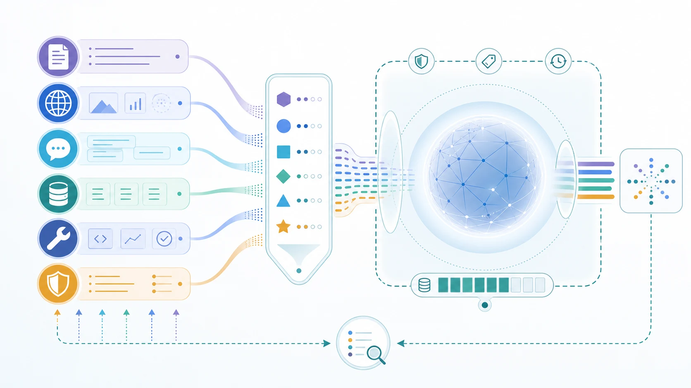

コンテキストエンジニアリングは、AI システムがタスクを実行する際に利用できる情報を、意図的に設計するための規律です。プロンプトを書くことよりも広い概念です。信頼できるモデル対話には、指示、利用者の目的、会話の状態、検索された根拠、メモリ、ツールの結果、ポリシー制約が関わることがあります。システムは、どの入力を含めるか、どの順序で渡すか、何を利用不可にすべきかを判断しなければなりません。

これは、モデルが抽象的なタスクだけに反応するのではなく、その瞬間に供給された具体的なコンテキストに反応するためです。能力の高いモデルでも、コンテキストが不完全、古い、矛盾している、過剰である、あるいは信頼できない場合には、無関係、安全でない、または一貫しない回答を返すことがあります。

## 定義

コンテキストエンジニアリングとは、モデルが実行時に使うタスク関連情報を、意図的に選択、構造化、供給、評価し、ライフサイクル全体で制御することです。目的はコンテキストウィンドウに入れる情報量を最大化することではありません。適切な情報を、利用できる形で、適切な境界の下でシステムに渡すことです。

この言葉は、実行時入力によって振る舞いが大きく変わる基盤モデルのアプリケーションで特に有用です。ただし、根底にある考え方は言語モデルに限られません。学習済みの振る舞いとライブな状態、根拠、ルールを組み合わせるあらゆるシステムには、コンテキスト設計の問題があります。

## なぜコンテキストエンジニアリングが重要か

プロンプトはタスクの枠組みを定めますが、優れた完了に必要な情報すべてを含むことはほとんどありません。サポートアシスタントには、現在のアカウント情報、製品ポリシー、直近の障害状況、会話履歴、許可された権限が必要になる場合があります。エンジニアリングアシスタントには、リポジトリの規約、変更されたファイル、テスト結果、承認済みのツールが必要になることがあります。利用可能な情報を無差別に供給しても解決にはなりません。モデルの注意を散らし、トークン予算を消費し、機密情報を露出し、信頼できない内容によって意図した振る舞いが上書きされるおそれがあります。

コンテキストエンジニアリングは、こうしたトレードオフを明示します。これはモデル入力を、不確実な環境と確率的なコンポーネントの間にある設計済みのインターフェースとして扱います。そのインターフェースには API と同様に、品質、境界、可観測性が必要です。

## コンテキストに含まれるもの

実行時コンテキストには複数の情報源があります。それぞれは異なる役割を持ち、異なるリスクを伴います。

| コンテキストの情報源                   | システム上の役割                             | 代表的なリスク                     |
| -------------------------------------- | -------------------------------------------- | ---------------------------------- |
| 指示とタスク定義                       | 意図、制約、応答の期待を定める               | 矛盾する指示や過度に広い指示       |
| 利用者、セッション、ワークフローの状態 | 応答を個別化し、継続性を保つ                 | 誤った ID や古いタスク状態         |
| 検索された根拠                         | 現在または領域固有の情報に基づかせる         | 低品質、古い、または悪意ある情報源 |
| メモリ                                 | 対話をまたいで有用な事実や設定を保持する     | 利用者間の漏えい、不適切な保持     |
| ツール結果                             | ライブな観測値やシステム記録を推論に持ち込む | 信頼できない出力や権限の不一致     |
| ポリシーと認可のコンテキスト           | 開示・実行できる範囲を定める                 | 制御漏れや委任の混同               |

これらの情報は一つのサービスから来る場合も、複数から来る場合もあります。重要なのは保存場所ではなく、意味上の役割、信頼度、鮮度、許可された利用方法です。たとえば検索されたポリシー文書は関連する根拠になり得ますが、アプリケーションを統治する指示を置き換えられるべきではありません。

## 中核となる設計原則

**関連性と十分性** は、現在のタスクを助ける根拠を選び、無関係な材料を避けることです。コンテキストは多ければよいわけではありません。供給された情報が、信頼できる次の行動や回答を支えるのに十分かを問う必要があります。

**優先順位と構造** は、どの入力が他の入力を統治するかを明確にします。指示、根拠、ツール結果、利用者提供の内容を、同じ権威を持つものとして提示してはいけません。明確な区分とスキーマは、モデルとシステムをデバッグする人の双方にとって曖昧さを減らします。

**鮮度と来歴** は、情報が現在も有効か、どこから来たかを示します。期限切れのポリシーや検証されていないウェブページに基づく回答は、もっともらしく見えても誤っている可能性があります。これらの性質がタスクに影響する場合、コンテキストには情報源、時刻、バージョン、信頼度を保持する必要があります。

**予算と圧縮** は、コンテキストウィンドウが有限であることを前提にします。決定的な事実を気付かないうちに落とすことなく、情報を順位付け、要約、重複排除、後回しにする方法が必要です。このトレードオフは技術的な問題だけではありません。過度に圧縮された記録は、正しい結論を変える例外を失うことがあります。

**分離と最小権限** は、コンテキストを、正当化できる利用者、テナント、タスク、認可範囲に限定します。これは機密情報を守るだけでなく、無関係な情報が振る舞いに影響する可能性も減らします。

**追跡可能性** は、どの情報が選択、変換、供給されたかを記録します。回答が誤っていた、または行動が不適切だった場合の評価、インシデントレビュー、改善を支えます。

## コンテキストのライフサイクル

コンテキストエンジニアリングは、一度だけプロンプトを構成する作業ではなく、継続的な流れです。システムはまず、利用者、ナレッジストア、メモリ、ツール、ポリシーサービスから候補情報を取得します。次に、タスクへの関連性、アクセス権、更新時刻、信頼度に基づいて材料をフィルタリングし、選択します。その後、構造化フィールド、抜粋、要約、引用、ツールスキーマなど、利用可能な表現へ変換します。

システムは選択した情報を明示的な境界とともに構成し、モデルまたはワークフローへ渡します。その後、コンテキストが有用な結果を支えたかを評価します。フィードバックにより、情報源の欠落、弱いランキング、不適切な要約、安全でない保持が明らかになることがあります。最後に、データとセキュリティのルールに従ってコンテキストを更新、失効、削除します。このライフサイクルは、一回限りの回答、長時間実行されるエージェントタスク、自動化されたワークフローのいずれにも当てはまります。

## 失敗モードと制御

コンテキストが欠けると、根拠のない推測につながります。古いコンテキストは、かつて正しかった回答を誤解を招くものにします。過剰なコンテキストは最も重要な根拠を隠し、コストとプライバシー露出を増やします。矛盾するコンテキストは、情報源や指示の権威順が定められていないと、一貫しない振る舞いを生みます。

信頼できないコンテキストは別のリスクを生みます。検索されたページ、添付ファイル、メール、ツール出力には、データとしては関連していてもシステムを制御してはならない、プロンプトインジェクションや指示が含まれる場合があります。届いたすべての文字列を命令として扱うと、根拠と権威の境界が崩れます。

有効な制御には、情報源の許可リスト、検索品質の確認、明示的な指示階層、テナントとタスクの分離、権限を考慮した検索、コンテンツのラベル付け、失効ルール、コンテキストの失敗を検証する評価セットが含まれます。これらはモデルの不確実性をなくすものではありませんが、システムが動作すべき条件を狭めます。

## 隣接するトピックとの関係

プロンプトエンジニアリングは、指示と例によってモデル対話をどう枠付けるかに焦点を当てます。コンテキストエンジニアリングはそれを含みますが、より広い実行時情報の集合も管理します。検索拡張生成は、外部の根拠を供給するための一つの手法であり、規律全体ではありません。メモリとエージェントシステムは、より長期の状態、ツール出力、計画の成果物、変化する認可境界を導入するため、この問題を拡張します。

[Data for AI](../data-for-ai/) は、品質、来歴、ガバナンス、鮮度を含む、コンテキストになり得る情報資産を管理します。コンテキストエンジニアリングは、それらの資産を特定の実行時対話でどのように使うかを決めます。[AI Engineering](../ai-engineering/) は、インターフェース、オーケストレーション、評価、制御を含め、その対話の周囲に信頼できるアプリケーションを設計します。[Responsible AI](../responsible-ai/) は、プライバシー、安全性、公平性、説明責任に関する横断的な要件を提供します。

## サブトピック

以下のページでは、コンテキストの情報源と統合境界を詳しく扱います。







## まとめ

コンテキストエンジニアリングは、実行時情報を偶発的なプロンプトの添付物から、設計されたシステムレイヤーへ変えます。関連する根拠を選び、境界と来歴を保ち、有限の注意を管理し、結果を評価することで、チームはモデルの振る舞いをより有用で、信頼でき、統治しやすいものにできます。
