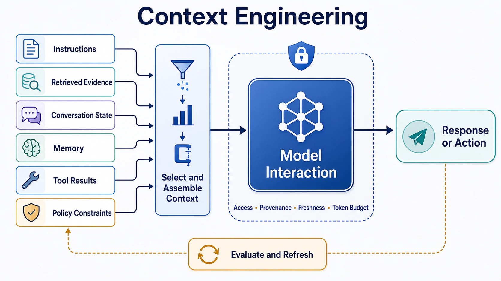

Context engineering is the discipline of deliberately designing the information that an AI system can use while it performs a task. It is broader than writing a prompt. A dependable model interaction may depend on instructions, the user's goal, conversation state, retrieved evidence, memory, tool results, and policy constraints. The system must decide which of those inputs to include, how to order them, and which must remain unavailable.

This matters because a model does not act on an abstract task alone. It responds to the particular context delivered at that moment. Even a capable model can give an irrelevant, unsafe, or inconsistent answer when that context is incomplete, stale, conflicting, excessive, or untrusted.

## Definition

Context engineering is the deliberate selection, structuring, delivery, evaluation, and lifecycle control of task-relevant information for a model at runtime. Its goal is not to maximize the amount of information in the context window. Its goal is to give the system the right information, in a usable form, under the right boundaries.

The term is especially useful for foundation-model applications because their behavior depends heavily on runtime inputs. However, the underlying idea is not unique to language models. Any system that combines learned behavior with live state, evidence, and rules has a context-design problem.

## Why Context Engineering Matters

Prompts frame a task, but they rarely contain all the information needed to complete it well. A support assistant may need the current account, product policy, recent incident status, the user's conversation history, and the limits of its authority. An engineering assistant may need repository conventions, the changed files, test results, and approved tools. Supplying all available information indiscriminately is not a solution: it can distract the model, exhaust a token budget, expose sensitive data, or let untrusted content override intended behavior.

Context engineering makes these tradeoffs explicit. It treats model input as a designed interface between an uncertain environment and a probabilistic component. That interface needs quality, boundaries, and observability just as an API does.

## What Counts as Context

Runtime context has several sources. They serve different purposes and carry different risks.

| Context source | System role | Representative risk |
| --- | --- | --- |
| Instructions and task definition | Establish intent, constraints, and response expectations | Conflicting or overly broad instructions |
| User, session, and workflow state | Personalize the response and preserve continuity | Incorrect identity or stale task state |
| Retrieved evidence | Ground answers in current or domain-specific information | Low-quality, outdated, or malicious sources |
| Memory | Carry useful facts or preferences across interactions | Cross-user leakage or inappropriate retention |
| Tool results | Bring live observations and system records into reasoning | Untrusted output or mismatched permissions |
| Policy and authorization context | Define what the system may reveal or do | Missing controls or confused delegation |

These categories may arrive from one service or many. The important distinction is not their storage location but their semantic role, trust level, freshness, and permitted use. A retrieved policy document, for example, may be relevant evidence but should not be allowed to replace the application's governing instructions.

## Core Design Principles

**Relevance and sufficiency** mean selecting evidence that helps with the current task while avoiding unrelated material. More context is not automatically better. The useful question is whether the supplied information is enough to support a reliable next action or answer.

**Precedence and structure** make it clear which inputs govern others. Instructions, evidence, tool results, and user-provided content should not be presented as if they have equal authority. Clear segmentation and schemas reduce ambiguity for both the model and the people debugging the system.

**Freshness and provenance** establish whether information is current and where it came from. A response grounded in an expired policy or an unverified web page can appear convincing while being wrong. Context should retain source, timestamp, version, and trust information when those properties affect the task.

**Budget and compression** recognize that context windows are finite. Systems need ways to rank, summarize, deduplicate, or defer information without silently discarding decisive facts. The tradeoff is semantic, not only technical: an overly compressed record may lose the exception that changes the correct outcome.

**Isolation and least privilege** limit context to the user, tenant, task, and authorization scope that justify it. This protects sensitive information and also reduces the chance that irrelevant material influences behavior.

**Traceability** records which information was selected, transformed, and supplied. It supports evaluation, incident review, and improvement when an answer was wrong or an action was inappropriate.

## The Context Lifecycle

Context engineering is an ongoing flow rather than a one-time prompt assembly step. Systems first acquire candidate information from users, knowledge stores, memory, tools, and policy services. They then filter and select material based on task relevance, access rights, recency, and trust. Next, they transform it into a usable representation: structured fields, excerpts, summaries, citations, or tool schemas.

The system assembles the selected material with explicit boundaries and sends it to the model or workflow. Afterward, it evaluates whether the context supported a useful outcome. Feedback can reveal missing sources, weak ranking, poor summarization, or unsafe retention. Finally, the system refreshes, expires, or removes context according to data and security rules. This lifecycle applies whether the interaction is one answer, a long-running agent task, or an automated workflow.

## Failure Modes and Controls

Missing context leads to unsupported guesses. Stale context causes answers that were once correct to become misleading. Excessive context can hide the most important evidence, increase cost, and raise privacy exposure. Conflicting context can produce inconsistent behavior when sources or instructions have no declared order of authority.

Untrusted context creates a separate risk. Retrieved pages, attachments, emails, and tool outputs can contain prompt injection or instructions that are relevant as data but must not control the system. Treating every incoming string as a command collapses the boundary between evidence and authority.

Useful controls include source allowlists, retrieval quality checks, explicit instruction hierarchy, tenant and task isolation, permission-aware retrieval, content labeling, expiration rules, and evaluation sets that test context failures. These controls do not eliminate model uncertainty, but they narrow the conditions under which the system must operate.

## Relationship to Adjacent Topics

Prompt engineering focuses on how instructions and examples frame a model interaction. Context engineering includes that work but also manages the broader set of runtime information. Retrieval-augmented generation is one technique for supplying external evidence; it is not the whole discipline. Memory and agent systems extend the problem because they introduce longer-lived state, tool outputs, planning artifacts, and changing authorization boundaries.

[Data for AI](../data-for-ai/) manages the information assets that may become context, including their quality, provenance, governance, and freshness. Context engineering decides how those assets are used in a particular runtime interaction. [AI Engineering](../ai-engineering/) designs the dependable application around that interaction, including interfaces, orchestration, evaluation, and controls. [Responsible AI](../responsible-ai/) supplies cross-cutting requirements for privacy, safety, fairness, and accountability.

## Summary

Context engineering turns runtime information from an incidental prompt attachment into a designed system layer. By selecting relevant evidence, preserving boundaries and provenance, managing finite attention, and evaluating outcomes, teams can make model behavior more useful, more reliable, and easier to govern.
