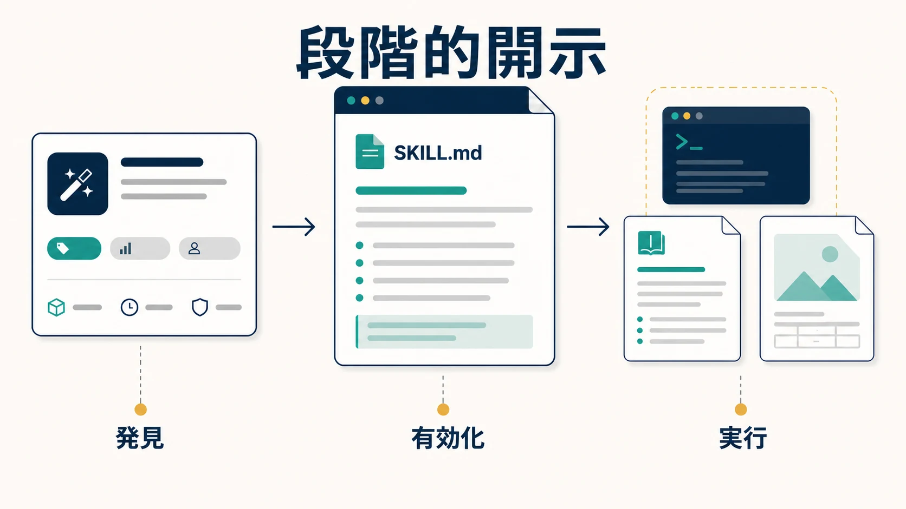
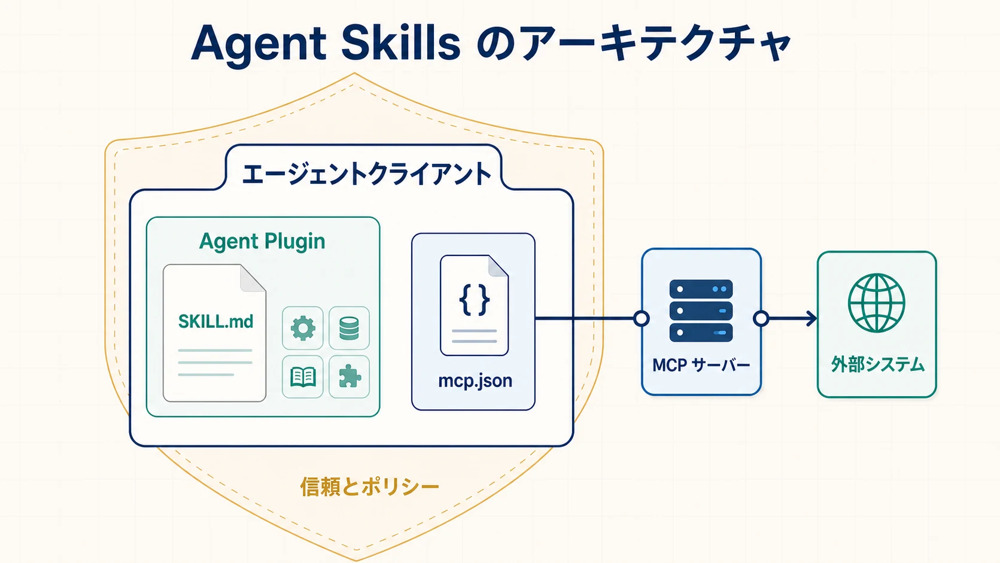

高性能な基盤モデルだけでは、現実の業務を確実に遂行できるエージェントにはなりません。エージェントには、手順、コーディング規約、デプロイルール、ドメイン固有の参考資料、テンプレート、スクリプト、外部システムへのアクセスも必要です。これらを大きなプロンプトやベンダー固有の拡張機能へ埋め込むと、指示が重複し、バージョン管理が難しくなり、コンテキストを消費し、エージェント環境間で移動しにくくなります。

Agent Skills と Agent Plugins は、このような能力に再利用可能な境界を設けます。**スキル** は手続き的知識と補助リソースをパッケージ化します。必須の **`SKILL.md`** は、その能力の内容と実行方法をエージェントへ伝えます。**Model Context Protocol（MCP）** は、エージェントアプリケーションを実行時のツールやコンテキストデータへ接続します。**Agent Plugin** は、スキルと MCP サーバー設定を、互換クライアントが扱える予測可能なディレクトリへまとめます。

これらは競合する方式ではなく、相互補完する層です。発見、配布、信頼、権限、実行ポリシーは、それぞれ別の課題として残ります。

## エージェント能力をパッケージ化する理由

組織では従来、エージェント向けのガイダンスをシステムプロンプト、プロジェクト指示、ツール記述、スクリプト、独自の拡張形式へ配置してきました。小規模なアプリケーションでは機能しますが、能力が増えると問題が生じます。

- 大きなプロンプトがタスク開始前からコンテキストを消費する
- コピーされた指示が分岐し、実行が一貫しなくなる
- 手続き的知識を独立してテスト、レビュー、バージョン管理しにくい
- プロンプトだけでは、スクリプト、テンプレート、大きな参考資料を適切に扱いにくい
- クライアント固有のレイアウトが移植性を下げる
- 指示と実行可能な操作を安全に組み合わせにくい

したがって、設計上の問いはプロンプト作成より広範です。**エージェントの知識、ワークフロー、ツール、補助リソースを、再利用でき、エージェント環境間で移動しやすい形にするには、どのようにパッケージ化すべきでしょうか。**

## Agent Skills

[Agent Skills](https://agentskills.io/home) は、専門知識と反復可能なワークフローをパッケージ化するためのオープンな形式です。実用的な手順には文章以外も必要になるため、スキルは単一のプロンプトではなくディレクトリとして表現されます。実行指示、スクリプト、詳細な参考資料、テンプレート、その他の資産を、バージョン管理可能な単位としてまとめられます。

スキルディレクトリには必須の `SKILL.md` があり、必要に応じて `scripts/`、`references/`、`assets/` を追加できます。能力に必要であれば、その他のファイルも配置できます。

通常のプロンプトは、ある対話に対して即時の指示を与えます。スキルは、エージェントが関連性を判断して必要なときだけ有効化できる、再利用可能な能力を定義します。契約レビュー、プレゼンテーション作成、データ分析、組織のデプロイ手順などに適しています。

### 段階的開示

[Agent Skills 仕様](https://agentskills.io/specification)は、発見、有効化、実行へ進む段階的開示モデルを定義しています。



**発見** では、クライアントは主に `name` と `description` からなる軽量なメタデータを提示し、エージェントがスキルの適用可能性を判断できるようにします。**有効化** では、エージェントが `SKILL.md` 全体を読み込みます。**実行** では、手順上必要になった補助ファイルだけを読み取るか実行します。

これはコンテキストエンジニアリングの仕組みです。能力の発見と完全なコンテキスト構築を分離することで、すべての手順や資料を起動時に読み込まずに、多数のスキルを利用可能にできます。選択には小さなメタデータ、実行には運用指示、必要な場合だけ専門資料を使うため、タスクに合わせてコンテキストを遅延構築できます。

## `SKILL.md`を理解する

`SKILL.md` は単なる Markdown プロンプトではありません。選択用メタデータ、手続き的な指示、スキルディレクトリ内のリソースへの参照を組み合わせたファイルです。YAML フロントマターと Markdown 本文が必須です。現行仕様では `name` と `description` が必須で、名前は親ディレクトリと一致し、説明には何を行うスキルかだけでなく、いつ利用するかも記述します。

次の例は説明用ですが、必須フィールドと現在の命名制約に従っています。

```markdown
---
name: deploy-service
description: Deploy a service safely and verify its health. Use for approved application releases and rollbacks.
---

# Deploy Service

Follow the organization's deployment procedure.

1. Verify the current build and deployment prerequisites.
2. Deploy the approved version.
3. Run health checks.
4. Roll back when validation fails.

Read `references/release-policy.md` before a production deployment.
Run `scripts/check-release.sh` for deterministic prerequisite checks.
```

手順と判断点は `SKILL.md` に置き、エージェントがワークフロー全体を理解できるようにします。詳細なポリシー、スキーマ、ドメイン文書は `references/`、決定的な操作や検証は `scripts/`、テンプレート、画像、静的データは `assets/` に置きます。これにより、運用上の流れを明確に保ちながら、大きな資料や実行可能な処理を必要時まで遅延できます。

良いスキルは能力の範囲が狭く、有効化条件が明確です。必要に応じて入力、出力、検証、失敗時の経路、復旧方法を明示します。不要なコンテキストを避け、大きな資料は分離し、正しさをモデルの即興に依存させるべきでない操作には決定的なスクリプトを使います。

## スキルとツールの違い

**スキルはタスクの進め方をエージェントへ伝え、ツールは呼び出し可能な操作をエージェントへ提供します。** デプロイ支援では、次のように区別できます。

| スキルに含まれる手続き的知識                                              | ツールとして公開される実行時操作                                                        |
| ------------------------------------------------------------------------- | --------------------------------------------------------------------------------------- |
| 前提条件を確認 → デプロイ → 稼働状態を確認 → ロールバックの要否を判断する | `getDeploymentStatus()`、`deployService()`、`getHealthChecks()`、`rollbackDeployment()` |

スキルはオーケストレーション、組織ルール、判断ロジックを表します。ツールはライブシステムに対する境界の明確な能力を公開します。スキルにスクリプトを含められるため物理的な境界は絶対ではありませんが、手順を知ることと、操作を実行する権限や接続性を持つことは異なります。

## MCPとの関係

[MCP](https://modelcontextprotocol.io/docs/getting-started/intro) は、AI アプリケーションを外部システムへ接続するオープンな標準です。MCP サーバーは、ツール、リソース、プロンプトを一貫した実行時プロトコルで公開できます。デプロイスキルは、デプロイ基盤との統合そのものを内包せずに、MCP サーバーが提供する能力の利用方法をエージェントへ指示できます。

デプロイの例では、Agent Skill が組織のデプロイ方法を説明します。エージェントはその手順に従い、MCP が提供する能力を通じてデプロイ基盤へアクセスします。

| 層            | 主な問い                                                                 |
| ------------- | ------------------------------------------------------------------------ |
| Agent Skills  | エージェントはどの再利用可能な指示と手続き的知識を持つか                 |
| MCP           | アプリケーションは実行時にどの外部ツールとコンテキストへアクセスできるか |
| Agent Plugins | 移植可能な拡張コンポーネントをどのようにまとめるか                       |

MCP が標準化するのは実行時接続であり、組織のデプロイ手順ではありません。一方、スキルは手順を記述できますが、必要なツール、認証情報、権限、ネットワーク接続がクライアントにあることを保証しません。詳しくは[ツールと Model Context Protocol](../tools-and-mcp/)を参照してください。

## Agent Plugins

組織は複数のスキル、MCP 設定、補助スクリプト、クライアント固有の統合を持つことがあります。共通のパッケージ境界がなければ、作成者はクライアントごとにディレクトリを並べ替えたり、別のマニフェストを維持したりする必要があります。

[Agent Plugins](https://agent-plugins.org/) は、移植可能なエージェント拡張のためのオープンでベンダー中立なディレクトリ形式です。2026年8月時点で、仕様バージョン **1.0.0 は Working Draft** です。移植可能な中核では Agent Skills と MCP サーバー設定の2種類のコンポーネントを標準化しており、いずれの標準も置き換えません。

ルートの `plugin.json` はプラグインと対象スキーマバージョンを識別します。任意の `skills/` には Agent Skills 仕様に準拠する直接の子ディレクトリを置きます。任意の `mcp.json` は、クライアントが固有のランタイムへ変換する MCP サーバー接続を記述します。`com.example.client` のような逆ドメイン形式の名前空間には、移植可能な中核を変えずにクライアント固有の動作を格納できます。正確なマニフェスト、固定配置、スキーマ、パス制約は [Agent Plugins 1.0 仕様](https://agent-plugins.org/specification)で定義されています。

デプロイ支援の例では、手順とロールバック規則を `skills/deploy-service/` に置き、状態確認、デプロイ、ヘルスチェック、ロールバック操作には `mcp.json` で記述した MCP サーバーを利用します。プラグインディレクトリは、互換クライアントが発見して読み込める単位になります。

### バージョン1.0が標準化しないもの

Agent Plugins は意図的に小さな相互運用性の基盤だけを定義します。1.0 のパッケージ契約は、インストール体験、マーケットプレイス、レジストリ、権限、承認フロー、サンドボックス、発行者の本人性、来歴、署名、組織の信頼ポリシー、ユーザーインターフェースをクライアント間で統一しません。その他のコンポーネントや固有動作も移植可能な中核の外に置けます。

中核を小さく保つことで、クライアントは独自のセキュリティや製品モデルを維持しながら、スキルと MCP 設定を共有できます。そのため、正しいパッケージであっても、クライアントによってインストール、表示、承認、実行の方法が異なり、対応していない場合もあります。

## アーキテクチャ



**スキル境界** は再利用可能な手順とタスク固有のリソースを所有します。**MCP 境界** は外部コンテキストや操作へのプロトコルレベルの実行時アクセスを担います。**プラグイン境界** は、互換クライアントが発見して読み込めるようにコンポーネントをまとめます。**クライアント境界** は、ポリシー、認可、ライフサイクル、実行を引き続き所有します。

## 概念の比較

| 概念             | 目的                                 | 代表的な成果物                       | 読み込み・利用時点     | 移植性における役割           |
| ---------------- | ------------------------------------ | ------------------------------------ | ---------------------- | ---------------------------- |
| プロンプト・指示 | モデルへの即時ガイダンス             | テキストまたは Markdown              | コンテキスト構築時     | 通常はアプリケーション固有   |
| Agent Skill      | 再利用可能な手続き的能力             | スキルディレクトリ                   | 関連するタスクの実行時 | 移植可能なスキル形式         |
| `SKILL.md`       | 選択用メタデータと手順               | フロントマター付き Markdown          | 発見時と有効化時       | Agent Skill の中核成果物     |
| MCP              | 実行時のツールとコンテキストへの接続 | MCP サーバーと接続設定               | 実行時                 | プロトコルレベルの相互運用性 |
| Agent Plugin     | 拡張コンポーネントのパッケージ       | プラグインディレクトリとマニフェスト | 発見時と読み込み時     | パッケージレベルの相互運用性 |

より広い相互運用性のスタックでは、関心事が次のように分かれます。

| 相互運用性の関心事 | 代表的な仕組み                           |
| ------------------ | ---------------------------------------- |
| 発見と配布         | カタログ、レジストリ、マーケットプレイス |
| パッケージング     | Agent Plugins                            |
| 手続き的知識       | Agent Skills と `SKILL.md`               |
| 実行時相互運用性   | MCP                                      |
| 外部システム       | API、データベース、SaaS、ツール          |

信頼と実行ポリシーはすべての層を横断します。手順記述、実行時統合、パッケージング、配布、信頼は異なる問いに答えます。オープンな形式は能力のバージョン管理、合成、互換実装間での再利用を助けますが、クライアント対応と非標準拡張は個別に確認する必要があります。

## セキュリティ上の考慮事項

オープン形式に従っているだけで、スキルやプラグインを信頼できるとは限りません。`SKILL.md` には悪意ある指示、参考資料にはプロンプトインジェクション、スクリプトには実行可能コードが含まれる可能性があります。MCP サーバーは強力な操作を公開でき、パッケージや発行者がサプライチェーン攻撃を受けることもあります。

パッケージングは、信頼、権限、実行の安全性と同じものではありません。

クライアントと組織には、来歴確認、発行者ポリシー、パッケージレビュー、最小権限の認証情報、重大な操作の明示的承認、パスとプロセスの分離、必要に応じたサンドボックス、実際に副作用を所有するシステムでの実行時認可が必要です。外部資料やツール結果は、上位の指示ではなく信頼できないデータとして扱います。

## 適切な境界の選び方

**Agent Skill を使う場合:** 再利用可能な指示、ドメイン知識、ワークフロー、スクリプト、参考資料、テンプレートを、1つの手続き的能力としてまとめたい場合。

**MCP を使う場合:** エージェントアプリケーションが、外部ツール、システム、コンテキストデータへの標準化された実行時アクセスを必要とする場合。

**Agent Plugin を使う場合:** スキルや MCP 設定を、互換クライアントが扱える予測可能なパッケージ境界で一緒に配布したい場合。

**クライアント固有の拡張を使う場合:** 必要な動作が移植可能な仕様の範囲外で、特定のエージェント環境へ意図的に依存する場合。

Agent Skills は、エージェント能力、段階的なコンテキストエンジニアリング、相互運用性エコシステムのすべてに関係します。リポジトリ全体のガイダンスを扱う [`AGENTS.md`](../agents-md/)、実行時接続を扱う[ツールと MCP](../tools-and-mcp/)、独立したエージェント間の通信を扱う[エージェント間の通信と相互運用性](../../agent-to-agent/)を補完します。

## まとめ

Agent Skills は再利用可能な手続き的知識をパッケージ化します。`SKILL.md` はスキルを説明して実行方法を指示する中核成果物であり、任意のリソースは大きな資料や実行可能な処理を必要時まで遅延します。MCP はツールやコンテキストへの標準化された実行時アクセスを提供します。Agent Plugins は、スキルと MCP 設定を一緒に運べる移植可能なパッケージ境界を提供します。

このモデルは再利用性と合成可能性を高めますが、エコシステム全体を1つの標準へ統合するものではありません。発見、配布、信頼、権限、実行時ポリシーは、関連しながらも別々の設計課題です。
