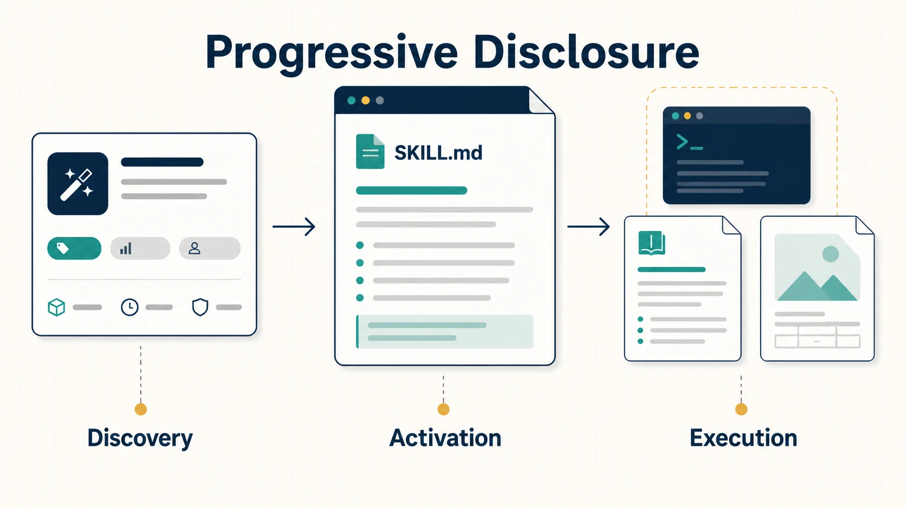
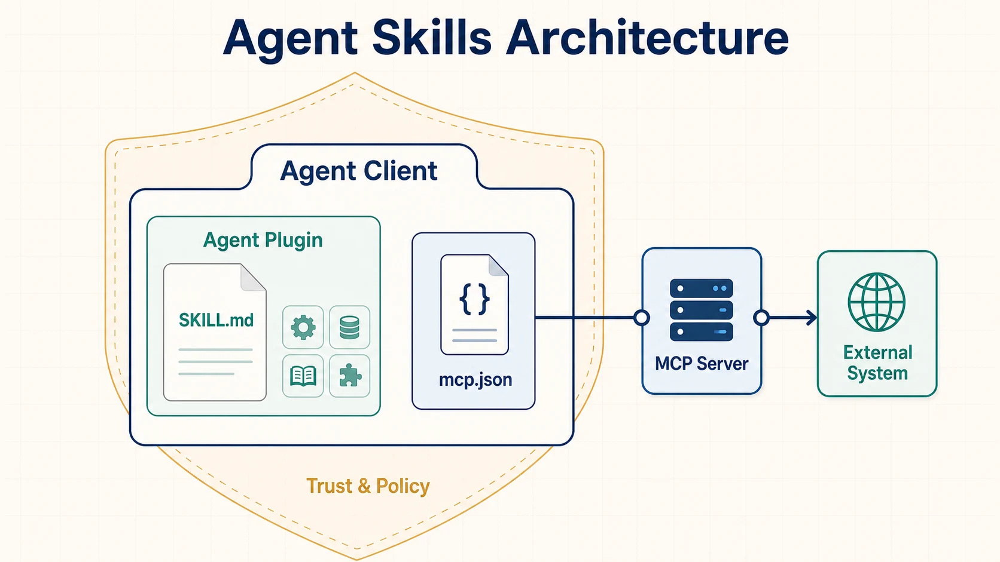

A capable foundation model is not enough for dependable real-world work. An agent also needs procedures, coding conventions, deployment rules, domain references, templates, scripts, and access to external systems. When every application embeds those capabilities in one large prompt or a vendor-specific extension, instructions are duplicated, difficult to version, expensive to keep in context, and hard to move between agent environments.

Agent Skills and Agent Plugins create reusable boundaries around this material. A **skill** packages procedural knowledge and supporting resources. Its required **`SKILL.md`** file tells an agent what the capability is and how to perform it. **Model Context Protocol (MCP)** connects an agent application to runtime tools and contextual data. An **Agent Plugin** can package skills and MCP server configuration in a predictable directory for compatible clients.

These formats address complementary layers, not competing approaches. Discovery, distribution, trust, permission, and execution policy remain separate concerns.

## Why Agent Capabilities Need Packaging

Organizations have historically placed agent guidance in system prompts, project instructions, tool descriptions, scripts, and proprietary extension formats. That works for a small application, but it creates friction as capabilities grow:

- large prompts consume context before a task begins;
- copied instructions diverge and produce inconsistent execution;
- procedural knowledge is difficult to test, review, and version independently;
- prompts alone cannot cleanly carry scripts, templates, or large references;
- client-specific layouts reduce portability;
- instructions and executable operations become difficult to compose safely.

The architectural question is therefore broader than prompt writing: **How should agent knowledge, workflows, tools, and supporting resources be packaged so they can be reused and increasingly moved across agent environments?**

## Agent Skills

[Agent Skills](https://agentskills.io/home) is an open format for packaging specialized knowledge and repeatable workflows. A skill is a directory rather than a single prompt because useful procedures often need more than prose. The directory can keep operational instructions together with executable scripts, detailed references, templates, and other assets while remaining a version-controlled unit.

A skill directory contains a required `SKILL.md` and can add optional `scripts/`, `references/`, and `assets/` directories. Other files are also permitted when the capability needs them.

A normal prompt usually gives immediate guidance for one interaction. A skill defines a reusable capability that an agent can discover and activate only when relevant. This makes skills useful for procedures such as reviewing a contract, preparing a presentation, analyzing a dataset, or following an organization's deployment runbook.

### Progressive Disclosure

The [Agent Skills specification](https://agentskills.io/specification) defines a progressive-disclosure model from discovery through activation to execution.



During **discovery**, a client exposes lightweight metadata—principally the skill's `name` and `description`—so the agent can determine when the skill may apply. During **activation**, the agent loads the complete `SKILL.md`. During **execution**, it reads or runs supporting files only when the procedure requires them.

This is a context-engineering mechanism. It separates capability discovery from full context assembly, allowing many potential skills to remain available without loading every procedure and reference at startup. Context is budgeted and assembled lazily around the task: compact metadata supports selection, operational instructions guide execution, and specialized material enters context only when needed.

## Understanding `SKILL.md`

`SKILL.md` is not merely a Markdown prompt. It combines selection metadata, procedural instructions, and references to resources in the surrounding skill directory. The file must contain YAML front matter followed by Markdown. In the current specification, `name` and `description` are required; the name must match the parent directory, and the description should state both what the skill does and when it applies.

The following example is illustrative but uses the required fields and current naming constraints:

```markdown
---
name: deploy-service
description: Deploy a service safely and verify its health. Use for approved application releases and rollbacks.
---

# Deploy Service

Follow the organization's deployment procedure.

1. Verify the current build and deployment prerequisites.
2. Deploy the approved version.
3. Run health checks.
4. Roll back when validation fails.

Read `references/release-policy.md` before a production deployment.
Run `scripts/check-release.sh` for deterministic prerequisite checks.
```

Keep the procedure and decision points in `SKILL.md` so the agent can understand the complete workflow. Put detailed policies, schemas, and domain documentation in `references/`; put deterministic operations and validations in `scripts/`; and put templates, images, and static data in `assets/`. This preserves a clear operational narrative while deferring large, specialized, or executable material.

Good skills have a narrow capability and a description with clear activation conditions. They make expected inputs, outputs, validation, failure paths, and recovery behavior explicit where those details matter. They avoid unnecessary context, keep large references separate, and use deterministic scripts when correctness should not depend on model improvisation. A skill should still be independently understandable: references should deepen the procedure rather than hide its essential logic.

## Skills and Tools Are Different

**A skill tells an agent how to perform a task. A tool gives the agent an operation it can invoke.** For a deployment assistant, the distinction looks like this:

| Procedural knowledge in the skill                                                    | Runtime operations exposed as tools                                                     |
| ------------------------------------------------------------------------------------ | --------------------------------------------------------------------------------------- |
| Check prerequisites → deploy → inspect health → decide whether rollback is necessary | `getDeploymentStatus()`, `deployService()`, `getHealthChecks()`, `rollbackDeployment()` |

The skill encodes orchestration, organizational rules, and decision logic. The tools expose bounded capabilities against live systems. A skill may include scripts, so the physical boundary is not absolute, but the architectural distinction remains useful: knowing the procedure is different from possessing authority and connectivity to execute each operation.

## Relationship with MCP

[MCP](https://modelcontextprotocol.io/docs/getting-started/intro) is an open standard for connecting AI applications to external systems. MCP servers can expose tools, resources, and prompts through a consistent runtime protocol. A deployment skill can instruct the agent to invoke deployment capabilities supplied by an MCP server without embedding the deployment platform integration in the skill itself.

In the deployment example, the Agent Skill explains how the organization deploys applications. The agent follows that procedure and reaches the deployment platform through MCP-provided capabilities.

| Layer         | Primary question                                                         |
| ------------- | ------------------------------------------------------------------------ |
| Agent Skills  | What reusable instructions and procedural knowledge does the agent have? |
| MCP           | What external tools and contextual resources can the application access? |
| Agent Plugins | How can portable extension components be packaged together?              |

MCP standardizes runtime connectivity, not the organization's deployment procedure. Conversely, a skill can describe the procedure but does not itself guarantee that a client has the tools, credentials, permission, or network access needed to carry it out. See [Tools and Model Context Protocol](../tools-and-mcp/) for the integration and control boundary in more detail.

## Agent Plugins

An organization may have several skills, MCP configuration, supporting scripts, and client-specific integrations. Without a common package boundary, authors must rearrange directories or maintain separate manifests for each agent client.

[Agent Plugins](https://agent-plugins.org/) defines an open, vendor-neutral directory format for portable agent extensions. As of August 2026, specification version **1.0.0 is a working draft**. Its portable core standardizes two component types: Agent Skills and MCP server configuration. It does not replace either underlying standard.

The root `plugin.json` identifies the plugin and the Agent Plugins schema version it targets. The optional `skills/` directory contains immediate child directories that conform to the Agent Skills specification. The optional root `mcp.json` describes MCP server connections in a portable configuration that a client maps to its native runtime. Reverse-domain extension namespaces, such as `com.example.client`, hold behavior owned by a specific client without changing the portable core. The [Agent Plugins 1.0 specification](https://agent-plugins.org/specification) defines the exact manifest, fixed component locations, schemas, and path-containment rules.

For the running example, the deployment procedure and rollback rules live in `skills/deploy-service/`. The live status, deployment, health, and rollback operations are reached through an MCP server described by `mcp.json`. The plugin directory gives compatible clients one unit to discover and load.

### What Version 1.0 Does Not Standardize

Agent Plugins deliberately defines a small interoperability floor. The 1.0 package contract does not make installation experience, marketplaces, registries, permissions, approval flows, sandboxing, publisher identity, provenance, signatures, organizational trust policy, or user interface uniform across clients. Other component types and client-specific behavior can remain outside the portable core.

Keeping this floor small lets clients share skills and MCP configuration while preserving their own security and product models. The tradeoff is important: a valid package may still install, appear, request approval, and execute differently—or not be supported—across agent clients.

## Architecture



The **skill boundary** owns reusable procedure and task-specific resources. The **MCP boundary** owns protocol-level runtime access to external context and operations. The **plugin boundary** packages portable components for discovery and loading by compatible clients. The **client boundary** still owns policy, authorization, lifecycle, and execution.

## Comparing the Concepts

| Concept             | Purpose                                | Typical artifact            | Loaded or used when      | Portability role                |
| ------------------- | -------------------------------------- | --------------------------- | ------------------------ | ------------------------------- |
| Prompt/instructions | Immediate model guidance               | Text or Markdown            | Context construction     | Usually application-specific    |
| Agent Skill         | Reusable procedural capability         | Skill directory             | When relevant            | Portable skill format           |
| `SKILL.md`          | Skill selection metadata + procedure   | Markdown with front matter  | Discovery and activation | Core Agent Skill artifact       |
| MCP                 | Runtime tools and context connectivity | MCP server and connection   | Runtime                  | Protocol-level interoperability |
| Agent Plugin        | Package extension components           | Plugin directory + manifest | Discovery and loading    | Package-level interoperability  |

These layers form a broader interoperability stack:

| Interoperability concern   | Representative mechanism                  |
| -------------------------- | ----------------------------------------- |
| Discovery and distribution | Catalogs, registries, and marketplaces    |
| Packaging                  | Agent Plugins                             |
| Procedural knowledge       | Agent Skills and `SKILL.md`               |
| Runtime interoperability   | MCP                                       |
| External systems           | APIs, databases, SaaS applications, tools |

Trust and execution policy cut across every layer.

Agent interoperability is not one problem. Procedure description, runtime integration, packaging, distribution, and trust answer different questions. Open formats can make capabilities version-controlled, composable, and reusable across compatible implementations, but client support and nonstandard extensions must still be verified. Standardized behavior should be distinguished from working drafts, experimental fields, and client-owned behavior as this ecosystem evolves.

## Security Considerations

A skill or plugin is not trustworthy merely because it follows an open format. `SKILL.md` can contain malicious instructions; references can carry prompt injection; scripts can execute code; MCP servers can expose powerful operations; and a package or publisher can be compromised through a supply-chain attack.

Packaging is not the same as trust, permission, or execution safety.

Clients and organizations still need provenance checks, publisher policy, package review, least-privilege credentials, explicit approval for consequential actions, path and process isolation, sandboxing where appropriate, and runtime authorization at the system that owns each side effect. External references and tool results should be treated as untrusted data rather than higher-priority instructions.

## Choosing the Right Boundary

**Use an Agent Skill when** reusable instructions, domain knowledge, workflows, scripts, references, or templates should travel as one procedural capability.

**Use MCP when** the agent application needs standardized runtime access to external tools, systems, or contextual data.

**Use an Agent Plugin when** skills and/or MCP configuration should be distributed together through the predictable package boundary defined by compatible clients.

**Use a client-specific extension when** required behavior is outside the portable specification and intentionally depends on a particular agent environment.

Agent Skills are simultaneously an agent-capability topic, a progressive context-engineering mechanism, and part of the emerging interoperability ecosystem. They complement repository-wide guidance such as [`AGENTS.md`](../agents-md/), runtime connectivity through [Tools and MCP](../tools-and-mcp/), and communication between independent agents through [Agent-to-Agent Interoperability](../../agent-to-agent/).

## Summary

Agent Skills package reusable procedural knowledge. `SKILL.md` is the core artifact that describes and instructs a skill, while optional resources keep large, specialized, or executable material available on demand. MCP supplies standardized runtime access to tools and context. Agent Plugins provide a portable package boundary that can carry skills and MCP configuration together.

That model improves reuse and composability, but it does not collapse the rest of the ecosystem into one standard. Discovery, distribution, trust, permissions, and runtime policy remain related but separate design problems.
