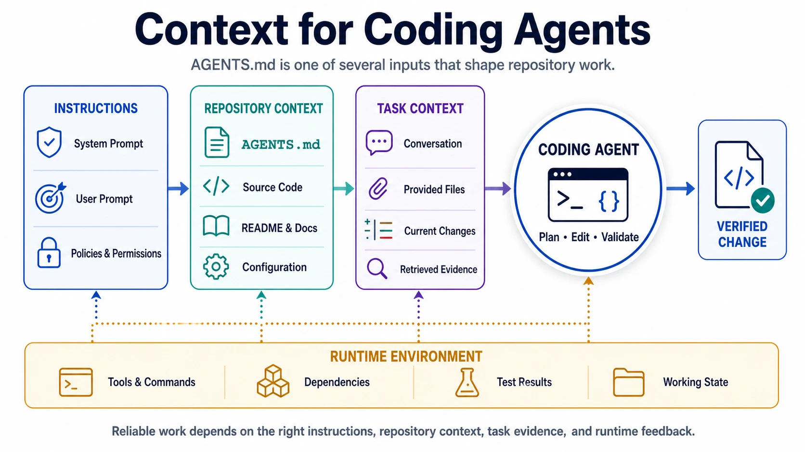

`AGENTS.md` is a Markdown file for giving coding agents the repository-specific context and instructions they need to work effectively. It can describe setup commands, validation steps, code conventions, architectural boundaries, security considerations, and contribution workflows. Its role is similar to a `README.md`, but its primary audience is an AI coding agent rather than a human contributor.

The format is intentionally simple. It does not replace application-level controls or a user's request. Instead, it supplies durable project context that would otherwise have to be repeated in every task. See the [official AGENTS.md site](https://agents.md/) for the format overview, examples, and FAQ.

## Overview

`AGENTS.md` is an open, agent-oriented convention built on standard Markdown. There are no required fields or fixed headings. Teams can organize the file around the information their agents actually need.

Common sections include:

- project overview and repository structure
- dependency installation and development commands
- formatting, linting, testing, and build commands
- code style and architectural conventions
- security, data-handling, and deployment cautions
- commit and pull-request expectations

The file complements human-facing documentation. A `README.md` can remain focused on project purpose and contributor onboarding while `AGENTS.md` carries precise operational details for coding agents.

## Hierarchy

A repository can contain more than one `AGENTS.md`. A root file can define project-wide rules, while nested files can add instructions for a package, service, or documentation area. According to the official convention, the file closest to the work being performed takes precedence when nested instructions conflict.

This hierarchy is useful in monorepos. A root file might require a shared security review, while `packages/web/AGENTS.md` specifies frontend tests and `services/api/AGENTS.md` specifies database migration checks. Local instructions should refine the broader rules rather than duplicate the entire root file.

Agents differ in how they discover files, combine nested instructions, and report conflicts. Teams should verify the behavior of the tools they use instead of assuming that every implementation loads context identically.

## Guidelines

Effective instructions are specific, executable, and scoped. Prefer commands and observable outcomes over broad preferences. “Run `pnpm lint` and `pnpm build` before completing a change” is more useful than “ensure high quality.” Explain uncommon constraints briefly so an agent can apply them correctly when the repository changes.

Keep instructions close to the code they govern and avoid copying volatile facts that already have an authoritative source. Commands should match the repository's current tooling. Safety-sensitive operations should identify boundaries and approval requirements rather than merely warning the agent to be careful.

An `AGENTS.md` file should also avoid becoming a complete architecture manual. Link to durable project documentation where detailed background is necessary, and reserve the file for instructions that influence how an agent plans, edits, validates, or hands off work.

## Limitations

`AGENTS.md` guides agent behavior, but it is not an authorization mechanism or security boundary. The application still needs to control filesystem access, credentials, network access, approvals, and other capabilities. A written instruction cannot safely compensate for excessive permissions.

Because repository content can be untrusted, agents and platforms must also distinguish instructions from data. Reviewing a third-party repository, generated archive, or pull request may expose an agent to malicious or conflicting instruction files. Sensitive workflows should define which instruction sources are trusted and keep consequential actions behind technical controls.

## Prompt Roles

After understanding the role of `AGENTS.md`, it is useful to distinguish it from two other instruction sources an agent may receive.

A **system prompt** defines the agent's governing behavior and operating boundaries. It may specify safety rules, available capabilities, instruction precedence, and how the agent should interact with its environment. It is normally supplied by the application or platform, not written as part of an ordinary user task.

A **user prompt** states the user's current goal: for example, fix a defect, explain a module, or add a documentation page. It is task-specific and may add constraints such as the desired scope or output format.

`AGENTS.md`, by contrast, records durable instructions associated with a repository or directory, such as which package manager to use and which tests to run. The three sources can be summarized as follows:

| Instruction source | Primary purpose                                               | Typical lifetime           | Example                             |
| ------------------ | ------------------------------------------------------------- | -------------------------- | ----------------------------------- |
| System prompt      | Define governing behavior and platform boundaries             | Application or session     | Observe safety and permission rules |
| User prompt        | Define the current task and desired outcome                   | Task                       | Add an `AGENTS.md` overview page    |
| `AGENTS.md`        | Supply repository- or directory-specific working instructions | Versioned with the project | Run `pnpm lint` before finishing    |

These sources are not interchangeable. A repository file should not attempt to override system-level controls. The AGENTS.md convention states that explicit user instructions override `AGENTS.md`; exact loading and precedence behavior beyond that can vary by agent implementation.

## Context Engineering

`AGENTS.md` is a practical context-engineering mechanism. It gives an agent stable, version-controlled information about the environment in which a task is performed. The user prompt contributes immediate intent; `AGENTS.md` contributes local working knowledge; the agent runtime selects and combines those inputs under its governing rules.

This separation reduces repeated prompting and makes repository expectations reviewable alongside the code. It also improves traceability: when a validation command or convention changes, the instruction can be updated in version control for future tasks.

## Summary

`AGENTS.md` is a simple open format for durable, repository-scoped guidance to coding agents. It works best when system prompts define governing boundaries, user prompts define the current task, and `AGENTS.md` supplies precise local context. Keep it scoped, executable, maintained, and backed by real permission and validation controls.
