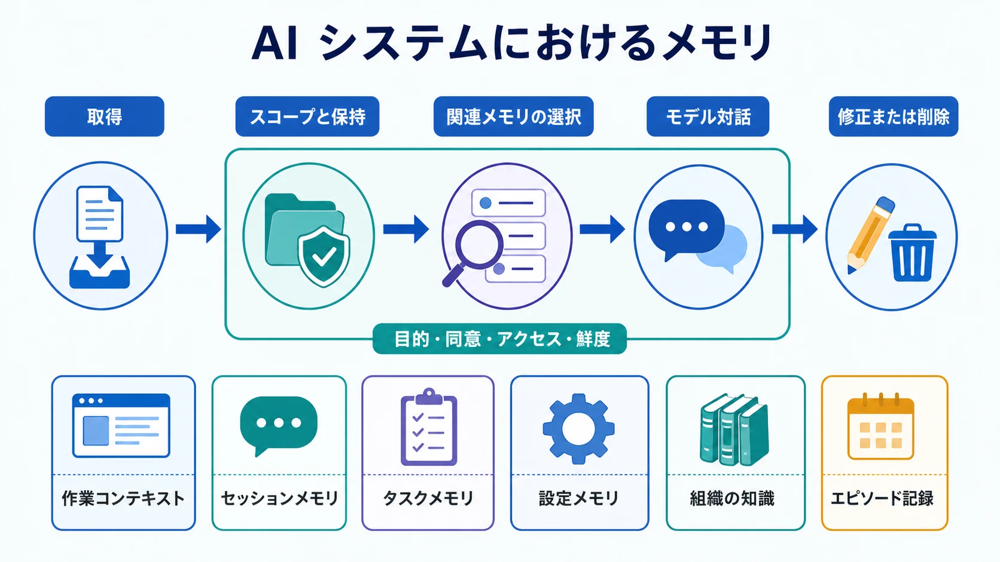

AI システムにおけるメモリとは、後続の作業で有用な継続性を利用できるように、一つの対話を超えて保持される情報です。単に会話履歴を長くすることではなく、正しさを保証するものでもありません。記憶された事実は、古い、誤って推論された、もはや利用を許可されていない、あるいは現在のタスクに無関係である可能性があります。

したがってメモリは、独自の設計とガバナンスを必要とするコンテキストの情報源です。何を保持するか、誰が使えるか、いつまで有効か、どう修正・削除できるかをシステムが決める必要があります。

## 定義

AI メモリとは、後のモデル対話またはワークフローでコンテキストとして選択・供給できる保持済みの状態です。利用者が明示した設定、境界のあるタスクの状態、過去のセッションの要約、イベントの監査可能な記録などを保持できます。アプリケーションが制御できないモデルパラメータや、一時的な作業コンテキストである現在のコンテキストウィンドウとは区別する必要があります。

## メモリの種類と時間軸

メモリは種類ごとに用途が異なり、同じ保持・アクセスルールを共有すべきではありません。

| メモリの種類     | 典型的なスコープ               | 代表的なリスク                         |
| ---------------- | ------------------------------ | -------------------------------------- |
| 作業コンテキスト | 一つの要求またはモデル呼び出し | 切り詰めにより重要な詳細を失う         |
| セッションメモリ | 一つの会話またはセッション     | 古い状態が現在の回答を変える           |
| タスクメモリ     | 境界のあるワークフロー         | スコープ変更後に古い成果物を再利用する |
| 設定メモリ       | 一人の利用者、長期間           | 誤った、または望まれない個別化         |
| 組織の知識       | 定義された利用者群             | チームやテナントをまたぐ不正利用       |
| エピソード記録   | 過去の行動またはイベント       | 機密性の高い履歴を必要以上に保持する   |

内容と同じくらいスコープが重要です。一人に有用な設定が、組織全体の既定値になってはいけません。タスク要約が永続的な利用者プロファイルになってもいけません。

## 中核となる設計原則

メモリには明確な **目的とスコープ** が必要です。各記録には存在理由と、利用者、テナント、タスク、対象者の範囲を定めます。また **来歴と確信度** も必要です。事実が利用者の発言、信頼できる記録システム、モデルの推論、ツール結果のどれに由来するかを保持します。

すべての保持情報をプロンプトに読み込むと、ノイズとプライバシー露出を生むため、**選択** が重要です。現在の要求に関連し、実行主体に許可されたメモリだけを取得します。振る舞いに影響する情報については、利用者と運用者が確認、修正、失効、削除できなければなりません。

最後に、メモリは指示ではなくデータとして扱います。過去のセッションに保存された内容は有用な根拠になり得ますが、現在のポリシーやタスク境界を上書きする権威を得てはいけません。

## メモリのライフサイクル

ライフサイクルは取得から始まります。候補情報が永続的な事実、一時的なタスク成果物、または会話の一過性の一部なのかを識別します。保存前に、所有者、情報源、機密性、保持期間、アクセス属性を付与します。

利用時には、関連する記録だけを取得・順位付けし、認可を確認して明確な構造で渡します。対話後のフィードバックは、メモリの確認、修正、無効化を可能にします。失効と削除は、任意の後処理ではなくライフサイクルの完結に必要な作業です。

## リスクと制御

誤ったメモリは偽の継続性を生みます。利用者やテナントをまたぐ漏えいは機密性を損ないます。長期保持はプライバシーの期待と衝突し、古い指示を不適切に残すことがあります。信頼できない内容を保存し、後で信頼済みの情報のように再利用すると、メモリがプロンプトインジェクションを保持する経路にもなります。

有効な制御には、テナント分離、権限を考慮した取得、情報源ラベル、確信度と鮮度の確認、保持スケジュール、利用者が操作できる制御、誤ったまたは不正な想起を検証する評価ケースが含まれます。

## 隣接するトピックとの関係

メモリはコンテキストエンジニアリングの一つの手段です。[RAG](../rag/) は現在のタスクのために外部の根拠を取得し、メモリは時間をまたいで選択された継続性を保持します。ツールは、保持済みの記録を確認または置き換える最新の状態を提供できます。[AI のためのデータ](../../data-for-ai/) は情報資産を広く管理し、コンテキストエンジニアリングは承認済みの情報のうち何を特定の対話へ渡すかを決めます。

## まとめ

AI メモリは継続性を支えますが、それは目的、範囲、修正可能性、制御が明確な場合に限られます。ライフサイクルと権威境界を設計することで、保持情報が隠れた誤りや漏えいの原因になることを防げます。
