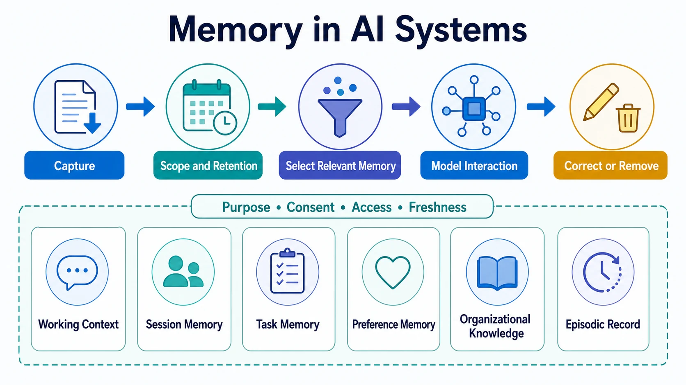

Memory in an AI system is information retained beyond one immediate interaction so that later work can use relevant continuity. It is not simply a longer conversation transcript and it is not a guarantee of truth. A remembered fact may be stale, incorrectly inferred, no longer authorized, or irrelevant to the current task.

Memory is therefore a context source with its own design and governance requirements. A useful system decides what to retain, who may use it, how long it remains valid, and how it can be corrected or removed.

## Definition

AI memory is retained state that can be selected and supplied as context for a later model interaction or workflow step. It can preserve a user's stated preference, the status of a bounded task, a summary of a prior session, or an auditable record of an event. It should be distinguished from the model's parameters, which are not application-controlled memory, and from a current context window, which is temporary working context.

## Memory Types and Time Horizons

Different forms of memory support different purposes and should not share the same retention or access rules.

| Memory type              | Typical scope               | Representative risk                               |
| ------------------------ | --------------------------- | ------------------------------------------------- |
| Working context          | One request or model call   | Important detail is lost through truncation       |
| Session memory           | One conversation or session | Stale state changes the current answer            |
| Task memory              | A bounded workflow          | Old task artifacts are reused after scope changes |
| Preference memory        | One user over time          | Incorrect or unwanted personalization             |
| Organizational knowledge | A defined audience          | Unauthorized reuse across teams or tenants        |
| Episodic record          | A past action or event      | Sensitive history is retained longer than needed  |

The scope is as important as the content. A useful preference for one person should not silently become an organization-wide default. A task summary should not become a permanent user profile.

## Core Design Principles

Memory needs explicit **purpose and scope**. Each record should have a reason for existing and a defined user, tenant, task, or audience. It also needs **provenance and confidence**: systems should retain whether a fact came from a user statement, a trusted system of record, a model inference, or a tool result.

**Selection** matters because loading every retained fact into a prompt creates noise and privacy exposure. A system should retrieve memory only when it is relevant to the current request and permitted for the acting identity. **Correction and deletion** matter for the same reason. Users and operators need ways to inspect, amend, expire, or remove information, especially when it affects behavior.

Finally, memory should be treated as data, not as instruction. Content stored in a prior session may be useful evidence, but it must not gain authority to override the application's current policies or task boundaries.

## Memory Lifecycle

The lifecycle begins with capture. Systems should identify whether the candidate information is a durable fact, a temporary task artifact, or merely a transient part of the conversation. Before storage, they should attach ownership, source, sensitivity, retention, and access metadata.

At use time, the system retrieves and ranks only relevant records, checks authorization, and presents them with clear structure. After the interaction, feedback can confirm, correct, or invalidate memory. Expiration and deletion complete the lifecycle; they are not optional cleanup tasks.

## Risks and Controls

Incorrect memory creates false continuity. Cross-user or cross-tenant leakage breaks confidentiality. Long retention can conflict with privacy expectations and make old instructions persist inappropriately. Memory can also preserve prompt injection when untrusted content is stored and later reused as if it were trusted.

Useful controls include tenant isolation, permission-aware retrieval, source labeling, confidence and freshness checks, retention schedules, user-visible controls, and evaluation cases for incorrect or unauthorized recall. These controls make memory more dependable without requiring a system to remember everything.

## Relationship to Adjacent Topics

Memory is one context-engineering mechanism. [RAG](../rag/) retrieves external evidence for a current task, while memory carries selected continuity across time. Tools can provide fresh state that confirms or supersedes retained records. [Data for AI](../../data-for-ai/) governs information assets more broadly; context engineering determines which approved information reaches a particular interaction.

## Summary

AI memory supports continuity, but only when it is purposeful, scoped, correctable, and controlled. Designing its lifecycle and authority boundaries prevents retained information from becoming a hidden source of error or exposure.
