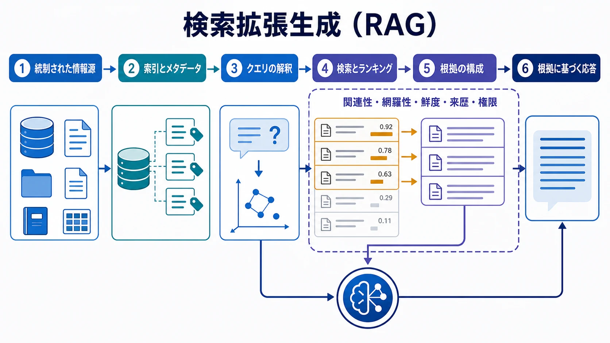

検索拡張生成（RAG: Retrieval-Augmented Generation）は、外部の根拠を実行時に取得し、モデル対話のコンテキストとして構成するパターンです。モデルのパラメータだけでは確実に得られない、最新の情報、領域固有の情報、組織固有の情報に基づく回答を支えます。

RAG はベクトル検索の同義語ではありません。その品質は、情報源から回答までの経路全体、すなわちコーパス、メタデータ、アクセスルール、検索、ランキング、コンテキスト構成、モデルの振る舞い、評価に依存します。

## 定義

RAG システムでは、要求を情報ニーズとして解釈します。候補となる根拠を見つけ、順位付け・フィルタリングし、選択した材料をモデルに渡して回答または構造化結果を生成します。結果は取得された根拠に基づくべきであり、根拠が弱い、または不完全である場合にはその限界を示す必要があります。

## なぜ RAG が重要か

ライブな検索がなくてもモデルは有用ですが、内蔵知識は古い、一般的すぎる、または非公開の領域には適さないことがあります。RAG を使うと、サポートアシスタントは承認済みの製品ドキュメントを、分析支援は統制された業務定義を、エンジニアリング支援は現在のリポジトリ資料を利用できます。

検索しただけで回答が正しくなるわけではありません。検索は根拠に基づく機会を作るものです。選択の悪い、または信頼できない根拠は、回答をもっともらしくしながら、信頼性を下げる場合があります。

## エンドツーエンドの流れ

| 段階               | 目的                                   | 代表的な失敗モード                             |
| ------------------ | -------------------------------------- | ---------------------------------------------- |
| 情報源の準備       | 文書を利用可能かつ統制されたものにする | 古い、または構造化が不十分な情報源             |
| 索引とメタデータ   | 発見とアクセス確認を支える             | 来歴や機密性ラベルの欠落                       |
| クエリの解釈       | 実際の情報ニーズを特定する             | 曖昧な要求を誤ったトピックに対応付ける         |
| 検索とランキング   | 関連する候補根拠を選ぶ                 | 重要な根拠が欠落する、または低く順位付けされる |
| コンテキストの構成 | 簡潔で有用な根拠をモデルへ渡す         | 過剰・矛盾した抜粋が回答を曖昧にする           |
| 生成と評価         | 根拠に基づく結果を生成・評価する       | モデルが根拠を超えた主張をする                 |

文書の準備には、分割、メタデータ付与、バージョン管理、情報源品質の評価が含まれます。これらは副次的な前処理ではなく、後で何を見つけ、何を信頼できるかを決める作業です。

## 品質と信頼

関連性は、取得された材料が質問に答えているかを問います。網羅性は、完全な回答に必要な根拠を含むかを問います。鮮度は現在の状態を反映するか、来歴は誰が所有し、信頼できるか、権限は実行中の利用者とアプリケーションが取得・開示を許可されているかを問います。

コンテキスト構成では、これらの性質を保つ必要があります。モデルは、根拠と指示を区別し、矛盾を識別し、必要に応じて引用または留保できるだけの情報を受け取るべきです。信頼できないページからの抜粋は、評価すべきデータであり、アプリケーションへの命令ではありません。

## 評価と失敗モード

RAG の評価では、期待する回答に似た文章を返すかだけを検証してはいけません。検索品質、根拠の網羅性、引用や帰属の正確性、回答の裏付け、権限の振る舞い、曖昧または敵対的な内容への耐性を測定します。

一般的な失敗には、根拠の欠落、弱いランキング、古い材料、矛盾する情報源、無関係なコンテキスト、根拠のない統合があります。検索文書にはモデルの振る舞いを変えようとするプロンプトインジェクションが含まれることもあります。明確な指示階層、情報源の制御、評価ケースが、根拠と権威の境界を保ちます。

## 隣接するトピックとの関係

RAG は外部の根拠を扱うためのコンテキストエンジニアリングのパターンです。[メモリ](../memory/) は選択された継続性を保持し、RAG は統制されたコーパスからタスク関連の材料を取得します。埋め込み、キーワード検索、知識グラフ、メタデータはいずれも検索を支え得ますが、それぞれ単独で RAG を定義するものではありません。[ツールと MCP](../tools-and-mcp/) は、統制されたインターフェースを通じて検索機能を公開できます。

## まとめ

RAG は、選択された外部の根拠にモデル対話を基づかせます。その信頼性は、一つのデータベースや検索技術ではなく、検索から回答までの経路全体の品質と統制から生まれます。
