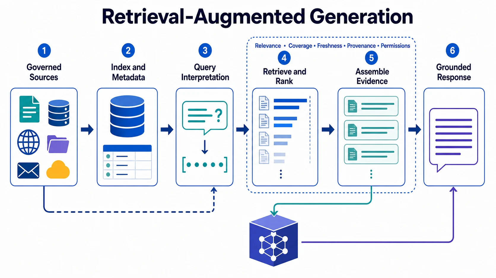

Retrieval-augmented generation (RAG) is a pattern that retrieves external evidence at runtime and assembles it into the context for a model interaction. It helps systems answer with current, domain-specific, or organization-specific information that is not reliably available in the model's parameters.

RAG is not a synonym for vector search. Its quality depends on the complete path from source material to answer: the corpus, metadata, access rules, retrieval, ranking, context construction, model behavior, and evaluation all matter.

## Definition

In a RAG system, a request is interpreted as an information need. The system locates candidate evidence, ranks and filters it, and supplies selected material to a model so it can produce an answer or structured result. The result should remain grounded in the retrieved evidence and make its limits visible when evidence is weak or incomplete.

## Why RAG Matters

Models can be useful without live retrieval, but their built-in knowledge may be outdated, too general, or unsuitable for a private domain. RAG allows a support assistant to use approved product documentation, an analyst assistant to use governed business definitions, or an engineering assistant to use current repository material.

Retrieval does not make an answer correct by itself. It creates an opportunity to ground the answer in evidence. Poorly chosen or untrusted evidence can make a response sound more convincing while making it less reliable.

## End-to-End Flow

| Stage                     | Purpose                                      | Representative failure mode                          |
| ------------------------- | -------------------------------------------- | ---------------------------------------------------- |
| Source preparation        | Make documents usable and governed           | Stale or poorly structured source material           |
| Indexing and metadata     | Support discovery and access checks          | Missing provenance or sensitivity labels             |
| Query interpretation      | Identify the actual information need         | Ambiguous request is mapped to the wrong topic       |
| Retrieval and ranking     | Select relevant candidate evidence           | Important evidence is absent or ranked too low       |
| Context assembly          | Supply concise, useful evidence to the model | Excessive or conflicting excerpts obscure the answer |
| Generation and evaluation | Produce and assess a grounded outcome        | Model makes unsupported claims beyond evidence       |

Document preparation may include segmentation, metadata assignment, versioning, and source-quality assessment. Those choices are not incidental preprocessing: they shape what the system can later find and trust.

## Quality and Trust

Relevance asks whether retrieved material addresses the question. Coverage asks whether it includes the evidence needed for a complete answer. Freshness asks whether it still reflects the current state. Provenance asks where it came from, who owns it, and whether it is trustworthy. Permissions ask whether the acting user and application are allowed to retrieve and disclose it.

Context assembly must preserve these properties. A model should receive enough source information to distinguish evidence from instruction, identify conflicts, and cite or qualify the result when appropriate. An extract from an untrusted page is data to be evaluated, not a command for the application.

## Evaluation and Failure Modes

RAG evaluation should test more than whether a system returns text that resembles an expected answer. It should measure retrieval quality, evidence coverage, citation or attribution accuracy, answer support, permission behavior, and resilience to ambiguous or adversarial content.

Common failures include missing evidence, weak ranking, stale material, contradictory sources, irrelevant context, and unsupported synthesis. Prompt injection is another risk: retrieved documents can contain instructions intended to alter model behavior. Clear instruction hierarchy, source controls, and evaluation cases help preserve the boundary between evidence and authority.

## Relationship to Adjacent Topics

RAG is a context-engineering pattern for external evidence. [Memory](../memory/) preserves selected continuity; RAG retrieves task-relevant material from a governed corpus. Embeddings, keyword search, knowledge graphs, and metadata can all support retrieval, but none alone defines RAG. [Tools and MCP](../tools-and-mcp/) may expose retrieval capabilities through controlled interfaces.

## Summary

RAG grounds model interactions in selected external evidence. Its reliability comes from the quality and governance of the full retrieval-to-answer path, not from a single database or search technique.
