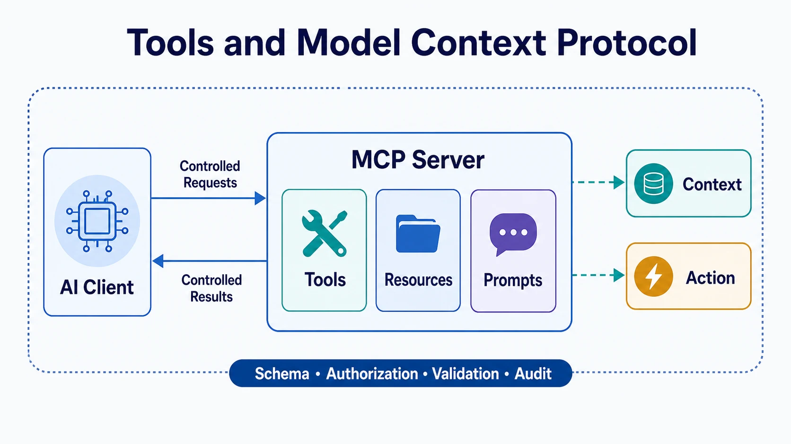

Tools connect a model-driven application to external information and actions. They can search a knowledge base, read a business record, execute a calculation, create a ticket, or request approval. This makes them powerful context sources and potential side-effect boundaries at the same time.

The Model Context Protocol (MCP) provides a standard protocol for connecting AI clients to external servers that expose contextual capabilities. It improves interoperability, but it does not remove the need for application-level authorization, validation, and operational controls.

## Definition

A tool is an interface through which an AI application can request a bounded capability from another system. Tool results become context that a model or workflow can interpret. A safe design keeps the tool's contract explicit: what inputs it accepts, what it returns, which identity performs the request, and what side effects are permitted.

MCP is one protocol model for making capabilities available to AI clients through MCP servers. Its concepts include clients and servers, tools for executable capabilities, resources for contextual data, and prompts for reusable interaction templates. These concepts help systems discover and use integrations consistently, but they do not define an organization's trust policy. See the [official Model Context Protocol site](https://modelcontextprotocol.io/) for the protocol's documentation and specifications.

## Why Tools Matter

Tool use lets an AI application move beyond static model knowledge. A tool can retrieve current inventory, check an account state, search a controlled corpus, or submit a draft for review. It can also turn model output into a real-world action. The same integration therefore needs both information-quality controls and authorization controls.

## Tool Integration Elements

| Element               | Responsibility                               | Representative risk                                 |
| --------------------- | -------------------------------------------- | --------------------------------------------------- |
| Tool schema           | Defines valid inputs and output structure    | Ambiguous fields cause incorrect actions            |
| Tool result           | Supplies external observation or data        | Untrusted content is treated as instruction         |
| Resource              | Exposes contextual data for use or reference | Sensitive data is discovered too broadly            |
| Client and server     | Connect the application to a capability      | An untrusted server receives credentials or context |
| Authorization context | Binds a request to scope and identity        | Confused delegation or excessive privilege          |
| Audit record          | Explains what was requested and done         | Missing evidence prevents review or recovery        |

Schemas make integration more reliable, but a well-formed request can still be unauthorized or unsafe. The application must evaluate the requested action against policy, user intent, task scope, and resource sensitivity.

## MCP in Context

MCP is valuable when teams need a consistent way to expose tools, resources, and prompts across multiple AI clients and integrations. It can reduce bespoke connector work and make capability descriptions easier to discover. It should be understood as an interoperability layer, not as a substitute for an API gateway, identity system, or governance model.

An MCP server may provide useful context, but its content and behavior still need a trust assessment. Clients should use only approved servers, request the minimum capability needed, and keep credentials and sensitive context scoped to the task.

## Control and Authorization Boundaries

Tool invocation should preserve the executing identity, the delegated user or business subject when applicable, the approved task scope, and the intended action. Read, write, and approval capabilities should be separated. High-impact operations should have explicit confirmation or workflow controls rather than relying on generated text alone.

Tool results should be labeled as external data. This reduces the chance that text returned by a search result, document, or remote server is interpreted as an instruction that overrides the application. Validation, rate limits, retries, and safe failure behavior are also part of the boundary.

## Relationship to Adjacent Topics

Tools and MCP are part of context engineering because tool results and resources influence runtime behavior. [RAG](../rag/) specializes in retrieving evidence; tool interfaces may expose retrieval or many other capabilities. [Agent-to-Agent Communication](../../agent-to-agent/) addresses delegation and task exchange between independent agents. [AI Engineering](../../ai-engineering/) covers the broader application discipline around these integrations.

## Summary

Tools give AI systems controlled access to information and action. MCP standardizes one integration model, while trustworthy use still depends on explicit contracts, scoped identity, validated results, and observable control boundaries.
