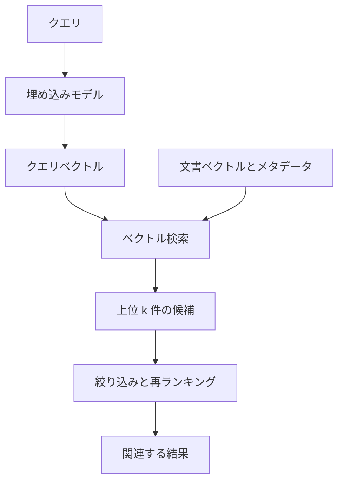

ベクトル検索とは、定義された類似度または距離の尺度に従って、クエリベクトルに近いベクトルを見つける検索技術です。コンテキストエンジニアリングのシステムでは、現在のタスクに関連する可能性がある情報を選ぶための仕組みの一つです。

ベクトル検索は、意味検索、RAG、ベクトルデータベースの同義語ではありません。これらの境界を明確にすると、検索システムを設計・評価しやすくなります。

## 概念上の境界

| 概念                 | 役割                                             |
| -------------------- | ------------------------------------------------ |
| 埋め込み             | 情報を表現する                                   |
| ベクトル検索         | 類似する表現を取得する                           |
| 意味検索             | 意味に基づいて情報を取得する                     |
| ハイブリッド検索     | 意味・ベクトル検索と語彙検索を組み合わせる       |
| 再ランキング         | 候補の順序を改善する                             |
| RAG                  | 取得した知識を生成モデルへ渡す                   |
| ベクトルデータベース | ベクトルを大規模に保存、索引、絞り込み、提供する |

[埋め込み](../../foundation-models/embeddings/) はベクトル表現を作り、ベクトル検索はその表現を比較します。意味検索は、より広い検索能力です。ベクトル検索を利用できますが、語彙検索、メタデータ、クエリ理解、ナレッジグラフ、再ランキング、これらのシグナルの組み合わせも利用できます。 [RAG](../rag/) は取得した情報をモデルのコンテキストとして使うものであり、ベクトル検索を必須としません。

**ベクトルデータベース** は、ベクトルを本番規模で永続化、索引、絞り込み、管理、提供するインフラストラクチャです。汎用データベースや検索エンジンにもベクトル索引を備えるものがあります。能力と製品カテゴリを混同してはいけません。ベクトル検索は専用のベクトルデータベースなしでも実行でき、ベクトルデータベースは検索操作以外の機能も提供します。

## 検索の流れ

クエリ時には、互換性のある埋め込みモデルをクエリに適用し、索引済みの文書または項目のベクトルを検索して候補を返します。その後、絞り込みと再ランキングによって、ベクトル類似度に含まれない情報を組み込めます。

クエリベクトルと文書ベクトルは、互換性のある埋め込み空間に属する必要があります。同じエンコーダと表現方法を両方に使うモデルもあれば、クエリと文書で非対称の役割を学習したモデルもあります。

一部の埋め込みモデルは、入力の役割や目的を示す短いラベルを本文の前に付けて学習されています。これをここでは **タスク接頭辞** と呼びます。たとえば、検索要求には「クエリ」、索引する文章には「文書」に相当する接頭辞を付け、同じ文章でも検索側か候補側かをモデルへ伝えます。分類、クラスタリング、意味的類似度など、検索以外の目的を区別する接頭辞を持つモデルもあります。

必要な文字列と付与方法はモデルごとに異なり、接頭辞を必要としないモデルもあります。モデルが指定する形式を、文書の索引時とクエリ生成時の両方で一貫して使う必要があります。接頭辞を省略する、役割を逆にする、別バージョンの形式を混在させると、ベクトルは生成できても、学習時に想定した位置関係が崩れて検索品質が低下する可能性があります。したがって、接頭辞、前処理、エンコーダ経路は埋め込みモデルのバージョンとともに記録し、評価対象に含めます。

## 最近傍検索

ベクトル検索は一般に、コサイン類似度、内積、ユークリッド距離など、モデルと互換性のある尺度の下で、クエリに最も近い索引済みベクトルを見つける **最近傍検索** として定式化されます。通常は、しきい値を超えるすべての項目ではなく、上位 **k 件** の候補を返します。

**厳密最近傍検索** は、クエリをすべての候補と比較するなどして、真の最近傍結果を保証します。分かりやすく、小規模データセット、検証、高精度が必要なワークロードに適しますが、コーパスの規模と次元数に応じてコストが増えます。

**近似最近傍検索（ANN）** は、再現率の一部と引き換えに、レイテンシと資源使用量を抑えます。ANN 索引はすべてのベクトルを調べることを避け、メモリ、構築時間、クエリレイテンシ、真の最近傍を見つける確率に影響する調整項目を持ちます。

代表的な索引方式には、ベクトルを探索可能な多層グラフとして構成する **HNSW** と、空間を大まかな領域へ分割し、選択した領域を検索する **IVF** があります。これらは索引方式であり、完全な検索アーキテクチャではありません。パラメータは一般的な既定値をそのまま使うのではなく、実際のワークロードを測定して選択します。

## 絞り込み、ハイブリッド検索、再ランキング

本番の検索では、類似度だけでは不十分なことが多くあります。 **メタデータによる絞り込み** は、テナント、権限、言語、コンテンツ種別、製品、地域、時刻などの属性で候補を制限します。セキュリティ上の絞り込みは認可制御であり、任意の関連性シグナルとして扱ってはいけません。ANN 検索の前、途中、後のどこで絞り込むかは、正しさと性能の両方に影響します。

**ハイブリッド検索** は、ベクトルまたは意味のシグナルと語彙検索を組み合わせます。語彙検索は、正確な名称、識別子、エラーコード、まれな用語に強く、ベクトル検索は言い換えや概念的な関係に役立つことがよくあります。スコアや候補集合の組み合わせは網羅性を改善できますが、それぞれのシグナルは自然には同じ尺度を持たないため、調整が必要です。

**再ランキング** は、より高コストまたは文脈を考慮するモデルを、小さな候補集合へ適用します。クロスエンコーダ、学習ランキングモデル、業務ルール、鮮度、情報源の権威性などによって、最初の検索後に結果を並べ替えられます。再ランキングは適合率を改善できますが、候補生成が返さなかった関連情報を復元することはできません。

## 再現率、レイテンシ、関連性

検索インフラストラクチャには、再現率とレイテンシのトレードオフがあります。より網羅的な探索、大きな候補集合、高い ANN 探索パラメータは、関連項目を見つける確率を高められますが、レイテンシと計算量を増やします。索引構築、メモリ、更新頻度、絞り込みの動作にもトレードオフがあります。

ANN の **再現率** は、近似結果が厳密最近傍検索の結果とどれほど一致するかを測ります。これはインフラストラクチャの指標であり、利用者にとっての関連性を完全に測るものではありません。埋め込みモデル、分割方法、コーパス、クエリ解釈が用途に合わなければ、最も近いベクトルでも不適切な回答候補になり得ます。

検索品質は、代表的なクエリと判定済みの結果を使い、エンドツーエンドで評価します。代表的な指標には、k 件における再現率と適合率、平均逆順位、正規化減損累積利得、アプリケーションの成功に結び付く指標があります。評価セットには、正確な用語、言い換え、曖昧なクエリ、権限境界、古いコンテンツ、十分な結果が存在しない事例を含めます。

問題の診断では、段階を分けることが有用です。

- 関連する材料が索引に存在しなければ、検索では見つけられません。
- 厳密検索で順位が低い場合は、埋め込み、分割、メタデータ、関連性の定義を確認します。
- 厳密検索では成功し、ANN で見失う場合は、索引方式を調整または変更します。
- 候補は関連しているのに順序が悪い場合は、スコア統合または再ランキングを改善します。
- 検索結果はよいのに生成出力に根拠がない場合は、RAG レイヤーのコンテキスト構成とモデルの振る舞いを確認します。

## 運用上の考慮事項

索引は、情報源データと [埋め込み](../../foundation-models/embeddings/) のバージョンに合わせて変化させます。追加、更新、削除、権限変更、再埋め込みには、伝播方法と整合性に関する期待を定める必要があります。古いベクトルは、情報源システムが正しくても、削除済みまたは古いコンテンツを取得する可能性があります。

本番システムでは、検索動作を説明するために必要な、クエリ変換、埋め込みと索引のバージョン、フィルター、候補識別子、スコア、再ランキング結果、レイテンシ、アクセス判断を記録します。ログには機密性の高いクエリや文書の内容を不必要に露出させないようにします。

容量計画では、ベクトル件数、次元数、索引のオーバーヘッド、複製、構築時間、更新率、メモリ常駐、クエリの同時実行数を考慮します。専用のベクトルデータベースがこれらの運用を助ける場合もあれば、リレーショナルデータベース、検索エンジン、アプリケーション内の索引で十分な場合もあります。規模、絞り込み、整合性、運用、ガバナンスの要件に基づいてアーキテクチャを選択します。

## RAG との関係

ベクトル検索は RAG パイプラインへ根拠候補を提供できますが、検索方法の一つにすぎません。信頼できるパイプラインは、語彙検索とベクトル検索、ナレッジグラフの探索、メタデータルール、再ランキング、権限確認、コンテキスト構成を組み合わせることがあります。ベクトル類似度は、根拠が最新、信頼可能、許可済み、十分であることを保証しません。

この区別によって、有用な順序が明確になります。埋め込みは情報を表現し、ベクトル検索は類似する表現を取得し、意味検索とハイブリッド検索はより広い検索能力を構成し、RAG は選択した根拠を生成モデルへ渡します。

## まとめ

ベクトル検索が答える問いは、 **ベクトル表現を比較して、どのように情報を取得するか** です。モデルと互換性のある類似度尺度、最近傍探索、厳密または近似の索引を使って候補を返します。意味検索はより広い能力であり、ハイブリッド検索はシグナルを組み合わせ、再ランキングは候補順を改善し、RAG は取得した根拠をコンテキストに使い、ベクトルデータベースはベクトルを大規模に運用するインフラストラクチャを提供します。
