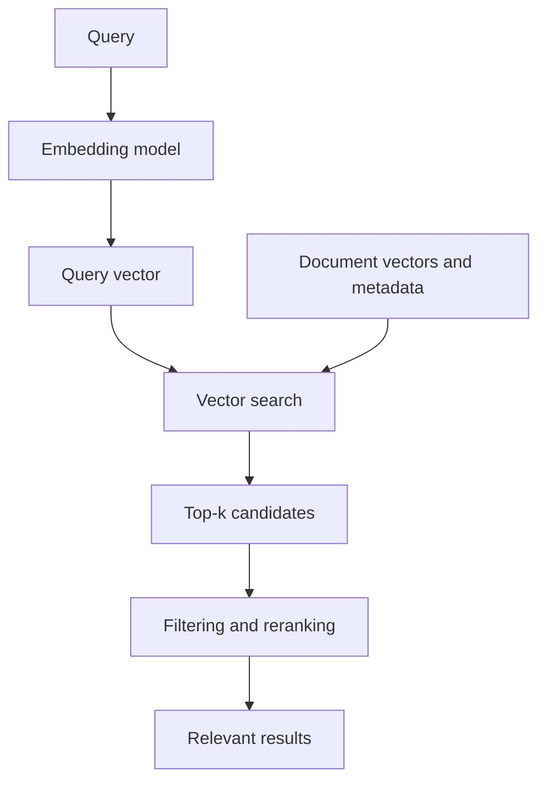

Vector search is a retrieval technique that finds vectors near a query vector according to a defined similarity or distance measure. In context-engineering systems, it is one mechanism for selecting information that may be relevant to the current task.

Vector search is not synonymous with semantic search, RAG, or a vector database. Keeping those boundaries clear makes retrieval systems easier to design and evaluate.

## The Conceptual Boundaries

| Concept         | Role                                             |
| --------------- | ------------------------------------------------ |
| Embeddings      | Represent information                            |
| Vector Search   | Retrieve similar representations                 |
| Semantic Search | Retrieve information based on meaning            |
| Hybrid Search   | Combine semantic/vector and lexical retrieval    |
| Reranking       | Improve candidate ordering                       |
| RAG             | Supply retrieved knowledge to a generative model |
| Vector Database | Store, index, filter, and serve vectors at scale |

[Embeddings](../../foundation-models/embeddings/) create vector representations. Vector search compares those representations. Semantic search is a broader search capability: it may use vector search, but it can also use lexical search, metadata, query understanding, knowledge graphs, reranking, or combinations of these signals. [RAG](../rag/) uses retrieved information as model context and does not require vector search.

A **vector database** is infrastructure for persisting, indexing, filtering, managing, and serving vectors at production scale. Some general-purpose databases and search engines also provide vector indexes. The capability and the product category should not be collapsed: vector search can run without a specialized vector database, and a vector database provides more than the search operation itself.

## Retrieval Flow

At query time, the system applies a compatible embedding model to the query, searches the indexed document or item vectors, and returns candidates. Filtering and reranking may then incorporate information not captured by vector similarity.

Query and document vectors must belong to compatible embedding spaces. Some models use the same encoder and representation strategy for both; others are trained with asymmetric query and document roles.

Some embedding models are trained with a short label prepended to the input to identify its role or intended task. This is a **task prefix**. For example, a retrieval request may receive a query prefix while indexed passages receive a document prefix, telling the model which side of the retrieval relationship the same text occupies. A model may also define prefixes that distinguish retrieval from classification, clustering, or semantic-similarity tasks.

The required strings and how they are applied are model-specific, and some models require no prefix. Systems must use the model's specified format consistently during both document indexing and query generation. Omitting a required prefix, reversing query and document roles, or mixing formats from different model versions can still produce vectors while degrading the geometry the model learned for retrieval. Prefixes, preprocessing rules, and encoder paths should therefore be versioned with the embedding model and included in retrieval evaluation.

## Nearest-Neighbor Search

Vector search is commonly formulated as **nearest-neighbor search**: find the indexed vectors closest to the query under cosine similarity, dot product, Euclidean distance, or another model-compatible measure. A system usually returns the best **top-k** candidates rather than every item above a threshold.

**Exact nearest-neighbor search** compares the query with every candidate, or otherwise guarantees the true nearest results. It is straightforward and useful for smaller datasets, validation, and high-accuracy workloads, but its cost grows with corpus size and dimensionality.

**Approximate nearest-neighbor (ANN) search** trades some recall for lower latency and resource use. ANN indexes avoid examining every vector and expose tuning choices that affect memory, build time, query latency, and the probability of finding the true nearest neighbors.

Representative index families include **HNSW**, which organizes vectors as a navigable multilayer graph, and **IVF**, which partitions the space into coarse regions and searches selected partitions. These names describe indexing strategies, not complete retrieval architectures. Their parameters should be chosen through workload-specific measurement rather than copied from generic defaults.

## Filtering, Hybrid Search, and Reranking

Similarity alone is rarely enough for production retrieval. **Metadata filtering** restricts candidates by properties such as tenant, permission, language, content type, product, region, or time. Security filters are authorization controls and must not be treated as optional relevance hints. Whether filtering happens before, during, or after ANN search affects both correctness and performance.

**Hybrid search** combines vector or semantic signals with lexical retrieval. Lexical search remains strong for exact names, identifiers, error codes, and rare terms; vector search often helps with paraphrases and conceptual relationships. Combining scores or candidate sets can improve coverage, but requires calibration because the signals do not naturally share a scale.

**Reranking** applies a more expensive or context-aware model to a smaller candidate set. A cross-encoder, learning-to-rank model, business rule, recency signal, or authority score can reorder results after initial retrieval. Reranking can improve precision, but cannot recover relevant material that candidate generation never returned.

## Recall, Latency, and Relevance

Search infrastructure exposes a recall-latency trade-off. More exhaustive probing, larger candidate sets, or higher ANN search parameters can improve the chance of finding relevant items while increasing latency and compute. Index construction, memory, update frequency, and filtering behavior add further trade-offs.

ANN **recall** measures how closely approximate results match exact nearest neighbors. That is an infrastructure metric, not a complete measure of user relevance. The nearest vectors may still be poor answers if the embedding model, chunking, corpus, or query interpretation is unsuitable.

Retrieval quality should be evaluated end to end with representative queries and judged results. Common measures include recall at k, precision at k, mean reciprocal rank, normalized discounted cumulative gain, and success measures tied to the application. Evaluation sets should include exact terminology, paraphrases, ambiguous queries, permission boundaries, stale content, and cases where no satisfactory result exists.

Useful diagnosis separates stages:

- If relevant material is absent from the index, retrieval cannot find it.
- If exact search ranks it poorly, examine embeddings, segmentation, metadata, and the relevance definition.
- If exact search succeeds but ANN misses it, tune or replace the index strategy.
- If candidates are relevant but ordered poorly, improve score fusion or reranking.
- If retrieval is good but generated output is unsupported, examine context assembly and model behavior in the RAG layer.

## Operational Considerations

Indexes must evolve with their source data and [embedding](../../foundation-models/embeddings/) versions. Insertions, updates, deletions, permission changes, and re-embedding need defined propagation and consistency expectations. A stale vector can retrieve deleted or outdated content even when the source system is correct.

Production systems should record the query transformation, embedding and index versions, filters, candidate identifiers, scores, reranking results, latency, and access decisions needed to explain retrieval behavior. Logs should avoid exposing sensitive query or document content unnecessarily.

Capacity planning includes vector count, dimensions, index overhead, replication, build time, update rate, memory residency, and query concurrency. Specialized vector databases may help operate these concerns, while relational databases, search engines, or application-local indexes may be sufficient for other workloads. The architectural choice should follow scale, filtering, consistency, operational, and governance requirements.

## Relationship to RAG

Vector search can supply evidence candidates to a RAG pipeline, but it is only one retrieval option. A dependable pipeline may combine lexical and vector retrieval, knowledge-graph traversal, metadata rules, reranking, permission checks, and context assembly. Vector similarity does not establish that evidence is current, authoritative, permitted, or sufficient.

This distinction preserves a useful sequence: embeddings represent information; vector search retrieves similar representations; semantic and hybrid search assemble broader search capabilities; and RAG supplies selected evidence to a generative model.

## Summary

Vector search answers the question: **How do we retrieve information by comparing vector representations?** It uses nearest-neighbor methods, compatible similarity metrics, and exact or approximate indexes to produce candidates. Semantic search is broader, hybrid search combines signals, reranking improves candidate order, RAG uses retrieved evidence as context, and vector databases provide infrastructure for operating vectors at scale.
