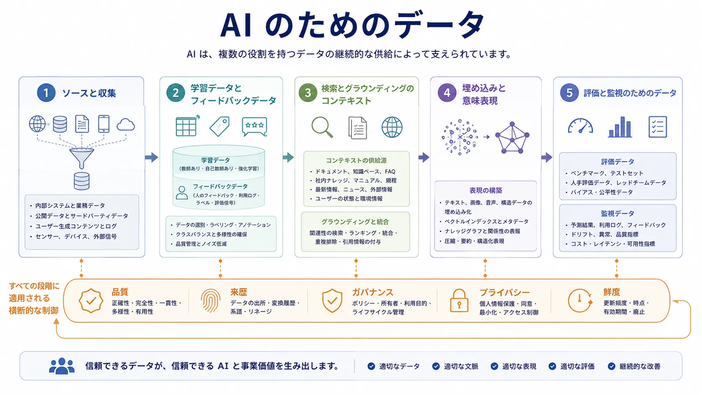

データは、あらゆる AI システムの背後にある情報供給チェーンです。モデルを学習させ、応答に根拠を与え、評価を形作り、ガバナンスを支え、世界の変化に対して出力を有用に保ちます。現代の AI では、データはモデル入力であるだけでなく、実行時コンテキスト、証拠、制御入力、測定の基盤でもあります。

## 定義

AI のためのデータとは、AI のライフサイクル全体にわたる学習、適応、検索、評価、ガバナンスを支える情報資産と情報フローの総体です。データセット、ラベル、メタデータ、埋め込み、検索文書、合成データ、人からのフィードバック、運用上の測定値を含みます。

重要なのは、AI システムが1つの巨大な学習コーパスではなく、異なる目的のための複数種類のデータに依存することです。

## なぜ重要か

データ品質、構造、来歴、鮮度は、能力とリスクの両方を形作ります。実行時コンテキストが古い、評価データセットが重要な失敗モードを隠す、検索コーパスに信頼性の低い情報が含まれるといった場合、よく学習されたモデルでも失敗します。逆に、多くの改善はモデル変更ではなく、よりよいデータ設計から得られます。

このため、データアーキテクチャと AI アーキテクチャは密接に結び付きます。

## AI における主なデータの役割

以下の役割は、異なるデータ資産が AI システムの各部分へどのように寄与するかを示します。

| データの役割                         | 支えるもの                   | 典型的な結果                         |
| ------------------------------------ | ---------------------------- | ------------------------------------ |
| 学習・事前学習データ                 | 一般的な能力の学習           | より広い、または強いモデルの振る舞い |
| ラベルと人からのフィードバック       | 目標との整合と補正           | 意図したタスクへの適合               |
| 検索とグラウンディングのコンテキスト | 実行時の関連性と事実的な根拠 | より正確な領域固有の応答             |
| 埋め込みと意味表現                   | 類似検索と順位付け           | 検索、クラスタリング、発見の改善     |
| 評価・ベンチマークデータ             | 測定とリグレッション検知     | より信頼できる品質・リリース判断     |

古典的な機械学習は、キュレーションされた学習例とラベルに大きく依存します。基盤モデルのシステムでは、大規模な事前学習コーパスに加え、指示データ、選好データ、人によるレビューなど、より狭い適応シグナルが使われます。生成システムでは、実行時の検索がモデル学習と同じほど重要になる場合があります。

メタデータはデータ資産の統制と解釈を支え、埋め込みは意味的な参照と関係の発見を実用化します。これらを組み合わせることで、情報を単なる保存物ではなく、使用可能な AI コンテキストへ変えられます。

## 管理上の主要な関心事

品質は、ノイズ、重複、不整合、弱いラベルが結果に直接影響するため重要です。来歴は、データの出所、適用される権利、信頼性をチームが理解するために必要です。アクセス、プライバシー、保持、分類は運用モデルの一部であるため、ガバナンスも欠かせません。鮮度が重要なのは、支えるデータより世界の変化が速いと多くの AI システムが劣化するためです。

## システム種別による違い

従来の機械学習では、ラベル付き学習セットと予測精度に結び付く指標が重視されます。基盤モデルでは大規模な事前学習データと適応シグナルが重視されます。検索拡張システムでは、グラウンディングコーパスの品質、構造、最新性が中心になります。エージェント的システムでは、プロセス状態、ツール出力、メモリ記録が追加のデータ依存になります。

共通するのは、データ設計がシステムの振る舞いの範囲を大きく決めることです。

## まとめ

AI のためのデータは、モデル中心のシステムを支える完全な情報パイプラインです。能力、コンテキスト、評価、ガバナンスを同時に可能にします。その役割を理解すると、能力があるだけでなく、最新で、説明可能で、運用上も信頼できる AI システムを設計しやすくなります。
