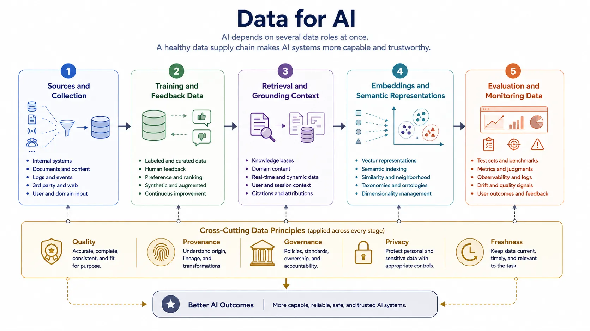

Data is the information supply chain behind every AI system. It trains models, grounds responses, shapes evaluation, supports governance, and determines whether outputs remain useful as the world changes. Treating data as only model input is therefore too narrow. In modern AI systems, data is also runtime context, evidence, control input, and measurement substrate.

This broader view matters because many AI failures are data failures before they become model failures. Weak provenance, poor coverage, stale retrieval sources, inconsistent labeling, or unclear rights can all distort system behavior long before anyone starts tuning the model.

## Definition

Data for AI is the full set of information assets and information flows that support learning, adaptation, retrieval, evaluation, and governance across the AI lifecycle. It includes datasets, labels, metadata, embeddings, retrieved documents, synthetic data, human feedback, and operational measurements.

The central point is that AI systems depend on several kinds of data for several different purposes, not one monolithic training corpus.

## Why It Matters

Data quality, structure, provenance, and freshness shape both capability and risk. A well-trained model can still fail if the runtime context is stale, the evaluation dataset hides important failure modes, or the retrieval corpus contains low-trust information. Conversely, many system improvements come from better data design rather than from changing the model.

This is why data architecture and AI architecture are closely linked.

## Topic Pages





## Differences Across AI System Types

Traditional ML systems often emphasize labeled training sets and performance metrics tied to prediction accuracy. Foundation-model systems emphasize large-scale pretraining data and adaptation signals. Retrieval-augmented systems emphasize the quality, structure, and currentness of the grounding corpus. Agentic systems add process state, tool outputs, and memory records as additional data dependencies.

The pattern across all of them is that data design determines much of the system’s behavior envelope.

## Relationship to Neighboring Topics

AI infrastructure determines how data moves, stores, and scales. Generative AI depends on data for grounding and context. Responsible AI depends on data provenance, rights, fairness, and auditability. Data for AI therefore sits near the center of the broader AI landscape.

## Summary

Data for AI is the full information pipeline behind model-centric systems. It enables capability, context, evaluation, and governance at once. Understanding those roles makes it easier to design AI systems that are not only capable, but also current, explainable, and operationally trustworthy.
