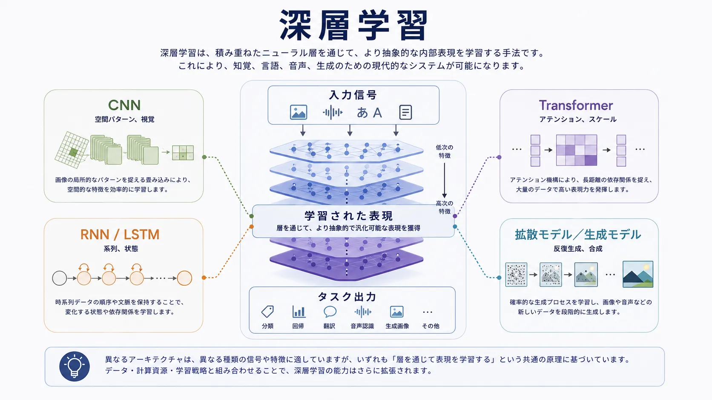

深層学習は、表現学習を大規模に実用化することで AI を大きく変えました。以前の機械学習では、手作業で作った特徴量とタスク固有のパイプラインに大きく依存していました。深層ニューラルネットワークは、生データまたは軽く処理したデータから、層状の内部表現を学ぶことで、その負担の多くをモデルへ移します。

画像、音声、コード、自然言語には、明示的に記述しにくい、豊かで階層的かつ文脈依存の構造があります。深層学習はこの構造をより効果的に取り込む方法を提供しました。

## 定義

深層学習は、多層ニューラルネットワークに基づく機械学習のアプローチ群です。これらのモデルは、入力データを予測、分類、生成、制御、検索に役立つ表現へ段階的に変換する、内部変換の列を学習します。

「深層」とは、この変換過程に含まれる層の数を指します。深さにより、浅い表現では扱いにくい複雑なパターンを表現できます。

## 分野を変えた理由

深層学習の主要な貢献は、単にベンチマークの得点を上げたことではありません。大規模な非構造化データから特徴を自動で学べるようにしたことです。画像認識や音声処理を実用化し、後には大規模な言語モデルとマルチモーダルモデルを可能にしました。

より大きいデータセット、性能の高いアクセラレータ、スケール可能な学習手法という3つの条件がこの変化を強めました。ニューラルネットワークは有望な手法から、現代の AI システムの多くを支える基盤へ変わりました。

## 中核概念

### パラメータと学習シグナル

深層学習システムには、多数の調整可能なパラメータがあります。学習では、誤差を減らす、または学習目的を改善するようにこれらを更新します。ルールを人間が読める形で保存するのではなく、振る舞いは学習された重み全体に分散して表されます。

### 学習された内部表現

深層学習の力は中間表現にあります。低い層は局所的・単純な構造を捉え、より深い層は抽象的なパターンを捉えます。言語では構文、意味、文脈上の関係、視覚ではエッジ、物体、構図などがこれに当たります。

### 汎化とスケール

中心的な目標は汎化です。学習された表現が学習例を超えて転用できるとき、深層モデルは有用になります。大きなデータで学習した大きなモデルは、より汎用的で再利用可能な内部構造を学ぶことがありますが、その分コストと運用の複雑さも増します。

## 主なアーキテクチャ群

| アーキテクチャ | 得意とする領域 | 代表的なシグナル | 強み | 主な制約 |
| --- | --- | --- | --- | --- |
| CNN | 空間的な知覚 | 画像、グリッド | 局所パターンの学習 | 長距離の系列構造は得意ではない |
| RNN と LSTM | 系列の状態追跡 | 時系列、音声、テキスト | 順序と時間依存を扱う | 長い文脈へスケールしにくい |
| Transformer | アテンションによる系列モデリング | 言語、コード、マルチモーダル入力 | 並列学習と長距離の関係 | 計算・メモリのコストが高い |
| オートエンコーダ | 圧縮と再構成 | 潜在構造 | 特徴学習、異常検知 | 単独で完全なタスク系になりにくい |
| 拡散モデル | 反復的な生成 | 画像、音声、マルチモーダル出力 | 高品質な生成と制御可能な合成 | 推論が高コストでパイプラインが複雑 |

CNN は局所的な空間構造を効率よく利用するため、画像タスクで重要になりました。RNN と LSTM は順序と状態を扱い、初期の言語・音声システムで中心的でした。Transformer は再帰構造をアテンションに置き換え、長い系列の関係と大規模な並列学習を可能にしました。拡散モデルなどの生成アーキテクチャは、深層学習が分類や予測だけでなく、制御された合成にも使われることを示しています。

## 強みと限界

深層学習は、豊かな非構造化データ、非線形な関係、転用可能な表現が必要な問題に強みがあります。高い能力の知覚、生成、順位付け、マルチモーダル推論を支えられます。

一方で、学習と推論は計算集約的です。大規模モデルの内部を直接解釈することは難しく、データ品質の問題はモデルの振る舞いにも拡大します。高い能力が、本番ワークフローにおける制御可能性や信頼性を保証するわけではありません。

## 基盤モデルとの関係

基盤モデルは、特に Transformer と大規模な表現学習のパターンを含む深層学習アーキテクチャの上に構築されます。深層学習を置き換えるものではなく、その主要な成果の1つです。大規模に学習した深いアーキテクチャから、広く再利用できる能力が生まれます。

## まとめ

深層学習は、現代の AI の多くを支えるニューラルな中核です。その重要性は、特定のモデル群ではなく、表現学習、スケール、アーキテクチャの柔軟性にあります。各アーキテクチャ群とトレードオフを理解すると、基盤モデル、生成システム、マルチモーダルアプリケーションの仕組みを考えやすくなります。
