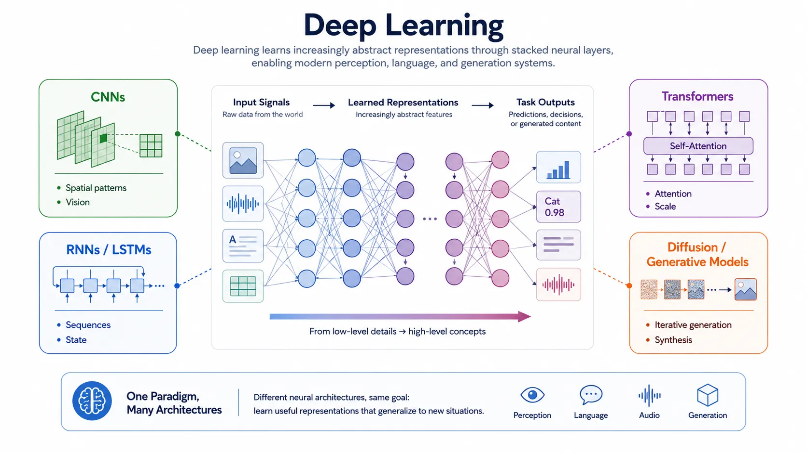

Deep learning changed AI by making representation learning practical at large scale. Earlier machine-learning systems often depended heavily on hand-crafted features and task-specific pipelines. Deep neural networks shifted more of that burden into the model itself by learning layered internal representations from raw or lightly processed data.

That shift matters because many high-value AI tasks involve signals that are hard to describe explicitly. Images, audio, code, and natural language contain structure that is rich, hierarchical, and context-dependent. Deep learning gave the field a way to absorb that structure more effectively.

## Definition

Deep learning is the family of machine-learning approaches built on multilayer neural networks. These models learn a sequence of internal transformations that map input data to increasingly useful representations for prediction, classification, generation, control, or retrieval.

The word "deep" refers to the number of layers involved in that transformation process. In practice, depth matters because it lets the model express more complex patterns than a shallow representation usually can.

## Why Deep Learning Changed the Field

The most important contribution of deep learning was not simply higher benchmark scores. It was the ability to learn features automatically from large-scale unstructured data. That made perception tasks such as image recognition and speech processing far more practical, and later made large-scale language and multimodal modeling possible.

Three conditions reinforced this shift: larger datasets, more capable accelerators, and training techniques that became stable enough to scale. Together, they turned neural networks from a promising method into the dominant substrate for many modern AI systems.

## Topic Pages





## Strengths and Limits

Deep learning is strong when the problem involves rich unstructured data, nonlinear relationships, and the need for transferable representations. It can support high-capability perception, generation, ranking, and multimodal reasoning systems.

Its limits are equally important. Training and inference can be compute-intensive. Large models are hard to interpret directly. Data quality problems scale into model behavior. And high capability does not guarantee controllability or reliability in production workflows.

## Relationship to Foundation Models

Foundation models are built on deep-learning architectures, especially transformers and large-scale representation learning patterns. They do not replace deep learning as a concept. They are one major outcome of it: broad reusable models whose capabilities emerge from deep architectures trained at large scale.

## Summary

Deep learning is the neural core of much of modern AI. Its importance comes from representation learning, scale, and architectural flexibility rather than from any single model family. Understanding the main architecture families and their tradeoffs makes it easier to understand why foundation models, generative systems, and multimodal applications work the way they do.
