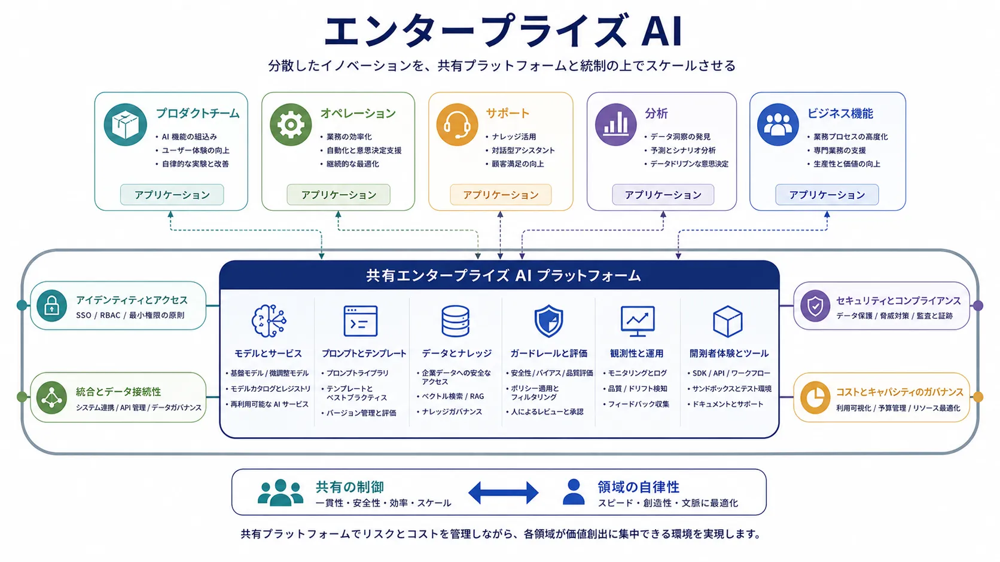

エンタープライズ AI は、孤立した AI の能力を大規模組織の現実の中で運用するときに生じる領域です。プロトタイプだけでは足りません。システムは既存のプラットフォーム、アイデンティティモデル、ガバナンス制御、調達上の制約、リスクポリシー、コスト管理の方法と統合する必要があります。

課題はモデルが何をできるかだけではありません。その能力を、多数のチームと領域で、繰り返し、安全に、経済的に採用する方法です。

## 定義

エンタープライズ AI は、共有プラットフォーム、ガバナンス、統合パターン、運用モデルを通じて、組織規模で AI の能力を採用・運用する分野です。AI を孤立した実験の集合ではなく、管理可能な組織能力にすることへ焦点を置きます。

組織規模になると設計問題が変わるため、この用語が役立ちます。

## なぜ重要か

個別のチームなら、局所的な判断と狭い制御で、能力ある AI 機能を出荷できることがあります。しかし大規模組織は、そのやり方をどこにでも適用できません。共有のアクセスパターン、承認済みの提供者・プラットフォーム、コストガバナンス、セキュリティ制御、繰り返し可能なレビュー手続きが必要です。これらがなければ採用はすぐに分断されます。

ガバナンスが弱いと、重複、不整合、管理されない露出のリスクが、得られる利益より速く拡大します。

## 中核となる関心事

| 関心事 | アーキテクチャ上の帰結 |
| --- | --- |
| プラットフォーム戦略 | 中央サービス、連合型プラットフォーム、チームごとの選択のどれで能力を共有するかを決める |
| 統合パターン | AI をアイデンティティ、ナレッジ、基幹業務システム、ワークフローエンジンへ接続する方法を形作る |
| アイデンティティとアクセス | どの条件で誰がどのモデル、ツール、データを使えるかを定める |
| セキュリティとコンプライアンス | レビュー、ログ、分離、ポリシー強制の要件を生む |
| コストとキャパシティのガバナンス | 利用制御、キャッシュ、クォータ、サービス階層への注意を促す |
| 運用モデルと所有 | 共有能力を構築、運用、レビュー、支援するチームを決める |

多くの企業には、集中型か連合型かを問わず、何らかの共有 AI プラットフォームが必要です。承認済みのモデルアクセス、検索インフラストラクチャ、ポリシー制御、可観測性、再利用可能なコネクタが共通サービスになります。AI 機能は内部データ、アイデンティティ文脈、運用ワークフローに依存するため、統合も重要です。

## アイデンティティ、セキュリティ、コスト

エンタープライズ AI をアイデンティティとアクセス設計から切り離すことはできません。権限、テナント分離、承認境界、監査可能性が、システムを信頼できるかを決めます。コストガバナンスも同様に重要です。クォータやルーティングポリシーなしに広い社内アクセスを許すと、AI の利用は予想より速く拡大します。

## 集中化と連合

エンタープライズ AI には通常、共有の制御と領域の自律性の均衡が必要です。集中化しすぎると提供が遅くなり、領域チームがローカルなワークフローを有効に形作れません。分散しすぎると、制御の不一致、インフラストラクチャの重複、弱いガバナンスにつながります。

実務的な目標は、共有プラットフォームとポリシーを、特定アプリケーションとコンテキストの領域レベルの所有と組み合わせる、連合型の有効化であることが多いです。

## よくある失敗パターン

分断されたツールはコストを重複させ、セキュリティを不整合にします。公式プラットフォームが遅すぎる、または制限が強すぎると、シャドー AI の利用が生じます。所有が不明確だとインシデントを解決しにくくなります。多数のチームが独立して利用を拡大すると、管理されない支出が戦略上の問題になります。これらは組織の失敗ですが、アーキテクチャの問題として現れます。

## まとめ

エンタープライズ AI は、AI 導入のための組織アーキテクチャです。散在したモデル利用を、統制され、統合され、再利用可能な能力へ変えることが目的です。そのためには共有プラットフォーム、明確な制御パターン、集中化と連合の意図的なバランスが必要です。
