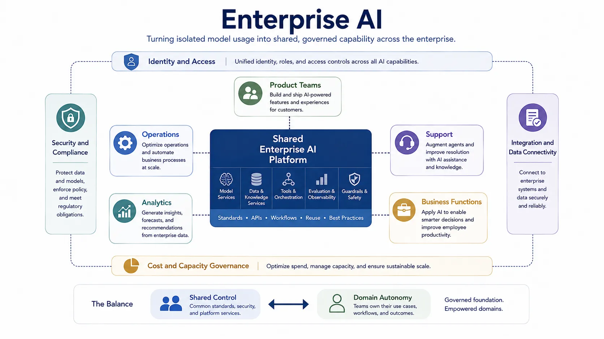

Enterprise AI is what happens when isolated AI capability has to operate inside the realities of a large organization. Prototypes are no longer enough. Systems must integrate with existing platforms, identity models, governance controls, procurement constraints, risk policies, and cost management practices.

This makes enterprise AI a distinct topic from model innovation alone. The challenge is not only what the model can do. It is how the organization can adopt that capability repeatedly, safely, and economically across many teams and domains.

## Definition

Enterprise AI is the discipline of adopting and operating AI capabilities at organization scale through shared platforms, governance, integration patterns, and operating models. It focuses on how AI becomes a manageable institutional capability rather than a collection of isolated experiments.

The term is useful because organizational scale changes the design problem.

## Why Enterprise AI Matters

An individual team can often ship a capable AI feature with local decisions and narrow controls. A large organization cannot rely on that model everywhere. Different teams need shared access patterns, approved providers or platforms, cost governance, security controls, and repeatable review processes. Without those, AI adoption fragments quickly.

Enterprise AI matters because the risks of duplication, inconsistency, and unmanaged exposure scale faster than the benefits when governance is weak.

## Topic Pages





## Relationship to Applications

Enterprise AI creates the conditions under which many domain-specific applications can exist safely and repeatably. It does not replace application design. It provides the platform, controls, and operating model that let application teams move faster without re-solving the same trust and integration problems every time.

## Summary

Enterprise AI is the organizational architecture of AI adoption. Its purpose is to turn scattered model usage into governed, integrated, reusable capability across the enterprise. That requires shared platforms, clear control patterns, and a deliberate balance between centralization and federation.
