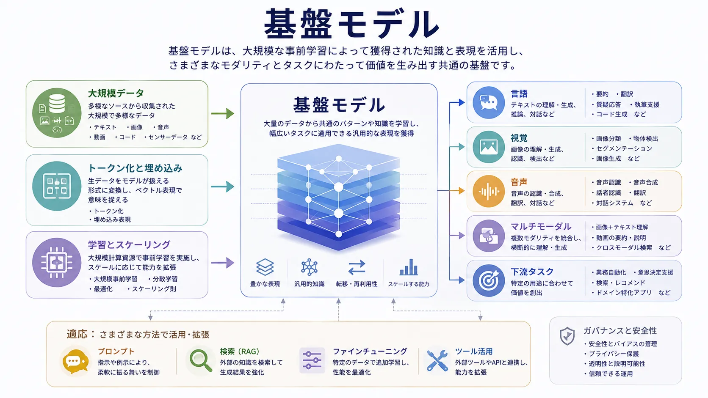

基盤モデルは、広く再利用できる能力と狭いアプリケーションロジックを分けることで、AI システム設計の形を変えました。下流タスクごとに別のモデルを学習する代わりに、大規模に事前学習した基盤から始め、プロンプト、検索、チューニング、ワークフローの構成で適応できます。

この変化はモデル選択にとどまりません。プラットフォーム、インターフェース、評価、セキュリティ、コスト、ガバナンスの考え方にも影響します。モデルが再利用可能な能力レイヤーになるほど、周辺システムが制御と用途適合性により大きな責任を持つようになります。

## 定義

基盤モデルは、1つの狭く定義された機能ではなく、多数の下流タスクを支えるために学習された、広範で再利用可能なモデル基盤です。価値の源泉は転移にあります。モデル群を最初から作り直さずに、異なる用途へ適応・誘導できます。

この用語は大きさだけでなく役割を強調します。複数のアプリケーション、ワークフロー、プロダクトの一般的な土台になるとき、そのモデルは基盤として重要です。

## なぜ重要か

基盤モデルは能力を再利用可能なレイヤーに圧縮します。検索拡張、要約、質問応答、コード支援、意味的な類似度のために別々のモデルを一から学習する代わりに、既存のモデル基盤を再利用し、適応と制御に集中できます。

その結果、ツール、評価手法、ゲートウェイ、検索システム、運用プラクティスが、共通の再利用可能なモデルインターフェースを中心に組織されるという強いエコシステム効果が生まれます。

## 主なモデル群

以下のモデル群はモダリティと用途が異なりますが、いずれも下流システムの再利用可能な基盤になり得ます。

| モデル群             | 主なモダリティ                   | 典型的な用途                           | 基盤となる理由                       |
| -------------------- | -------------------------------- | -------------------------------------- | ------------------------------------ |
| 大規模言語モデル     | テキストとコードのトークン       | 生成、推論支援、抽出、対話             | 言語中心の多くのタスクに再利用できる |
| 視覚モデル           | 画像と視覚特徴                   | 分類、検出、視覚理解                   | 視覚表現を転移できる                 |
| 音声モデル           | 音声シグナル                     | 文字起こし、音声理解、音声対話         | 音響・言語構造を再利用できる         |
| コードモデル         | ソースコード、技術テキスト       | 補完、説明、変換、レビュー             | プログラミング作業へ転移できる       |
| マルチモーダルモデル | テキスト、画像、音声、動画の混合 | モダリティ横断の理解・生成             | モダリティをまたぐ表現を共有できる   |
| 埋め込みモデル       | 意味ベクトル                     | 検索、クラスタリング、順位付け、類似度 | 直接生成ではなく表現を再利用できる   |

言語とコードのモデルは、説明、抽出、下書き、質問応答、構造化変換を通じて多くの業務フローに適用できるため、特に注目されています。視覚、音声、マルチモーダルのモデルも、知覚が中心となる領域では同様に重要です。埋め込みモデルは直接の生成よりも検索と順位付けを支え、意味的な検索、クラスタリング、グラウンディングを実用化します。

## 中核となる概念

**事前学習**は、大規模データへの接触と自己教師ありの目的を通じて、モデルに広い初期能力を与えます。

**トークン化**は、計算のために入力の流れをどのように分割するかを決めます。モデルは人間と同じ単位でテキスト、コード、その他の入力を見ているわけではありません。

**埋め込み**は、意味上の関係を符号化する学習済み表現であり、検索と下流タスクへの再利用を支えます。

**適応**には、プロンプト、ファインチューニング、指示チューニング、ワークフロー構成が含まれます。汎用モデルを、境界のある運用文脈で有用にする過程です。

**インコンテキスト利用**は、必要ごとに基盤モデルを再学習するのではなく、指示、例、検索文書、ツール、セッション状態によって実行時に誘導することです。

## アーキテクチャへの影響

基盤モデルは、周辺レイヤーへより多くのシステム責任を移します。モデルの知識は広くても最新または領域固有とは限らないため、検索が重要になります。振る舞いはプロンプト、コンテキスト、ツールアクセス、モデル版に依存するため、評価は複雑になります。柔軟で決定的ではないため、制御レイヤーの重要性も高まります。

その結果、アプリケーションアーキテクチャは、ゲートウェイ、オーケストレーション、検索システム、安全制御、キャッシュ、可観測性、ライフサイクルガバナンスへ重心を移します。

## 生成 AI との関係

基盤モデルは再利用可能な土台であり、生成 AI はその土台の上に作る広いアプリケーションパターンです。基盤モデルは生成、検索支援、分類、変換を支えられます。生成 AI は、それらの能力を対話的または出力を生むシステムへ組み立てる方法を表します。

## まとめ

基盤モデルは、多数の下流タスクへ適応できる、広く再利用可能な能力レイヤーです。本質的な意義は規模だけでなく、アプリケーション設計、プラットフォームの責任、運用上の制御を再編する点にあります。
