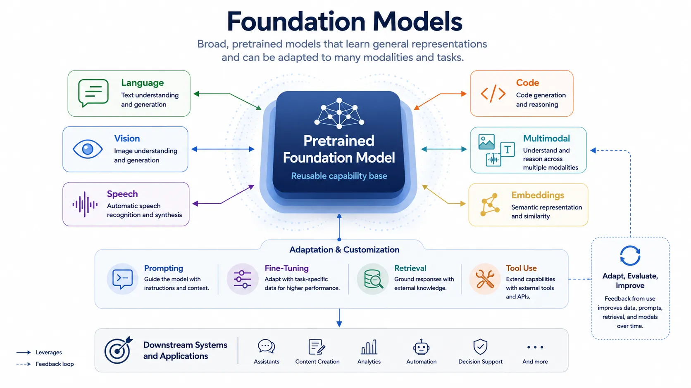

Foundation models changed the shape of AI system design by separating broad reusable capability from narrow application logic. Instead of training a distinct model for every downstream task, organizations can start from a large pretrained base and adapt it through prompting, retrieval, tuning, or workflow composition.

That shift affects more than model selection. It changes how teams think about platforms, interfaces, evaluation, security, cost, and governance. Once a model becomes a reusable capability layer, the surrounding system takes on a larger share of the responsibility for control and fit.

## Definition

Foundation models are broad, reusable model bases trained to support many downstream tasks rather than one narrowly defined function. Their value comes from transfer. A single model family can be adapted or guided for different uses without rebuilding everything from scratch.

The term is useful because it highlights role rather than only size. A model matters as a foundation when it becomes a general substrate for multiple applications, workflows, or products.

## Why They Matter

Foundation models matter because they compress capability into a reusable layer. Instead of training separate models for search expansion, summarization, question answering, code assistance, or semantic similarity from first principles, teams can often reuse an existing model base and focus on adaptation and control.

This creates strong ecosystem effects. Tooling, evaluation methods, gateways, retrieval systems, and operational practices increasingly organize themselves around common reusable model interfaces.

## Main Model Families

| Model family          | Main modality                      | Typical use                                                | What makes it foundational                            |
| --------------------- | ---------------------------------- | ---------------------------------------------------------- | ----------------------------------------------------- |
| Large language models | Text and code tokens               | Generation, reasoning assistance, extraction, conversation | Reusable across many language-centered tasks          |
| Vision models         | Images and visual features         | Classification, detection, visual understanding            | Transferable visual representations                   |
| Speech models         | Audio and speech signals           | Transcription, speech understanding, voice interaction     | Reusable acoustic and linguistic structure            |
| Code models           | Source code and technical text     | Completion, explanation, transformation, review            | Transfer across programming tasks                     |
| Multimodal models     | Mixed text, image, audio, or video | Cross-modal understanding and generation                   | Shared representations across modalities              |
| Embedding models      | Semantic vectors                   | Retrieval, clustering, ranking, similarity                 | Reusable representation rather than direct generation |

### Language and Code Models

Language and code models became especially prominent because text interfaces are broadly applicable. Many business workflows can be mediated through explanation, extraction, drafting, question answering, or structured transformation.

### Vision, Speech, and Multimodal Models

Other modalities matter just as much in domains where perception is central. Vision supports inspection, classification, detection, and interpretation of images or video. Speech supports transcription and voice interaction. Multimodal models matter when systems must coordinate across several types of signal at once.

### Embedding Models

Embedding models deserve separate attention because they often support retrieval and ranking rather than direct generation. They turn inputs into semantic vectors that make similarity search, clustering, and grounding workflows practical.

## Core Enabling Concepts

**Pretraining** gives the model broad initial capability through large-scale exposure to data and self-supervised objectives.

**Tokenization** defines how the input stream is segmented for computation. This matters because the model does not see text, code, or other input in the same way a human does.

**Embeddings** provide learned representations that encode semantic relationships and support reuse across retrieval and downstream tasks.

**Adaptation** includes prompting, fine-tuning, instruction tuning, and workflow composition. Adaptation is how a general model becomes useful in a bounded operational context.

**In-context use** refers to guiding the model at runtime through instructions, examples, retrieved documents, tools, or session state instead of retraining the base model for every need.

## Architectural Implications

Foundation models push more system responsibility into surrounding layers. Retrieval becomes important because model knowledge may be broad but not current or domain-specific enough. Evaluation becomes more complex because behavior depends on prompts, context, tool access, and model version. Control layers become more important because the model is flexible rather than deterministic.

As a result, application architecture shifts toward gateways, orchestration, retrieval systems, safety controls, caching, observability, and lifecycle governance.

## Relationship to Generative AI

Foundation models are the reusable substrate. Generative AI is the broader application pattern built on top of that substrate. A foundation model can power generation, retrieval support, classification, or transformation. Generative AI describes how those capabilities are assembled into interactive or output-producing systems.

## Summary

Foundation models matter because they provide broadly reusable capability layers that can be adapted across many downstream tasks. Their real significance lies not only in scale, but in how they reorganize application design, platform responsibilities, and operational control.
