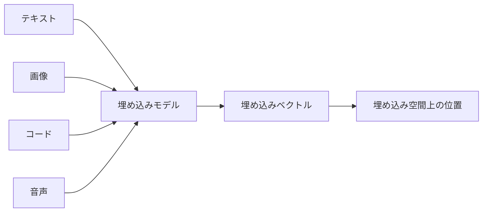
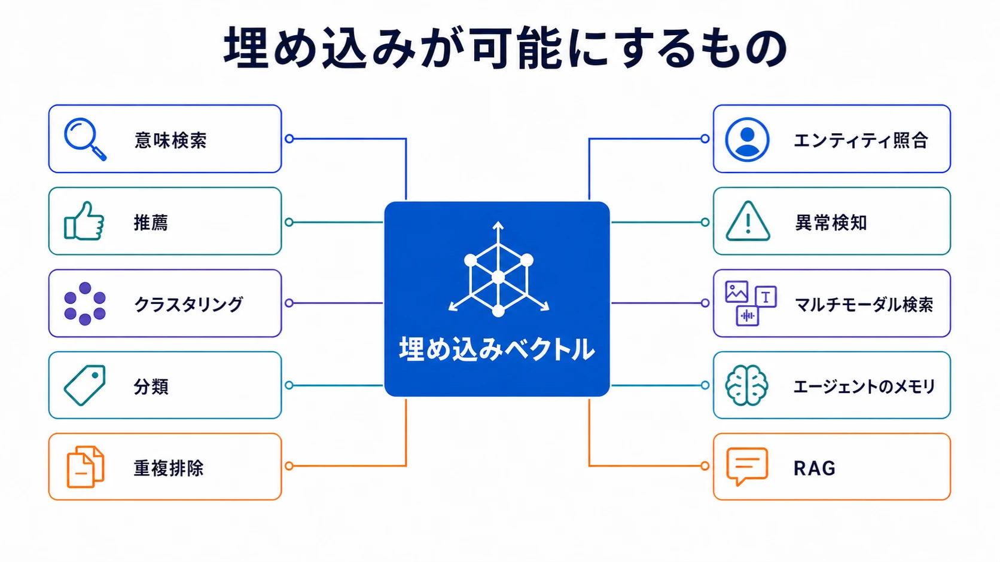

埋め込みとは、情報を学習済みの数値表現に変換したものです。テキスト、画像、コード、音声、エンティティなどの入力を、モデルやアプリケーションにとって有用な関係を位置として表すベクトルへ写像します。これにより、類似する入力をベクトル演算によって比較、グループ化、検索、分類できます。

埋め込みは、検索拡張生成の構成要素だけではなく、表現学習の一般的な技術です。意味検索、推薦、クラスタリング、分類、重複排除、エンティティ照合、異常検知、マルチモーダル検索、エージェントのメモリ、RAG を支えます。

## 情報からベクトルへ

埋め込みモデルは入力を、 **埋め込みベクトル** と呼ぶ順序付きの数値列へ変換します。それぞれの数値は、学習された **埋め込み空間** における座標です。座標の数をベクトルの **次元数** と呼びます。

個々の次元が、人間にとって読み取れる概念に対応するとは限りません。意味はベクトル全体に分散しており、一つの座標よりも空間の幾何学的な構造が重要です。学習目的は、保持すべき関係に従って関連する例を近づけ、関連しない例を遠ざけることで、その構造を形作ります。

埋め込みは、使用したモデル、バージョン、前処理、想定する比較方法との組み合わせによって意味を持ちます。異なるモデルが生成したベクトルは、次元数が偶然同じでも、通常は互換性のある座標系を共有しません。

## モダリティと表現の種類

**テキスト埋め込み** は、文章、クエリ、文、文書を表現し、多くの場合は意味的な類似度や検索に最適化されます。**コード埋め込み** は、ソースコード、自然言語による説明、API、プログラミング上の概念の関係を捉えます。**画像埋め込み** は視覚的な内容を表現し、**マルチモーダル埋め込み** は複数のモダリティを協調した空間に置くことで、たとえばテキストから関連画像を検索できるようにします。

何を一単位として埋め込むかも重要です。文書全体のベクトルは広い主題を捉えられますが、文章単位の検索に必要な詳細を失うことがあります。小さなチャンクは検索粒度を細かくできますが、文脈が失われる場合があります。アプリケーションが表現によって答えたい問いに、分割方法を合わせる必要があります。

現代のニューラル埋め込みの多くは **密な表現** です。多数の次元がゼロでない値を持ち、意味がベクトル全体に分散します。**疎な表現** では大部分の値がゼロで、語や特徴との明示的な対応を保つことがよくあります。従来の語彙表現や学習済みの疎検索モデルは、正確な用語が重要な場合に有効です。密表現と疎表現は、システムによっては代替手段であり、ハイブリッド検索では相互補完するシグナルになります。

## 類似度と距離

ベクトル比較は、幾何学的な関係をアプリケーションで利用できるシグナルへ変えます。適切な尺度は、モデルの学習方法とベクトルの正規化方法に依存します。

| 尺度             | 解釈                                       | 重要な性質                                     |
| ---------------- | ------------------------------------------ | ---------------------------------------------- |
| コサイン類似度   | ベクトル間の角度を比較する                 | 大きさより方向を重視する                       |
| 内積             | 対応する座標を掛け合わせ、その総和を求める | 正規化しない限り、角度と大きさの両方を反映する |
| ユークリッド距離 | 点と点の間の直線距離を測る                 | スケールと大きさの影響を受ける                 |

**正規化** では、ベクトルの長さを一般に1へ揃えます。単位ベクトルでは、コサイン類似度と内積による順位が等しくなり、ユークリッド距離とも直接の関係を持ちます。ただし、正規化が常に有益とは限りません。モデルがベクトルの大きさに有用な情報を意図的に符号化している場合、正規化はそのシグナルを失わせます。モデルの仕様と評価結果に基づいて選択する必要があります。

類似度は、真実、関連性、同一性のいずれとも同じではありません。高いスコアは、特定の表現と尺度において二つのベクトルが近いことを示すだけです。その近さが有用かどうかは、タスク、コーパス、しきい値、後続処理で適用する判定や制御に依存します。

## 埋め込みが可能にするもの

埋め込みは、距離、近傍、境界を扱うアルゴリズムから情報を利用可能にします。

- **意味検索とマルチモーダル検索** は、まったく同じ単語やモダリティを共有しない場合でも、クエリベクトルから関連項目を見つけます。
- **推薦** は、表現のパターンが近い項目や利用者を特定します。
- **クラスタリングと可視化** は、事前にラベルを定めずにグループや構造を明らかにします。
- **分類と異常検知** は、ベクトル空間上の領域や距離をカテゴリや外れ値のシグナルとして使います。
- **重複排除とエンティティ照合** は、表面的な違いがあっても意味や構造が近い記録を特定します。
- **エージェントのメモリと RAG** は、現在の対話に関連する可能性がある過去の記録や外部の根拠を取得します。

[ベクトル検索](../../context-engineering/vector-search/) では、近傍ベクトルを取得する方法を説明します。 [RAG](../../context-engineering/rag/) では、取得した根拠を選択し、モデルのコンテキストとして構成する方法を説明します。どちらの用途も埋め込み全体を定義するものではありません。

## 埋め込みモデルの選択

モデル選択は、一般的なランキングではなく、タスクとデータから始めます。関連する基準には、モダリティ、対応言語、領域固有の語彙、入力長、対応する類似度尺度、出力次元、レイテンシ、スループット、デプロイ制約、ライセンスがあります。同じ形式のテキスト同士の類似度を学習したモデルと、短いクエリを長い文章に対応付けるよう学習したモデルでは、振る舞いが異なります。

次元数にはトレードオフがあります。大きなベクトルは表現能力を高められますが、ストレージ、メモリ帯域、索引サイズ、比較コストを増加させます。小さなベクトルは保存・提供コストを下げますが、アプリケーションに重要な違いを失う場合があります。次元削減や出力の切り詰めに対応するモデルもありますが、実際のタスクに基づく評価は必要です。

医療、法律、金融、ソースコードなどの領域固有の埋め込みは、一般言語の類似性が目的のシグナルではない場合に、重要な区別を改善できます。一方で、対応範囲を狭めたり、領域固有の偏りを持ち込んだりする可能性もあります。実際のワークロードを代表する入力、区別の難しい負例、言語、境界事例で評価します。

## ライフサイクルと運用

埋め込みの生成はデータライフサイクルです。システムは情報源の単位を定め、決定的な前処理と分割を適用し、ベクトルを生成し、情報源とアクセスのメタデータを付与し、出力を検証して、検索索引や後続処理が利用するデータストアへ公開します。クエリ時の前処理は、索引済みコーパスと互換性を保つ必要があります。

保存するベクトルはすべて、埋め込みモデルとそのバージョン、前処理ルール、情報源のバージョン、生成時刻、想定する尺度まで追跡可能にします。これらのいずれかを変更すると、古いベクトルと新しいベクトルを比較できなくなる可能性があります。そのためモデルの更新では、設定をその場で変更するのではなく、統制された **再埋め込み** と再索引が必要になることがあります。

運用上の関心事には、バッチ処理のスループット、オンライン処理のレイテンシ、生成の失敗や部分的完了、機密データの扱い、削除の伝播、索引の鮮度、ストレージ増加、情報源コーパスのドリフトがあります。新しいモデルを比較するときは並行索引またはバージョン付きコレクションを用意し、本番の埋め込み空間を置き換える前にロールバックと切り替えの手順を定めます。

品質評価は用途を反映させます。検索ワークロードには、人手の判断または行動データに基づくクエリと結果の対応、および再現率を重視した指標が必要です。分類とクラスタリングには、それぞれのタスク指標が必要です。ベクトル件数や生成レイテンシの監視は有用ですが、利用者が必要とする区別を表現できていることは証明しません。

## まとめ

埋め込みが答える問いは、 **有用な関係を計算できるように、情報をどのように数値で表現するか** です。埋め込みは、学習目的、次元数、前処理、正規化、比較尺度によって形作られる、モデル固有の空間上の学習済みベクトルです。その用途は検索、推薦、グループ化、照合、異常検知、メモリ、RAG に広がり、信頼できる利用には明示的なモデル選択、評価、バージョン管理、再埋め込みが必要です。
