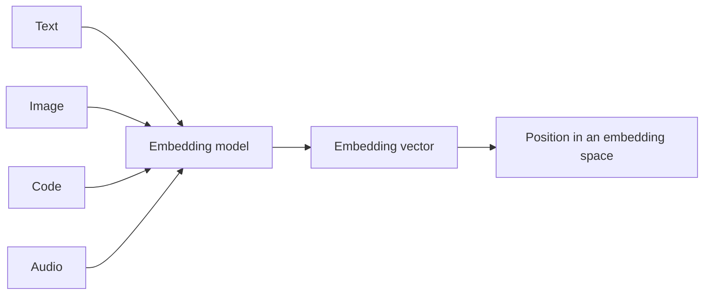
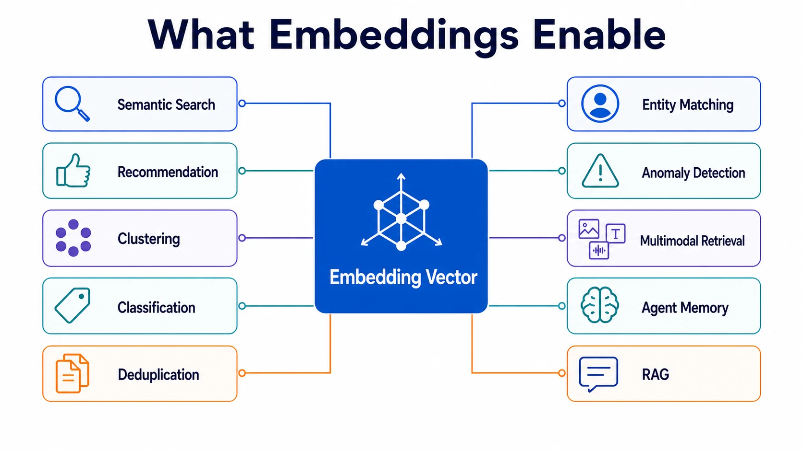

An embedding is a learned numerical representation of information. It maps text, images, code, audio, entities, or other inputs to vectors whose positions capture relationships useful to a model or application. Similar inputs can therefore be compared, grouped, retrieved, or classified through operations on those vectors.

Embeddings are a general representation-learning technique, not merely a component of retrieval-augmented generation. They support semantic search, recommendations, clustering, classification, deduplication, entity matching, anomaly detection, multimodal retrieval, agent memory, and RAG.

## From Information to Vectors

An embedding model transforms an input into an ordered list of numbers called an **embedding vector**. Each number is a coordinate in a learned **embedding space**. The number of coordinates is the vector's **dimensionality**.

Individual dimensions usually do not correspond to human-readable concepts. Meaning is distributed across the vector, and the geometry of the space matters more than any one coordinate. Training objectives shape that geometry by pulling related examples closer together and pushing unrelated examples apart according to the relationships the model is expected to preserve.

An embedding is meaningful only relative to its model, version, preprocessing, and intended comparison method. Vectors produced by different models generally do not share a compatible coordinate system, even when their dimensions happen to match.

## Modalities and Representation Types

**Text embeddings** represent passages, queries, sentences, or documents and are commonly optimized for semantic similarity or retrieval. **Code embeddings** capture relationships among source code, natural-language descriptions, APIs, and programming concepts. **Image embeddings** represent visual content, while **multimodal embeddings** place two or more modalities in a coordinated space so that, for example, text can retrieve related images.

The unit being embedded matters. A document-level vector may capture a broad subject but lose details needed for passage retrieval. Smaller chunks provide finer retrieval granularity but can discard context. Applications should align segmentation with the question they need the representation to answer.

Most modern neural embeddings are **dense**: many dimensions contain nonzero values, and meaning is distributed through the vector. **Sparse** representations contain mostly zero values and often preserve more explicit term or feature associations. Traditional lexical representations and learned sparse retrieval models can be valuable where exact terminology matters. Dense and sparse representations are alternatives in some systems and complementary signals in hybrid retrieval systems.

## Similarity and Distance

Vector comparisons turn geometric relationships into application signals. The appropriate metric depends on how the model was trained and how vectors are normalized.

| Measure            | Interpretation                                     | Important property                                         |
| ------------------ | -------------------------------------------------- | ---------------------------------------------------------- |
| Cosine similarity  | Compares the angle between vectors                 | Emphasizes direction rather than magnitude                 |
| Dot product        | Multiplies corresponding coordinates and sums them | Reflects angle and magnitude unless vectors are normalized |
| Euclidean distance | Measures straight-line distance between points     | Sensitive to scale and magnitude                           |

**Normalization** commonly scales vectors to unit length. For unit-normalized vectors, cosine similarity and dot-product ranking are equivalent, and Euclidean distance has a direct relationship to them. Normalization is not universally beneficial, however. If a model intentionally encodes useful information in vector magnitude, normalizing it removes that signal. The model's documentation and evaluation results should determine the choice.

Similarity is not the same as truth, relevance, or identity. A high score says that two vectors are close according to a particular representation and metric. Whether that closeness is useful depends on the task, corpus, thresholds, and downstream controls.

## What Embeddings Enable

Embeddings make information accessible to algorithms that operate on distances, neighborhoods, and boundaries.

- **Semantic and multimodal search** use a query vector to find related items even when they do not share exact words or modalities.
- **Recommendations** identify items or users with related representation patterns.
- **Clustering and visualization** reveal groups and structure without predefined labels.
- **Classification and anomaly detection** use vector regions or distances as signals for categories and outliers.
- **Deduplication and entity matching** identify records that are semantically or structurally close despite surface differences.
- **Agent memory and RAG** retrieve potentially relevant prior records or external evidence for a current interaction.

[Vector Search](../../context-engineering/vector-search/) explains how systems retrieve nearby vectors. [RAG](../../context-engineering/rag/) explains how retrieved evidence is selected and assembled as model context. Neither use case defines embeddings as a whole.

## Choosing an Embedding Model

Model choice should begin with the task and data rather than a generic leaderboard. Relevant criteria include modality, language coverage, domain vocabulary, input length, supported similarity metric, output dimensions, latency, throughput, deployment constraints, and licensing. A model trained for symmetric text similarity may behave differently from one trained to match short queries with longer passages.

Dimensionality creates trade-offs. Larger vectors can provide more representational capacity, but increase storage, memory bandwidth, index size, and comparison cost. Smaller vectors are cheaper to store and serve, but may lose distinctions important to the application. Some models support dimension reduction or truncated outputs; these still require task-specific evaluation.

Domain-specific embeddings can improve distinctions in fields such as medicine, law, finance, or source code, especially when general-language similarity is not the desired signal. They can also narrow coverage or introduce domain-specific biases. Evaluate them on representative inputs, difficult negatives, languages, and edge cases from the actual workload.

## Lifecycle and Operations

Embedding generation is a data lifecycle. Systems identify source units, apply deterministic preprocessing and segmentation, generate vectors, attach source and access metadata, validate outputs, and publish them to a search index or downstream store. Query-time preprocessing must remain compatible with the indexed corpus.

Every stored vector should be traceable to the embedding model and version, preprocessing rules, source version, generation time, and intended metric. Changing any of these can make old and new vectors incomparable. A model upgrade therefore often requires a controlled **re-embedding** and reindexing process rather than an in-place configuration change.

Operational concerns include batch throughput, online latency, failed or partial generation, sensitive-data handling, deletion propagation, index freshness, storage growth, and drift in the source corpus. Teams should support parallel indexes or versioned collections when comparing a new model, and define rollback and cutover procedures before replacing a production embedding space.

Quality evaluation should reflect the intended use. Retrieval workloads need labeled or behavior-derived query-result judgments and recall-oriented metrics. Classification and clustering need their own task measures. Monitoring vector counts or generation latency is useful, but it cannot establish that the representation preserves the distinctions users need.

## Summary

Embeddings answer the question: **How can information be represented numerically so that useful relationships become computable?** They are learned vectors in a model-specific space, shaped by training objectives, dimensionality, preprocessing, normalization, and comparison metrics. Their value extends across search, recommendations, grouping, matching, anomaly detection, memory, and RAG, while their dependable use requires explicit model selection, evaluation, versioning, and re-embedding practices.
