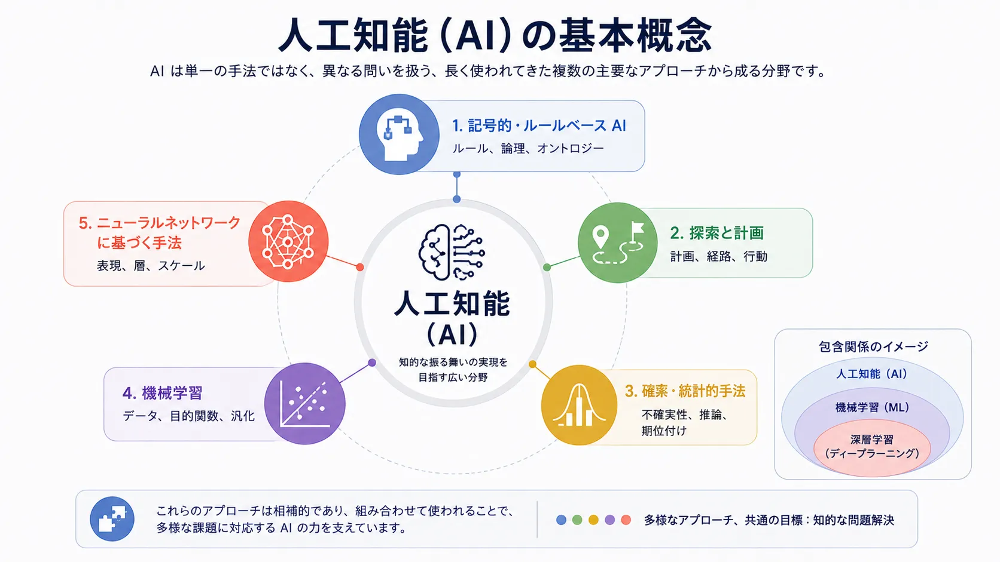

人工知能（AI）は、近年の単一の技術潮流として捉えると誤解しやすい分野です。実際には、知的な振る舞いについて異なる問いを扱う、複数の主要なアプローチから成り立っています。ルールと推論、探索と計画、確率と統計的手法、データからのパターン学習は、それぞれ異なる視点を与えます。

この広い見方が重要なのは、現代の AI システムを1つのアプローチだけで十分に説明できることが少ないためです。検索を用いるアシスタントには、ニューラル言語モデル、確率的な順位付け、記号的なポリシールール、明示的なワークフロー制御が同時に含まれる場合があります。ここで整理する基本概念は、それらの技術要素をナビゲートするための概念地図です。

## 定義

人工知能（AI）は、知覚、推論、学習、生成、意思決定、行動に関わるタスクを実行できるシステムを構築する分野です。特定のアルゴリズム群やモデルアーキテクチャよりも広く、明示的なルール、探索手続き、統計的推論、学習された表現に基づくアプローチを含みます。

この定義は、能力あるシステムの構築には複数の正当な方法があることを示します。AI は機械学習だけではなく、機械学習も深層学習だけではありません。

## 基本概念が重要な理由

チームは、実際にどの AI のアプローチを使っているかを理解すると、よりよい選択を行えます。アクセス制御、コンプライアンス、決定的なワークフロー分岐のようにルールが中心となる領域では、明示的な論理と追跡可能な推論が役立ちます。画像認識や音声文字起こしのように知覚が中心の領域では、学習された表現への依存度が高くなります。推薦や順位付けでは、記号的推論より統計的学習、実験、最適化が重要になることがあります。

この区別がないと、「AI に関する活動をしている」という言葉が分類、生成、検索、予測、ポリシー自動化といった設計上まったく異なる活動を曖昧にまとめてしまいます。

## 主要なアプローチ

### 記号的・ルールベース AI

記号的 AI は、ルール、論理、オントロジー、状態記述によって知識を明示的に表現します。概念が安定し、制約が明確で、監査可能性が求められる領域に適しています。エキスパートシステム、ルールエンジン、形式推論システムが代表例です。

強みは明瞭さです。どのルールを適用したか、なぜ結論に至ったかを説明しやすくなります。一方、自然言語、画像、ノイズを含む行動パターンのような豊かなシグナルを、明示的なルールとして漏れなく表現することは困難です。

### 探索と計画

探索を中心とする AI は、目標に到達するための状態や行動を探索します。計画システム、ゲームを行うエージェント、経路最適化、スケジューリングはこの考え方を利用します。問うのは何が真であるかだけでなく、制約の下でどの行動列を選ぶべきかです。

言語モデルが中間的な推論やツール選択に用いられる場合でも、多くのエージェント的システムは計画の考え方に依存しています。

### 確率・統計的手法

確率的 AI は不確実性を第一級の関心事として扱います。世界を正確に知っていると仮定せず、尤度、確信度、期待される結果を推定します。ベイズ推論、確率グラフィカルモデル、順位付け、予測、古典的な機械学習の多くが該当します。

不完全な情報の下で規律ある推論を行えることが強みです。一方、高次元で構造化されていない領域では、明示的な確率構造をスケールさせることが難しくなります。

### 機械学習

機械学習は、手作業で作ったルールから学習されたパターンへ重心を移しました。チームはロジックを完全に記述する代わりに、データ、目的、評価基準を与え、システムに有用な振る舞いを学習させます。分類、推薦、異常検知、順位付けを大規模に実用化する方法です。

機械学習は AI の重要な一部ですが、広い分野の中の1つのアプローチ群です。

### ニューラルネットワークに基づく手法

ニューラルネットワークに基づく手法は、接続された層状のパラメータを通じて内部表現を学習します。大量の非構造化データを扱い、手作業では定義しにくい特徴を学習できることが強みです。深層学習、基盤モデル、現代の生成システムの多くはこの手法に基づきます。

この手法の成功は、以前のアプローチを無効にしたのではなく、知覚、言語、生成で有効に扱える問題の範囲を広げました。

## AI、機械学習、深層学習

| 用語     | 対象                                     | 主な考え方                                         | 代表的な強み               | よくある誤解                           |
| -------- | ---------------------------------------- | -------------------------------------------------- | -------------------------- | -------------------------------------- |
| AI       | 知的なシステムを扱う広い分野             | 推論、学習、意思決定、行動を行うシステムを構築する | 幅広い概念的な射程         | 1つの特定技術として扱うこと            |
| 機械学習 | データから学ぶ AI の一部                 | 学習パターンで性能を改善する                       | 適応、予測、順位付け、分類 | すべての AI が機械学習だと考えること   |
| 深層学習 | 多層ニューラルモデルを使う機械学習の一部 | 大規模データから豊かな内部表現を学ぶ               | 知覚、言語、生成、転移     | 他の手法をすべて置き換えると考えること |

## 繰り返し現れるトレードオフ

**汎用性と特化**は、多くのタスクを十分に解くか、1つのタスクを極めて高い水準で解くかという選択です。広く再利用できるモデルと、狭く最適化されたシステムは異なる答えを示します。

**データ駆動の学習と明示的なルール**は、振る舞いを学習データから生じさせるか、論理とポリシーで直接制約するかを問います。実際のシステムでは両方を組み合わせることが多くなります。

**予測と推論**は、もっともらしい出力を推定するシステムと、明示的な手順、制約、計画に従う必要があるシステムを区別します。この違いは信頼と制御に影響します。

## まとめ

AI は1つの手法でも1つの時代でもありません。異なる前提と制約の下で知的に振る舞うシステムを構築する、アプローチの集合です。主要なアプローチを理解すると、機械学習、基盤モデル、エージェント、ガバナンスといった現代の話題を適切な文脈に置けます。
