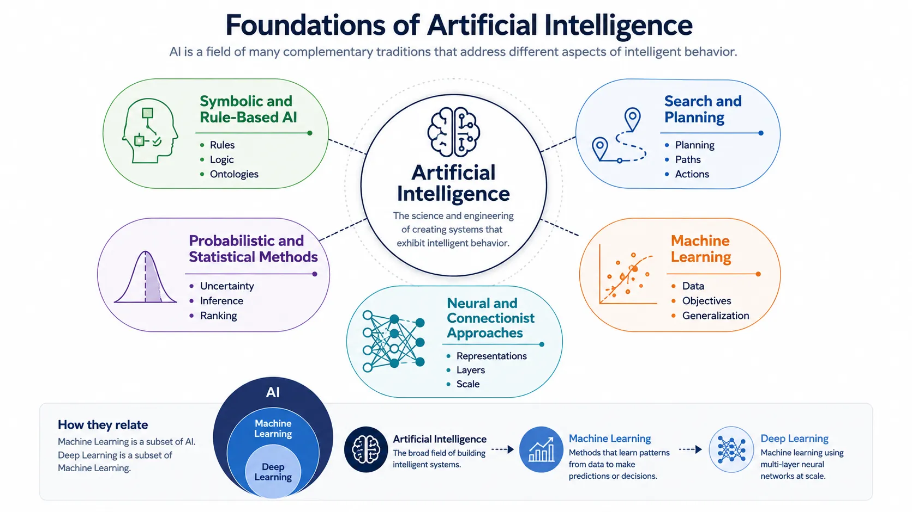

Artificial Intelligence is easiest to misunderstand when it is treated as one recent technology wave. In practice, it is a broad field formed from several traditions that each try to answer a different question about intelligent behavior. Some traditions focus on rules and reasoning, some on search and planning, some on uncertainty and probability, and some on learning patterns from data.

That broader view matters because modern AI systems are rarely explained well by one tradition alone. A retrieval-based assistant may depend on neural language models, probabilistic ranking, symbolic policy rules, and explicit workflow control at the same time. Foundations provide the conceptual map that keeps those layers distinct.

## Definition

Artificial Intelligence is the discipline of building systems that can perform tasks associated with perception, reasoning, learning, generation, decision-making, or action. The field is broader than any single algorithm family or model architecture. It includes approaches based on explicit rules, search procedures, statistical inference, and learned representations.

The practical value of this definition is that it makes room for several valid ways of building capable systems. AI is not only machine learning, and machine learning is not only deep learning.

## Why Foundations Matter

Teams make better choices when they understand which AI tradition they are actually using. A rule-heavy domain such as access control, compliance, or deterministic workflow routing often depends on explicit logic and traceable reasoning. A perception-heavy domain such as image recognition or speech transcription often depends more on learned representations. A recommendation or ranking system may rely on statistical learning, experimentation, and optimization rather than symbolic reasoning.

Without that distinction, conversations become vague. Engineers may say they are "doing AI" when what they really mean is classification, generation, retrieval, search, forecasting, or policy automation. Foundations help turn those vague labels into design-relevant categories.

## Core Traditions

### Symbolic and Rule-Based AI

Symbolic AI represents knowledge explicitly through rules, logic, ontologies, or state descriptions. It works well when the domain has stable concepts, clear constraints, and a need for auditability. Expert systems, rule engines, and formal reasoning systems belong to this tradition.

Its main strength is clarity. The system can often explain which rule was used or why a conclusion was reached. Its main limit is brittleness. Rich real-world signals such as natural language, images, and noisy behavior patterns are difficult to capture exhaustively as explicit rules.

### Search and Planning

Search-oriented AI focuses on exploring possible states or actions to reach a goal. Planning systems, game-playing agents, route optimization, and scheduling systems often rely on this tradition. The question is not only what is true, but what sequence of actions should be taken under constraints.

This tradition remains important because many modern agentic systems still depend on planning ideas, even when a language model is involved in intermediate reasoning or tool selection.

### Probabilistic and Statistical Methods

Probabilistic AI treats uncertainty as a first-class concern. Instead of assuming the system knows the world exactly, it estimates likelihoods, confidence, and expected outcomes. Bayesian reasoning, probabilistic graphical models, ranking systems, forecasting, and many classical machine-learning methods fit this tradition.

Its strength is disciplined reasoning under incomplete information. Its limit is that explicit probabilistic structure can become difficult to scale when the domain is high-dimensional and unstructured.

### Machine Learning

Machine learning shifted emphasis from hand-crafted rules to learned patterns. Instead of fully specifying the logic, teams provide data, objectives, and evaluation criteria so the system can learn useful behavior. This makes tasks such as classification, recommendation, anomaly detection, and ranking practical at larger scale.

Machine learning is a major part of AI, but it is still one family within the larger field.

### Neural and Connectionist Approaches

Neural approaches learn internal representations through interconnected layers of parameters. Their strength is that they can absorb large volumes of unstructured data and learn features that would be hard to define manually. Deep learning, foundation models, and many modern generative systems build on this tradition.

Their success changed the field, but not by invalidating older traditions. Instead, they expanded what kinds of perception, language, and generation tasks could be handled effectively.

## AI, Machine Learning, and Deep Learning

The following comparison clarifies the scope and relationship of these commonly conflated terms.

| Term             | What it covers                                              | Main idea                                                 | Typical strengths                               | Common mistake                                    |
| ---------------- | ----------------------------------------------------------- | --------------------------------------------------------- | ----------------------------------------------- | ------------------------------------------------- |
| AI               | The broad field of intelligent systems                      | Build systems that reason, learn, decide, or act          | Wide conceptual coverage                        | Treating it as one specific technology            |
| Machine Learning | A subset of AI focused on learning from data                | Improve performance through learned patterns              | Adaptation, prediction, ranking, classification | Assuming all AI is machine learning               |
| Deep Learning    | A subset of machine learning using multilayer neural models | Learn rich internal representations from large-scale data | Perception, language, generation, transfer      | Assuming deep learning replaces all other methods |

## Enduring Tensions

Several tensions reappear across generations of AI systems.

**Generality versus specialization** asks whether a system should solve many tasks adequately or one task exceptionally well. Broad reusable models and narrow optimized systems represent different answers.

**Data-driven learning versus explicit rules** asks whether behavior should emerge from training data or be constrained directly through logic and policy. In real systems, the answer is often both.

**Prediction versus reasoning** distinguishes systems that estimate likely outputs from systems that must follow explicit steps, constraints, or plans. The difference matters for trust and control.

**Capability versus interpretability** reflects a recurring tradeoff: systems often become more flexible and powerful as their internal reasoning becomes harder to inspect directly.

## Why This Still Matters Now

Modern AI systems combine these traditions rather than replacing them cleanly. Foundation models depend on deep learning. Retrieval systems depend on search and ranking. Governance often depends on symbolic constraints and policy logic. Agents frequently blend language generation with tool use, state tracking, planning, and approval gates.

That is why foundations remain useful. They provide the vocabulary for describing what a system is actually doing, where its strengths come from, where its limits will appear, and which neighboring disciplines must be involved to make it reliable.

## Summary

AI is not one method and not one era. It is a family of approaches for building systems that can act intelligently under different assumptions and constraints. Understanding the major traditions inside that family makes modern topics such as machine learning, foundation models, agents, and governance easier to place in context.
