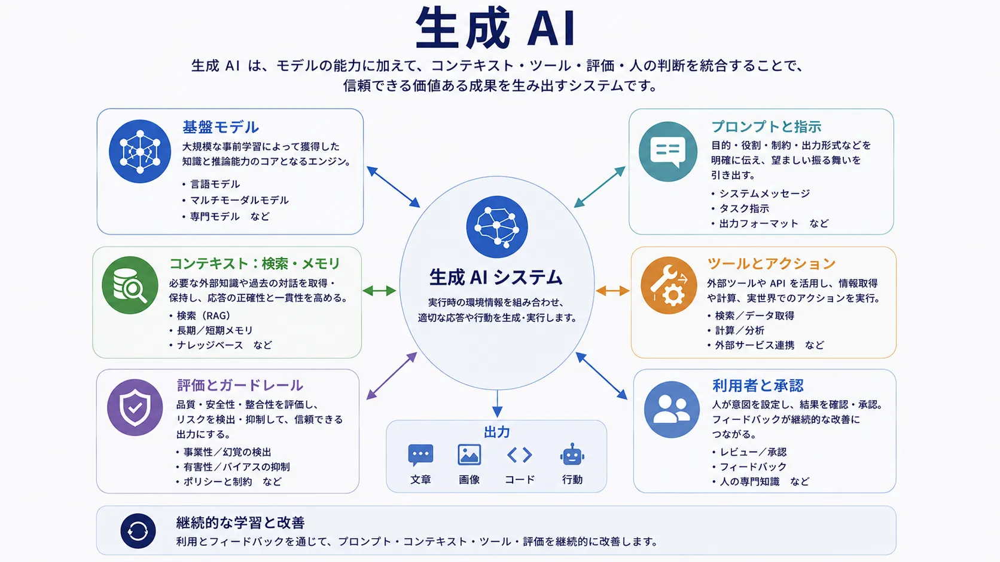

生成 AI が広く有用になったのは、モデル出力を単なるテキストや画像の合成として扱うのではなく、コンテキスト、対話、制御と組み合わせたときです。重要なのはモデルが生成できるかだけではありません。利用者価値を生むだけの信頼性で、生成を誘導、制約、適用できるかが問われます。

したがって生成 AI は、アプリケーションパターンとして理解するのが適切です。モデルは生成能力を提供しますが、プロダクトはプロンプト、検索されたコンテキスト、ツールアクセス、承認境界、構造化出力、評価ループによって成立します。

## 定義

生成 AI は、学習済みモデルの振る舞いと実行時コンテキストを通じて、テキスト、コード、画像、音声、構造化出力を生成するシステムを指します。実務では、モデルだけでなく、その周囲に構築されるアプリケーションパターンまでを含むことが一般的です。

本番の生成システムは、単に呼び出されるのではなく、複数の要素から組み立てられます。振る舞いはその構成から生じます。

## なぜ重要か

生成 AI は、言語、知識、変換、合成を中心とするインターフェースを構築するコストを下げます。下書き、要約、抽出、検索支援、対話的な案内、ワークフロー支援を素早く試作し、多くの場合は拡張しやすくします。

同時に、モデルの柔軟性は周辺システムによる境界設定を必要とします。能力だけから信頼性が自動的に生まれることはありません。

## 中核となる構成要素

以下の構成要素を組み合わせることで、生成の振る舞いを利用可能なシステムへ形作ります。

| 構成要素                     | システム上の役割                       | 重要な理由                             |
| ---------------------------- | -------------------------------------- | -------------------------------------- |
| プロンプトと指示             | タスクの枠組みを定める                 | 意図、スタイル、運用境界を形作る       |
| コンテキストエンジニアリング | 実行時に関連情報を選ぶ                 | 曖昧さを減らし、タスクへの適合を高める |
| 検索                         | 外部知識を対話へ持ち込む               | 最新または領域固有の情報へ根拠を与える |
| ファインチューニングと適応   | モデルを特化させる                     | 繰り返し使うパターンへの適合を改善する |
| ツール呼び出し               | 出力を外部の操作・システムへ接続する   | 生成をワークフロー能力へ変える         |
| 構造化出力                   | 応答形式を制約する                     | 後続の自動化を安全かつ容易にする       |
| メモリと計画                 | 継続性を保ち、複数段階の作業を管理する | 長いタスクと整合的な実行を支える       |

プロンプトはタスクを枠付けしますが、実行時にシステムが使える情報を決めるコンテキストはさらに重要です。強いグラウンディングを持つ簡潔なプロンプトの方が、情報が弱い巧妙なプロンプトよりよい結果を出すことがあります。検索は関連文書、記録、知識オブジェクトを結び付け、ツール呼び出しは検索、API、ワークフロー、内部サービスへの統制されたアクセスを与えます。

## 主なシステムパターン

チャットアシスタントは対話と質問応答を中心にします。コパイロットはコーディング、執筆、運用などのホストワークフローに支援を埋め込みます。検索ベースのアシスタントは企業・領域知識へのグラウンディングを優先します。ワークフロー自動化は生成とツールを使って境界のあるタスクを完了します。エージェントは、複数段階の実行、分岐、承認を意識した行動でこれらを拡張します。

これらは関連しますが同一ではありません。許される自律性、外部へ実行できる操作、周囲の制御面が異なります。

## 主なリスクと限界

流暢な出力でも根拠がない、または誤っている可能性があるため、ハルシネーションは中心的な問題です。不完全、古い、誤解を招く情報が渡されるとコンテキストの失敗が起きます。決定的な振る舞いが必要な場所で自由度の高い生成を使うと、信頼性の問題も生じます。

プロンプト、検索コンテンツ、ツール結果、生成出力はすべて情報漏えい・不正利用の経路になり得ます。能力やツールアクセスが広がるほど、境界のある権限と監査可能性が重要になります。

## まとめ

生成 AI は、モデル能力をコンテキスト、検索、制御、対話と組み合わせるシステムパターンです。価値もリスクも、その構成から生じます。生のモデル出力ではなく、完全なアプリケーションの規律として扱うことが重要です。
