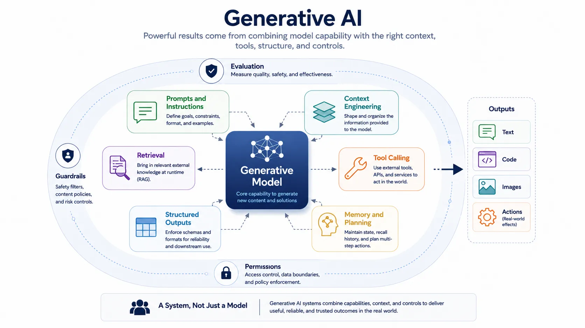

Generative AI became widely useful when model output was combined with context, interaction, and control rather than treated as raw text or image synthesis alone. The practical question is not simply whether a model can generate. It is whether the broader system can guide, constrain, and apply that generation in a way that is reliable enough to create user value.

That is why generative AI is best understood as an application pattern. Models provide the generative capability, but the product depends on prompts, retrieved context, tool access, approval boundaries, structured outputs, and evaluation loops.

## Definition

Generative AI refers to systems that produce text, code, images, audio, or structured outputs through learned model behavior and runtime context. In practice, the term usually includes not just the model, but the application pattern built around it.

This is important because production generative systems are assembled, not merely called. Their behavior comes from composition.

## Why It Matters

Generative AI matters because it lowers the cost of building interfaces around language, knowledge, transformation, and synthesis. Tasks that once required narrow automation logic can now be approached through flexible interaction. Drafting, summarization, extraction, search assistance, conversational guidance, and workflow support all become easier to prototype and often easier to scale.

At the same time, the flexibility of the model means the surrounding system must define boundaries. Reliability does not emerge automatically from capability.

## Core Building Blocks

| Building block             | System role                                         | Why it matters                                               |
| -------------------------- | --------------------------------------------------- | ------------------------------------------------------------ |
| Prompts and instructions   | Frame the task                                      | Shapes intent, style, and operating boundaries               |
| Context engineering        | Select relevant runtime information                 | Reduces ambiguity and improves fit to the task               |
| Retrieval                  | Bring external knowledge into the interaction       | Grounds the system in current or domain-specific information |
| Fine-tuning and adaptation | Specialize the model                                | Improve fit for recurring use patterns                       |
| Tool calling               | Connect model output to external actions or systems | Turns generation into workflow capability                    |
| Structured outputs         | Constrain the response format                       | Makes downstream automation safer and easier                 |
| Memory and planning        | Preserve continuity and manage multistep work       | Supports longer tasks and more coherent execution            |

### Prompts and Context

Prompts matter because they define task framing, but context matters even more because it determines what the system can use at runtime. A weak prompt with strong grounding often outperforms a clever prompt with weak information.

### Retrieval and Tools

Retrieval-augmented generation expands what the system can answer by attaching relevant documents, records, or knowledge objects at runtime. Tool calling expands what the system can do by giving it controlled access to search, APIs, workflow systems, or internal services.

### Structured Outputs, Memory, and Planning

Structured outputs help turn generative behavior into reliable software interfaces. Memory supports continuity across a session or task. Planning matters when the system must break work into stages rather than produce one direct answer.

## Major System Patterns

Chat assistants emphasize interaction and question answering. Copilots embed assistance inside a host workflow such as coding, writing, or operations. Retrieval-based assistants prioritize grounding in enterprise or domain knowledge. Workflow automation systems use generation and tools to complete bounded tasks. Agents extend these patterns through multistep execution, branching, and approval-aware action.

These are related but not identical patterns. The difference lies in how much autonomy the system has, what external actions it can take, and what control surfaces surround it.

## Main Risks and Limits

Hallucination remains a central problem because fluent output can still be ungrounded or incorrect. Context failure occurs when the system receives incomplete, stale, or misleading information. Reliability issues emerge when open-ended generation is used where deterministic behavior is required.

Security and privacy matter because prompts, retrieved content, tool results, and generated outputs can all create leakage or misuse paths. The more powerful the system becomes, the more important bounded permissions and auditability become.

## Relationship to Adjacent Topics

Generative AI depends on foundation models for reusable capability. It depends on data for grounding, retrieval, and evaluation. It depends on AI engineering to wrap the model in dependable interfaces and controls. It depends on LLMOps to monitor cost, quality, drift, and safety over time.

## Summary

Generative AI is best understood as a system pattern that combines model capability with context, retrieval, control, and interaction. Its value comes from that composition, and so do its risks. Treating it as a full application discipline rather than as raw model output makes the rest of the AI stack easier to reason about.
