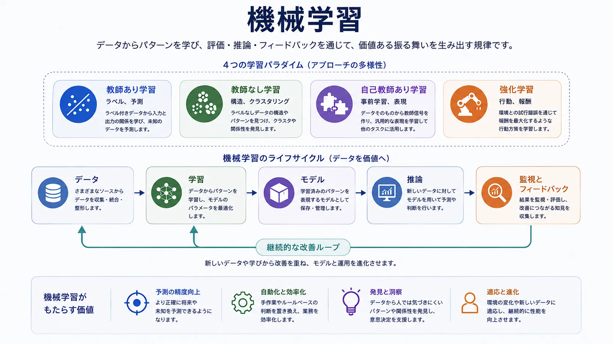

機械学習が AI の中心になったのは、有用なタスクの多くが固定的なルールだけでは扱えないほど変化に富むからです。不正のパターン、顧客行動、画像の分類、言語の使われ方は変化し続けます。あらゆる条件を手作業で記述する代わりに、機械学習は例とフィードバックから有用なパターンを推定させます。

ただし、エンジニアリング上の判断が不要になるわけではありません。課題はデータ品質、目的設計、評価、汎化、運用上のドリフトを扱うことへ移ります。機械学習はモデリング技法であるだけでなく、振る舞いを構築・維持する別の方法です。

## 定義

機械学習は、データからパターンを学ぶことでタスク性能を改善するシステムを構築する分野です。すべての判断ルールを明示する代わりに、エンジニアは目的を定め、例を準備し、表現を選び、得られたモデルが学習データ以外にも汎化するかを評価します。

これは学習された振る舞いを扱う AI の一部であり、純粋なルールベースの手法とは異なります。ただし、実際のシステムでは両者を組み合わせることが少なくありません。

## 機械学習が重要な理由

手作業のロジックをスケールさせるには変動が大きすぎるとき、機械学習は重要です。検索結果の順位付け、スパム検知、需要予測、文書分類、製品推薦、音声認識では、ルールとして列挙するよりもデータから学ぶ方が扱いやすいパターンが現れます。

その代償として、学習システムは確率的です。完全な振る舞いを保証するものではなく、コードの検査だけではなく、証拠、誤り分析、運用監視によって判断する必要があります。

## 主な学習パラダイム

### 教師あり学習

教師あり学習は、望ましい出力が付いたラベル付きの例を使います。入力と出力の対応を学び、分類、回帰、順位付け、多くの予測タスクに用います。ラベルが意味を持ち、対象を適切に代表しているときに有効ですが、品質はデータ定義と学習対象に強く依存します。

### 教師なし学習

教師なし学習は、明示的な正解ラベルなしに構造を探します。クラスタリング、セグメンテーション、次元削減、異常の発見が代表例です。答えを直接教えるのではなく、データの中にある有用なまとまりを見つけさせます。探索には強力ですが、見つかった構造を実際の製品・業務上の判断につなげる必要があります。

### 自己教師あり学習

自己教師あり学習は、データ自身から学習シグナルを作ります。マスクされた語、次のトークン、欠けた領域などを予測させることで、人手で完全にラベル付けされたデータセットなしに広い表現を学べます。大規模言語モデルやマルチモーダルモデルで特に重要になりました。

重要なのは統計的な側面だけではありません。大規模な事前学習を、経済面・運用面の両方で可能にするアーキテクチャ上の仕組みでもあります。

### 強化学習

強化学習は、時間を通じた行動とフィードバックを扱います。システムは環境と相互作用し、報酬や罰を受け、累積的な結果を改善する方策を学びます。制御、ゲーム、スケジューリング、逐次的な最適化のように、判断が将来の状態に影響する場面で役立ちます。フィードバックが遅れ、探索自体が高コストまたは危険になり得ることが中心的な難しさです。

## 学習パラダイムの比較

以下の比較は、主な学習パラダイムにおけるシグナル、用途、制約の違いを示します。

| パラダイム | 主なシグナル | 典型的な用途 | 強み | 主な制約 |
| --- | --- | --- | --- | --- |
| 教師あり学習 | 人が与えるラベル | 分類、回帰、順位付け | 目的との対応が明確 | ラベルのコストとバイアス |
| 教師なし学習 | データ内の構造 | クラスタリング、異常発見、セグメンテーション | 探索と表現に有用 | 業務成果へ直接結び付けにくい |
| 自己教師あり学習 | データ自身から得るシグナル | 事前学習、表現学習 | 大規模な未ラベルコーパスに対応できる | 下流用途での適応と評価が必要 |
| 強化学習 | 逐次的な相互作用からの報酬 | 制御、計画、最適化 | 時間を通じた振る舞いを学べる | サンプル効率と安定性 |

## 機械学習システムのライフサイクル

機械学習システムは、データ収集と問題設定から始まります。どのシグナルが重要か、成功をどう定義するか、例をどう収集・ラベル付けするかを決めます。この段階は、アルゴリズム選択以上に結果を左右することがあります。

学習では、データを有用なパターンを捉えるモデルへ変換します。検証とテストでは、モデルが汎化するか、重要な部分集団で系統的に失敗しないか、意図した用途に十分な性能があるかを確認します。

推論は、モデルを実際のワークフローで使う段階です。レイテンシ、鮮度、フィードバックループ、オフライン評価と本番の振る舞いの差が新たな関心事になります。そのため監視は後付けではなく、ライフサイクルの一部です。

## よく使う評価概念

**汎化**は、学習データを記憶するだけでなく、新しいデータでも良い性能を示す能力です。

**バイアスと分散**は異なる失敗モードを表します。モデルが単純すぎて有用な構造を捉えられない場合もあれば、学習データに敏感すぎて本番で安定しない場合もあります。

**過学習と過少適合**はその実務的な現れです。過学習は学習データを具体的に覚えすぎること、過少適合は十分に有用な構造を学べないことです。

**オフライン評価とオンライン評価**は異なる目的に役立ちます。オフラインのテストは統制された比較を可能にし、オンラインの振る舞いは実際の利用者との相互作用、変化する入力、フィードバックループの下での性能を示します。

## まとめ

機械学習は、網羅的に人が記述したルールではなく、データから有用な振る舞いを構築する AI の領域です。適応性に価値がありますが、その適応性はデータ品質、評価の規律、運用への依存も生みます。主要な学習パラダイムとライフサイクルを理解すると、現代の AI を考えやすくなります。
